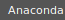

<a href="https://tiledb.com"></a>

[](https://github.com/TileDB-Inc/TileDB/actions/workflows/full-ci.yml) [](https://dev.azure.com/TileDB-Inc/CI/_build/latest?definitionId=2&branchName=main) [](https://anaconda.org/conda-forge/TileDB)

# The Universal Storage Engine

TileDB is a powerful engine for storing and accessing **dense and sparse multi-dimensional arrays**, which can help you model any complex data efficiently. It is an embeddable C++ library that works on Linux, macOS, and Windows. It is open-sourced under the permissive MIT License, developed and maintained by [TileDB, Inc](https://tiledb.com/). To distinguish this project from other TileDB offerings, we often refer to it as *TileDB Embedded*. 

TileDB includes the following features:

* Support for both **dense** and **sparse arrays**
* Support for **dataframes** and **key-value stores** (via sparse arrays)
* **Cloud storage** (AWS S3, Google Cloud Storage, Azure Blob Storage)
* **Chunked** (tiled) arrays
* Multiple **compression**, **encryption** and **checksum** filters
* Fully **multi-threaded** implementation
* **Parallel IO**
* **Data versioning** (rapid updates, time traveling)
* Array **metadata**
* Array **groups**
* Numerous **APIs** on top of the C++ library
* Numerous **integrations** (Spark, Dask, MariaDB, GDAL, etc.)
 
You can use TileDB to store data in a variety of applications, such as Genomics, Geospatial, Finance and more. The power of TileDB stems from the fact that any data can be modeled efficiently as either a dense or a sparse multi-dimensional array, which is the format used internally by most data science tooling. By storing your data and metadata in TileDB arrays, you abstract all the data storage and management pains, while efficiently accessing the data with your favorite data science tool.

## Quickstart

You can install the TileDB C++ library as follows:

```bash
# Conda (macOS, Linux, Windows):
$ conda install -c conda-forge tiledb
```

Visit the links below for Python, R, and other APIs installation instructions.

Alternatively, you can use the [Dockerfile we provide.](examples/Dockerfile/Dockerfile)

We include several [examples](https://github.com/TileDB-Inc/TileDB/tree/main/examples). You can start with the following:

* [Dense array example](https://github.com/TileDB-Inc/TileDB/blob/main/examples/cpp_api/quickstart_dense.cc)
* [Sparse array example](https://github.com/TileDB-Inc/TileDB/blob/main/examples/cpp_api/quickstart_sparse.cc)

## Documentation

You can find the detailed TileDB documentation at [https://cloud.tiledb.com/academy](https://cloud.tiledb.com/academy).

## Building from source

To build TileDB from source, visit [Building from Source](BUILDING_FROM_SOURCE.md).

## Format Specification

The TileDB data format is open-source and can be found [here](format_spec/FORMAT_SPEC.md).

## Application-specific Packages

* [TileDB-BioImaging](https://github.com/TileDB-Inc/TileDB-BioImaging): TileDB library for biomedical imaging, with support for image-optimized compression using WebP.
* [TileDB-SOMA](https://github.com/single-cell-data/TileDB-SOMA): TileDB implementation of the [SOMA](https://github.com/single-cell-data/SOMA) specification for single-cell genomic data. ([documentation](https://github.com/single-cell-data/TileDB-SOMA#quick-start))
* [TileDB-VCF](https://github.com/TileDB-Inc/TileDB-VCF): TileDB library and query engine for genomic variant data. ([documentation](https://cloud.tiledb.com/academy/structure/life-sciences/population-genomics/)).
* [TileDB-Vector-Search](https://github.com/TileDB-Inc/TileDB-Vector-Search): open source, embeddable, and cloud-native vector similarity search database built on top of TileDB in high-performance C++, with an easy-to-use Python API.

## APIs

The TileDB team maintains a variety of APIs built on top of the C++ library:

* C ([examples](https://github.com/TileDB-Inc/TileDB/tree/main/examples/c_api), [API docs](https://tiledb-inc-tiledb.readthedocs-hosted.com/en/stable/c-api.html))
* C++ ([examples](https://github.com/TileDB-Inc/TileDB/tree/main/examples/cpp_api), [API docs](https://tiledb-inc-tiledb.readthedocs-hosted.com/en/stable/c++-api.html))
* [Python](https://github.com/TileDB-Inc/TileDB-Py)
* [R](https://github.com/TileDB-Inc/TileDB-R)
* [Java](https://github.com/TileDB-Inc/TileDB-Java)
* [Go](https://github.com/TileDB-Inc/TileDB-Go)
* [C#](https://github.com/TileDB-Inc/TileDB-CSharp)

## Get involved

TileDB Embedded is an open-source project and welcomes all forms of contributions. Contributors to the project should read over the [contribution docs](https://github.com/TileDB-Inc/TileDB/blob/main/CONTRIBUTING.md) for more information.

We'd love to hear from you. Drop us a line at [hello@tiledb.com](mailto:hello@tiledb.com), visit our [forum](https://forum.tiledb.com/) or [contact form](https://tiledb.com/contact), or [follow us on Twitter](https://twitter.com/tiledb) to stay informed of updates and news.
