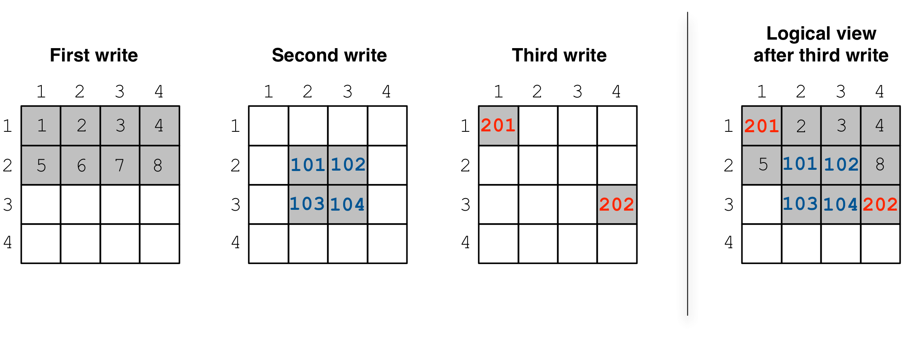
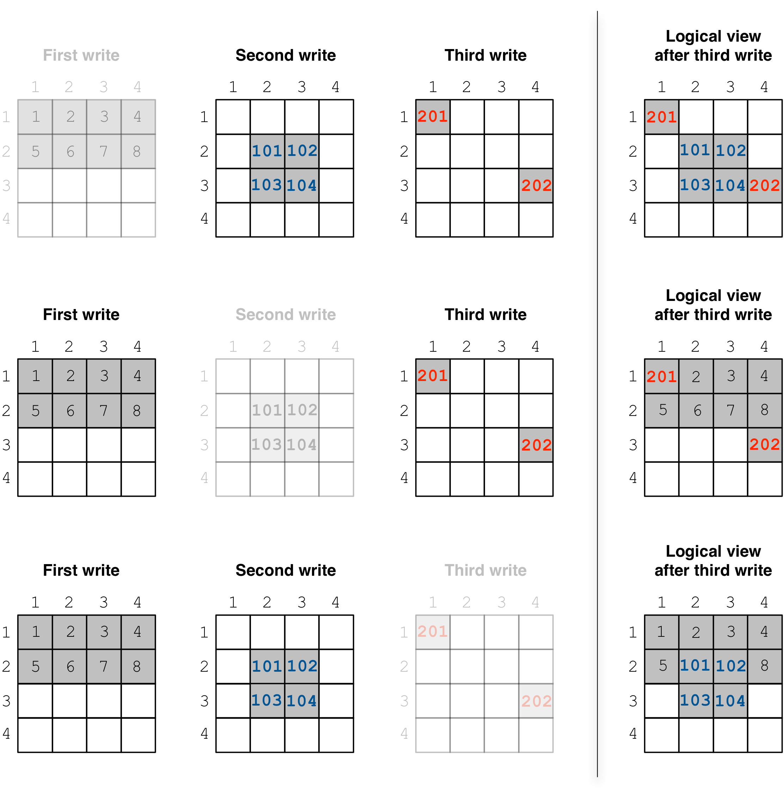
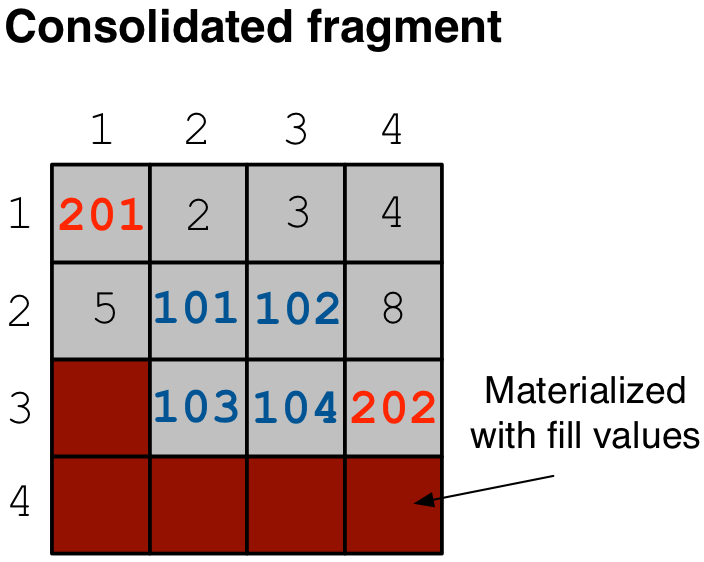

Fragments and Consolidation
===========================

In this tutorial we will explain in more detail the concept of array
fragments and introduce the feature of consolidation. It is strongly
recommended that you read the tutorials on writing dense and sparse
arrays first.

.. toggle-header::
    :header: **Example Code Listing**

    .. content-tabs::

       .. tab-container:: cpp
          :title: C++

          .. literalinclude:: {source_examples_path}/cpp_api/fragments_consolidation.cc
             :language: c++
             :linenos:

Basic concepts and definitions
------------------------------

.. toggle-header::
    :header: **Fragment**

      An array is composed of fragments. Each fragment is perceived as an
      array snapshot, containing only the cells written upon a write
      operation. TileDB distinguishes between dense and sparse fragments.
      A sparse array is composed only of sparse fragments, whereas a dense
      array can have both dense and sparse fragments. Each fragment is
      a timestamped, standalone subdirectory inside the array directory.

.. toggle-header::
    :header: **Consolidation**

      To mitigate the potential performance degradation resutling from
      the existence of numerous fragments, TileDB enables you to
      consolidate the fragments, i.e., merge all fragments into a single
      one.

What is a fragment?
-------------------

Consider the example in the code listing at the beginning of this tutorial.
This example creates a ``4x4`` array with ``2x2`` space tiling, and
performs three separate write operations. The figure below depicts
the cells written in each operation, as well as the collective logical
view of the array.

After compiling and running the program, we see that the array directory
contains three subdirectories with weird names:

.. code-block:: bash

  $ g++ -std=c++11 fragments_consolidation.cc -o fragments_consolidation_cpp -ltiledb
  $ ./fragments_consolidation_cpp
  Cell (1, 1) has data 201
  Cell (1, 2) has data 2
  Cell (1, 3) has data 3
  Cell (1, 4) has data 4
  Cell (2, 1) has data 5
  Cell (2, 2) has data 101
  Cell (2, 3) has data 102
  Cell (2, 4) has data 8
  Cell (3, 1) has data -2147483648
  Cell (3, 2) has data 103
  Cell (3, 3) has data 104
  Cell (3, 4) has data 202
  Cell (4, 1) has data -2147483648
  Cell (4, 2) has data -2147483648
  Cell (4, 3) has data -2147483648
  Cell (4, 4) has data -2147483648
  $ ls -l fragments_consolidation/
  total 8
  drwx------  5 stavros  staff  170 Jun 27 13:56 __31372fdd407f448fb341dc81cfc37a2b_1530122217138
  drwx------  4 stavros  staff  136 Jun 27 13:56 __967e8bc52f194928b8fb08ead588a1c9_1530122217123
  -rwx------  1 stavros  staff  109 Jun 27 13:56 __array_schema.tdb
  drwx------  4 stavros  staff  136 Jun 27 13:56 __ba566f83462e497fb9ad1af592dce1ba_1530122217131
  -rwx------  1 stavros  staff    0 Jun 27 13:56 __lock.tdb

Each subdirectory corresponds to a **fragment**, i.e., to an array snapshot
containing the cells written in a write operation. *How can we tell which
fragment corresponds to which write?* In this example, this can be
easily derived from the fragment name. The name has the following format::

    __<uuid>_<timestamp>

The `UUID <https://en.wikipedia.org/wiki/Universally_unique_identifier>`_ is
a *unique identifier*, specific to a process-thread pair. In a later tutorial
we will explain that this enables concurrent threads/processes writing
to the same array. The timestamp records the time
when the fragment got created. Inspecting the fragment names, we derive that
``__967e8bc52f194928b8fb08ead588a1c9_1530122217123`` corresponds to the
first write, ``__ba566f83462e497fb9ad1af592dce1ba_1530122217131`` to the
second, and ``__31372fdd407f448fb341dc81cfc37a2b_1530122217138`` to the
third, reading the fragment timestamps in ascending order.

There are two takeaways so far: (i) *every fragment is immutable*, i.e.,
a subsequent write operation never overwrites a file of a previously
created fragment, and (ii) during a read operation, TileDB logically
superimposes every fragment on top of the previous one (chronologically),
"overwriting" any common cells. Also note that TileDB
has an intelligent internal algorithm for doing this efficiently.

Another interesting feature in TileDB is that each fragment directory
is *standalone*. This means that you can simply remove any subdirectory,
and TileDB will function properly as if the write that created that
subdirectory never happened. Try out the code below, which checks
what happens each time a different fragment is deleted:

.. code-block:: bash

  $ cp -R fragments_consolidation/ temp
  $ rm -rf fragments_consolidation/__967e8bc52f194928b8fb08ead588a1c9_1530122217123
  $ ./fragments_consolidation_cpp
  Cell (1, 1) has data 201
  Cell (1, 2) has data -2147483648
  Cell (1, 3) has data -2147483648
  Cell (1, 4) has data -2147483648
  Cell (2, 1) has data -2147483648
  Cell (2, 2) has data 101
  Cell (2, 3) has data 102
  Cell (2, 4) has data -2147483648
  Cell (3, 1) has data -2147483648
  Cell (3, 2) has data 103
  Cell (3, 3) has data 104
  Cell (3, 4) has data 202
  Cell (4, 1) has data -2147483648
  Cell (4, 2) has data -2147483648
  Cell (4, 3) has data -2147483648
  Cell (4, 4) has data -2147483648
  $ rm -rf fragments_consolidation
  $ cp -R temp fragments_consolidation
  $ rm -rf __ba566f83462e497fb9ad1af592dce1ba_1530122217131
  $ ./fragments_consolidation_cpp
  Cell (1, 1) has data 201
  Cell (1, 2) has data 2
  Cell (1, 3) has data 3
  Cell (1, 4) has data 4
  Cell (2, 1) has data 5
  Cell (2, 2) has data 6
  Cell (2, 3) has data 7
  Cell (2, 4) has data 8
  Cell (3, 1) has data -2147483648
  Cell (3, 2) has data -2147483648
  Cell (3, 3) has data -2147483648
  Cell (3, 4) has data 202
  Cell (4, 1) has data -2147483648
  Cell (4, 2) has data -2147483648
  Cell (4, 3) has data -2147483648
  Cell (4, 4) has data -2147483648
  $ rm -rf fragments_consolidation
  $ cp -R temp fragments_consolidation
  $ rm -rf __31372fdd407f448fb341dc81cfc37a2b_1530122217138
  $ ./fragments_consolidation_cpp
  Cell (1, 1) has data 1
  Cell (1, 2) has data 2
  Cell (1, 3) has data 3
  Cell (1, 4) has data 4
  Cell (2, 1) has data 5
  Cell (2, 2) has data 101
  Cell (2, 3) has data 102
  Cell (2, 4) has data 8
  Cell (3, 1) has data -2147483648
  Cell (3, 2) has data 103
  Cell (3, 3) has data 104
  Cell (3, 4) has data -2147483648
  Cell (4, 1) has data -2147483648
  Cell (4, 2) has data -2147483648
  Cell (4, 3) has data -2147483648
  Cell (4, 4) has data -2147483648

This is also illustrated in the figure below, which shows the array logical
view after removing each of the three fragments.

TileDB knows how to recognize a fragment through file
``__fragment_metadata.tdb`` stored in the fragment directory.
This file also makes the fragment self-contained, as it stores all
necessary data that TileDB needs when processing read queries.

Dense vs. sparse fragments
--------------------------

A fragment can be *dense* or *sparse*. Simply stated, a sparse fragment
stores the explicit coordinates of the non-empty cells in a file
``__coords.tdb``, whereas a dense fragment is missing this file.
A dense array can have both dense and sparse fragments (since we
explained in an earlier tutotial that you can submit sparse writes
to a dense array), whereas a sparse array can have only sparse fragments
(there is no notion of a dense write in a sparse array). In the
example above, the first two writes create dense fragments, whereas
the third write creates a sparse fragment.

Consolidation
-------------

The presence of numerous fragments may impact the TileDB read
performance. This is because many fragments would lead to numerous
fragment metadata files being loaded to main memory from storage.
Moreover, they could prevent TileDB from applying certain internal
optimizations that work well with fewer fragments.

To mitigate this problem, TileDB has a consolidation feature, which allows
you to *merge* the existing fragments into a single one. Consolidation
is thread-/process-safe and can be done in the background while you
continue reading from the array without being blocked.
Consolidation is done with a simple command (note that you need to
put this in a separate thread/process if you wish to make it non-blocking,
as it is blocking by default):

.. content-tabs::

   .. tab-container:: cpp
      :title: C++

      .. code-block:: c++

        Context ctx;
        Array::consolidate(ctx, array_name);

Rerunning the above example as shown below (providing ``consolidate`` as input
to the program) consolidates the three fragments into one before reading.

.. code-block:: bash

  $ ./fragments_consolidation_cpp consolidate
  Cell (1, 1) has data 201
  Cell (1, 2) has data 2
  Cell (1, 3) has data 3
  Cell (1, 4) has data 4
  Cell (2, 1) has data 5
  Cell (2, 2) has data 101
  Cell (2, 3) has data 102
  Cell (2, 4) has data 8
  Cell (3, 1) has data -2147483648
  Cell (3, 2) has data 103
  Cell (3, 3) has data 104
  Cell (3, 4) has data 202
  Cell (4, 1) has data -2147483648
  Cell (4, 2) has data -2147483648
  Cell (4, 3) has data -2147483648
  Cell (4, 4) has data -2147483648
  $ ls -l fragments_consolidation
  total 8
  drwx------  4 stavros  staff  136 Jun 27 15:21 __d9d15b3f27c8459ca9cbb9c9f27638a3_1530141040402_1530141040383
  -rwx------  1 stavros  staff  109 Jun 27 15:21 __array_schema.tdb
  -rwx------  1 stavros  staff    0 Jun 27 15:21 __lock.tdb
  $ ls -l fragments_consolidation/__d9d15b3f27c8459ca9cbb9c9f27638a3_1530141040402_1530141040383/
  total 16
  -rwx------  1 stavros  staff  108 Jun 27 15:21 __fragment_metadata.tdb
  -rwx------  1 stavros  staff   64 Jun 27 15:21 a.tdb

As expected, the result is the same as before.
However, listing the contents of the array we now see a single fragment.
This fragment merges the data of the three writes. We make two observations.
First, the name is slightly different. The format now is::

    __<uuid>_<timestamp_merged>_<timestamp_last>

Here ``timestamp_merged`` is the time the merged fragment got created, whereas
``timestamp_last`` is the timestamp of the latest fragment that got
consolidated (i.e., the fragment corresponding to the third write in
this example). In general, TileDB always uses the last timestamp in
the fragment name in order to chronologically sort the fragments as they
are being created during the reads.

The second observation is that the merged fragment is *dense* (notice that
``__coords.tdb`` is missing). Upon consolidation, TileDB calculates the
subdomain that stores only non-empty cells (expanding it to a hyper-rectangle
that contains integral tiles). In this example, this subdomain happens
to be ``[1,4], [1,4]`` (in the general case, the subdomain may be much
smaller than the entire domain). Then it materializes this subdomain
in a dense fragment, i.e., it stores the special fill value for every
empty cell. This is shown in the figure below, and is also evident by
the size of ``a.tdb``, which now stores 64 bytes, i.e., 16 integer values.

Note that the case of consolidating sparse arrays is similar. The only
difference is that, since a sparse array can have only sparse fragments,
the resulting merged fragment will also be *sparse* (without extra
empty cell materialization required).

Fragments and performance
-------------------------

Since TileDB creates a new fragment per write operation, the *write
performance* depends only on the new cells being written and is
unaffected by the number of existing fragments. However, the number
of fragments may affect the overall *read performance*. In cases
where there are numerous fragments produced, you should use the
consolidation feature that enables you to merge multiple fragments
in a single one. The *consolidation performance* naturally depends on
the number and size of fragments being consolidated. We provide a more detailed
discussion on fragments and performance in a later tutorial.

