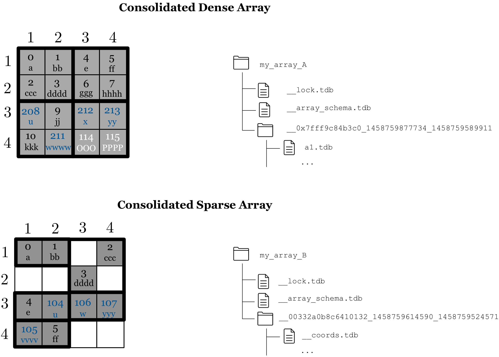

Consolidation
=============

If an excessive number of update operations occurs, numerous fragments
are created, which may naturally impact the performance of future
reads.  TileDB offers a consolidation feature, which merges all
fragments into a single one. In other words, consolidation creates a
new fragment sub directory under the array directory containing all
the most up-to-date cell values, deleting the old fragment sub
directories. :ref:`Figure 15 <figure-15>` depicts the dense array of
:ref:`Figure 13 <figure-13>` and the sparse array of :ref:`Figure 14
<figure-14>` after their consolidation. Each array now consists of a
single fragment.  Moreover, observe in :ref:`Figure 15 <figure-15>`
that the cells of the sparse array are properly **re-tiled** based on
the tile and cell order (both row-major) and the data tile capacity
that is equal to 2.

.. _figure-15:

    Figure 15: Consolidated arrays

A nice feature of TileDB is that
consolidation is **thread- and process-safe**. That means that
consolidation can run in the background while TileDB continues executing
read and write queries. Under the covers, TileDB creates a new fragment
directory that is **“hidden”** until the consolidation process
completes. Only then does TileDB briefly lock the array in order to
delete the old fragments and renders the new fragment as **visible**.

.. warning::
    Consolidating many small
    fragments with a few large ones can be costly, since the total
    consolidation time is dominated by reading and writing the large
    fragments. Informally, this suggests consolidation should be applied on
    fragments of approximately equal size. Moreover, read performance
    degrades when many data tiles of different fragments overlap in the
    logical space (this will become apparent in section
    :doc:`Reading <reading/index>`). Thus, it is important to consolidate those
    fragments before others. We are currently implementing a new
    consolidation algorithm that addresses all these issues, and runs
    automatically in the background hiding all these technical details from
    the user.

Consolidated fragment name
--------------------------

Recall that the name of a fragment directory has the form
``__<thread_id>_<timestamp>``, where ``<thread_id>`` is the id of the
thread that created the fragment, and ``<timestamp>`` stands for the
time in milliseconds when the fragment got created. A consolidated
fragment has a slightly different name, namely
``__<thread_id>_<timestamp>_<last_fragment_timestamp>``. Here,
``<thread_id>`` and ``<timestamp>`` have the same meaning as before,
whereas ``<last_fragment_timestamp>`` is the timestamp of the latest
(i.e., most recent) of the **consolidated fragments**.

The rationale behind this naming convention is as follows. As noted
above, we wish to implement an algorithm that can consolidate any
subsequence of fragments. It is important to retain the time order even
for consolidated fragments. For instance, suppose there are four
fragments ``f1, f2, f3, f4``, ordered in time. Now assume that we wish
to consolidate ``f2`` and ``f3`` with new name, say, ``f5``. For
correctness, we must retain the order ``f1, f5, f4``. Recall that the
TileDB read algorithm always orders the fragments (in time) with respect
to the last component in their name, which is the creation timestamp. If
we do not include in ``f5``\ ’s name the timestamp of ``f3``, and we
simply include the creation timestamp of the consolidated fragment, then
the read algorithm would sort the fragments as ``f1, f4, f5``, which
would be incorrect. Finally, we include the creation timestamp of ``f5``
in the name (but **before** the timestamp of ``f3``), as this may be
useful for creating a timeline for the consolidation operations (e.g.,
for logging purposes).
