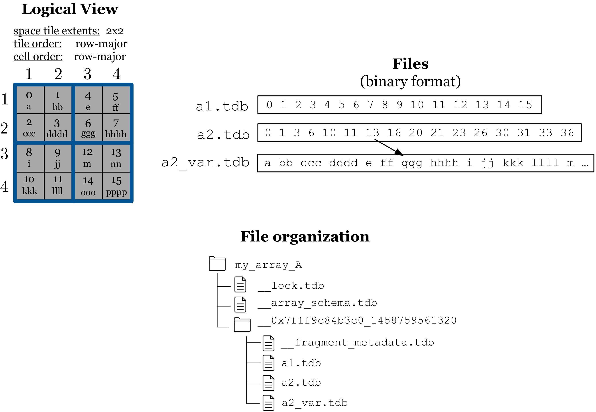

Physical Organization
=====================

An array in TileDB is physically stored as a **directory** in the
underlying filesystem. The array directory contains one sub-directory
per array fragment, whose name is comprised of the thread id that
created it, as well as a timestamp indicating when the fragment was
created. We will explain soon that time-stamping the fragments is
important in the case of updates. Every fragment directory contains one
file per fixed-sized attribute, and two files per variable-sized
attribute. The attribute files store cell values in the global cell
order in a binary representation. Storing a file per attribute is a form
of **vertical partitioning**, which allows efficient subsetting of the
attributes in read requests and leads to effective compression. Each
fragment directory also contains a file that stores the fragment
metadata. We explain the physical storage for dense and sparse arrays
with examples below.

Dense case
----------

:ref:`Figure 6 <figure-6>` shows the physical organization of the
dense array, assuming that it follows
the global cell order illustrated in the middle array of :ref:`Figure
2 <figure-2>`. The cell values along the fixed-sized attribute ``a1``
are stored in a file called ``a1.tdb``, always following the specified
global cell order. Attribute ``a2`` is variable-sized and, thus,
TileDB uses two files to physically store its values.  Specifically,
file ``a2_var.tdb`` stores the variable-sized cell values (again
serialized along the global cell order), whereas ``a2.tdb`` stores the
starting offsets of each variable-sized cell value in file
``a2_var.tdb``. This enables TileDB to efficiently locate the actual
cell value in file ``a2_var.tdb`` during read requests. For instance,
cell ``(2,3)`` appears 7th in the global cell order. Therefore, TileDB
can efficiently look-up the 7th offset in file ``a2.tdb`` (since the
offsets are fixed-sized), which points to the beginning of the cell
value ``ggg`` in ``a2_var.tdb``. Using this organization, TileDB does
not need to maintain any special metadata information for
variable-sized attributes. It only needs to record the subarray in
which the dense fragment is constrained.

.. _figure-6:

    Figure 6: Physical organization of a dense array

In this example, the
fragment name is ``__0x7fff9c84b3c0_1458759561320``, where
``0x7fff9c84b3c0`` is the thread id, and ``1458759561320`` is the
timestamp of the creation in milliseconds.

Observe that, in the file organization of the array depicted in
:ref:`Figure 6 <figure-6>`, there are also three more files. File
``__array_schema.tdb`` contains information about the array definition
(this file is typically very small). File\ ``__lock.tdb`` is used to
achieve process-safety (explained later). File
``__fragment_metadata.tdb`` contains the necessary metadata
information about a specific fragment. Note that
``__array_schema.tdb`` and ``__fragment_metadata.tdb`` are compressed
with some default option (typically BLOSC-ZSTD).

Sparse case
-----------

:ref:`Figure 7 <figure-7>` illustrates the physical organization of
the sparse array, assuming that it
follows the global cell order of the middle array of :ref:`Figure 3
<figure-3>`. The attribute files of sparse arrays are organized in the
same manner as those of dense, except that they contain only
**non-empty** cells. That is, the cell values follow the global cell
order in the attribute files, and there is an extra file for
variable-sized attributes storing the starting offsets of the
variable-sized cell values. Unlike dense arrays where the offset of
each cell value can be directly computed, the same is not possible in
sparse arrays, since the exact distribution of the non-empty cells is
unknown.  In order to locate the non-empty cells, TileDB stores an
additional file with the explicit **coordinates** of the non-empty
cells (``__coords.tdb`` in the figure), which are once again
serialized based on the global cell order. Note that the coordinates
follow the order of the dimensions, as specified in the array metadata
upon array creation.

.. _figure-7:

.. figure:: Figure_7.png
    :align: center

    Figure 7: Physical organization of a sparse array

In order to achieve efficient reads, TileDB stores two types of
metadata information about the data tiles of a sparse array. Recall
that a data tile is a group of non-empty cells of fixed capacity,
associated with an MBR. TileDB stores the MBRs of the data tiles in
the fragment metadata, which facilitate the search for non-empty cells
during a read request. In addition, it stores bounding coordinates,
which are the first and last cell of the data tile along in the global
cell order. These are important for reads as well.

A final remark on physical storage concerns compression. As mentioned
earlier, TileDB compresses each attribute data tile separately, based on
the compression type specified in the array schema for each attribute.
In other words, for every attribute file, TileDB compresses the data
corresponding to each tile separately prior to writing them into the
file. Note that different tiles may be compressed into blocks of
different size, even for fixed-sized attributes (since the compression
ratio depends on the actual data contained in each tile). TileDB
maintains metadata information in order to be able to properly locate
and decompress each tile upon a read request, such as the start offsets
of each tile in each file, as well as the original size of each tile for
the variable-sized tiles. Note that, typically, this metadata
information is many orders of magnitude smaller than the entire array
size, and highly compressible.
