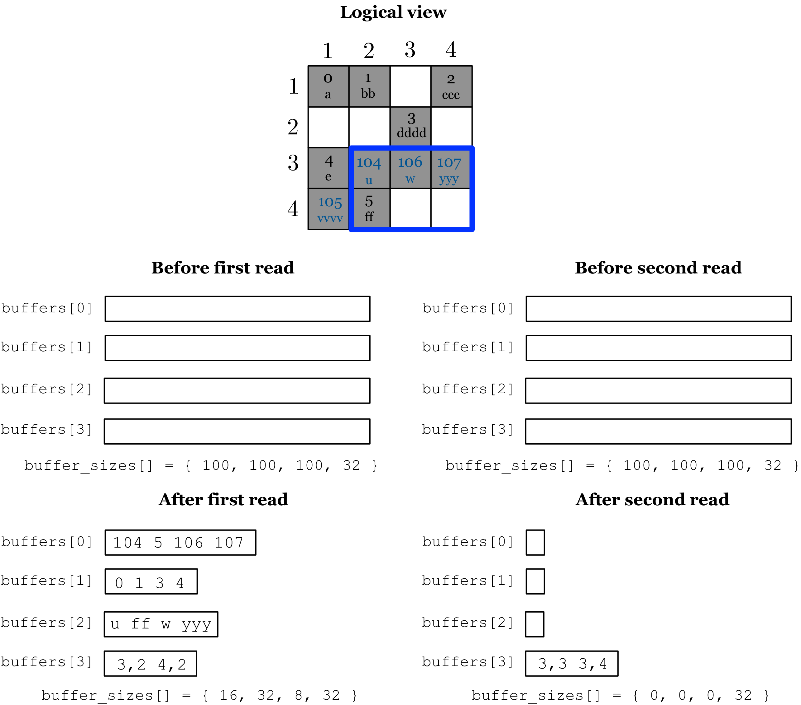

Handling Incomplete Queries
===========================

TileDB enables easy and flexible memory management at the user’s side
during reads, by gracefully handling cases where the user buffers cannot
fit the result. Specifically, the user does not need to carry out the
subarray query in a single read API invocation, especially if she does
not have enough available main memory to do so, or she does not know the
result size in advance (this can happen in the case of sparse reads or
variable-sized attributes). Given buffers that cannot contain the entire
result, instead of crashing, TileDB simply fills as much data as it can
in the provided buffers, maintaining some read state about where exactly
it stopped. Then, if the user submits the query once again providing the
same or different buffers, TileDB resumes the query execution from the
point it stopped, filling the remainder of the result data in the
buffers. The read invocations for a particular subarray query must
always occur for the same created query object, and before the query is
finalized (which flushes the read state).

TileDB handles incomplete queries in the same manner for both dense and
sparse arrays. We explain it with an example using :ref:`Figure 20 <figure-20>`, which
focuses on the sparse array of :ref:`Figure 19 <figure-19>` (the approach is similar for
dense arrays). The figure shows that the subarray query is answered with
two read operations. Observe in the first read that, although the
buffers have enough space to hold all values for attributes ``a1`` and
``a2``, the coordinates buffer can hold only 4 coordinates at a time.
Therefore, the first read retrieves all attributes values, but only the
first 4 coordinates. The second read retrieves the last 4 coordinates.
Moreover, it does not retrieve any value for the other two attributes,
since TileDB knows that these have been already retrieved.

.. _figure-20:

    Figure 20 Incomplete query read example
