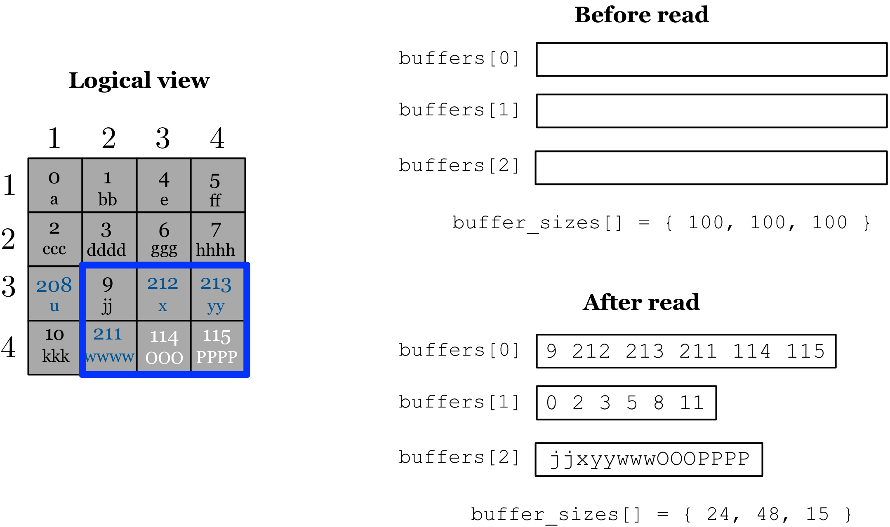

Reading Dense Arrays
====================

Reading in the global cell order
--------------------------------

:ref:`Figure 16 <figure-16>` depicts the logical view of the array from 
:ref:`Figure 13 <figure-13>` or :ref:`Figure 15 <figure-15>`, i.e., 
it may contain three fragments or a single consolidated one;
from the user's perspective, when reading data, it makes no difference
if the array is consolidated or not. Upon array initialization, suppose
the user specifies as her query the subarray ``[3,4],[2,4]``, which is
depicted as a blue rectangle in the figure. Also suppose that she
specifies all attribute values to be retrieved for this subarray. The
user submits a (single) read query passing an array ``buffers`` of three
empty buffers, with sizes 100 bytes each specified in ``buffer_sizes``.
It is the responsibility of the user to allocate memory for these
buffers, which must be at least as big as specified in ``buffer_sizes``.
TileDB retrieves the relevant data and places them into the user's
``buffers`` as shown in the figure (after read). Observe that, in this
examples, the cell values are written in the global cell order of the
array (this leads to the best read performance). In addition, the
offsets of ``buffers[1]`` for attribute ``a2`` are always relative to
the variable-sized cell values in ``buffers[2]``. Finally, TileDB alters
the sizes in ``buffer_sizes`` to reflect the size of the useful data
written in the corresponding buffers.

.. _figure-16:

.. figure:: Figure_16.png
    :align: center

    Figure 16: Reading from a dense array in the global cell order

.. warning::
    Note that, if the array has only a subset of its domain populated 
    (with the remainder being empty), TileDB returns some dummy values 
    for the empty cells intersecting the subarray query. In the future, 
    we are planning to expose special empty, ``null``, and ``NA`` values 
    for datatypes.

Reading in subarray layouts
---------------------------

TileDB supports also reads in a user-specified layout within the
subarray, which are efficiently implemented via a linear time
re-arrangement algorithm and interleaved asynchronous I/O and CPU
processing. Observe that, returning the cell values in the array global
cell order requires the user to know the space tiling (and the cell/tile
orders) in order to make sense of them. TileDB allows the user to
specify the layout with respect to the subarray, which can be row- or
column-major. :ref:`Figure 17 <figure-17>` shows the same example as 
:ref:`Figure 16 <figure-16>`, but now observe that the cells are returned 
in row-major order within subarray ``[3,4], [2,4]``.

.. _figure-17:

    Figure 17: Reading from a dense array in row-major subarray layout
