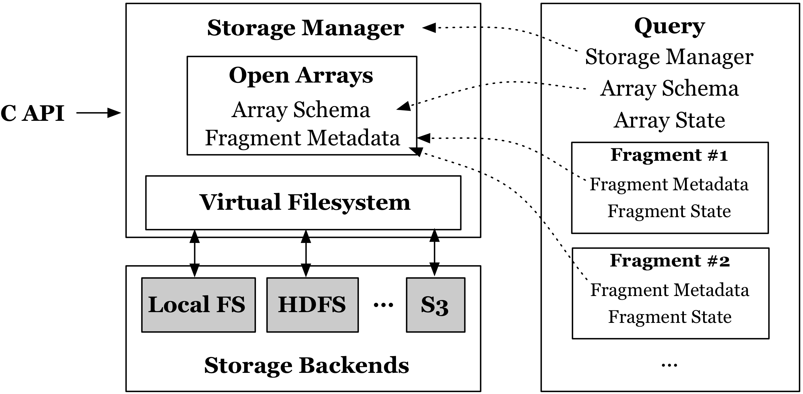

System Architecture
===================

:ref:`Figure 5 <figure-5>` illustrates the TileDB system architecture. 
TileDB exposes a C API that allows users to submit queries to the TileDB 
**storage manager**. The C API is further wrapped with bindings for other
programming languages (e.g., C++, Python, etc.). The storage manager is
responsible for all IO operations that are carried out by interfacing
with potentially multiple storage backends, such as the local filesystem
(e.g., ext4), or distributed filesystems like HDFS, S3, etc. TileDB
**unifies and abstracts** all these backends by letting the user specify
a URI path to an array, and deriving from the URI the type of the
storage backend. The storage manager handles all different backends via
its **virtual filesystem** module. 

.. note:: 
    The TileDB storage manager is a **library**, not a service.

A user query is typically an array read, write, or some other
operations that will be discussed later on. Upon an array read/write
query, the storage manager **opens** the array and maintains some
main-memory information for it, such as the array and fragment metadata
of the array. The storage manager also creates a **query** object.

Each query object is **stateful**, i.e., it maintains information about
the current state of the query operation. This is important for certain
types of queries as we shall explain later in this tutorial. The query
keeps state about all fragments collectively (i.e., the overall array
state), as well as for each fragment individually. The memory footprint
of these states is rather small. The query also stores pointers to the
array/fragment metadata (so that metadata are not unnecessarily
replicated across concurrent queries) and the storage manager object
(which is the sole module responsible for IO).

.. _figure-5:

    
    Figure 5: System architecture
