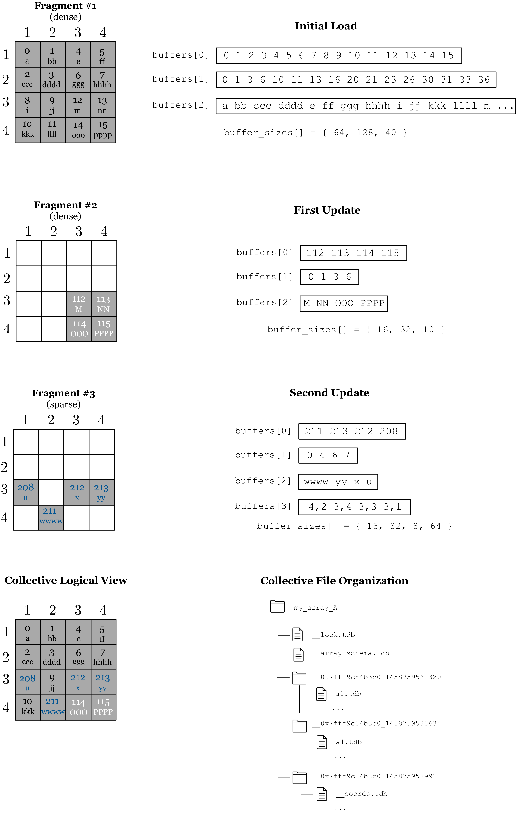

Updating
========

TileDB supports efficient updates for both dense and sparse arrays. An
array is updated by a new write operation (or sequence of write
operations), which create a **new fragment**. At any given time instant,
an array consists of a set of ordered fragments (in ascending order of
timestamps, breaking ties arbitrarily using the thread id). The logical
view of the array (i.e., its actual contents) is comprised of the union
of the updates, with the cell conflicts being resolved by retaining the
cell values of the most recent fragment. In other words, more recent
cell values overwrite older ones. We cover the dense and sparse case
separately in the following two sections. In the last section we discuss
about deletions.

Updating a dense array
----------------------

:ref:`Figure 13 <figure-13>` illustrates an example. The top part shows the initial write,
which is the same as that of :ref:`Figure 8 <figure-8>`. Recall that this writing
operation can be accomplished by any number of writes, as long as the
following sequence of operations takes place: (i) create a query, (ii)
submit the query a number of times (each with different buffer
contents), (iii) finalize the query. The figure also depicts two
updates; the first is dense in subarray ``[3,4],[3,4]``, whereas the
second is sparse and accounts for a set of random cell updates. This is
one of the most interesting features in TileDB; random updates in dense
arrays are expressed as sparse fragments. In our example, the cells are
given in random order, but TileDB sorts them so that they follow the
global cell order, namely row-major tile order with tile extent 2 on
both dimensions, row-major cell order, and assuming that the user has
specified data tile capacity equal to 2. These cells could have been
given ordered as explained in :ref:`Figure 11 <figure-11>` for sparse arrays. Observe that
there are three fragments, where the earliest timestamp corresponds to
the first fragment and the latest to the third fragment. The lower part
of the figure depicts the final logical view of the array, as well as
its final file organization (observe that there are three
sub-directories, one per fragment). Observe also that the most recent
updates overwrite the older ones, e.g., as in cell ``(3,4)``.

.. _figure-13:

    Figure 13: Updating a dense array

Updating a sparse array
-----------------------

:ref:`Figure 14 <figure-14>` shows how sparse arrays can be updated. The top part depicts
the initial load, which is identical to that of :ref:`Figure 12 <figure-12>`. The figure
also illustrates an update via a new write operation with unordered
cells. This creates a new fragment, which is tiled independently
following the array schema. There are two insertions for cells ``(3,2)``
and ``(4,1)``, and two overwrites for cells ``(3,3)`` and ``(3,4)``. The
lower part of the figure shows the final logical view of the sparse
array, as well as the final file organization. There are two fragments,
each having a separate sub directory under the array directory.

.. _figure-14:

.. figure:: Figure_14.png
    :align: center

    Figure 14: Updating a sparse array

Deletions
---------

TileDB currently handles deletions (meaningful mostly for sparse
arrays), **as insertions** of some (user-defined) special value on all
attributes of the cell to be deleted. It is the responsibility of the
user to check for these values upon reading. 

.. warning::
    We are planning to build a more sophisticated way to handle deletions, 
    which will appear in future versions of TileDB.
