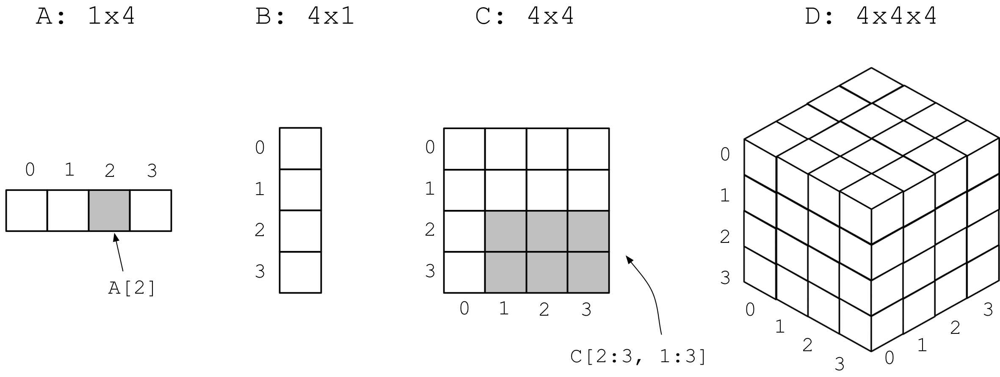
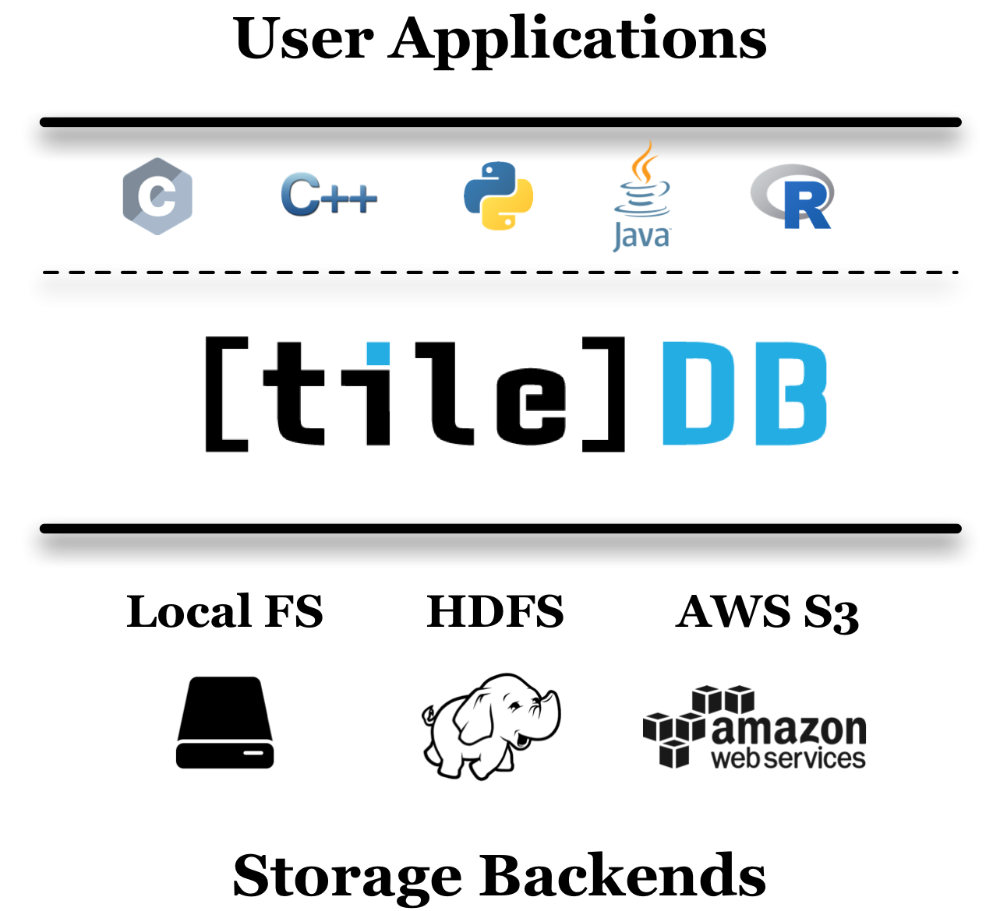

Introduction
============

Welcome to TileDB!

    *TileDB is a library that efficiently manages large-scale, n-dimensional, dense
    and sparse array data*.

Here you will find tutorials that should serve as a gradual
introduction to help you understand basic TileDB concepts, such as dense versus
sparse arrays, all the way through more advanced topics such as data consistency
and performance tuning.

TileDB can be found at `GitHub <https://github.com/TileDB-Inc/TileDB>`_,
open-sourced under the permissive
`MIT License <https://github.com/TileDB-Inc/TileDB/blob/master/LICENSE>`_.

What is Array Data?
-------------------

Array data are collections of elements or **cells**, where each cell is uniquely
indexed by a **coordinate tuple** in an arbitrary number of orthogonal dimensions.
The figure below shows examples of 1D, 2D and 3D arrays. It is easy to
identify a single cell or any subset of cells using array notation, such
as ``A[2]`` for cell with index ``2`` in vector ``A``, or ``C[2:3, 1:3]`` for
cells in rows ``2, 3`` and columns ``1, 2, 3`` in 2D array ``C``. Such a
cell subselection is called **slicing** and is the most fundamental operation
for array data. Moreover, each cell may contain arbitrary information, beyond
just an integer or a real number (e.g., a string, or a custom object).

   Example 1D, 2D and 3D arrays

If every cell in the array has an associated value, we call the array
**dense**. If the majority of cells do not have a value, i.e. many cells
have “undefined” or “empty” values, we call the array **sparse**.

A real-world example of a 2D dense array is a pixel-based image file. Each pixel
is identified by a unique ``(x,y)`` coordinate pair, and each pixel can
store information such as its RGB values. Video is a 3D dense array example,
where each frame is a 2D dense image across an extra (discretized) dense time
dimension. Sparse data is also very common in the real world, such as
time-based data where irregular gaps occur between events (as opposed to
regular samples). Geo-locations on maps can be modeled as 2D sparse arrays,
whereas point cloud data (e.g., LiDAR) is a good 3D sparse array example.
There are numerous other examples seeming irrelevant to arrays that
are actually best represented as arrays, including genomics data, even
relational database tables!

What is TileDB?
---------------

With TileDB you gain the ability to quickly query
array-structured data using rectangular slices, quickly update existing arrays
with new or changed data, and easily optimize your physical data organization
for maximizing compression and read performance.

What does it mean when we say TileDB “manages” your data? It means that when
you ingest data into a TileDB array, the library takes care of all of the
metadata handling required for fast slicing, writes and updates.
The TileDB library also handles lower-level details like data compression,
parallel execution and file I/O, and interfacing with a variety of storage
backends, such as parallel file systems like Lustre and HDFS, or cloud data
stores such as AWS S3.

TileDB does all of this through a familiar library-based approach. To ingest
data into TileDB’s persistent format, you write a program that links with the
TileDB library and makes API calls to create, write to and read from TileDB
arrays. It is simple to choose whether your arrays should be stored as files
and directories on your local disk, or objects in a remote cloud storage system
such as S3. TileDB is a thin software layer that sits between your
applications and the supported storage backend, exposing API bindings for a
wide set of programming languages (e.g., C, C++, Python, Java and R).

   TileDB is a thin layer between the user applications and the storage backends

Features
--------

Novel Format
^^^^^^^^^^^^

TileDB introduces a novel multi-dimensional array format
that effectively handles both dense and sparse data, exposing a unified array
API. TileDB's concept of immutable, append-only fragments allows also
for efficient updates. TileDB adopts a **columnar** format for the various
types of values (**attributes**) stored in the arrays, enabling compressibility
and efficient attribute subselection.

Compression
^^^^^^^^^^^

TileDB offers high compression ratios while allowing efficient
slicing via its tile-based approach. TileDB can compress array data with a
growing number of compressors, such as GZIP, BZIP2,
LZ4, ZStandard, double-delta and run-length encoding.

Parallelism
^^^^^^^^^^^

All the TileDB internals (e.g., compression/decompression,
file I/O, slicing, etc.) are fully parallelized. TileDB's
thread-/process-safe and asynchronous writes and reads enables users to
build powerful parallel analytics on top of the TileDB array
storage manager (e.g., using OpenMP or MPI).

Portability
^^^^^^^^^^^

TileDB works on Linux, macOS and Windows, offering easy
installation packages, binaries and Docker containerization. The users can
integrate TileDB with the tools of their favorite platform to manage
massive multi-dimensional array data.

Language Bindings
^^^^^^^^^^^^^^^^^

Although TileDB is built in C++, it comes with a
growing set of bindings, including **C**, **C++**, **Python**,
**Java** and **R**. TileDB
enables users to continue using their favorite data science applications,
while being empowered to work on immense amounts of data, beyond what
can be stored in main memory.

Multiple Backends
^^^^^^^^^^^^^^^^^

TileDB transparently stores the user arrays
across multiple backends such as HDFS or S3-compliant object stores
(like AWS S3, minio, or Ceph). TileDB's API is the same regardless of
where the array is stored.

Key-value Store
^^^^^^^^^^^^^^^

Users can store any persistent metadata with
TileDB's key-value storage functionality. A TileDB key-value store is
implemented as a TileDB sparse array and inherits all its benefits
(such as compression, parallelism, and multiple backend support).

Virtual Filesystem
^^^^^^^^^^^^^^^^^^

TileDB adds general file management and IO
into the mix for any supported storage backend, via its unified
"virtual filesystem" (VFS) API.

Comparison to HDF5
------------------
`HDF5 <https://www.hdfgroup.org/>`_ is arguably the most popular
multi-dimensional array storage software,
with a strong presence in High Perfomance Computing for over 30 years.
While heavily inspired by HDF5, TileDB brings many novel ideas to
array data management, several of which are adapted from Databases.
The most important differences between TileDB and HDF5 are outlined below.

Sparse Array Support
^^^^^^^^^^^^^^^^^^^^

TileDB was designed from the ground up to efficiently store and access
**both dense and sparse** arrays. In contrast, HDF5 is a dense array
storage manager.

Parallelism
^^^^^^^^^^^

TileDB is **fully parallelized** internally. Specifically, it performs
slicing, compression/decompression, even file I/O with multiple
threads transparently from the user, scaling gracefully with the number
of available threads/cores. This is particularly important
for compression/decompression, since now you can compress your massive
data without compromising read performance. In addition, TileDB is
thread- and process-safe, providing more flexibility for users
accustomed to parallel programming with OpenMP or MPI. On the contrary,
HDF5 is not multi-threaded; it was originally designed to work well
with MPI on HPC systems.

Emphasis on Storing Multiple Values in Cells and Columnar Format
^^^^^^^^^^^^^^^^^^^^^^^^^^^^^^^^^^^^^^^^^^^^^^^^^^^^^^^^^^^^^^^^

TileDB adapts several ideas from Databases. Each array cell in TileDB
is regarded as a *tuple*, and each cell tuple adheres to some common
*array schema*. An element of a cell tuple is called an **attribute**
value. Attributes in TileDB have the same meaning as in
Databases, i.e., they are different fields in the cell. TileDB stores
all cell values on each attribute in a separate file, i.e., it adopts
a **columnar** format.
This means that each TileDB data file corresponds to a different
*projection* of the array on a single attribute. This leads to
better data compressibility and more efficient access in case
the user is interested in a subset of the array attributes upon reads.

HDF5 does not have this concept of cell fields/attributes. Note that HDF5 uses
"attribute" to refer to some piece of array metadata. HDF5 does support
storing structs, which can be regarded as collections of attributes.
However, it stores *all* the values of a cell struct object contiguously,
preventing the user from efficiently retrieving a subset of the struct fields,
and considerably hindering compression.

Multi-File Format and Immutability
^^^^^^^^^^^^^^^^^^^^^^^^^^^^^^^^^^

HDF5 stores an array in a single file. Each update modifies this
single file *in-place*. TileDB instead stores each array as a **collection
of files** stored in a
"directory" (physical directory in the local filesystem, or a collection
of objects with a common name prefix on an object store). Any update
(or, more accurately, any batch of updates) creates a new subdirectory under
the array directory. Every file in TileDB is **immutable**. TileDB's approach
prevents **corruption** during a failed update. This means that you do not
need to nuke your entire (potentially huge) array just because a single
cell update failed and corrupted your file. Therefore, TileDB offers better
fault-tolerance and recovery, as well as the opportunity to build extra
useful features, such as versioning, time-traveling and an "undo" functionality
for updates.

Handling of Variable-Sized Cell Values
^^^^^^^^^^^^^^^^^^^^^^^^^^^^^^^^^^^^^^

TileDB has native support for cell values with variable sizes. In contrast
to HDF5's VL datatypes, TileDB stores all cell values contiguously in a
single file, following the same grouping into tiles as the
fixed-sized values. In addition, it stores the starting offsets of the cell
values in a separate file. Since the offsets are sorted in ascending order,
they are highly compressible. This technique leads to both large compression
ratio and rapid slicing, exhibiting comparable performance to the fixed-sized
counterparts.

Storage Backend Support
^^^^^^^^^^^^^^^^^^^^^^^

TileDB is optimized for various storage backends (including HDFS and AWS S3),
all supported in the core, open-source library. This means that
(i) this feature is free, and (ii) you get to use it with the embeddable
TileDB library, without having to set up or communicate with an extra
service. On the contrary, the HDF5 software does not ship S3 and HDFS
support by default. The HDF Group offers a cloud service with
HDFS/S3 integration as part of their
`Enterprise Support for HDF5 <https://www.hdfgroup.org/solutions/hdf5-enterprise-support-edition/>`_,
but this is not open-source/free.

Modern Build System
^^^^^^^^^^^^^^^^^^^

TileDB offers a modern build system that works on Linux, macOS and Windows,
with automatic installation of all dependencies. TileDB ships with all
its compressors by default. This makes it easier to share compressed data,
since they are all compressed using the same suit of compressors. In contrast,
HDF5 does not ship with all compressors, but rather offers compressor plug-ins
that must be build separately. This can make it difficult to share compressed
data if end users have different compressors installed (or none).

Comparison to SciDB
-------------------

`SciDB <https://www.paradigm4.com/>`_ is a popular **array
database management system**. Its functionality, architecture and targeted
user base are vastly different from those of TileDB (and HDF5)
SciDB is a distributed database service, not an embeddable library like TileDB.
Applications interface with SciDB via sockets (ODBC connectors), sending
queries written in SciDB's query language (called AQL). On the contrary,
TileDB is a leightweight layer that brings the data from storage directly
to the application via library API calls with
minimal overhead (avoiding any serialization/deserialization costs).
SciDB supports a wide set of database-like operators
and features, including analytics, ACID consistency properties, access control,
etc. In contrast, TileDB is an **array storage manager** that provides
effective compression and efficient slicing, while being easily integrated
with higher level programming languages. TileDB (currently) focuses on IO,
leaving the computational tasks to the applications built on top of it.

Contributing
------------

If you would like to contribute to TileDB, visit our
`GitHub repository <https://github.com/TileDB-Inc/TileDB>`_ to view the list of
tracked issues. You can also see developer documentation at the
`wiki <https://github.com/TileDB-Inc/TileDB/wiki>`_ (also on GitHub).

History
-------

TileDB was originally created at the Intel Science and Technology Center for
Big Data, a collaboration between Intel Labs and MIT. The research project
was published in a
`VLDB 2016 paper <https://people.csail.mit.edu/stavrosp/papers/vldb2017/VLDB17_TileDB.pdf>`_.
`TileDB, Inc. <https://tiledb.io>`_ was founded in February 2017 to continue the
further development and maintenance of the TileDB software.

