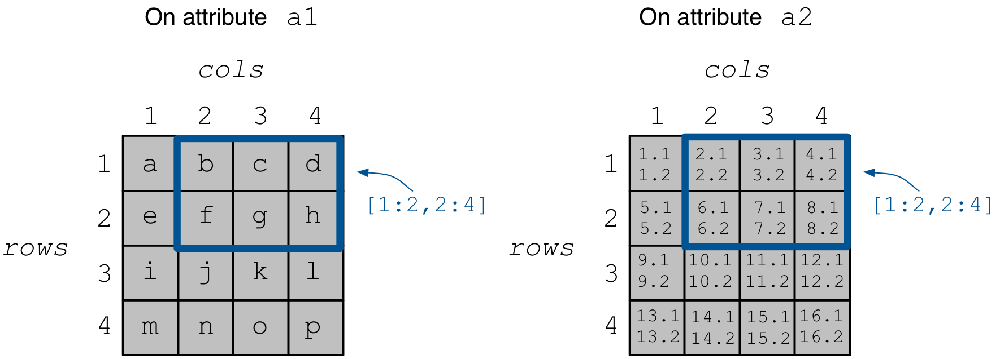

Multi-attribute Arrays
======================

In this tutorial we will learn how to add multiple attributes to TileDB arrays.
We will focus only on dense arrays, as everything you learn here applies to
sparse arrays as well in a straightforward manner.
It is recommended to read the tutorial on dense arrays first.

.. toggle-header::
    :header: **Example Code Listing**

    .. content-tabs::

       .. tab-container:: cpp
          :title: C++

          .. literalinclude:: {source_examples_path}/cpp_api/multi_attribute.cc
             :language: c++
             :linenos:

Basic concepts and definitions
------------------------------

.. toggle-header::
    :header: **Multiple attributes**

      TileDB enables you to store more than one value per cell via the concept of
      attributes. You have the flexibility to define an arbitrary number of attributes,
      potentially each of a different type, in the array schema.

.. toggle-header::
    :header: **Fixed-length attributes**

      Here we will cover fixed-length attributes, i.e., attributes whose values
      consume a fixed amount of space. Fixed-length attributes could be of
      a primitive data type (e.g., ``int32`` or ``char``), or specify a
      vector of a fixed number of primitive data type values.

      .. note::

        TileDB currently does not support user-defined datatypes (such as
        structs). However, this functionality will be added soon.

.. toggle-header::
    :header: **Attribute subselection**

      Although an array may have many attributes, the user may be interested
      in reading just a subset of attribute values. TileDB enables you to
      subselect on the array attributes upon read queries.

.. toggle-header::
    :header: **Columnar format**

      TileDB adopts the so-called columnar format, i.e., it stores the cell
      values along each attribute in a separate file. This leads to very
      efficient attribute subselection (as only the values of the attributes
      you are interested in are fetched from storage, without reading any values
      from irrelevant attributes), as well as more effective compression
      (to be covered in a later tutorial).

Creating a multi-attribute array
--------------------------------

This is similar to what we covered in the simple dense array example. The only
difference is that we add two attributes to the array schema instead of one,
namely ``a1`` that stores characters, and ``a2`` that stores floats. Notice
however that ``a2`` is defined to store **two** float values per cell.

.. content-tabs::

   .. tab-container:: cpp
      :title: C++

      .. code-block:: c++

        schema.add_attribute(Attribute::create<char>(ctx, "a1"));
        schema.add_attribute(Attribute::create<float[2]>(ctx, "a2"));

.. note::

 In the current version of TileDB, once an array has been created, you cannot modify
 the array schema. This means that it is not currently possible to add or remove
 attributes to an already existing array.

Writing to the array
--------------------

Writing is similar to the simple dense array example. The difference here is that
we need to prepare two buffers (one for ``a1`` and one for ``a2``) and set them
to the query object. Note that there should be a one-to-one correspondence
between the values of ``a1`` and ``a2`` in the buffers; for instance, value
``1`` in ``data_a1`` is associated with value ``(1.1f,1.2f)`` in ``data_a2``
(recall each cell stores two floats on ``a2``), ``2`` in ``data_a1``
with ``(2.1f,2.2f)`` in ``data_a2``, etc.

.. content-tabs::

   .. tab-container:: cpp
      :title: C++

      .. code-block:: c++

        std::vector<char> data_a1 = {
            'a', 'b', 'c', 'd',
            'e', 'f', 'g', 'h',
            'i', 'j', 'k', 'l',
            'm', 'n', 'o', 'p'};
        std::vector<float> data_a2 = {
            1.1f,  1.2f,  2.1f,  2.2f,  3.1f,  3.2f,  4.1f,
            4.2f,  5.1f,  5.2f,  6.1f,  6.2f,  7.1f,  7.2f,
            8.1f,  8.2f,  9.1f,  9.2f,  10.1f, 10.2f, 11.1f,
            11.2f, 12.1f, 12.2f, 13.1f, 13.2f, 14.1f, 14.2f,
            15.1f, 15.2f, 16.1f, 16.2f};
        Context ctx;
        Array array(ctx, array_name, TILEDB_WRITE);
        Query query(ctx, array);
        query.set_layout(TILEDB_ROW_MAJOR)
             .set_buffer("a1", data_a1)
             .set_buffer("a2", data_a2);
        query.submit();
        array.close();

.. warning::

   During writing, you must provide a value for all attributes for the cells
   being written, otherwise an error will be thrown.

The array on disk now stores the written data.
The resulting array is depicted in the figure below.

Reading from the array
----------------------

We focus on subarray ``[1,2], [2,4]``.
Reading is similar to the simple dense array example. The difference here
is that we need to allocate two buffers (one for ``a1`` and one for ``a2``)
and set to the query object. Knowing that the result consists of 6 cells,
we allocate 6 character elements for ``data_a1`` and 12 float elements for
``data_a2``, since ``a2`` stores two floats per cell.

.. content-tabs::

   .. tab-container:: cpp
      :title: C++

      .. code-block:: c++

        const std::vector<int> subarray = {1, 2, 2, 4};
        std::vector<char> data_a1(6);
        std::vector<float> data_a2(12);
        Context ctx;
        Array array(ctx, array_name, TILEDB_READ);
        Query query(ctx, array);
        query.set_subarray(subarray)
             .set_layout(TILEDB_ROW_MAJOR)
             .set_buffer("a1", data_a1)
             .set_buffer("a2", data_a2);
        query.submit();
        array.close();

Now ``data_a1`` holds the result cell values on attribute ``a1`` and
``data_a2`` the results on ``a2``, which we can print simply like:

.. content-tabs::

   .. tab-container:: cpp
      :title: C++

      .. code-block:: c++

        for (int i = 0; i < 6; ++i)
        std::cout << "a1: " << data_a1[i] << ", a2: (" << data_a2[2 * i] << ","
                  << data_a2[2 * i + 1] << ")\n";

Subselecting on attributes
~~~~~~~~~~~~~~~~~~~~~~~~~~

While you must provide buffers (values) for all attributes during writes, the same
is not true during reads. If you submit a read query with buffers only for some of
the attributes of an array, only those attributes will be read from disk. For example,
if we wish to retrieve the values only on ``a1``, we set only buffer ``data_a1``
to the query object (i.e., omitting ``data_a2``):

.. content-tabs::

   .. tab-container:: cpp
      :title: C++

      .. code-block:: c++

        const std::vector<int> subarray = {1, 2, 2, 4};
        std::vector<char> data_a1(6);
        Context ctx;
        Array array(ctx, array_name, TILEDB_READ);
        Query query(ctx, array);
        query.set_subarray(subarray)
             .set_layout(TILEDB_ROW_MAJOR)
             .set_buffer("a1", data_a1);
        query.submit();
        array.close();

If you compile and run the example of this tutorial as shown below, you should
see the following output:

.. code-block:: bash

   $ g++ -std=c++11 multi_attribute.cc -o multi_attribute -ltiledb
   $ ./multi_attribute
   Reading both attributes a1 and a2:
   a1: b, a2: (2.1,2.2)
   a1: c, a2: (3.1,3.2)
   a1: d, a2: (4.1,4.2)
   a1: f, a2: (6.1,6.2)
   a1: g, a2: (7.1,7.2)
   a1: h, a2: (8.1,8.2)

   Subselecting on attribute a1:
   a1: b
   a1: c
   a1: d
   a1: f
   a1: g
   a1: h

On-disk structure
-----------------

Let us look at the contents of the array of this example on disk.

.. code-block:: bash

   $ ls -l multi_attribute/
   total 8
   drwx------  5 stavros  staff  170 Jun 18 17:33 __3f4622ed4ec1486ea3450f66c905f8cc_1529357638905
   -rwx------  1 stavros  staff  186 Jun 18 17:33 __array_schema.tdb
   -rwx------  1 stavros  staff    0 Jun 18 17:33 __lock.tdb

   $ ls -l multi_attribute/__3f4622ed4ec1486ea3450f66c905f8cc_1529357638905/
   total 24
   -rwx------  1 stavros  staff  124 Jun 18 17:33 __fragment_metadata.tdb
   -rwx------  1 stavros  staff   16 Jun 18 17:33 a1.tdb
   -rwx------  1 stavros  staff  128 Jun 18 17:33 a2.tdb

TileDB created two separate attribute files in fragment subdirectory
``__3f4622ed4ec1486ea3450f66c905f8cc_1529357638905``: ``a1.tdb`` that stores the cell values
on attribute ``a1`` (observe the file size is ``16`` bytes, equal to the size
required for storing 16 1-byte characters), and ``a2.tdb`` that stores the cell
values on attribute ``a2`` (observe the file size is ``128`` bytes, equal to the
size required for storing 32 4-byte floats, recalling that each cell stores
two floats).

