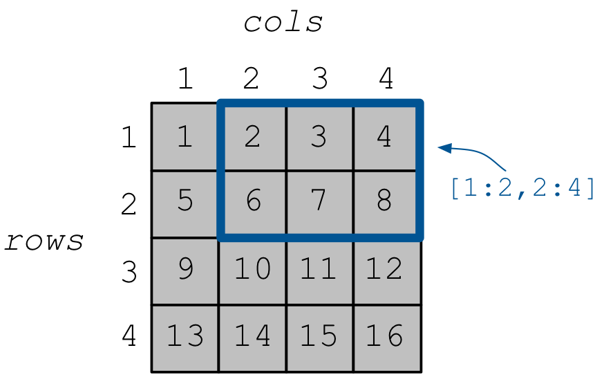
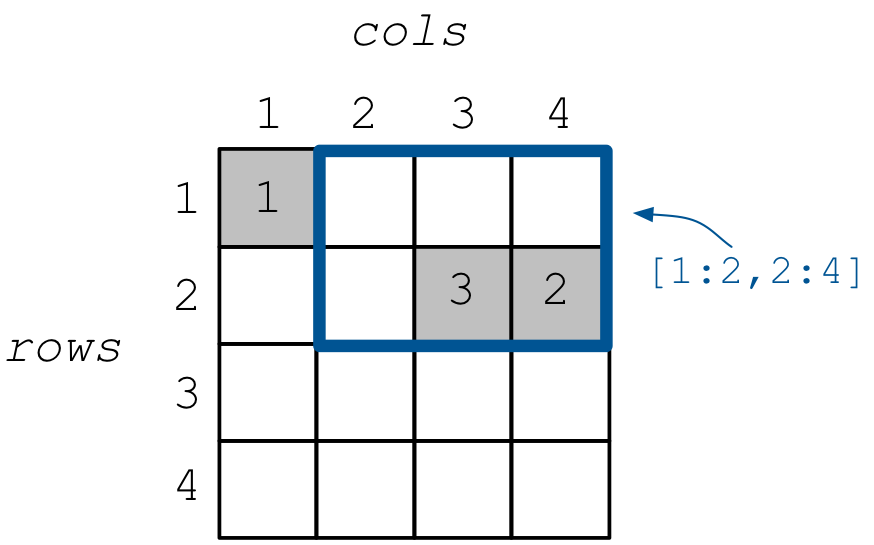

.. _quickstart:

Quickstart
==========

Welcome to TileDB! This quickstart will walk you through getting TileDB
installed and writing your first TileDB programs.

Install TileDB
--------------

C++ API
~~~~~~~

First, grab a TileDB release for your system:

.. content-tabs::

   .. tab-container:: macos
      :title: macOS

      .. code-block:: bash

         # Homebrew:
         $ brew update
         $ brew install tiledb-inc/stable/tiledb

         # Or Conda:
         $ conda install -c conda-forge tiledb

   .. tab-container:: linux
      :title: Linux

      .. code-block:: bash

         # Conda:
         $ conda install -c conda-forge tiledb

         # Or Docker:
         $ docker pull tiledb/tiledb
         $ docker run -it tiledb/tiledb

   .. tab-container:: windows
      :title: Windows

      .. code-block:: powershell

         # Conda
         > conda install -c conda-forge tiledb

         # Or download the pre-built release binaries from:
         # https://github.com/TileDB-Inc/TileDB/releases

For more in-depth installation information, see the :ref:`Installation <installation>` page.

Compiling TileDB programs
'''''''''''''''''''''''''

In the remainder of this quickstart and the tutorials to follow, you will
learn how to create TileDB programs using the language API of your choice.
To compile and run a TileDB program called ``my_tiledb_program.cc``
using the C++ API:

.. code-block:: bash

   $ g++ -std=c++11 my_tiledb_program.cc -o my_tiledb_program -ltiledb
   $ ./my_tiledb_program

If you run into compilation issues, see the :ref:`Usage <usage>` page for more
complete instructions on how to compile and link against TileDB.
If you are on Windows, use the :ref:`Windows usage <windows-usage>` instructions
to create a Visual Studio project instead.

Python API
~~~~~~~~~~

A working TileDB Python system can be installed with ``pip``:

.. code-block:: bash

    $ pip install tiledb

This will automatically download and build the core TileDB library in addition
to the Python bindings, so it may take a while.

To use TileDB-Py in a program, simply import the TileDB Python module:

.. code-block:: python

    import tiledb

And run your program as usual:

.. code-block:: bash

    $ python my_tiledb_program.py

R API
~~~~~
TileDB needs to be installed.  After the core library is installed,
the R source package can be installed and built with ``devtools``:

.. code-block:: R

    install.packages("devtools")
    library(devtools)
    devtools::install_github("TileDB-Inc/TileDB-R@latest")

To use the TileDB-R package, simply import the installed R library in your R script or REPL:

.. code-block:: R

   library(tiledb)

To run a TileDB-R script:

.. code-block:: bash

    $ Rscript my_tiledb_program.R

Golang API
~~~~~~~~~~

TileDB needs to be installed. After the core library is installed the Go
api can be installed with ``go get``:

.. code-block:: bash

    $ go get -v github.com/TileDB/TileDB-Go

This will automatically download and build the Go API bindings and link to
the core library.

To use the TileDB Go API, simply import the installed Go library in your Go source file:

.. code-block:: go

    import tiledb "github.com/TileDB/TileDB-Go"

And run your program as usual:

.. code-block:: bash

    $ go run my_tiledb_program.go

A Simple Dense Array Example
----------------------------

First let's create a simple ``4x4`` dense array, i.e., with two dimensions
(called `rows` and `cols`), each with domain ``[1,4]``. This array has
a single ``int`` attribute, i.e., it will store integer values in its cells.

.. content-tabs::

   .. tab-container:: cpp
      :title: C++

      .. code-block:: c++

         // Name of array.
         std::string array_name("quickstart_dense");

         void create_array() {
           // Create a TileDB context.
           Context ctx;

           // The array will be 4x4 with dimensions "rows" and "cols", with domain [1,4].
           Domain domain(ctx);
           domain.add_dimension(Dimension::create<int>(ctx, "rows", {{1, 4}}, 4))
                 .add_dimension(Dimension::create<int>(ctx, "cols", {{1, 4}}, 4));

           // The array will be dense.
           ArraySchema schema(ctx, TILEDB_DENSE);
           schema.set_domain(domain)
                 .set_order({{TILEDB_ROW_MAJOR, TILEDB_ROW_MAJOR}})

           // Add a single attribute "a" so each (i,j) cell can store an integer.
           schema.add_attribute(Attribute::create<int>(ctx, "a"));

           // Create the (empty) array on disk.
           Array::create(array_name, schema);
         }

   .. tab-container:: python
      :title: Python

      .. code-block:: python

         import numpy as np
         import sys
         import tiledb

         # Name of the array to create.
         array_name = "quickstart_dense"

         def create_array():
             # Create a TileDB context
             ctx = tiledb.Ctx()

             # Check if the array already exists.
             if tiledb.object_type(ctx, array_name) == "array":
                 print("Array already exists.")
                 sys.exit(0)

             # The array will be 4x4 with dimensions "rows" and "cols", with domain [1,4].
             dom = tiledb.Domain(ctx,
                                 tiledb.Dim(ctx, name="rows", domain=(1, 4), tile=4, dtype=np.int32),
                                 tiledb.Dim(ctx, name="cols", domain=(1, 4), tile=4, dtype=np.int32))

             # The array will be dense with a single attribute "a" so each (i,j) cell can store an integer.
             schema = tiledb.ArraySchema(ctx, domain=dom, sparse=False,
                                         attrs=[tiledb.Attr(ctx, name="a", dtype=np.int32)])

             # Create the (empty) array on disk.
             tiledb.DenseArray.create(array_name, schema)

   .. tab-container:: R
      :title: R

      .. code-block:: R

         library(tiledb)

         # Name of the array to create.
         array_name = "quickstart_dense"

         create_array <- function() {
             # Create a TileDB context
            ctx <- tiledb_ctx()

            # Check if the array already exists.
            if (tiledb_object_type(ctx, array_name) == "ARRAY") {
                stop("Array already exists.")
                quit(0)
            }

            # The array will be 4x4 with dimensions "rows" and "cols", with domain [1,4].
            dom <- tiledb_domain(ctx,
                        dims = c(tiledb_dim(ctx, "rows", c(1L, 4L), 4L, "INT32"),
                                 tiledb_dim(ctx, "cols", c(1L, 4L), 4L, "INT32")))

            # The array will be dense with a single attribute "a" so each (i,j) cell can store an integer.
            schema <- tiledb_array_schema(ctx,
                        dom, attrs=c(tiledb_attr(ctx, "a", type = "INT32")))

            # Create the (empty) array on disk.
            tiledb_array_create(array_name, schema)
        }

   .. tab-container:: golang
      :title: Golang

      .. code-block:: go

         // Name of array.
         var arrayName = "quickstart_dense"

         func createDenseArray() {
                 // Create a TileDB context.
        	 ctx, _ := tiledb.NewContext(nil)

        	 // The array will be 4x4 with dimensions "rows" and "cols", with domain [1,4].
        	 domain, _ := tiledb.NewDomain(ctx)
        	 rowDim, _ := tiledb.NewDimension(ctx, "rows", []int32{1, 4}, int32(4))
        	 colDim, _ := tiledb.NewDimension(ctx, "cols", []int32{1, 4}, int32(4))
        	 domain.AddDimensions(rowDim, colDim)

        	 // The array will be dense.
        	 schema, _ := tiledb.NewArraySchema(ctx, tiledb.TILEDB_DENSE)
        	 schema.SetDomain(domain)
        	 schema.SetCellOrder(tiledb.TILEDB_ROW_MAJOR)
        	 schema.SetTileOrder(tiledb.TILEDB_ROW_MAJOR)

        	 // Add a single attribute "a" so each (i,j) cell can store an integer.
        	 a, _ := tiledb.NewAttribute(ctx, "a", tiledb.TILEDB_INT32)
        	 schema.AddAttributes(a)

        	 // Create the (empty) array on disk.
        	 array, _ := tiledb.NewArray(ctx, arrayName)
        	 array.Create(schema)
         }

Next we populate the array by writing some values to its cells, specifically
``1``, ``2``, ..., ``16`` in a row-major layout (i.e., the columns of the first
row will be populated first, then those of the second row, etc.).

.. content-tabs::

   .. tab-container:: cpp
      :title: C++

      .. code-block:: c++

         void write_array() {
           Context ctx;

           // Prepare some data for the array
           std::vector<int> data = {
               1, 2, 3, 4, 5, 6, 7, 8, 9, 10, 11, 12, 13, 14, 15, 16};

           // Open the array for writing and create the query.
           Array array(ctx, array_name, TILEDB_WRITE);
           Query query(ctx, array);
           query.set_layout(TILEDB_ROW_MAJOR)
                .set_buffer("a", data);

           // Perform the write and close the array.
           query.submit();
           array.close();
         }

   .. tab-container:: python
      :title: Python

      .. code-block:: python

         def write_array():
             ctx = tiledb.Ctx()
             # Open the array and write to it.
             with tiledb.DenseArray(ctx, array_name, mode='w') as A:
                 data = np.array(([1, 2, 3, 4],
                                  [5, 6, 7, 8],
                                  [9, 10, 11, 12],
                                  [13, 14, 15, 16]))
                 A[:] = data

   .. tab-container:: R
      :title: R

      .. code-block:: R

         library(tiledb)

         write_array <- function() {
             data <- array(c(c(1L, 5L, 9L, 13L),
                             c(2L, 6L, 10L, 14L),
                             c(3L, 7L, 11L, 15L),
                             c(4L, 8L, 12L, 16L)),
                           dim = c(4,4))
             # Open the array and write to it.
             ctx <- tiledb_ctx()
             A <- tiledb_dense(ctx, uri = array_name)
             A[] <- data
         }

   .. tab-container:: golang
      :title: Golang

      .. code-block:: go

         func writeDenseArray() {
           ctx, _ := tiledb.NewContext(nil)

           // Prepare some data for the array
           data := []int32{
             1, 2, 3, 4, 5, 6, 7, 8, 9, 10, 11, 12, 13, 14, 15, 16}

           // Open the array for writing and create the query.
           array, _ := tiledb.NewArray(ctx, arrayName)
           array.Open(tiledb.TILEDB_WRITE)
           query, _ := tiledb.NewQuery(ctx, array)
           query.SetLayout(tiledb.TILEDB_ROW_MAJOR)
           query.SetBuffer("a", data)

           // Perform the write and close the array.
           query.Submit()
           array.Close()
         }

The resulting array is depicted in the figure below.
Finally, we will read a portion of the array (called **slicing**) and
simply output the contents of the selected cells on the screen.
Suppose we wish to read subarray ``[1,2]``, ``[2,4]``, i.e.,
focus on the cells in rows ``1``, ``2`` and columns ``2``, ``3``, ``4``.
The result values should be ``2 3 4 6 7 8``, reading again in
row-major order (i.e., first the three selected columns of row ``1``,
then the three selected columns of row ``2``).

   A ``4x4`` dense array, highlighting subarray ``[1:2,2:4]``

.. content-tabs::

   .. tab-container:: cpp
      :title: C++

      .. code-block:: c++

         void read_array() {
           Context ctx;

           // Prepare the array for reading
           Array array(ctx, array_name, TILEDB_READ);

           // Slice only rows 1, 2 and cols 2, 3, 4
           const std::vector<int> subarray = {1, 2, 2, 4};

           // Prepare the vector that will hold the result (of size 6 elements)
           std::vector<int> data(6);

           // Prepare the query
           Query query(ctx, array);
           query.set_subarray(subarray)
                .set_layout(TILEDB_ROW_MAJOR)
                .set_buffer("a", data);

           // Submit the query and close the array.
           query.submit();
           array.close();

           // Print out the results.
           for (auto d : data)
             std::cout << d << " ";
           std::cout << "\n";
         }

   .. tab-container:: python
      :title: Python

      .. code-block:: python

         def read_array():
             ctx = tiledb.Ctx()
             # Open the array and read from it.
             with tiledb.DenseArray(ctx, array_name, mode='r') as A:
                 # Slice only rows 1, 2 and cols 2, 3, 4.
                 data = A[1:3, 2:5]
                 print(data["a"])

   .. tab-container:: R
      :title: R

      .. code-block:: R

         library(tiledb)

         read_array <- function() {
             ctx <- tiledb_ctx()
             # Open the array and read from it.
             A <- tiledb_dense(ctx, uri = array_name)
             data <- A[1:2, 2:4]
             show(data)
         }

   .. tab-container:: golang
      :title: Golang

      .. code-block:: go

         func readDenseArray() {
           ctx, _ := tiledb.NewContext(nil)

           // Prepare the array for reading
           array, _ := tiledb.NewArray(ctx, arrayName)
           array.Open(tiledb.TILEDB_READ)

           // Slice only rows 1, 2 and cols 2, 3, 4
           subArray := []int32{1, 2, 2, 4}

           // Prepare the vector that will hold the result (of size 6 elements)
           data := make([]int32, 6)

           // Prepare the query
           query, _ := tiledb.NewQuery(ctx, array)
           query.SetSubArray(subArray)
           query.SetLayout(tiledb.TILEDB_ROW_MAJOR)
           query.SetBuffer("a", data)

           // Submit the query and close the array.
           query.Submit()
           array.Close()

           // Print out the results.
           fmt.Println(data)
         }

If you run the example, you should see the following output:

.. content-tabs::

   .. tab-container:: cpp
      :title: C++

      .. code-block:: bash

         $ g++ -std=c++11 quickstart_dense.cc -o quickstart_dense -ltiledb
         $ ./quickstart_dense
         2 3 4 6 7 8

   .. tab-container:: python
      :title: Python

      .. code-block:: bash

         $ python quickstart_dense.py
         [[2 3 4]
          [6 7 8]]

   .. tab-container:: R
      :title: R

      .. code-block:: bash

         $ Rscript quickstart_dense.R
              [,1] [,2] [,3]
         [1,]    2    3    4
         [2,]    6    7    8

  .. tab-container:: golang
     :title: Golang

     .. code-block:: bash

        $ go test -v quickstart_dense.go
        [2 3 4 6 7 8]

Links to full programs
~~~~~~~~~~~~~~~~~~~~~~

====================================  ================================================================================
**Program**                           **Links**
------------------------------------  --------------------------------------------------------------------------------
``quickstart_dense``                  |quickstartdensecpp| |quickstartdensepy| |quickstartdenser| |quickstartdensego|
====================================  ================================================================================

.. |quickstartdensecpp| image:: figures/cpp.png
   :align: middle
   :width: 30
   :target: {tiledb_src_root_url}/examples/cpp_api/quickstart_dense.cc

.. |quickstartdensepy| image:: figures/python.png
   :align: middle
   :width: 25
   :target: {tiledb_py_src_root_url}/examples/quickstart_dense.py

.. |quickstartdenser| image:: figures/r.png
   :align: middle
   :width: 25
   :target: {tiledb_R_src_root_url}/examples/quickstart_dense.R

A Simple Sparse Array Example
-----------------------------

First let's create a simple ``4x4`` sparse array, i.e., with two dimensions
(called `rows` and `cols`), each with domain ``[1,4]``. This array has
a single ``int`` attribute, i.e., it will store integer values in its cells.

.. content-tabs::

   .. tab-container:: cpp
      :title: C++

      .. code-block:: c++

         // Name of array.
         std::string array_name("quickstart_sparse");

         void create_array() {
           // Create a TileDB context.
           Context ctx;

           // The array will be 4x4 with dimensions "rows" and "cols", with domain [1,4].
           Domain domain(ctx);
           domain.add_dimension(Dimension::create<int>(ctx, "rows", {{1, 4}}, 4))
                 .add_dimension(Dimension::create<int>(ctx, "cols", {{1, 4}}, 4));

           // The array will be sparse.
           ArraySchema schema(ctx, TILEDB_SPARSE);
           schema.set_domain(domain).set_order({{TILEDB_ROW_MAJOR, TILEDB_ROW_MAJOR}});

           // Add a single attribute "a" so each (i,j) cell can store an integer.
           schema.add_attribute(Attribute::create<int>(ctx, "a"));

           // Create the (empty) array on disk.
           Array::create(array_name, schema);
         }

   .. tab-container:: python
      :title: Python

      .. code-block:: python

         import numpy as np
         import sys
         import tiledb

         # Name of the array to create.
         array_name = "quickstart_sparse"

         def create_array():
             # Create a TileDB context
             ctx = tiledb.Ctx()

             # Check if the array already exists.
             if tiledb.object_type(ctx, array_name) == "array":
                 print("Array already exists.")
                 sys.exit(0)

             # The array will be 4x4 with dimensions "rows" and "cols", with domain [1,4].
             dom = tiledb.Domain(ctx,
                                 tiledb.Dim(ctx, name="rows", domain=(1, 4), tile=4, dtype=np.int32),
                                 tiledb.Dim(ctx, name="cols", domain=(1, 4), tile=4, dtype=np.int32))

             # The array will be sparse with a single attribute "a" so each (i,j) cell can store an integer.
             schema = tiledb.ArraySchema(ctx, domain=dom, sparse=True,
                                         attrs=[tiledb.Attr(ctx, name="a", dtype=np.int32)])

             # Create the (empty) array on disk.
             tiledb.SparseArray.create(array_name, schema)

   .. tab-container:: R
      :title: R

      .. code-block:: R

         library(tiledb)

         # Name of the array to create.
         array_name = "sparse_sparse"

         create_array <- function() {
             # Create a TileDB context
            ctx <- tiledb_ctx()

            # Check if the array already exists.
            if (tiledb_object_type(ctx, array_name) == "ARRAY") {
                stop("Array already exists.")
                quit(0)
            }

            # The array will be 4x4 with dimensions "rows" and "cols", with domain [1,4].
            dom <- tiledb_domain(ctx,
                        dims = c(tiledb_dim(ctx, "rows", c(1L, 4L), 4L, "INT32"),
                                 tiledb_dim(ctx, "cols", c(1L, 4L), 4L, "INT32")))

           # The array will be dense with a single attribute "a" so each (i,j) cell can store an integer.
            schema <- tiledb_array_schema(ctx,
                        dom, attrs=c(tiledb_attr(ctx, "a", type = "INT32")),
                        sparse = TRUE)

            # Create the (empty) array on disk.
            tiledb_array_create(array_name, schema)
        }

   .. tab-container:: golang
      :title: Golang

      .. code-block:: go

         // Name of array.
         var sparseArrayName = "quickstart_sparse"

         func createSparseArray() {
           // Create a TileDB context.
           ctx, _ := tiledb.NewContext(nil)

           // The array will be 4x4 with dimensions "rows" and "cols", with domain [1,4].
           domain, _ := tiledb.NewDomain(ctx)
           rowDim, _ := tiledb.NewDimension(ctx, "rows", []int32{1, 4}, int32(4))
           colDim, _ := tiledb.NewDimension(ctx, "cols", []int32{1, 4}, int32(4))
           domain.AddDimensions(rowDim, colDim)

           // The array will be dense.
           schema, _ := tiledb.NewArraySchema(ctx, tiledb.TILEDB_SPARSE)
           schema.SetDomain(domain)
           schema.SetCellOrder(tiledb.TILEDB_ROW_MAJOR)
           schema.SetTileOrder(tiledb.TILEDB_ROW_MAJOR)

           // Add a single attribute "a" so each (i,j) cell can store an integer.
           a, _ := tiledb.NewAttribute(ctx, "a", tiledb.TILEDB_INT32)
           schema.AddAttributes(a)

           // Create the (empty) array on disk.
           array, _ := tiledb.NewArray(ctx, sparseArrayName)
           array.Create(schema)
          }

Next we populate the array by writing some values to its cells, specifically
``1``, ``2``, and ``3`` at cells ``(1,1)``, ``(2,4)`` and  ``(2,3)``,
respectively. Notice that, contrary to the dense case, here we specify
the exact indices where the values will be written, i.e., we provide
the cell **coordinates**. Do not worry about the "unordered" query
layout for now, just know that it is important.

.. content-tabs::

   .. tab-container:: cpp
      :title: C++

      .. code-block:: c++

         void write_array() {
           Context ctx;

           // Write some simple data to cells (1, 1), (2, 4) and (2, 3).
           std::vector<int> coords = {1, 1, 2, 4, 2, 3};
           std::vector<int> data = {1, 2, 3};

           // Open the array for writing and create the query.
           Array array(ctx, array_name, TILEDB_WRITE);
           Query query(ctx, array);
           query.set_layout(TILEDB_UNORDERED)
                .set_buffer("a", data)
                .set_coordinates(coords);

           // Perform the write and close the array.
           query.submit();
           array.close();
         }

   .. tab-container:: python
      :title: Python

      .. code-block:: python

         def write_array():
             ctx = tiledb.Ctx()
             # Open the array and write to it.
             with tiledb.SparseArray(ctx, array_name, mode='w') as A:
                 # Write some simple data to cells (1, 1), (2, 4) and (2, 3).
                 I, J = [1, 2, 2], [1, 4, 3]
                 data = np.array(([1, 2, 3]));
                 A[I, J] = data

   .. tab-container:: R
      :title: R

      .. code-block:: R

         library(tiledb)

         write_array <- function() {
             I <- c(1L, 2L, 2L)
             J <- c(1L, 4L, 3L)
             data <- c(1L, 2L, 3L)
             # Open the array and write to it.
             ctx <- tiledb_ctx()
             A <- tiledb_sparse(ctx, uri = array_name)
             A[I, J] <- data
         }

   .. tab-container:: golang
      :title: Golang

      .. code-block:: go

         func writeSparseArray() {
           ctx, _ := tiledb.NewContext(nil)

           // Write some simple data to cells (1, 1), (2, 4) and (2, 3).
           coords := []int32{1, 1, 2, 4, 2, 3}
           data := []int32{1, 2, 3}

           // Open the array for writing and create the query.
           array, _ := tiledb.NewArray(ctx, sparseArrayName)
           array.Open(tiledb.TILEDB_WRITE)
           query, _ := tiledb.NewQuery(ctx, array)
           query.SetLayout(tiledb.TILEDB_ROW_MAJOR)
           query.SetBuffer("a", data)
           query.SetCoordinates(coords)

           // Perform the write and close the array.
           query.Submit()
           array.Close()
         }

The resulting array is depicted in the figure below.
Similar to the dense array example, we read subarray
``[1,2]``, ``[2,4]``, i.e., focus on the cells in rows
``1``, ``2`` and columns ``2``, ``3``, ``4``.
The result values should be ``3`` for cell ``(2,3)`` and
``2`` for cell ``(2,4)`` reading again in row-major order.

   A ``4x4`` sparse array, highlighting subarray ``[1:2,2:4]``

One of the most challenging issues when using the C++ API is estimating how
large the result of a read query on a sparse array is, so that you know how
much space to allocate for your buffers, and how to parse the result (this
was not an issue in the dense case). TileDB offers several utility functions
in the C++ API to help deal with this issue; read through the "Tutorial"
sections for the details. The Python API takes care of this issue for you
automatically.

.. content-tabs::

   .. tab-container:: cpp
      :title: C++

      .. code-block:: c++

         void read_array() {
           Context ctx;

           // Prepare the array for reading
           Array array(ctx, array_name, TILEDB_READ);

           // Slice only rows 1, 2 and cols 2, 3, 4
           const std::vector<int> subarray = {1, 2, 2, 4};

           // Prepare the vector that will hold the result.
           // We take an upper bound on the result size, as we do not
           // know a priori how big it is (since the array is sparse)
           auto max_el = array.max_buffer_elements(subarray);
           std::vector<int> data(max_el["a"].second);
           std::vector<int> coords(max_el[TILEDB_COORDS].second);

           // Prepare the query
           Query query(ctx, array);
           query.set_subarray(subarray)
                .set_layout(TILEDB_ROW_MAJOR)
                .set_buffer("a", data)
                .set_coordinates(coords);

           // Submit the query and close the array.
           query.submit();
           array.close();

           // Print out the results.
           auto result_num = (int) query.result_buffer_elements()["a"].second;
           for (int r = 0; r < result_num; r++) {
             int i = coords[2 * r], j = coords[2 * r + 1];
             int a = data[r];
             std::cout << "Cell (" << i << "," << j << ") has data " << a << "\n";
           }
         }

   .. tab-container:: python
      :title: Python

      .. code-block:: python

         def read_array():
             ctx = tiledb.Ctx()
             # Open the array and read from it.
             with tiledb.SparseArray(ctx, array_name, mode='r') as A:
                 # Slice only rows 1, 2 and cols 2, 3, 4.
                 data = A[1:3, 2:5]
                 a_vals = data["a"]
                 for i, coord in enumerate(data["coords"]):
                     print("Cell (%d,%d) has data %d" % (coord[0], coord[1], a_vals[i]))

   .. tab-container:: R
      :title: R

      .. code-block:: R

         library(tiledb)

         read_array <- function() {
             ctx <- tiledb_ctx()
             # Open the array and read from it.
             A <- tiledb_dense(ctx, uri = array_name)
             data <- A[1:2, 2:4]

             coords <- data[["coords"]]
             a_vals <- data[["a"]]
             for (idx in seq_along(a_vals)) {
                 i <- coords[((idx - 1) * 2) + 1]
                 j <- coords[((idx - 1) * 2) + 2]
                 cat(sprintf("Cell (%d,%d) has data %d\n", i, j, a_vals[idx]))
             }
         }

   .. tab-container:: golang
      :title: Golang

      .. code-block:: go

         func readSparseArray() {
           ctx, _ := tiledb.NewContext(nil)

           // Prepare the array for reading
           array, _ := tiledb.NewArray(ctx, sparseArrayName)
           array.Open(tiledb.TILEDB_READ)

           // Slice only rows 1, 2 and cols 2, 3, 4
           subArray := []int32{1, 2, 2, 4}

           // Prepare the vector that will hold the results
           // We take the upper bound on the result size as we do not know how large
           // a buffer is needed since the array is sparse
           maxElements, _ := array.MaxBufferElements(subArray)
           data := make([]int32, maxElements["a"][1])
           coords := make([]int32, maxElements[tiledb.TILEDB_COORDS][1])

           // Prepare the query
           query, _ := tiledb.NewQuery(ctx, array)
           query.SetSubArray(subArray)
           query.SetLayout(tiledb.TILEDB_ROW_MAJOR)
           query.SetBuffer("a", data)
           query.SetCoordinates(coords)

           // Submit the query and close the array.
           query.Submit()
           array.Close()

           // Print out the results.
           for r := 0; r < len(data); r++ {
             i := coords[2*r]
             j := coords[2*r+1]
             fmt.Printf("Cell (%d, %d) has data %d\n", i, j, data[r])
           }
         }

If you run the example, you should see the following output:

.. content-tabs::

   .. tab-container:: cpp
      :title: C++

      .. code-block:: bash

         $ g++ -std=c++11 quickstart_sparse.cc -o quickstart_sparse -ltiledb
         $ ./quickstart_sparse
         Cell (2, 3) has data 3
         Cell (2, 4) has data 2

   .. tab-container:: python
      :title: Python

      .. code-block:: bash

         $ python quickstart_sparse.py
         Cell (2,3) has data 3
         Cell (2,4) has data 2

   .. tab-container:: R
      :title: R

      .. code-block:: bash

         $ Rscript quickstart_dense.R
         Cell (2,3) has data 3
         Cell (2,4) has data 2

   .. tab-container:: golang
      :title: Golang

      .. code-block:: bash

         $ go test -v quickstart_sparse_test.go
         Cell (2, 3) has data 3
         Cell (2, 4) has data 2

Links to full programs
~~~~~~~~~~~~~~~~~~~~~~

====================================  ===================================================================================
**Program**                           **Links**
------------------------------------  -----------------------------------------------------------------------------------
``quickstart_sparse``                 |quickstartsparsecpp| |quickstartsparsepy| |quickstartsparser| |quickstartsparsego|
====================================  ===================================================================================

.. |quickstartsparsecpp| image:: figures/cpp.png
   :align: middle
   :width: 30
   :target: {tiledb_src_root_url}/examples/cpp_api/quickstart_sparse.cc

.. |quickstartsparsepy| image:: figures/python.png
   :align: middle
   :width: 25
   :target: {tiledb_py_src_root_url}/examples/quickstart_sparse.py

.. |quickstartsparser| image:: figures/r.png
   :align: middle
   :width: 25
   :target: {tiledb_R_src_root_url}/examples/quickstart_sparse.R

A Simple Key-Value Example
--------------------------

.. warning::

   Key-value arrays are not yet supported for the Go or R APIs.

First let's create a simple map with a single integer attribute.

.. content-tabs::

   .. tab-container:: cpp
      :title: C++

      .. code-block:: c++

         // Name of map.
         std::string map_name("quickstart_map");

         void create_map() {
           // Create TileDB context
           tiledb::Context ctx;

           // Create a map with a single integer attribute
           tiledb::MapSchema schema(ctx);
           tiledb::Attribute a = tiledb::Attribute::create<int>(ctx, "a");
           schema.add_attribute(a);
           tiledb::Map::create(map_name, schema);
         }

   .. tab-container:: python
      :title: Python

      .. code-block:: python

         import numpy as np
         import sys
         import tiledb

         # Name of the array to create.
         array_name = "quickstart_kv"

         def create_array():
             # Create a TileDB context
             ctx = tiledb.Ctx()

             # The KV store will have a single attribute "a" storing a string.
             schema = tiledb.KVSchema(ctx, attrs=[tiledb.Attr(ctx, name="a", dtype=bytes)])

             # Create the (empty) array on disk.
             tiledb.KV.create(ctx, array_name, schema)

.. note::

    Currently the Python key-value API only supports string-valued attributes.
    The C and C++ APIs support any attribute type for key-value arrays.

Next we populate the map with 3 key-value pairs: ``"key_1": 1``, ``"key_2": 2``
and ``"key_3": 3``.

.. content-tabs::

   .. tab-container:: cpp
      :title: C++

      .. code-block:: c++

        void write_map() {
          tiledb::Context ctx;

          // Open the map
          tiledb::Map map(ctx, map_name, TILEDB_WRITE);

          map["key_1"]["a"] = 1;
          map["key_2"] = 2;  // Implicit "a" since there is 1 attr
          map["key_3"] = 3;
          map.flush();

          // Close the map
          map.close();
        }

   .. tab-container:: python
      :title: Python

      .. code-block:: python

         def write_array():
             ctx = tiledb.Ctx()
             # Open the array and write to it.
             A = tiledb.KV(ctx, array_name)
             A["key_1"] = "1"
             A["key_2"] = "2"
             A["key_3"] = "3"
             A.flush()

Finally, we read the data back using the keys and print them on the screen.

.. content-tabs::

   .. tab-container:: cpp
      :title: C++

      .. code-block:: c++

         void read_map() {
           Context ctx;

           // Open the map
           tiledb::Map map(ctx, map_name, TILEDB_READ);

           // Read the keys
           int a1 = map["key_1"];
           int a2 = map["key_2"];
           int a3 = map["key_3"];

           // Print
           std::cout << "key_1: " << a1 << "\n";
           std::cout << "key_2: " << a2 << "\n";
           std::cout << "key_3: " << a3 << "\n";

           // Close the map
           map.close();
         }

   .. tab-container:: python
      :title: Python

      .. code-block:: python

         def read_array():
             ctx = tiledb.Ctx()
             # Open the array and read from it.
             A = tiledb.KV(ctx, array_name)
             print("key_1: %s" % A["key_1"])
             print("key_2: %s" % A["key_2"])
             print("key_3: %s" % A["key_3"])

If you run the example, you should see the following output:

.. content-tabs::

   .. tab-container:: cpp
      :title: C++

      .. code-block:: bash

         $ g++ -std=c++11 quickstart_map.cc -o quickstart_map -ltiledb
         $ ./quickstart_map
         key_1: 1
         key_2: 2
         key_3: 3

   .. tab-container:: python
      :title: Python

      .. code-block:: bash

         $ python quickstart_kv.py
         key_1: 1
         key_2: 2
         key_3: 3

Links to full programs
~~~~~~~~~~~~~~~~~~~~~~

====================================  ================================================================================
**Program**                           **Links**
------------------------------------  --------------------------------------------------------------------------------
``quickstart_kv``                     |quickstartkvcpp| |quickstartkvpy|
====================================  ================================================================================

.. |quickstartkvcpp| image:: figures/cpp.png
   :align: middle
   :width: 30
   :target: {tiledb_src_root_url}/examples/cpp_api/quickstart_map.cc

.. |quickstartkvpy| image:: figures/python.png
   :align: middle
   :width: 25
   :target: {tiledb_py_src_root_url}/examples/quickstart_kv.py

Further reading
---------------

This quickstart omits discussion of several important concepts such as tiling,
cell/tile layouts, types of write and read queries, memory management,
and many more exciting topics. To learn more about these subjects, read through
the "Tutorial" sections that cover all the TileDB concepts and functionality in
great depth.
