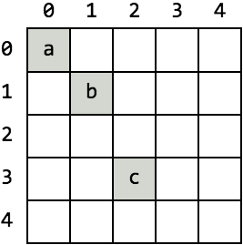

.. _quickstart:

Quickstart
==========

Welcome to TileDB! This quickstart will walk you through getting TileDB
installed and reading/writing some simple data using the C++ API.

1. Install TileDB
-----------------

First, grab a TileDB release for your system:

.. content-tabs::

   .. tab-container:: macos
      :title: macOS

      .. code-block:: bash

         # Homebrew:
         $ brew update
         $ brew install tiledb-inc/stable/tiledb

         # Or Conda:
         $ conda install -c conda-forge tiledb

   .. tab-container:: linux
      :title: Linux

      .. code-block:: bash

         # Conda:
         $ conda install -c conda-forge tiledb

         # Or Docker:
         $ docker pull tiledb/tiledb
         $ docker run -it tiledb/tiledb

   .. tab-container:: windows
      :title: Windows

      .. code-block:: powershell

         # Conda
         > conda install -c conda-forge tiledb

         # Or download the pre-built release binaries from:
         # https://github.com/TileDB-Inc/TileDB/releases

For more in-depth installation information, see the :ref:`Installation <installation>` page.

2. Write example program
------------------------

The example program illustrates three main TileDB operations: 2D sparse array
creation (``create_array()`` in the example code), writing data into the array
(``write_array()``), and reading from the array (``read_array()``).

We will first create the array with a simple sparse 2D schema where each cell can
store a single character of data. Then, we'll write data to 3 cells of the array.
Finally, we'll read back the cells using a spatial slice.

Save the following program to a file ``quickstart.cc``:

.. code-block:: c++

   #include <iostream>
   #include <tiledb/tiledb>
   
   using namespace tiledb;
   
   // Name of array.
   std::string array_name("my_array");
   
   void create_array() {
     Context ctx;
     // If the array already exists on disk, return immediately.
     if (Object::object(ctx, array_name).type() == Object::Type::Array)
       return;
   
     // The array will be 2D with dimensions "x" and "y", with domain [0,4].
     Domain domain(ctx);
     domain.add_dimension(Dimension::create<int>(ctx, "x", {{0, 4}}, 2))
         .add_dimension(Dimension::create<int>(ctx, "y", {{0, 4}}, 2));
   
     // The array will be sparse.
     ArraySchema schema(ctx, TILEDB_SPARSE);
     schema.set_order({{TILEDB_ROW_MAJOR, TILEDB_ROW_MAJOR}})
         .set_capacity(4)
         .set_domain(domain);
   
     // Add a single attribute "a" so each (x,y) cell can store a character.
     schema.add_attribute(Attribute::create<char>(ctx, "a"));
   
     // Create the (empty) array on disk.
     Array::create(array_name, schema);
   }
   
   
   void write_array() {
     Context ctx;
     // Write some simple data to cells (0, 0), (1, 1) and (2, 3).
     std::vector<int> coords = {0, 0, 1, 1, 2, 3};
     std::vector<char> data = {'a', 'b', 'c'};
   
     // Open the array for writing and create the query.
     Array array(ctx, array_name, TILEDB_WRITE);
     Query query(ctx, array);
     // "Unordered" means we provide the coordinates for each cell being written.
     query.set_layout(TILEDB_UNORDERED)
         .set_buffer("a", data)
         .set_coordinates(coords);
     // Perform the write and close the array.
     query.submit();
     query.finalize();
     array.close();
   }
   
   
   void read_array() {
     Context ctx;
     Array array(ctx, array_name, TILEDB_READ);
   
     // Read using a spatial query with bounding box from (0, 0) to (3, 3).
     const std::vector<int> subarray = {0, 3, 0, 3};
     // Figure out how big our buffers need to be to hold the query result.
     auto max_sizes = array.max_buffer_elements(subarray);
     std::vector<char> data(max_sizes["a"].second);
     std::vector<int> coords(max_sizes[TILEDB_COORDS].second);
   
     Query query(ctx, array);
     // "Global order" read means TileDB won't sort the cells before returning.
     query.set_subarray(subarray)
         .set_layout(TILEDB_GLOBAL_ORDER)
         .set_buffer("a", data)
         .set_coordinates(coords);
     // Submit the query and close the array.
     query.submit();
     query.finalize();
     array.close();
   
     // Print out the results.
     int num_cells_read = query.result_buffer_elements()["a"].second;
     for (int i = 0; i < num_cells_read; i++) {
       int x = coords[2 * i], y = coords[2 * i + 1];
       char a = data[i];
       std::cout << "Cell (" << x << "," << y << ") has data '" << a << "'"
                 << std::endl;
     }
   }
   
   
   int main(int argc, char **argv) {
     create_array();
     write_array();
     read_array();
     return 0;
   }

Compile the example program:

.. code-block:: bash

   $ g++ -std=c++11 quickstart.cc -o quickstart -ltiledb

If you run into compilation issues, see the :ref:`Usage <usage>` page for more
complete instructions on how to compile and link against TileDB.
If you are on Windows, use the :ref:`Windows usage <windows-usage>` instructions
to create a Visual Studio project instead.

3. Run the example
------------------

Run the example, and you should see the following output:

.. code-block:: none

   $ ./quickstart
   Created array my_array
   Cell (0,0) has data 'a'
   Cell (1,1) has data 'b'
   Cell (2,3) has data 'c'

The array we created has the following structure:

   Visualization of the example sparse array

Because the array is sparse, only the cells that were actually written to are
stored on disk (colored grey in the figure). The other empty cells (colored
white in the figure) don't exist in the array on disk, and therefore don't take
up any extra storage.

**Troubleshooting**

If you ran into compile or runtime issues with any of the above steps, the
:ref:`Installation <installation>` and :ref:`Usage <usage>` pages contain more
in-depth documentation to help.

4. Further reading
------------------

This quickstart omits discussion of several important issues such as:

* How to choose tile sizes for your array (the example used a "space tile"
  extent of 2 and a "data tile" capacity of 4).
* How to choose row and tile ordering (the example used row-major for both).
* The other types of read and write queries (the example used unordered writes
  and global order reads).

To learn more about these subjects, see the other documentation sections such as
the Tutorials or Further Reading.