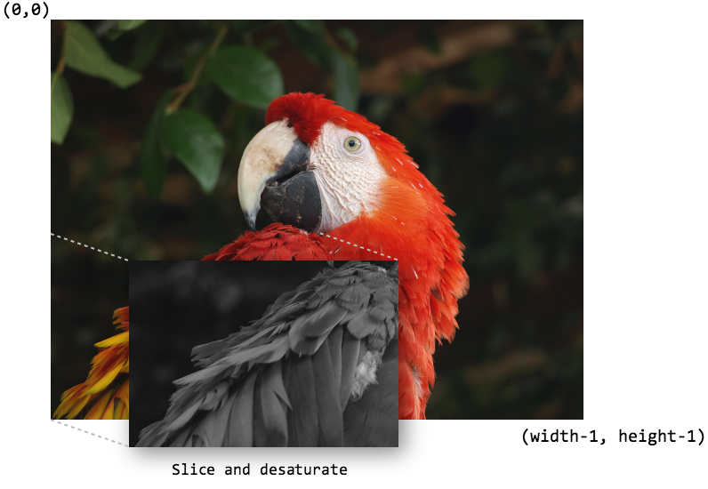

Dense Image Data
================

In this tutorial we will walk through a real-world example of ingesting and
reading dense image data in a TileDB array. It is recommended to first
read the tutorials on dense arrays and attributes. We built the code
example of this tutorial in C++, but by now you are hopefully able to port
this to other languages using the TileDB APIs.

.. table:: Full programs
  :widths: auto

  ====================================  =============================================================
  **Program**                           **Links**
  ------------------------------------  -------------------------------------------------------------
  ``tiledb_png``                        |pngcpp|
  ====================================  =============================================================

.. |pngcpp| image:: ../figures/cpp.png
   :align: middle
   :width: 30
   :target: {tiledb_src_root_url}/examples/png_ingestion/README.md

Project setup
-------------

For this tutorial we will ingest dense image data into a TileDB array and
perform some basic slices and filters on it. We'll use the widely-available
`libpng <https://sourceforge.net/projects/libpng/>`__ library for reading
pixel data from PNG files. The tutorial will also assume you've already
installed a TileDB release on your system (see the :ref:`installation`
page for instructions on how to do that) as well as ``libpng``.

To get started, it will be easiest to use the
`example CMake project <https://github.com/TileDB-Inc/TileDB/tree/dev/examples/cmake_project>`__
as a template that we will fill in, including linking the ingestor
program with ``libpng``.

Clone the TileDB repository and copy the ``examples/cmake_project`` directory to
where you want to store this project:

.. code-block:: bash

   $ git clone https://github.com/TileDB-Inc/TileDB.git
   $ mkdir ~/tiledb_projects
   $ cd TileDB
   $ cp -R examples/cmake_project ~/tiledb_projects/png_example
   $ cd ~/tiledb_projects/png_example

Adding ``libpng``
-----------------

First, edit the ``src/main.cc`` file and add the new include at the top:

.. content-tabs::

   .. tab-container:: cpp
      :title: C++

      .. code-block:: c++
      
         #include <png.h>
         // Note: on some macOS platforms with a brew-installed libpng,
         // include instead:
         // #include <libpng16/png.h>

Next, edit ``CMakeLists.txt`` and add the commands to link the executable against ``libpng``::

    # Find and link with libpng.
    find_package(PNG REQUIRED)
    target_link_libraries(ExampleExe "${PNG_LIBRARIES}")
    target_include_directories(ExampleExe PRIVATE "${PNG_INCLUDE_DIRS}")
    target_compile_definitions(ExampleExe PRIVATE "${PNG_DEFINITIONS}")

Then build the program as follows.

.. code-block:: bash

   $ mkdir build
   $ cd build
   $ cmake .. && make

In the remainder of the tutorial, we will be building up ``src/main.cc``, which
will eventually contain our full code example.

Reading and writing PNG data with ``libpng``
--------------------------------------------

First we need to interface with ``libpng`` to be able to read/write pixel data
from/to ``.png`` files on disk. Add the following two functions at the top
of ``src/main.cc``. The first, ``read_png()``,  will read PNG pixel data from
a given path, and normalize it such that there are always values for all
four RGBA components. The second, ``write_png()``, will write pixel data to a
new ``.png`` image at the given path.

.. toggle-header::
   :header: **Click to see:** ``read_png()``

    .. content-tabs::

       .. tab-container:: cpp
          :title: C++

          .. code-block:: c++
   
             /**
              * Reads a .png file at the given path and returns a vector of pointers to
              * the pixel data in each row. The caller must free the row pointers.
              *
              * This is a modified version of: https://gist.github.com/niw/5963798
              * "How to read and write PNG file using libpng"
              * (C) 2002-2010 Guillaume Cottenceau
              * Redistributed under the X11 license.
              */
             std::vector<uint8_t*> read_png(
                 const std::string& path, unsigned* width, unsigned* height) {
               std::vector<uint8_t*> row_pointers;
             
               // Get the image info.
               auto fp = fopen(path.c_str(), "rb");
               png_structp png =
                   png_create_read_struct(PNG_LIBPNG_VER_STRING, NULL, NULL, NULL);
               png_infop info = png_create_info_struct(png);
               setjmp(png_jmpbuf(png));
               png_init_io(png, fp);
               png_read_info(png, info);
             
               *width = png_get_image_width(png, info);
               *height = png_get_image_height(png, info);
               uint8_t color_type = png_get_color_type(png, info),
                       bit_depth = png_get_bit_depth(png, info);
             
               // Read any color_type into 8bit depth, RGBA format.
               // See http://www.libpng.org/pub/png/libpng-manual.txt
               if (bit_depth == 16)
                 png_set_strip_16(png);
             
               if (color_type == PNG_COLOR_TYPE_PALETTE)
                 png_set_palette_to_rgb(png);
             
               // PNG_COLOR_TYPE_GRAY_ALPHA is always 8 or 16bit depth.
               if (color_type == PNG_COLOR_TYPE_GRAY && bit_depth < 8)
                 png_set_expand_gray_1_2_4_to_8(png);
             
               if (png_get_valid(png, info, PNG_INFO_tRNS))
                 png_set_tRNS_to_alpha(png);
             
               // These color_type don't have an alpha channel then fill it with 0xff.
               if (color_type == PNG_COLOR_TYPE_RGB || color_type == PNG_COLOR_TYPE_GRAY ||
                   color_type == PNG_COLOR_TYPE_PALETTE)
                 png_set_filler(png, 0xFF, PNG_FILLER_AFTER);
             
               if (color_type == PNG_COLOR_TYPE_GRAY ||
                   color_type == PNG_COLOR_TYPE_GRAY_ALPHA)
                 png_set_gray_to_rgb(png);
             
               png_read_update_info(png, info);
             
               // Set up buffers to hold rows of pixel data.
               for (int y = 0; y < *height; y++) {
                 auto row = (uint8_t*)(std::malloc(png_get_rowbytes(png, info)));
                 row_pointers.push_back(row);
               }
             
               // Read the pixel data.
               png_read_image(png, row_pointers.data());
               fclose(fp);
             
               return row_pointers;
             }

.. toggle-header::
   :header: **Click to see:** ``write_png()``

    .. content-tabs::

       .. tab-container:: cpp
          :title: C++

          .. code-block:: c++
             
             /**
              * Writes a .png file at the given path using a vector of pointers to
              * the pixel data in each row. The caller must free the row pointers.
              *
              * This is a modified version of: https://gist.github.com/niw/5963798
              * "How to read and write PNG file using libpng"
              * (C) 2002-2010 Guillaume Cottenceau
              * Redistributed under the X11 license.
              */
             void write_png(
                 std::vector<uint8_t*>& row_pointers,
                 unsigned width,
                 unsigned height,
                 const std::string& path) {
               FILE* fp = fopen(path.c_str(), "wb");
               if (!fp)
                 abort();
             
               png_structp png =
                   png_create_write_struct(PNG_LIBPNG_VER_STRING, NULL, NULL, NULL);
               if (!png)
                 abort();
             
               png_infop info = png_create_info_struct(png);
               if (!info)
                 abort();
             
               if (setjmp(png_jmpbuf(png)))
                 abort();
             
               png_init_io(png, fp);
             
               // Output is 8bit depth, RGBA format.
               png_set_IHDR(
                   png,
                   info,
                   width,
                   height,
                   8,
                   PNG_COLOR_TYPE_RGBA,
                   PNG_INTERLACE_NONE,
                   PNG_COMPRESSION_TYPE_DEFAULT,
                   PNG_FILTER_TYPE_DEFAULT);
               png_write_info(png, info);
             
               // To remove the alpha channel for PNG_COLOR_TYPE_RGB format,
               // Use png_set_filler().
               // png_set_filler(png, 0, PNG_FILLER_AFTER);
             
               png_write_image(png, row_pointers.data());
               png_write_end(png, NULL);
             
               fclose(fp);
             }

The array schema
----------------

Before ingesting data, we need to design an array schema to hold the data.
In this case, the image data is two-dimensional and dense, so we will
ingest the data into a 2D dense array.

PNG pixel data typically has four component values for each pixel in the
image: *red*, *green*, *blue*, and *alpha* (RGBA). We have several choices
on how to store this data.

One possible approach is to have each cell in the array (corresponding
to each pixel in the image) hold a single ``uint32_t`` with the
RGBA value. This would correspond to an array schema with a single
attribute named ``rgba`` of type ``uint32_t``, e.g.:

.. content-tabs::

   .. tab-container:: cpp
      :title: C++

      .. code-block:: c++

         ArraySchema schema(ctx, TILEDB_DENSE);
         schema.add_attribute(Attribute::create<uint32_t>(ctx, "rgba"));

Because the RGBA value is fundamentally made of four components, we can also store
the components separately, where each cell has a separate red, green, blue and alpha
value. This would correspond to an array schema with four attributes:
``red``, ``green``, ``blue``, and ``alpha``, all of type ``uint8_t``, e.g.:

.. content-tabs::

   .. tab-container:: cpp
      :title: C++

      .. code-block:: c++

         ArraySchema schema(ctx, TILEDB_DENSE);
         schema.set_order({{TILEDB_ROW_MAJOR, TILEDB_ROW_MAJOR}}).set_domain(domain);
         schema.add_attribute(Attribute::create<uint8_t>(ctx, "red"))
               .add_attribute(Attribute::create<uint8_t>(ctx, "green"))
               .add_attribute(Attribute::create<uint8_t>(ctx, "blue"))
               .add_attribute(Attribute::create<uint8_t>(ctx, "alpha"));

The choice of array schema depends on the type of read queries that will be
issued to the array, and whether separate access to the RGBA components will
be a common task. For the rest of this tutorial, we will use the second
schema, with four attributes.

Once we have decided on a schema for the array to hold our data, we
can write the function to define the array:

.. content-tabs::

   .. tab-container:: cpp
      :title: C++

      .. code-block:: c++

         using namespace tiledb;

         /**
          * Create a TileDB array suitable for storing pixel data.
          *
          * @param width Number of columns in array domain
          * @param height Number of rows in array domain
          * @param array_path Path to array to create
          */
         void create_array(
             unsigned width, unsigned height, const std::string& array_path) {
           Context ctx;
           Domain domain(ctx);
           domain
               .add_dimension(
                   Dimension::create<unsigned>(ctx, "y", {{0, height - 1}}, 100))
               .add_dimension(
                   Dimension::create<unsigned>(ctx, "x", {{0, width - 1}}, 100));
         
           ArraySchema schema(ctx, TILEDB_DENSE);
           schema.set_order({{TILEDB_ROW_MAJOR, TILEDB_ROW_MAJOR}}).set_domain(domain);
           schema.add_attribute(Attribute::create<uint8_t>(ctx, "red"))
               .add_attribute(Attribute::create<uint8_t>(ctx, "green"))
               .add_attribute(Attribute::create<uint8_t>(ctx, "blue"))
               .add_attribute(Attribute::create<uint8_t>(ctx, "alpha"));
         
           // Create the (empty) array on disk.
           Array::create(array_path, schema);
         }

The above array schema specifies that the domain of the array will be
``[0, height-1], [0, width-1]`` in the ``y`` and ``x`` dimensions, respectively. Notice that
``y`` corresponds to the height/rows and ``x`` to the width/columns of the array.
Conceptually, this corresponds to a traditional row-major ordering of pixel data, which
will make it easier to interface with ``libpng`` (which returns pixel data already
in row-major order).

We've chosen a relatively small tile extent of ``100x100``; for very large (e.g. gigapixel)
images it would make sense to increase this to ``1000x1000`` or even higher.

Ingesting PNG data
------------------

We will write a function that uses the ``read_png()`` function from earlier to
retrieve pixel data from an image on disk, splits the pixel data into four
attribute buffers (one per color channel), and issues a write query to TileDB:

.. content-tabs::

   .. tab-container:: cpp
      :title: C++

      .. code-block:: c++

         /**
          * Ingest the pixel data from the given .png image into a TileDB array.
          *
          * @param input_png Path of .png image to ingest.
          * @param array_path Path of array to create.
          */
         void ingest_png(const std::string& input_png, const std::string& array_path) {
           // Read the png file into memory
           unsigned width, height;
           std::vector<uint8_t*> row_pointers = read_png(input_png, &width, &height);
         
           // Create the empty array.
           create_array(width, height, array_path);
         
           // Unpack the row-major pixel data into four attribute buffers.
           std::vector<uint8_t> red, green, blue, alpha;
           for (unsigned y = 0; y < height; y++) {
             auto row = row_pointers[y];
             for (unsigned x = 0; x < width; x++) {
               auto rgba = &row[4 * x];
               uint8_t r = rgba[0], g = rgba[1], b = rgba[2], a = rgba[3];
               red.push_back(r);
               green.push_back(g);
               blue.push_back(b);
               alpha.push_back(a);
             }
           }
         
           // Clean up.
           for (int y = 0; y < height; y++)
             std::free(row_pointers[y]);
         
           // Write the pixel data into the array.
           Context ctx;
           Array array(ctx, array_path, TILEDB_WRITE);
           Query query(ctx, array);
           query.set_layout(TILEDB_ROW_MAJOR)
               .set_buffer("red", red)
               .set_buffer("green", green)
               .set_buffer("blue", blue)
               .set_buffer("alpha", alpha);
           query.submit();
           query.finalize();
           array.close();
         }

Next, we modify the ``main()`` function of ``src/main.cc`` to call
these functions with command-line arguments that specify the path of the
input ``.png`` file and the output TileDB array, and we have a complete
ingestion program:

.. content-tabs::

   .. tab-container:: cpp
      :title: C++

      .. code-block:: c++

         int main(int argc, char** argv) {
           std::string input_png(argv[1]), array_path(argv[2]);
         
           // Ingest the .png data to a new TileDB array.
           ingest_png(input_png, array_path);
         
           return 0;
         }

Build and run the program to ingest a ``.png`` file:

.. code-block:: bash

   $ make
   $ ./ExampleExe input.png my_array_name

This will read the file ``input.png``, create a new array in the current
directory named ``my_array_name``, and write the pixel data into it.

Slicing image data from the array
---------------------------------

To complete the tutorial, we will write a simple function that reads a
"slice" (rectangular region) of image data from the TileDB array created
by the ingestor, converts the sliced data to greyscale, and then writes
the resulting image to a new ``.png`` file:

   `Original image <https://commons.wikimedia.org/wiki/File:Scarlet-Macaw.jpg>`_ copyright Ben Lunsford, reproduced under CC-BY-SA-3.0-US.

The following code snippet shows the beginning of function
``slice_and_desaturate()``. First, we must open the array for reading,
and use the utility function ``non_empty_domain()`` to calculate the
width and height of the array.

.. content-tabs::

   .. tab-container:: cpp
      :title: C++

      .. code-block:: c++

         /**
          * Reads a slice of image data from a TileDB array, converts it to greyscale,
          * and writes a new image with the resulting image data.
          *
          * @param array_path Path of array to read from.
          * @param output_png Path of .png image to create.
          */
         void slice_and_desaturate(
             const std::string& array_path, const std::string& output_png) {
           Context ctx;
           Array array(ctx, array_path, TILEDB_READ);

           auto non_empty = array.non_empty_domain<unsigned>();
           auto array_y_min = non_empty[0].second.first,
                array_y_max = non_empty[0].second.second,
                array_x_min = non_empty[1].second.first,
                array_x_max = non_empty[1].second.second;
           auto array_height = array_y_max - array_y_min + 1,
                array_width = array_x_max - array_x_min + 1;

Note that the order of dimensions in the vector ``non_empty`` is the same
as when we created the array schema (``y`` first to compute the height,
then ``x`` for the width). Next, we can use the array width and height to
compute the cell coordinates for the subarray we wish to read. The subarray
selects rows ``[array_height / 2 : array_height - 1]`` (inclusive range) and
columns ``[0 : array_width / 2]``, which corresponds to the lower-left
quarter of the image:

.. content-tabs::

   .. tab-container:: cpp
      :title: C++

      .. code-block:: c++

           std::vector<unsigned> subarray = {
               array_height / 2, array_height - 1, 0, array_width / 2};
           auto output_height = subarray[1] - subarray[0] + 1,
                output_width = subarray[3] - subarray[2] + 1;

Once we have set up the subarray, we can allocate ``std::vector`` buffers that
will hold the image data read from the array, and submit the read query to TileDB:

.. content-tabs::

   .. tab-container:: cpp
      :title: C++

      .. code-block:: c++

           auto max_elements = array.max_buffer_elements(subarray);
           std::vector<uint8_t> red(max_elements["red"].second),
               green(max_elements["green"].second),
               blue(max_elements["blue"].second),
               alpha(max_elements["alpha"].second);

           Query query(ctx, array);
           query.set_layout(TILEDB_ROW_MAJOR)
               .set_subarray(subarray)
               .set_buffer("red", red)
               .set_buffer("green", green)
               .set_buffer("blue", blue)
               .set_buffer("alpha", alpha);
           query.submit();
           query.finalize();
           array.close();

We now have the image data in memory. We can now transform the pixel data
however we like, and pack it into a buffer that ``libpng`` can use to
create the new ``.png`` image. Here we are performing a simple desaturation
process by changing the RGB value of each pixel to the average of the color components:

.. content-tabs::

   .. tab-container:: cpp
      :title: C++

      .. code-block:: c++
         
           // Allocate a buffer suitable for passing to libpng.
           std::vector<uint8_t*> desaturated;
           for (unsigned y = 0; y < output_height; y++)
             desaturated.push_back(
                 (uint8_t*)std::malloc(output_width * 4 * sizeof(uint8_t)));
         
           // Compute and store the desaturated pixel values.
           for (unsigned y = 0; y < output_height; y++) {
             uint8_t* row = desaturated[y];
             for (unsigned x = 0; x < output_width; x++) {
               unsigned i = y * output_width + x;
               auto rgba = &row[4 * x];
               auto grey = (uint8_t)((red[i] + green[i] + blue[i]) / 3.0f);
               rgba[0] = rgba[1] = rgba[2] = grey;
               rgba[3] = alpha[i];
             }
           }

Finally we just need to call into ``libpng`` to write the image,
and clean up the buffers we allocated:

.. content-tabs::

   .. tab-container:: cpp
      :title: C++

      .. code-block:: c++

           // Write the image.
           write_png(desaturated, output_width, output_height, output_png);
         
           // Clean up.
           for (unsigned i = 0; i < output_height; i++)
             std::free(desaturated[i]);
         }

Here is the complete function definition:

.. toggle-header::
   :header: **Click to see:** ``slice_and_desaturate()``

    .. content-tabs::

       .. tab-container:: cpp
          :title: C++

          .. code-block:: c++

             /**
              * Reads a slice of image data from a TileDB array, converts it to greyscale,
              * and writes a new image with the resulting image data.
              *
              * @param array_path Path of array to read from.
              * @param output_png Path of .png image to create.
              */
             void slice_and_desaturate(
                 const std::string& array_path, const std::string& output_png) {
               Context ctx;
               Array array(ctx, array_path, TILEDB_READ);
             
               // Get the array non-empty domain, which corresponds to the original image
               // width and height.
               auto non_empty = array.non_empty_domain<unsigned>();
               auto array_height =
                        non_empty[0].second.second - non_empty[0].second.first + 1,
                    array_width = non_empty[1].second.second - non_empty[1].second.first + 1;
             
               // Read ("slice") the lower left quarter of the image.
               std::vector<unsigned> subarray = {
                   array_height / 2, array_height - 1, 0, array_width / 2};
               auto output_height = subarray[1] - subarray[0] + 1,
                    output_width = subarray[3] - subarray[2] + 1;
             
               // Allocate buffers to read into.
               auto max_elements = array.max_buffer_elements(subarray);
               std::vector<uint8_t> red(max_elements["red"].second),
                   green(max_elements["green"].second), blue(max_elements["blue"].second),
                   alpha(max_elements["alpha"].second);
             
               // Read from the array.
               Query query(ctx, array);
               query.set_layout(TILEDB_ROW_MAJOR)
                   .set_subarray(subarray)
                   .set_buffer("red", red)
                   .set_buffer("green", green)
                   .set_buffer("blue", blue)
                   .set_buffer("alpha", alpha);
               query.submit();
               query.finalize();
               array.close();
             
               // Allocate a buffer suitable for passing to libpng.
               std::vector<uint8_t*> desaturated;
               for (unsigned y = 0; y < output_height; y++)
                 desaturated.push_back(
                     (uint8_t*)std::malloc(output_width * 4 * sizeof(uint8_t)));
             
               // Compute and store the desaturated pixel values.
               for (unsigned y = 0; y < output_height; y++) {
                 uint8_t* row = desaturated[y];
                 for (unsigned x = 0; x < output_width; x++) {
                   unsigned i = y * output_width + x;
                   auto rgba = &row[4 * x];
                   auto grey = (uint8_t)((red[i] + green[i] + blue[i]) / 3.0f);
                   rgba[0] = rgba[1] = rgba[2] = grey;
                   rgba[3] = alpha[i];
                 }
               }
             
               // Write the image.
               write_png(desaturated, output_width, output_height, output_png);
             
               // Clean up.
               for (unsigned i = 0; i < output_height; i++)
                 std::free(desaturated[i]);
             }

Modify the ``main()`` function to take a third argument for the name of the
output image to create, and invoke the ``slice_and_desaturate()`` function:

.. content-tabs::

   .. tab-container:: cpp
      :title: C++

      .. code-block:: c++
         
         int main(int argc, char** argv) {
           std::string input_png(argv[1]), array_path(argv[2]), output_png(argv[3]);
         
           // Ingest the .png data to a new TileDB array.
           ingest_png(input_png, array_path);
         
           // Read a slice from the array and write it to a new .png image.
           slice_and_desaturate(array_path, output_png);
         
           return 0;
         }

Now build and run the example, removing the ingested array from previous steps (if it exists):

.. code-block:: bash

   $ make
   $ rm -r my_array_name
   $ ./ExampleExe input.png my_array_name output.png

This will create ``output.png`` in the current directory containing the sliced, desaturated image:

