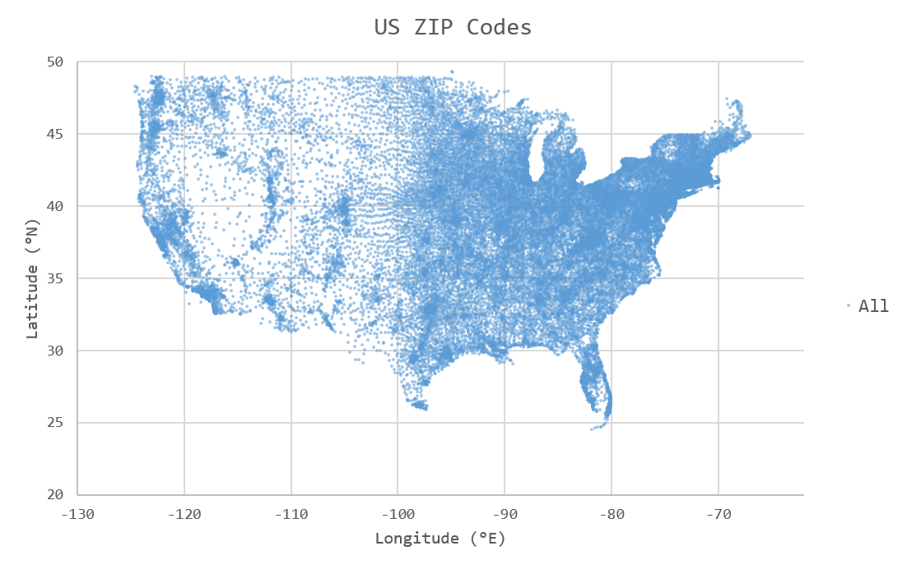
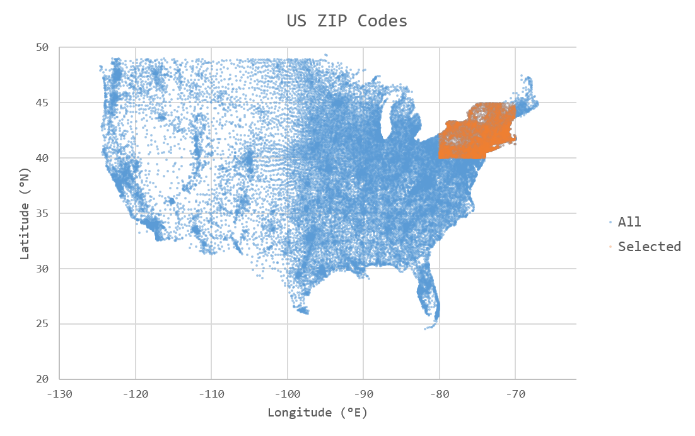

:orphan:

Sparse Geospatial Data
======================

In this tutorial we will walk through a real-world example of ingesting s
parse geospatial data from a CSV file hosted on S3, into a TileDB array
also hosted on S3. It is recommended to first read the tutorials on
sparse arrays and attributes, as well as the tutorial on working with S3.
We built the code example of this tutorial in C++, but by now you are
hopefully able to port this to other languages using the TileDB APIs.

Project setup
-------------

For this tutorial we will ingest sparse geospatial data into a TileDB array
and perform some basic slices on it. In particular, we will ingest a
comma-separated (CSV) file containing the US ZIP codes with an
associated latitude and longitude coordinate pair. The raw data used
for this tutorial can be found in
`this GitHub Gist <https://gist.github.com/erichurst/7882666#file-US%20Zip%20Codes%20from%202013%20Government%20Data>`_
(credit `@erichurst <https://github.com/erichurst>`_).

The tutorial will also assume you've already installed a TileDB release
with S3 support on your system (see the :ref:`installation` page for
instructions on how to do that).

To get started, it will be easiest to use the
`example CMake project <https://github.com/TileDB-Inc/TileDB/tree/dev/examples/cmake_project>`__
as a template that we will fill in.

Clone the TileDB repository and copy the ``examples/cmake_project``
directory to where you want to store this project:

.. code-block:: bash

   $ git clone https://github.com/TileDB-Inc/TileDB.git
   $ mkdir ~/tiledb_projects
   $ cd TileDB
   $ cp -R examples/cmake_project ~/tiledb_projects/zip_code_example
   $ cd ~/tiledb_projects/zip_code_example

You should now be able to build the example program:

.. code-block:: bash

   $ mkdir build
   $ cd build
   $ cmake .. && make

In the remainder of the tutorial, we will be building up ``src/main.cc``, which
will eventually contain our full code example.

Reading and writing CSV data on S3
----------------------------------

For simplicity, in this tutorial we will implement a simple CSV parser for
the specific format instead of linking with a full-fledged parsing library.
Note however that the parsing methods we implement here are quite slow; for
large datasets it would be necessary to use a dedicated CSV parsing library.
Much of the runtime in ingesting the sample US ZIP code data is spent in
these parsing functions.

In order to support reading CSV data hosted on S3, we will take advantage of
TileDB's virtual filesystem (VFS) interface, which exposes a simple
read/write interface over files on any supported backend (which includes S3).
Using TileDB's VFS interface allows us to directly read from a CSV file
hosted on S3 without having to use an S3 SDK to correctly form and issue
requests to an API.

The input CSV data in this case is a very simple format, and looks like this:

.. code-block:: none

    ZIP,LAT,LNG
    00601,18.180555, -66.749961
    00602,18.361945, -67.175597
    00603,18.455183, -67.119887
    00606,18.158345, -66.932911

When visualized as a scatter plot, each ZIP code corresponds to a single
unique point in 2D space. Longitude degrees west are represented in this
dataset as negative values:

Add the following two functions at the top of ``src/main.cc``. The first,
``split_csv_row()``,  will split a comma-delimited string of the above
format into a vector of strings, one element per column. The second,
``parse_csv()``, uses ``split_csv_row()`` to read each line of the input
CSV file and make a callback on each row with that row's column values.

.. toggle-header::
   :header: **Click to see:** ``split_csv_row()``

    .. content-tabs::

       .. tab-container:: cpp
          :title: C++

          .. code-block:: c++

             /**
              * Split a comma-separated string into a vector of elements.
              *
              * @param row Comma-separated string to split
              * @param columns Vector where elements will be stored.
              */
             void split_csv_row(const std::string& row, std::vector<std::string>* columns) {
               assert(columns != nullptr);
               std::istringstream ss(row);
               std::string value;
               columns->clear();
               while (std::getline(ss, value, ',')) {
                 columns->push_back(value);
               }
             }

.. toggle-header::
   :header: **Click to see:** ``parse_csv()``

    .. content-tabs::

       .. tab-container:: cpp
          :title: C++

          .. code-block:: c++

             /**
              * Parse the CSV file at the given URI and make a callback on each row's
              * values.
              *
              * @param input_csv URI of CSV file to parse.
              * @param on_row Callback made with the column values for every row.
              */
             void parse_csv(
                 const std::string& input_csv,
                 std::function<void(const std::vector<std::string>&)> on_row) {
               // Set to true to skip parsing the first line in the file.
               bool skip_first_line = true;
             
               // Set any region, proxy, etc. config options here.
               Config config;
               // E.g.: config["vfs.s3.region"] = "us-east-1";
               Context ctx(config);
               VFS vfs(ctx, config);
             
               // Get the file size and allocate a buffer.
               std::string contents;
               auto nbytes = vfs.file_size(input_csv);
               contents.resize(nbytes);
             
               // Open the file and read all contents.
               VFS::filebuf file_buf(vfs);
               file_buf.open(input_csv, std::ios::in);
               std::istream is(&file_buf);
               if (!is.good()) {
                 throw std::runtime_error("Error opening input file " + input_csv);
               }
               is.read((char*)contents.data(), nbytes);
               file_buf.close();
             
               // Parse each line into string column values.
               std::string line;
               std::istringstream ss(contents);
               std::vector<std::string> columns;
               while (std::getline(ss, line)) {
                 // Skip the header line.
                 if (skip_first_line) {
                   skip_first_line = false;
                   continue;
                 }
                 split_csv_row(line, &columns);
                 on_row(columns);
               }
             }

The input argument ``input_csv`` can be a full URI pointing to any backend
that TileDB supports. That means to parse a CSV file from S3, all you
need to do is pass a URI such as ``s3://bucket-name/path/to/file.csv``
and TileDB's VFS layer will take care of the rest. To parse a CSV file
from your local disk, use a URI such as ``file:///path/to/file.csv``
or unqualified ``file.csv``. No code changes are required, illustrating
the convenience of TileDB's VFS interface.

The array schema
----------------

Before ingesting data, we need to design an array schema to hold the data.
In this case, the geospatial data is two-dimensional and sparse, so we will
ingest the data into a 2D sparse array.

When reading from the array, we want to be able to make queries on spatial
"slices" of the array, for example to return all ZIP codes within a given
latitude/longitude bounding region. Therefore, the dimensions of our array
will be latitude and longitude. Each cell in the array will be identified
by a unique latitude/longitude coordinate pair.

Each latitude/longitude pair is associated with a single value, a ZIP code.
So, we will add a single ``zip`` attribute to the array to store the ZIP
code for each point. The ``zip`` attribute will be ``uint32_t`` in order
to store ZIP code values larger than ``2^16-1`` (e.g. ``90210``, which cannot
fit in a ``uint16_t``).

.. note::

    Currently real- and negative-valued dimensions are supported in TileDB,
    but still considered an "experimental" feature. Therefore, for this tutorial
    we will perform a conversion step on the fixed-precision coordinate values
    to convert them losslessly to and from ``uint32_t`` values.

Once we have decided on a schema for the array to hold our data, we can write
the function to define the array:

.. content-tabs::

   .. tab-container:: cpp
      :title: C++

      .. code-block:: c++
         
         /**
          * Create an array suitable for holding zip code spatial data.
          *
          * @param array_path URI where empty array will be created.
          */
         void create_array(const std::string& array_path) {
           Context ctx;
           Domain domain(ctx);
         
           // Configure tile and domain extents.
           const uint32_t space_tile_extent = 10000;
           const uint32_t domain_min = 0,
                          domain_max =
                              std::numeric_limits<uint32_t>::max() - space_tile_extent;
           domain
               .add_dimension(Dimension::create<uint32_t>(
                   ctx, "latitude", {{domain_min, domain_max}}, space_tile_extent))
               .add_dimension(Dimension::create<uint32_t>(
                   ctx, "longitude", {{domain_min, domain_max}}, space_tile_extent));
         
           // Configure the schema
           ArraySchema schema(ctx, TILEDB_SPARSE);
           schema.set_order({{TILEDB_ROW_MAJOR, TILEDB_ROW_MAJOR}}).set_domain(domain);
           schema.add_attribute(Attribute::create<uint32_t>(ctx, "zip"));
         
           // Create the (empty) array on disk.
           Array::create(array_path, schema);
         }

``uint32_t`` instead of ``float``, as mentioned in the previous section.
We set the domain of each dimension to the entire range of ``uint32_t`` values
(minus a small amount of space for the "domain expansion" process discussed in
previous tutorials) because we do not know ahead of time the range or min/max of
coordinate values we will be ingesting from the input file. It is only possible
to use such a large domain because this is a sparse array, and "empty space" in
the domain (cells that do not contain data) is not allocated or materialized.

We have chosen a space tile extent of ``10000x10000``. Choosing the space tile size
impacts query times for reads, as it changes the minimum bounding rectangles used
internally by TileDB to satisfy spatial read queries. See the other tutorials
on tiling for more information about this.

Ingesting CSV data
------------------

We will write the two simple functions that will losslessly convert the
fixed-precision latitude/longitude values in the CSV file to and from
``uint32_t`` values suitable for coordinates in the array:

.. toggle-header::
   :header: **Click to see:** ``parse_coord()``

    .. content-tabs::

       .. tab-container:: cpp
          :title: C++

          .. code-block:: c++

             /**
              * Parse and scale a floating point latitude/longitude string value to a
              * uint32_t.
              *
              * E.g. " 18.180555" ->  18180555 -> 2165664202
              *      "-66.749961" -> -66749961 -> 2080733686
              *
              * @param coord Lat/long value to scale.
              * @return Scaled value.
              */
             uint32_t parse_coord(const std::string& coord) {
               unsigned i = 0;
               int sign = 1;
               std::string integral, fractional;
               for (; i < coord.size() && coord[i] != '.'; i++) {
                 if (coord[i] == '-')
                   sign = -1;
                 integral.push_back(coord[i]);
               }
               i++;  // Skip .
               for (; i < coord.size(); i++)
                 fractional.push_back(coord[i]);

               int64_t value = std::stoi(integral) * 1000000 + sign * std::stoi(fractional);
               value += std::numeric_limits<int32_t>::max();
               if (value < std::numeric_limits<uint32_t>::lowest() ||
                   value > std::numeric_limits<uint32_t>::max()) {
                 throw std::runtime_error("Unable to represent coord as uint32_t.");
               }
               return (uint32_t)value;
             }

.. toggle-header::
   :header: **Click to see:** ``unparse_coord()``

    .. content-tabs::

       .. tab-container:: cpp
          :title: C++

          .. code-block:: c++

             /**
              * Scale a uint32_t latitude/longitude value to a string.
              *
              * E.g. 2165664202 ->  18180555 ->  "18.180555"
              *      2080733686 -> -66749961 -> "-66.749961"
              *
              * @param coord Lat/long value to scale.
              * @return String scaled value.
              */
             std::string unparse_coord(uint32_t coord) {
               int64_t value = (int64_t)coord - std::numeric_limits<int32_t>::max();
               int sign = value < 0 ? -1 : 1;
               value = value < 0 ? -value : value;
               std::string integral, fractional(6, ' ');
               for (unsigned i = 0; i < 6; i++) {
                 fractional[6 - i - 1] = std::to_string(value % 10)[0];
                 value /= 10;
               }
               integral = std::to_string(sign * value);
               return integral + "." + fractional;
             }

All that is left for ingestion is to write the function that uses the
``parse_csv()`` function from earlier to parse the column values from
a CSV file on S3, transforms the coordinates to ``uint32_t``, and
issues a write query to TileDB:

.. content-tabs::

   .. tab-container:: cpp
      :title: C++

      .. code-block:: c++

         /**
          * Ingest zip code spatial data into a TileDB array.
          *
          * @param input_csv URI of CSV file to ingest.
          * @param array_path URI of array that will be created.
          */
         void ingest_csv(const std::string& input_csv, const std::string& array_path) {
           // Create the empty array.
           create_array(array_path);
         
           // Parse the input CSV file into coordinate and zip code buffers.
           std::vector<uint32_t> coords, zip_codes;
           parse_csv(
               input_csv, [&coords, &zip_codes](const std::vector<std::string>& values) {
                 uint32_t zip = (uint32_t)std::stoul(values[0]);
                 uint32_t lat = parse_coord(values[1]), lon = parse_coord(values[2]);
                 zip_codes.push_back(zip);
                 coords.push_back(lat);
                 coords.push_back(lon);
               });
         
           // Write the ingested columns into the array.
           Context ctx;
           Array array(ctx, array_path, TILEDB_WRITE);
           Query query(ctx, array);
           query.set_layout(TILEDB_UNORDERED)
               .set_buffer("zip", zip_codes)
               .set_coordinates(coords);
           query.submit();
           query.finalize();
           array.close();
         }

As seen in previous tutorials we use an "unordered" write which specifies that we
are providing explicit coordinates for every cell being written, in no particular order.

Now modify the ``main()`` function to call these functions with command-line
arguments that specify the path of the input .csv file and the output
TileDB array, and we have a complete ingestion program:

.. content-tabs::

   .. tab-container:: cpp
      :title: C++

      .. code-block:: c++

         int main(int argc, char** argv) {
           std::string input_csv(argv[1]), array_path(argv[2]);
         
           // Ingest the .csv data to a new TileDB array.
           ingest_csv(input_csv, array_path);
         
           return 0;
         }

Build and run the program to ingest a .csv file:

.. code-block:: bash

   $ make
   $ export AWS_ACCESS_KEY_ID=...
   $ export AWS_SECRET_ACCESS_KEY=...
   $ ./ExampleExe s3://my-bucket-name/zip-codes.csv s3://my-bucket-name/zip-codes-array

This will read the file ``zip-codes.csv`` from an S3 bucket named ``my-bucket-name``,
create a new array named ``zip-codes-array`` in the same bucket, and write the
ingested data into it.

You can freely mix and match URI schemes, e.g. to ingest a local CSV file
``zip-codes.csv`` from the current directory into an S3 bucket:

.. code-block:: bash

   $ ./ExampleExe zip-codes.csv s3://my-bucket-name/zip-codes-array

Or the reverse (ingesting from S3 to a local array):

.. code-block:: bash

   $ ./ExampleExe s3://my-bucket-name/zip-codes.csv zip-codes-array

Or entirely locally:

.. code-block:: bash

   $ ./ExampleExe zip-codes.csv zip-codes-array

Note that there is no code change or rebuild required to mix and match URI schemes.

Slicing data from the array
---------------------------

To complete the tutorial, we will write a simple function that reads a "slice"
(rectangular region) of ZIP code data from the TileDB array created by the ingestor,
and then writes the resulting data to a new .csv file. We will slice in the
New England region of the US, between 40--45˚ N and 70--80˚ W
(colored orange in the following figure):

The function ``slice_and_write()`` below performs the read query to select
the points of interest.

.. content-tabs::

   .. tab-container:: cpp
      :title: C++

      .. code-block:: c++

         /**
          * Perform a spatial bounding-box slice on the zip code data in the given array,
          * and write the results to a new CSV file.
          *
          * @param array_path URI of TileDB array to read from.
          * @param output_csv URI of CSV file to create with results.
          */
         void slice_and_write(
             const std::string& array_path, const std::string& output_csv) {
           Context ctx;
           Array array(ctx, array_path, TILEDB_READ);
         
           // Slice in the New England region, between 40-45 deg N, and 70-80 deg W.
           std::vector<uint32_t> subarray = {parse_coord("40.000000"),
                                             parse_coord("45.000000"),
                                             parse_coord("-80.000000"),
                                             parse_coord("-70.000000")};
         
           // Allocate buffers to read into.
           auto max_elements = array.max_buffer_elements(subarray);
           std::vector<uint32_t> zip_codes(max_elements["zip"].second),
               coords(max_elements[TILEDB_COORDS].second);
         
           // Read from the array.
           Query query(ctx, array);
           query.set_layout(TILEDB_GLOBAL_ORDER)
               .set_subarray(subarray)
               .set_buffer("zip", zip_codes)
               .set_coordinates(coords);
           query.submit();
           query.finalize();
           array.close();
         
           // Shrink the buffers to fit (releasing unnecessary allocated memory).
           auto num_results = query.result_buffer_elements()["zip"].second;
           zip_codes.resize(num_results);
           coords.resize(2 * num_results);
         
           // Write the CSV containing the results to a file.
           write_csv(output_csv, coords, zip_codes);
         }

Once we have read the coordinate values and corresponding ZIP code data in
memory, this function calls a simple helper function ``write_csv()`` that
writes the resulting data in CSV format to a new file. We also use TileDB's
VFS interface here to support writing the results to S3:

.. toggle-header::
   :header: **Click to see:** ``write_csv()``

    .. content-tabs::

       .. tab-container:: cpp
          :title: C++

          .. code-block:: c++

             /**
              * Write zip code spatial data from the given buffers into a new CSV file.
              *
              * @param output_csv Path of CSV file that will be created.
              * @param coords Vector of (lat,lon) coordinate values.
              * @param zip_codes Zip code value for each (lat,lon) pair.
              */
             void write_csv(
                 const std::string& output_csv,
                 const std::vector<uint32_t>& coords,
                 const std::vector<uint32_t>& zip_codes) {
               // Set any region, proxy, etc. config options here.
               Config config;
               // E.g.: config["vfs.s3.region"] = "us-east-1";
               Context ctx(config);
               VFS vfs(ctx, config);
             
               // Construct the output
               std::ostringstream ss;
               ss << "ZIP,LAT,LNG\n";
               for (unsigned i = 0; i < zip_codes.size(); i++) {
                 auto zip = zip_codes[i];
                 auto lat = unparse_coord(coords[2 * i]),
                      lon = unparse_coord(coords[2 * i + 1]);
                 ss << std::setw(5) << std::setfill('0') << zip << "," << lat << "," << lon
                    << "\n";
               }
             
               // Open the file and write the output.
               VFS::filebuf buff(vfs);
               buff.open(output_csv, std::ios::out);
               std::ostream os(&buff);
               if (!os.good()) {
                 throw std::runtime_error("Error opening file for output: " + output_csv);
               }
               std::string contents = ss.str();
               os.write(contents.data(), contents.size());
               os.flush();
             }
             
Modify the ``main()`` function to take a third argument for the name of the
output CSV file to create, and invoke the ``slice_and_write()`` function:

.. content-tabs::

   .. tab-container:: cpp
      :title: C++

      .. code-block:: c++
         
         int main(int argc, char** argv) {
           std::string input_csv(argv[1]), array_path(argv[2]), output_csv(argv[3]);
         
           // Ingest the .csv data to a new TileDB array.
           ingest_csv(input_csv, array_path);
         
           // Read a slice from the array and write it to a new .csv file.
           slice_and_write(array_path, output_csv);
         
           return 0;
         }

Now build and run the example, removing the ingested array from previous steps
(if it exists). Here we ingest a local CSV file to a local array, and then
write the slice results to a new file on S3:

.. code-block:: bash

   $ make
   $ rm -r my_array_name
   $ ./ExampleExe zip-codes.csv my_array_name s3://my-bucket-name/output.csv

Just as before, the URI schemes can be freely mixed and matched.

Full code
---------

If you would like to try this on your own, here is the source code for the project.

.. toggle-header::
   :header: **Click to see:** ``src/main.cc``

    .. content-tabs::

       .. tab-container:: cpp
          :title: C++

          .. code-block:: c++

             /**
              * @file   main.cc
              *
              * @section LICENSE
              *
              * The MIT License
              *
              * @copyright Copyright (c) 2018 TileDB, Inc.
              *
              * Permission is hereby granted, free of charge, to any person obtaining a copy
              * of this software and associated documentation files (the "Software"), to deal
              * in the Software without restriction, including without limitation the rights
              * to use, copy, modify, merge, publish, distribute, sublicense, and/or sell
              * copies of the Software, and to permit persons to whom the Software is
              * furnished to do so, subject to the following conditions:
              *
              * The above copyright notice and this permission notice shall be included in
              * all copies or substantial portions of the Software.
              *
              * THE SOFTWARE IS PROVIDED "AS IS", WITHOUT WARRANTY OF ANY KIND, EXPRESS OR
              * IMPLIED, INCLUDING BUT NOT LIMITED TO THE WARRANTIES OF MERCHANTABILITY,
              * FITNESS FOR A PARTICULAR PURPOSE AND NONINFRINGEMENT. IN NO EVENT SHALL THE
              * AUTHORS OR COPYRIGHT HOLDERS BE LIABLE FOR ANY CLAIM, DAMAGES OR OTHER
              * LIABILITY, WHETHER IN AN ACTION OF CONTRACT, TORT OR OTHERWISE, ARISING FROM,
              * OUT OF OR IN CONNECTION WITH THE SOFTWARE OR THE USE OR OTHER DEALINGS IN
              * THE SOFTWARE.
              *
              */
             
             #include <cassert>
             #include <iomanip>
             #include <iostream>
             #include <sstream>
             #include <string>
             
             // Include the TileDB C++ API headers
             #include <tiledb/tiledb>
             
             using namespace tiledb;
             
             /**
              * Split a comma-separated string into a vector of elements.
              *
              * @param row Comma-separated string to split
              * @param columns Vector where elements will be stored.
              */
             void split_csv_row(const std::string& row, std::vector<std::string>* columns) {
               assert(columns != nullptr);
               std::istringstream ss(row);
               std::string value;
               columns->clear();
               while (std::getline(ss, value, ',')) {
                 columns->push_back(value);
               }
             }
             
             /**
              * Parse the CSV file at the given URI and make a callback on each row's
              * values.
              *
              * @param input_csv URI of CSV file to parse.
              * @param on_row Callback made with the column values for every row.
              */
             void parse_csv(
                 const std::string& input_csv,
                 std::function<void(const std::vector<std::string>&)> on_row) {
               // Set to true to skip parsing the first line in the file.
               bool skip_first_line = true;
             
               // Set any region, proxy, etc. config options here.
               Config config;
               // E.g.: config["vfs.s3.region"] = "us-east-1";
               Context ctx(config);
               VFS vfs(ctx, config);
             
               // Get the file size and allocate a buffer.
               std::string contents;
               auto nbytes = vfs.file_size(input_csv);
               contents.resize(nbytes);
             
               // Open the file and read all contents.
               VFS::filebuf file_buf(vfs);
               file_buf.open(input_csv, std::ios::in);
               std::istream is(&file_buf);
               if (!is.good()) {
                 throw std::runtime_error("Error opening input file " + input_csv);
               }
               is.read((char*)contents.data(), nbytes);
               file_buf.close();
             
               // Parse each line into string column values.
               std::string line;
               std::istringstream ss(contents);
               std::vector<std::string> columns;
               while (std::getline(ss, line)) {
                 // Skip the header line.
                 if (skip_first_line) {
                   skip_first_line = false;
                   continue;
                 }
                 split_csv_row(line, &columns);
                 on_row(columns);
               }
             }
             
             /**
              * Create an array suitable for holding zip code spatial data.
              *
              * @param array_path URI where empty array will be created.
              */
             void create_array(const std::string& array_path) {
               Context ctx;
               Domain domain(ctx);
             
               // Configure tile and domain extents.
               const uint32_t space_tile_extent = 10000;
               const uint32_t domain_min = 0,
                              domain_max =
                                  std::numeric_limits<uint32_t>::max() - space_tile_extent;
               domain
                   .add_dimension(Dimension::create<uint32_t>(
                       ctx, "latitude", {{domain_min, domain_max}}, space_tile_extent))
                   .add_dimension(Dimension::create<uint32_t>(
                       ctx, "longitude", {{domain_min, domain_max}}, space_tile_extent));
             
               // Configure the schema
               ArraySchema schema(ctx, TILEDB_SPARSE);
               schema.set_order({{TILEDB_ROW_MAJOR, TILEDB_ROW_MAJOR}}).set_domain(domain);
               schema.add_attribute(Attribute::create<uint32_t>(ctx, "zip"));
             
               // Create the (empty) array on disk.
               Array::create(array_path, schema);
             }
             
             /**
              * Parse and scale a floating point latitude/longitude string value to a
              * uint32_t.
              *
              * E.g. " 18.180555" ->  18180555 -> 2165664202
              *      "-66.749961" -> -66749961 -> 2080733686
              *
              * @param coord Lat/long value to scale.
              * @return Scaled value.
              */
             uint32_t parse_coord(const std::string& coord) {
               unsigned i = 0;
               int sign = 1;
               std::string integral, fractional;
               for (; i < coord.size() && coord[i] != '.'; i++) {
                 if (coord[i] == '-')
                   sign = -1;
                 integral.push_back(coord[i]);
               }
               i++;  // Skip .
               for (; i < coord.size(); i++)
                 fractional.push_back(coord[i]);
             
               int64_t value = std::stoi(integral) * 1000000 + sign * std::stoi(fractional);
               value += std::numeric_limits<int32_t>::max();
               if (value < std::numeric_limits<uint32_t>::lowest() ||
                   value > std::numeric_limits<uint32_t>::max()) {
                 throw std::runtime_error("Unable to represent coord as uint32_t.");
               }
               return (uint32_t)value;
             }
             
             /**
              * Scale a uint32_t latitude/longitude value to a string.
              *
              * E.g. 2165664202 ->  18180555 ->  "18.180555"
              *      2080733686 -> -66749961 -> "-66.749961"
              *
              * @param coord Lat/long value to scale.
              * @return String scaled value.
              */
             std::string unparse_coord(uint32_t coord) {
               int64_t value = (int64_t)coord - std::numeric_limits<int32_t>::max();
               int sign = value < 0 ? -1 : 1;
               value = value < 0 ? -value : value;
               std::string integral, fractional(6, ' ');
               for (unsigned i = 0; i < 6; i++) {
                 fractional[6 - i - 1] = std::to_string(value % 10)[0];
                 value /= 10;
               }
               integral = std::to_string(sign * value);
               return integral + "." + fractional;
             }
             
             /**
              * Ingest zip code spatial data into a TileDB array.
              *
              * @param input_csv URI of CSV file to ingest.
              * @param array_path URI of array that will be created.
              */
             void ingest_csv(const std::string& input_csv, const std::string& array_path) {
               // Create the empty array.
               create_array(array_path);
             
               // Parse the input CSV file into coordinate and zip code buffers.
               std::vector<uint32_t> coords, zip_codes;
               parse_csv(
                   input_csv, [&coords, &zip_codes](const std::vector<std::string>& values) {
                     uint32_t zip = (uint32_t)std::stoul(values[0]);
                     uint32_t lat = parse_coord(values[1]), lon = parse_coord(values[2]);
                     zip_codes.push_back(zip);
                     coords.push_back(lat);
                     coords.push_back(lon);
                   });
             
               // Write the ingested columns into the array.
               Context ctx;
               Array array(ctx, array_path, TILEDB_WRITE);
               Query query(ctx, array);
               query.set_layout(TILEDB_UNORDERED)
                   .set_buffer("zip", zip_codes)
                   .set_coordinates(coords);
               query.submit();
               query.finalize();
               array.close();
             }
             
             /**
              * Write zip code spatial data from the given buffers into a new CSV file.
              *
              * @param output_csv Path of CSV file that will be created.
              * @param coords Vector of (lat,lon) coordinate values.
              * @param zip_codes Zip code value for each (lat,lon) pair.
              */
             void write_csv(
                 const std::string& output_csv,
                 const std::vector<uint32_t>& coords,
                 const std::vector<uint32_t>& zip_codes) {
               // Set any region, proxy, etc. config options here.
               Config config;
               // E.g.: config["vfs.s3.region"] = "us-east-1";
               Context ctx(config);
               VFS vfs(ctx, config);
             
               // Construct the output
               std::ostringstream ss;
               ss << "ZIP,LAT,LNG\n";
               for (unsigned i = 0; i < zip_codes.size(); i++) {
                 auto zip = zip_codes[i];
                 auto lat = unparse_coord(coords[2 * i]),
                      lon = unparse_coord(coords[2 * i + 1]);
                 ss << std::setw(5) << std::setfill('0') << zip << "," << lat << "," << lon
                    << "\n";
               }
             
               // Open the file and write the output.
               VFS::filebuf buff(vfs);
               buff.open(output_csv, std::ios::out);
               std::ostream os(&buff);
               if (!os.good()) {
                 throw std::runtime_error("Error opening file for output: " + output_csv);
               }
               std::string contents = ss.str();
               os.write(contents.data(), contents.size());
               os.flush();
             }
             
             /**
              * Perform a spatial bounding-box slice on the zip code data in the given array,
              * and write the results to a new CSV file.
              *
              * @param array_path URI of TileDB array to read from.
              * @param output_csv URI of CSV file to create with results.
              */
             void slice_and_write(
                 const std::string& array_path, const std::string& output_csv) {
               Context ctx;
               Array array(ctx, array_path, TILEDB_READ);
             
               // Slice in the New England region, between 40-45 deg N, and 70-80 deg W.
               std::vector<uint32_t> subarray = {parse_coord("40.000000"),
                                                 parse_coord("45.000000"),
                                                 parse_coord("-80.000000"),
                                                 parse_coord("-70.000000")};
             
               // Allocate buffers to read into.
               auto max_elements = array.max_buffer_elements(subarray);
               std::vector<uint32_t> zip_codes(max_elements["zip"].second),
                   coords(max_elements[TILEDB_COORDS].second);
             
               // Read from the array.
               Query query(ctx, array);
               query.set_layout(TILEDB_GLOBAL_ORDER)
                   .set_subarray(subarray)
                   .set_buffer("zip", zip_codes)
                   .set_coordinates(coords);
               query.submit();
               query.finalize();
               array.close();
             
               // Shrink the buffers to fit (releasing unnecessary allocated memory).
               auto num_results = query.result_buffer_elements()["zip"].second;
               zip_codes.resize(num_results);
               coords.resize(2 * num_results);
             
               // Write the CSV containing the results to a file.
               write_csv(output_csv, coords, zip_codes);
             }
             
             int main(int argc, char** argv) {
               std::string input_csv(argv[1]), array_path(argv[2]), output_csv(argv[3]);
             
               ingest_csv(input_csv, array_path);
             
               slice_and_write(array_path, output_csv);
             
               return 0;
             }