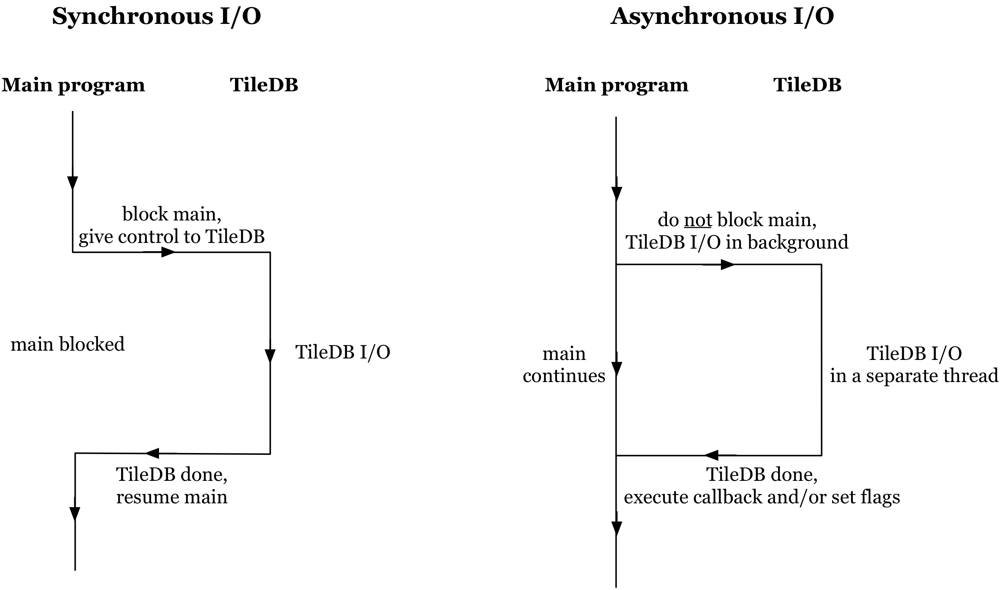

Asynchronous I/O
================

TileDB provides API for asynchronous I/O operations (i.e.,
reads/writes). In asynchronous I/O, the TileDB read or write operation
returns control to the caller function immediately after its invocation,
and performs the I/O in the background. The caller function may either
pass a callback function to the asynchronous I/O, or check the status of
the asynchronous I/O operation that indicates whether the query is in
progress, completed, or returned as incomplete or failed. :ref:`Figure 22 <figure-22>`
shows the difference between a synchronous and an asynchronous I/O
operation.

.. _figure-22:

    Figure 22: Synchronous vs. asynchronous I/O

Asynchronous I/O can lead to better
overall performance in an application that performs computations as
well. Specifically, it can be used to fetch data from the disk in the
background, while the program is executing CPU-based operations in
parallel. Overlapping I/O with CPU effectively reduces the total program
time.
