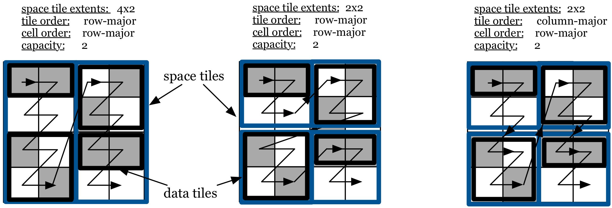

Basic Concepts
==============

Global cell order and tiling
----------------------------

Whenever multi-dimensional data is stored on disk or memory it must be
laid out in some **linear** order, since these storage media are
**single-dimensional**. This choice of ordering can significantly impact
application performance, since it affects which cells are near each
other in storage. In TileDB, we call the mapping from multiple
dimensions to a linear order the **global cell order**.

A desirable property is that cells that are accessed together should be
**co-located** on the disk and in memory, to minimize disk seeks, page
reads, and cache misses. The best choice of global cell order is
dictated by application-specific characteristics; for example, if an
application reads data a row-at-a-time, data should be laid out in rows.
A columnar layout in this case will result in a massive number of
additional page reads.

As we explain later, array **compression** is a desirable property that
reduces both storage space and IO overhead. Arrays are typically
accessed by **slicing** a portion (or **subarray**) of the array,
instead of bringing the entire array into main memory from the
filesystem backend. This suggests that compression must be performed on
a **block-based** manner, i.e., the cells must be organized into groups
such that the cells of each group are compressed/accessed always
together. In TileDB, we call such a group of cells a **tile**. The array
tiling can affect (or help shape) the global cell order.

Below we explain how the user can flexibly specify the tiling and global
cell order for the case of dense and sparse arrays separately.

Dense case
~~~~~~~~~~

TileDB offers various ways to define the global cell order for an array,
enabling the user to tailor the array storage to his or her application
for maximum performance. For dense arrays, the global cell order is
specified in three steps. First, the user decomposes the array domain
into **space tiles** by specifying a **tile extent** per dimension
(e.g., ``2x2`` tiles). This effectively creates equi-sized
hyper-rectangles (i.e., each containing the same number of cells) that
cover the entire array domain. Second, the user determines the **cell
order** within each space tile, which can be either **row-major** or
**column-major**. Third, the user determines a **tile order**, which is
also either row-major or column-major. :ref:`Figure 2 <figure-2>` shows the global cell
orders resulting from different choices in these three steps (the space
tiles are depicted in blue).

.. _figure-2:

.. figure:: Figure_2.png
    :align: center

    Figure 2: Global cell order in dense arrays

Sparse case
~~~~~~~~~~~

The notion of a global cell order also applies to sparse arrays.
However, creating sparse tiles is somewhat more complex because simply
using tiles of fixed logical size could lead to many empty tiles for
very sparse arrays. Even if we suppressed storage of empty tiles, skew
in many sparse datasets would create tiles of highly varied capacity,
leading to ineffective compression, metadata overheads, and some very
small tiles where seek times represent a large fraction of access cost.
Therefore, to address the case of sparse tiles, we introduce the notion
of **data tiles**.

A data tile is a group of **non-empty** cells. It is the atomic unit of
IO and compression (as discussed below), and has a crucial role during
reads. Similarly to a space tile, a data tile is enclosed in the logical
space by a hyper-rectangle. For the dense array case, each data tile has
a one-to-one mapping to a space tile, i.e., it encompasses the cells
included in the space tile. The same may not hold for in sparse arrays.

For the sparse case, TileDB instead allows the user to specify a data
**tile capacity**, and creates the data tiles such that they all have
the same number of non-empty cells, equal to the capacity. To implement
this, assuming that the fixed capacity is denoted by ``c``, TileDB
simply traverses the cells in the global cell order imposed by the space
tiles and creates one data tile for every ``c`` non-empty cells. A data
tile of a sparse array is represented in the logical space by the
tightest hyper-rectangle that encompasses the non-empty cells it groups,
called the **minimum bounding rectangle (MBR)**. :ref:`Figure 3 <figure-3>` illustrates
various data tiles resulting from different global cell orders, assuming
that the tile capacity is 2. The space tiles are depicted in blue color
and the (MBR of the) data tiles in black. Note that data tiles in the
sparse case may overlap, but each non-empty cell corresponds to exactly
one data tile.

.. _figure-3:

    Figure 3: Global cell order in sparse arrays

Compression
-----------

TileDB employs **tile-based** compression. Additionally, it allows the
user to select different compression schemes on a **per-attribute
basis**, as attributes are stored separately (as discussed below).
Compression is an important feature of TileDB and, therefore, we include
more details in a separate section Compression.

.. note::
    The **data tile** (in both dense and sparse
    arrays) is the **atomic unit of IO and compression**.

Fragments
---------

A **fragment** is a timestamped snapshot of a batch of array updates,
i.e., a collection of array modifications carried out via write
operations and made visible at a particular time instant. For instance,
the initial loading of the data into the array constitutes the first
array fragment. If at a later time a set of cells is modified, then
these cells constitute the second array fragment, and so on. In that
sense, an array is comprised of a collection of array fragments, each of
which can be regarded as a separate array, whose collective logical
overlap composes the current logical view of the array. A fragment can
be either dense or sparse. Dense fragments are used only with dense
arrays, but sparse fragments may be applied to both dense and sparse
arrays.

:ref:`Figure 4 <figure-4>` shows an example of an array with three fragments; the first
two are dense and the third is sparse. Observe that the second fragment
is dense within a hyper-rectangular subarray, whereas any cell outside
this subarray is empty. The figure also illustrates the collective
logical view of the array; the cells of the most recent fragments
overwrite those of the older ones.

.. _figure-4:

.. figure:: Figure_4.png
    :align: center

    Figure 4: Fragment examples

The fragments are the key concept that enables TileDB to
perform rapid writes. If the number of fragments is reasonable, then
their presence does not significantly affect the read performance. In
the event that numerous fragments are created and the read performance
becomes unsatisfactory, TileDB employs an efficient **consolidation**
mechanism that coalesces fragments into a single one. Consolidation can
happen in parallel in the background, while reads and writes continue to
access the array. The concept of fragments and their benefits are
explained later in this tutorial.

Array Schema and Fragment Metadata
----------------------------------

TileDB stores metadata about every array, as well as for each fragment.
The **array schema** contains information about the definition of the
array, such as the number, names and types of dimensions and attributes,
the dimension domains, the space tile extents, data tile capacity, and
the compression types. The **fragment metadata** contain summary
information about the physical organization of the stored array data in
a fragment, such as the start offsets of the compressed tiles in the
file, the MBRs for sparse arrays, etc.

.. note::
    The array schema and fragment metadata constitute internal
    information managed solely by TileDB. This is different from the
    arbitrary metadata that the user may wish to attach to an array, which
    can be done via TileDB’s key-value store
    functionality.
