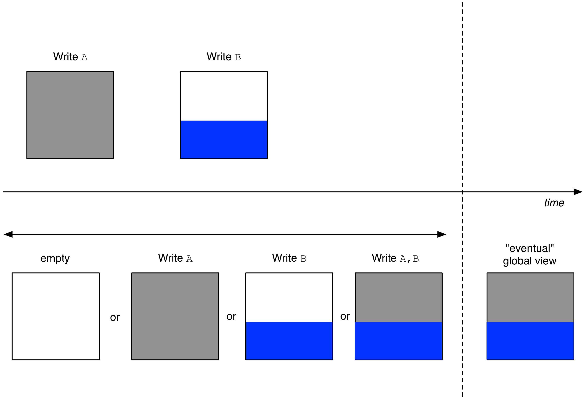

Consistency
===========

Recall that TileDB enables concurrent writes and reads that can be
arbitrarily mixed, without affecting the normal execution of a parallel
program. This comes with a more relaxed consistency model, called
**eventual consistency**. Informally, this guarantees that, if no new
updates are made to an array, eventually all accesses to the array will
“see” the last collective global view of the array (i.e., one that
incorporates all the updates).

The concept of eventual consistency in TileDB is illustrated in
:ref:`Figure 25 <figure-25>`. Suppose that initially the array is
empty, and then two writes are performed, first ``A`` and then
``B``. We assume that the writes may be initiated simultaneously, and
may also overlap, since it may take time for each write to
complete. Suppose that ``A``\ ’s fragment is first in the fragment
order, which means that either ``A`` started at an earlier timestamp
than ``B``, or it started at the same time as ``B``, but its thread id
broke the tie in its favor (recall that the fragment order is dictated
by the fragment names, which are composed of a thread id and a
timestamp).

**Eventually** (i.e., at some future point in time), read queries will
“see” the global view depicted at the bottom right of the figure,
encompassing both writes ``A`` and ``B``. However, for some time
interval, four possible worlds exist: (i) no write has taken effect yet
and the array is empty, (ii) write ``A`` completed first and its
fragment became “visible”, but not ``B``, (iii) write ``B`` completed
first and its fragment became “visible”, but not ``A``, and (iv) both
``A`` and ``B`` completed and their fragments became visible, and since
``A`` came first (i.e., its fragment name comes first in the fragment
order), ``B`` “overwrote” the blue portion of ``A``\ ’s write.

.. _figure-25:

    Figure 25: Eventual consistency in TileDB

Eventual consistency allows high availability and
parallelism. This model is followed by the AWS S3 object store and,
thus, TileDB is ideal for integrating with such distributed storage
backends. If strict consistency is required for some application (e.g.,
similar to that in transactional databases), then an extra layer must be
built on top of TileDB to enforce additional locking.
