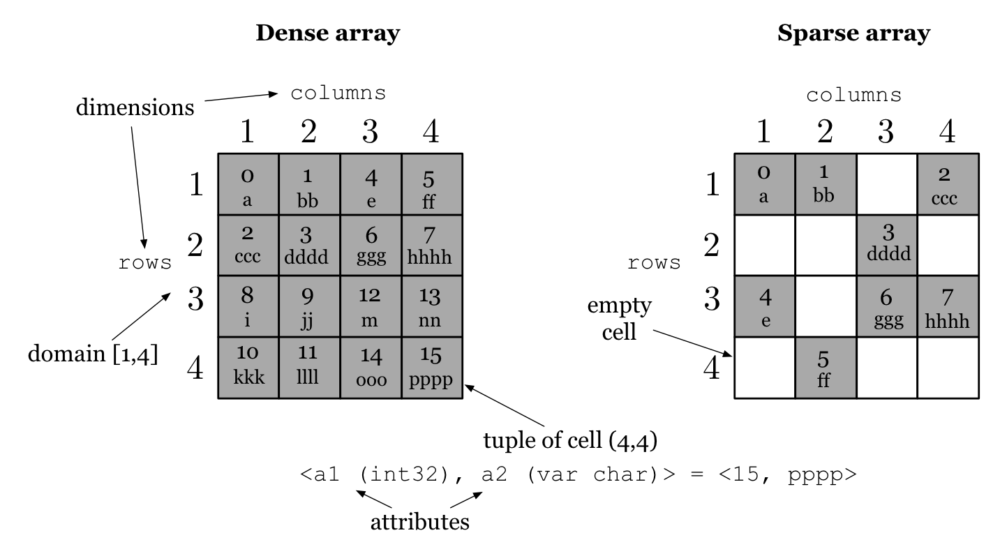

Data Model
==========

Multi-dimensional arrays
------------------------

TileDB stores data represented as **multi-dimensional arrays** (or simply **arrays** for brevity). An array in TileDB consists of a **domain** and a set of **attributes**. The array domain consists of a set of **dimensions**, and each dimension specifies its own domain of values. A combination of dimension domain values, referred to as **coordinates**, uniquely identifies an array element, called a **cell**. A cell may either be empty or contain a tuple of attribute values. Dimensions and attributes may have various **types**. Currently, in TileDB all dimensions must be of the same type. Each attribute may be either a primitive type, or a fixed or variable-sized vector of a primitive type.

TileDB currently supports the following primitive data types: ``char`` (character), ``int8`` (8-bit integer), uint8 (unsigned 8-bit integer), ``int16`` (16-bit integer), ``uint16`` (unsigned 16-bit integer), ``int32`` (32-bit integer), ``uint32`` (unsigned 32-bit integer), ``int64`` (64-bit integer), ``uint64`` (unsigned 64-bit integer), ``float32`` (32-bit floating point), and ``float64`` (64-bit floating point).

This array model can capture many applications, as long as each data item can be **uniquely identified by a set of coordinates**. For example, in an imaging application, each image can be modeled by a 2D matrix, with each cell representing the RGB values of a pixel. As another example, point-cloud data can be stored in a 3D array whose cells are the points identified by uint64 or float64 geographical coordinates, and with each cell storing some set of attributes with various types for that point.

Dense vs. sparse arrays
-----------------------

Arrays in TileDB can be **dense**, where every cell contains an attribute tuple, or **sparse**, where some cells may be empty; all TileDB operations can be performed on either type of array, but the choice of dense vs. sparse can significantly impact storage requirements and application performance. Typically, an array is stored in sparse format if more than some threshold fraction of cells are empty. An example of a dense array is an image, whereas an example of a sparse array is the point-cloud data described above.

Example
-------

:ref:`Figure 1 <figure-1>` shows two arrays, one dense and one sparse. Both arrays have two dimensions, called ``rows`` and ``columns`` respectively. Both dimensions have domain ``[1,4][1,4]`` (in general, the arrays do not need to have a square shape, and domains may even be real-valued for the sparse case). The arrays have two attributes, ``a1`` of type ``int32`` and ``a2`` of type *variable* ``char``. Every cell is identified by its coordinates, i.e., a pair of ``(rows, columns)``. In our examples throughout this tutorial, empty cells are shown in white, and non-empty cells in gray. Hence, in the dense array, every cell has an attribute tuple, e.g., cell ``(4,4)`` contains ``<15,pppp>``, whereas several cells in the sparse array are empty, e.g., cell ``(4,1)``.

.. _figure-1:

    Figure 1: Dense and sparse array example
