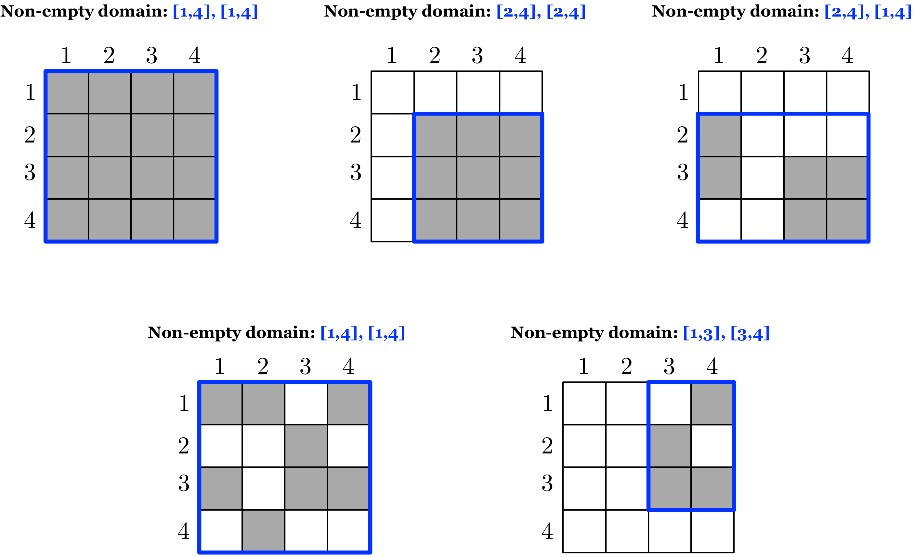

Utility Functions
=================

Non-empty domain
----------------

TileDB offers a utility function that calculates the non-empty domain of
an array. By **non-empty** we mean the tightest bounding hyper-rectangle
that includes all non-empty cells of the array. The figure below shows
examples of non-empty domains returned by this utility function for
various dense and sparse arrays. Note that the non-empty domain is
always calculated on the **collective logical view of all fragments** in
the array. 

.. _figure-21:

    Figure 21: Example non-empty domains (non-empty cells depicted in grey)
    
Upper bound on buffer sizes
---------------------------

Recall from section `Handling Incomplete
Queries <doc:handling-incomplete-queries>`__ that sparse arrays and
variable-sized attributes pose a challenge in deciding the buffer sizes
when issuing a read query. The reason is that, (i) for sparse arrays, we
cannot know in advance the result size as the distribution of the
non-empty cells in the array is not known in advance (contrary to the
dense case where it is always fixed, since all returned cells are
non-empty), and (ii) the cell values for variable-sized attributes have
unknown size.

To address this challenge, TileDB offers a utility function for
calculating an **upper bound** on the buffer size required to hold the
result of a read query on a given attribute. Note that the function
returns an upper bound in the sense that it **overestimates** the
required size. This is due to the fact that the function does not
calculate the entire query, but rather relies on the array metadata to
produce an approximation. Although helpful, the returned buffer sizes
should be used wisely when allocating in preparation for a read query.
