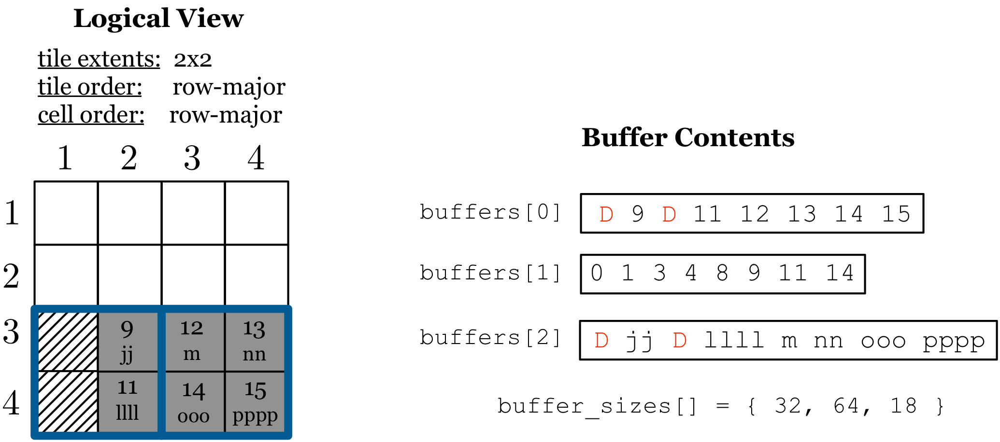
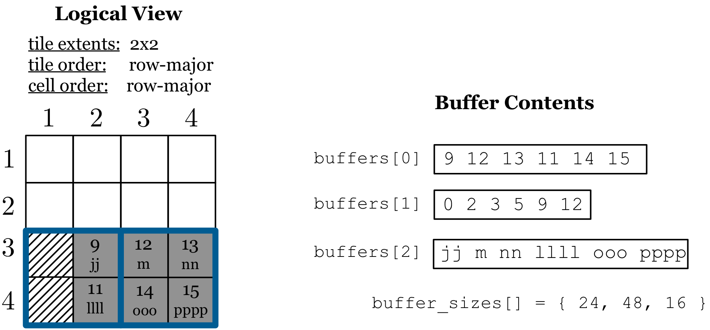

Writing Dense Data
==================

Upon query creation, the user specifies the subarray region in which the
dense fragment is constrained (expressed as a low/high pair for each
dimension). This can be the entire domain, or just an arbitrary domain
slice. In the following two subsections we will cover two writing modes,
namely writing cells that are ordered in the global cell order, and
writing cells that are have an ordered layout within the subarray.

Writing in global cell order
----------------------------

Subarray is the entire domain
~~~~~~~~~~~~~~~~~~~~~~~~~~~~~

Writing in the global cell order is the most efficient way to ingest
data in TileDB. However, performance comes with two limitations:

1. The user must be aware of the tiling, as well as the tile and cell
   order specified upon the array creation.
2. The subarray query must be aligned with the array tiles.

Both of these limitations are eliminated in the next subsection.

The user must create and populate one buffer per fixed-sized array
attribute, and two buffers per variable-sized attribute, storing the
cell values **respecting the global cell order**. The buffer memory is
managed solely by the user. If there is no compression, the write
function simply appends the values from the buffers into the
corresponding attribute files, writing them sequentially, and without
requiring any additional internal buffering (i.e., it writes directly
from the user buffers to the files). In case an attribute must be
compressed, TileDB uses internal buffers for storing each compressed
tile prior to writing it to the disk.

A nice feature of this writing mode is that the user may submit the
query repeatedly with different buffer contents, in the event that
memory is insufficient to hold all the data at once. Each write
invocation results in a series of sequential writes to the same fragment
(i.e., **appends**), one write per attribute file.

:ref:`Figure 8 <figure-8>` shows how the user can populate the entire dense array of the
example of :ref:`Figure 6 <figure-6>` (i.e., the write subarray is the entire domain). The
user provides two items to the query submit API: ``buffers``, a vector
of binary buffers storing the array data, and ``buffer_sizes``, a vector
with the corresponding sizes (in bytes) of the buffers in buffers.
:ref:`Figure 8 <figure-8>` demonstrates the contents of these two items in the case the
user populates the array with a single write, assuming that the user has
created the query with attributes ``a1`` and ``a2`` (in this order). The
first buffer corresponds to ``a1`` and contains the attribute values in
the same order as that of the global cell order. The second and third
buffers correspond to ``a2``; for any variable-sized attribute, the
first of its corresponding buffers should always store the offsets of
the cell values stored in the second buffer, as shown in the figure.
Finally, ``buffer_sizes`` simply stores the sizes of the three buffers
in bytes (in the figure we assume that an offset, which in TileDB is
stored as ``uint64``, consumes 8 bytes). Note that buffers should always
correspond to the attributes used upon the initialization of the array
prior to the write operation, respecting also their specified order.

.. _figure-8:

.. figure:: Figure_8.png
    :align: center

    Figure 8: Writing the entire dense array in global cell order

TileDB also enables the user to populate an array via multiple write operations. :ref:`Figure 8 <figure-8>` shows the
contents of the buffers in the case the user wishes to carry out the
writing to the dense array in two separate API invocations. Observe that
the attribute buffers need not be synchronized; in the first write, the
first 6 cells are written for attribute ``a1``, whereas the first 8
cells are written for attribute ``a2``. What is important is (i) inside
each buffer, the cell values must be whole (e.g., the user should not
split a 4-byte integer into two 2-byte values in each write operation),
and (ii) the two buffers of each variable-sized attribute must be
synchronized (i.e., there should always be a one-to-one correspondence
between an offset and a variable-sized cell value in the provided
buffers). Finally, observe in the second write in :ref:`Figure 8 <figure-8>` that the
offsets buffer always contains offsets relative to the current
variable-sized cell buffer; TileDB will handle the appropriate shifting
of relative offsets to absolute offsets prior to writing the data in
their respective files. TileDB does so by maintaining some lightweight
write state throughout the write operations. The feature of multiple
writes, coupled with the fact that the user is the one defining the
subset of attributes and amount of data to write per write operation,
provides great flexibility to the user in terms of main memory
management.

Subarray is a domain slice
~~~~~~~~~~~~~~~~~~~~~~~~~~

We next explain how to write to a slice of the dense array domain.
Writing to a domain slice is particularly useful when loading data to an
array with parallel threads or processes focusing on disjoint parts of
the array, as well as for efficient updates. :ref:`Figure 9 <figure-9>` demonstrates an
example, using the same dense array as :ref:`Figure 8 <figure-8>`, but assuming that now
the user wishes to focus only on subarray ``[3,4],[2,4]`` (i.e., on rows
3 and 4, and columns 2, 3 and 4). This is depicted in :ref:`Figure 9 <figure-9>` where the
meaningful cells are shown in grey. TileDB expects from the user to
provide values for the **expanded subarray** that tightly encompasses
her subarray, coinciding though with the array space tile boundaries. In
the example, this means that TileDB expects values in the buffers for
the expanded subarray ``[3,4],[1,4]``, where the cells ``(3,1)`` and
``(4,1)`` falling outside of the user's subarray should receive dummy
values (TileDB will ignore them). :ref:`Figure 9 <figure-9>` shows the contents that the
user should provide in her buffers when writing to a subarray. Observe
that the user must provide values for all cells in the expanded subarray
(i.e., even for the two redundant cells). In the figure, the ``D``
stands for some dummy value (any random value), which is of type
``int32`` in the first buffer and ``char`` in the third buffer.

.. _figure-9:

    Figure 9: Writing to a dense subarray

The previous writing mode leads to the best performance, because TileDB
receives the cell values from the user in exactly the same layout as the
one it stores them on the disk. Therefore, no additional internal cell
re-organization is required to sort the cell values in the native array
cell order. However, this mode is cumbersome for the user, since she
needs to be aware of the space tiling and be responsible for properly
adding the special dummy cell values.

TileDB supports two additional writing modes that allow the user to
provide the cell values in her buffers in row- or column-major,
respectively, **ordered with respect to her specified subarray**. This
is a more natural way to write to TileDB, as the user does not need to
know the space tiling, but rather focus on the subarray she wants to
write in. Although this does require some internal cell re-organization
(in order to map the cells from the subarray order to the native array
cell order), TileDB performs this very efficiently (employing a linear
algorithm for re-organization, as well as mixing asynchronous I/O with
the CPU computations for the cell re-arrangement).

:ref:`Figure 10 <figure-10>` shows the same example as :ref:`Figure 9 <figure-9>`, but now observe that the
user does not add any dummy cell values. Moreover, she provides the
values in row-major order within the target subarray ``[3,4], [2,4]``.
Note that TileDB always writes integral tiles on disk. Therefore, TileDB
in fact writes 8 cells instead of the given 6 cells on disk, with the
two extra cells being dummy cells. In other words :ref:`Figure 10 <figure-10>` produces an
identical result to :ref:`Figure 10 <figure-10>` on the disk.

.. _figure-10:

    Figure 10: Writing to a dense subarray in row-major subarray layout

.. warning::
    When writing to dense subarrays, the user must provide the correct number 
    of cells (before finalizing the query), otherwise errors will be thrown.
