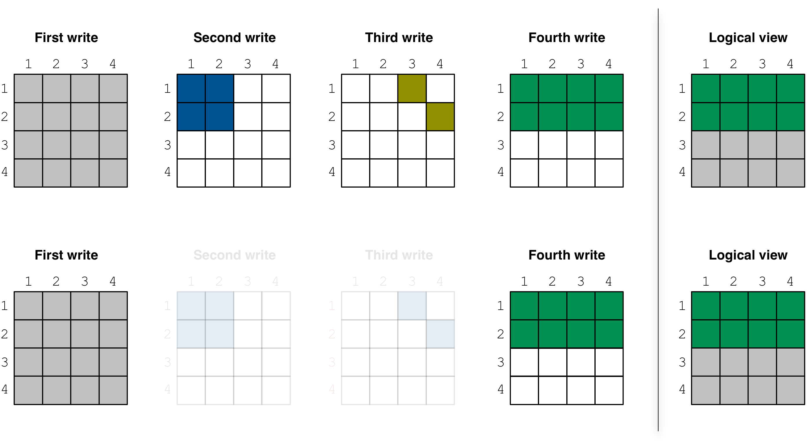
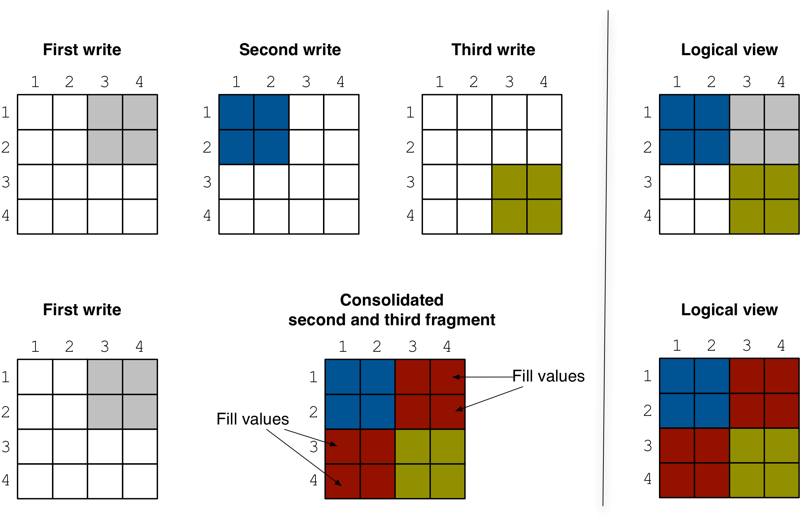
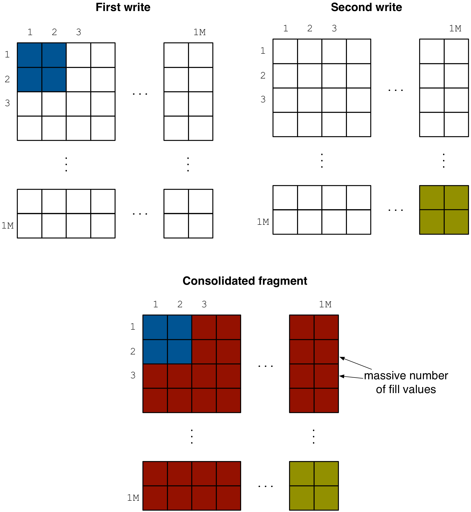

.. _advanced-consolidation:

Advanced Consolidation
======================

In this section we explain consolidation in depth. Specifically,
we describe the consolidation algorithm and all the configuration
parameters that can be used to tune the consolidation performance
to the user application.

Fragment clean up
-----------------

Before the consolidation algorithm begins, TileDB applies a simple
optimization in a pre-processing step, which may lead to great
performance benefits depending on the "shape" of the existing
fragments. Specifically, TileDB identifies *dense* fragments
whose non-empty domain *completely covers older adjacent*
(dense or sparse) fragments, and directly deletes the old fragment
directories without performing any actual consolidation.

This clean-up process is illustrated with an example in the
figure below. Suppose the first fragment is dense and covers
the entire array, i.e., ``[1,4], [1,4]``, the second is
dense and covers ``[1,2], [1,2]``, the third is sparse as
shown in the figure, and the fourth one is dense covering
``[1,2], [1,4]``. Observe that, if those four fragments were to
be consolidated, the cells of the second and third fragment
would be completely overwritten from the cells of the
fourth fragment. Therefore, the existence of those two fragments
would make no difference to the consolidation result. Deleting
them altogether *before* the consolidation algorithm commences
will result in boosting the algorithm performance (since fewer
cells will be read and checked for overwrites).

Consolidation algorithm
-----------------------

The consolidation algorithm is performed in *steps*. In each step,
a *subset of adjacent* (in the timeline) fragments is selected for
consolidation. The algorithm proceeds until a determined number of
steps were executed, or until the algorithm specifies that no further
fragments are to be consolidated. The choice of the next fragment
subset for consolidation is based on certain rules and user-defined
parameters, explained below. The number of steps is also configurable,
controlled by ``sm.consolidation.steps``.

To configure the consolidation algorithm, you must create and set
a config object with the desired parameters, and pass it as argument
in the consolidation function as follows:

.. content-tabs::

   .. tab-container:: cpp
      :title: C++

      .. code-block:: c++

        Context ctx;
        Config config;
        config["sm.consolidation.steps"] = 3;
        Array::consolidate(ctx, array_name, config);

   .. tab-container:: python
      :title: Python

      .. code-block:: python

         ctx = tiledb.Ctx()
         config = tiledb.Config()
         config["sm.consolidation.steps"] = 3;
         tiledb.consolidate(ctx, array_name, config)

Now let us focus on a single step, during which the algorithm
must select and consolidate a subset of fragments based on
certain *criteria*:

- The first criterion is if a subset of  fragments is *"consolidatable"*,
  i.e., eligible for consolidation in a way that does not violate
  correctness. Any subset consisting of solely sparse fragments is always
  consolidatable. However, if a fragment subset contains one or more
  dense fragments, TileDB performs an important check; if the union
  of the non-empty domains of the fragments (which is equal to the
  non-empty domain of the resulting consolidated fragment) overlaps
  with any fragment created prior to this subset, then the subset
  is marked as non-consolidatable. Recall that the fragment that
  results from consolidating a subset of fragments containing at
  least one dense fragment is always a dense fragment. Therefore,
  empty regions in the non-emtpy domain of the consolidated fragment
  will be filled with special values. Those values may erroneously
  overwrite older valid cell values. Such a scenario is illustrated
  in the figure below. The second and third fragments are not
  consolidatable, since their non-empty domain contains empty
  regions that overlap with the first (older) fragment. Consequently,
  consolidating the second and third fragment results in a logical
  view that is not identical to the one before consolidation,
  violating correctness. This criterion detects and prevents such cases.

- The second criterion is the *comparative
  fragment size*. Ideally, we must consolidate fragments of
  approximately equal size. Otherwise, we may end up in a situation
  where, for example, a 100GB fragment gets consolidated with a 1MB one,
  which would unnecessarily waste consolidation time. This is controlled
  by parameter ``sm.consolidation.step_size_ratio``; if the size
  ratio of two adjacent fragments is larger than this parameter,
  then no fragment subset that contains those two fragments will
  be considered for consolidation.

- The third criterion is the fragment *amplification factor*, applicable to
  the case where the fragment subset to be consolidated contains at least
  one dense fragment. If the non-empty domain of the resulting fragment
  has too many empty cells, its size may become considerably larger
  than the sum of sizes of the original fragments to be
  consolidated. This is because the consolidated fragment is dense
  and inserts special fill values for all empty cells in its non-empty
  domain (see figure below). The amplification factor is the ratio between
  the consolidated fragment size and the sum of sizes of the original
  fragments. This is controlled by ``sm.consolidation.amplification``,
  which should not be exceed for a fragment subset to be eligible for
  consolidation. The default value ``1.0`` means that the fragments
  will be consolidated if there is no amplification at all, i.e.,
  if the size of the resulting consolidated fragment is smaller than
  or equal to the sum of sizes of the original fragments. As an example,
  this happens when the non-empty domain of the consolidated fragment
  does not contain any empty cells.

- The fourth criterion is the *collective fragment size*. Among all
  eligible fragment subsets for consolidation, we must first select to
  consolidate the ones that have the smallest sum of fragment sizes. This
  will quickly reduce the number of fragments (hence boosting read
  performance), without resorting to costly consolidation of larger
  fragments.

- The final criterion is the number of fragments to consolidate in
  each step. This is controlled by ``sm.consolidation.step_min_frags`` and
  ``sm.consolidation.step_max_frags``; the algorithm will select the
  subset of fragments (complying with all the above criteria) that
  has the *maximum* cardinality smaller than or equal to
  ``sm.consolidation.step_max_frags`` and larger than or equal to
  ``sm.consolidation.step_min_frags``. If no fragment subset is eligible
  with cardinality at least ``sm.consolidation.step_min_frags``, then
  the consolidation algorithm terminates.

The algorithm is based on dynamic programming and runs in time
``O(max_frags * total_frags)``, where ``total_frags`` is the total
number of fragments considered in a given step, and ``max_frags`` is
equal to the ``sm.consolidation.step_max_frags`` config parameter.

.. note::
    When computing the union of the non-empty domains of the
    fragments to be consolidated, in case there is at least one
    dense fragment, the union is always expanded to coincide with
    the space tile extents. This affects criterion 1 (since the
    expanded domain union may now overlap with some older fragments)
    and 2 (since the expanded union may amplify resulting consolidated
    fragment size).

Performance tips
----------------

The best scenario for maximizing the performance of reads is to have
a single fragment. The only way to result in a single fragment is
by (i) performing a single write (which may not be possible in applications
where the data is much larger than RAM), (ii) writing in global
order, i.e., appending data to your fragments (which may not be
possible in applications where the data do not arrive in global
order), and (iii) frequently consolidating your fragments, which
is the most reasonable choice for most applications. However,
properly tuning consolidation for an application may be challenging.
Therefore, below we provide a few tips for maximizing the consolidation
performance.

- Perform dense writes in subarrays that align with the space tiles.
  In this case, the consolidation algorithm writes to the consolidated
  fragment in global order, instead of row-/col-major order, which
  is generally faster.

- Update the (dense) array by trying to rewrite the same dense subarrays. This
  helps the pre-processing clean up process, which will try to delete
  older fully overwritten fragments rapidly without performing consolidation.

- For sparse arrays (or sparse writes in dense arrays), perform writes
  of approximately equal sizes. This will lead to balanced consolidation.

- It may be a good idea to invoke consolidation after every write, tuning
  ``sm.consolidation.step_min_frags``, ``sm.consolidation.step_max_frags``
  and ``sm.consolidation.steps`` to emulate the way
  `LSM-Trees <https://en.wikipedia.org/wiki/Log-structured_merge-tree>`_
  work. Specifically, choose a reasonable value for ``sm.consolidation.step_min_frags``
  and ``sm.consolidation.step_max_frags``, e.g., 2-20. This will
  ensure that only small number of fragments gets consolidated per
  step. Then you can set the number of steps (``sm.consolidation.steps``)
  to something large, so that consolidation proceeds recursively until
  there is a single fragment (or very few fragments). If consolidation
  is invoked after each write, the consolidation cost will be amortized
  over all ingestion processes in the lifetime of your system. Note that
  in that case, the consolidation times will be quite variable. Sometimes
  no consolidation will be needed at all, sometimes a few fast consolidation
  steps may be performed (involving a few small fragments), and sometimes
  (although much less frequently), consolidation may take much longer
  as it may be consolidating very large fragments. Nevertheless, this
  approach leads to a great *amortized* overall ingestion time resulting
  in very few fragments and, hence, fast reads.

- Increase the buffer size used internally during consolidation. This
  is controlled by config parameter ``sm.consolidation.buffer_size``,
  which determines the buffer size used per attribute when reading
  from the old fragments and before writing to the new consolidated
  fragment. A larger buffer size increases the overall performance.

