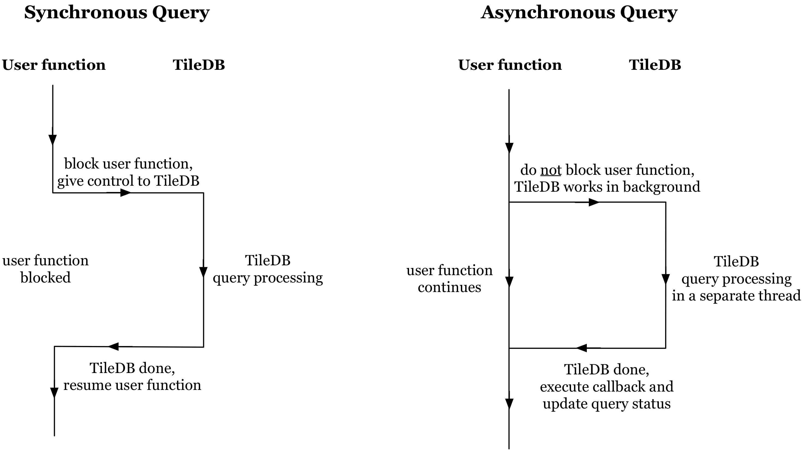

Asynchronous Queries
====================

In this tutorial we explain asynchronous queries in TileDB.
It is strongly recommended that you read the previous tutorials on
write and read queries first.

.. toggle-header::
    :header: **Example Code Listing**

    .. content-tabs::

       .. tab-container:: cpp
          :title: C++

          .. literalinclude:: ../{source_examples_path}/cpp_api/async.cc
             :language: c++
             :linenos:

Basic concepts and definitions
------------------------------

.. toggle-header::
    :header: **Asynchronous Execution**

      Asynchronous execution (or non-blocking) allows you to submit a
      TileDB query without having to wait for it to complete. This
      attributes flexibility and allows for code design leading to
      optimized performance.

Asynchronous query submission
-----------------------------

In all previous tutorials, the (read/write) queries were being
submitting *synchronously*, i.e., in a *blocking* fashion. This means
that the user function that was submitting the query had to block
and wait until TileDB was done processing the query. There are scenarios
in which you may want to submit the query in an *asynchronous*, i.e.,
in a *non-blocking* fashion. In other words, you may wish to submit
the query but tell TileDB to process it in the background, while
you proceed with the execution of your function and perform other
tasks while TileDB is executing the query in parallel. TileDB enables
you to check the query status (e.g., if it is still in progress). It
also allows to pass a *callback* upon submission, i.e., specify
a function that you wish TileDB to compute upon finishing processing
the query. This applies to both dense and sparse arrays, as well
as to both write and read queries.

The following figure shows illustrates the difference between
synchronous and asynchronous query execution.

We include an example for writing and reading an array asynchronously
in the code listing at the beginning of the tutorial. Submitting the
query asynchronously is very simple; it is done as shown below.
Observe that we pass a simple function to the query submission,
which simply prints a message on the screen (the function can be
anything).

.. content-tabs::

   .. tab-container:: cpp
      :title: C++

      .. code-block:: c++

         query.submit_async( { std::cout << "Callback: Write query completed\n"; });

Moreover, in our example we want to wait until the query completes,
which is done by retrieving and checking the status as follows:

.. content-tabs::

   .. tab-container:: cpp
      :title: C++

      .. code-block:: c++

        tiledb::Query::Status status;
        do {
          status = query.query_status();
        } while (status == tiledb::Query::Status::INPROGRESS);

Compiling and running the program, we get the following output:

.. code-block:: bash

   $ g++ -std=c++11 async.cc -o async_cpp -ltiledb
   $ ./async_cpp
   Write query in progress
   Callback: Write query completed
   Read query in progress
   Callback: Read query completed
   Cell (1, 1) has data 1
   Cell (2, 1) has data 2
   Cell (2, 2) has data 3
   Cell (4, 3) has data 4

Observe that in both the case of the write and read query, the program
continues after query submission to print a message to the output,
and then waits until the query is no longer in progress. Once
TileDB is done processing the query, it invokes the set callback,
which prints a message to the output that the query is completed.
After that, TileDB changes the query status and the user function
exits the loop (i.e., it is done waiting).
