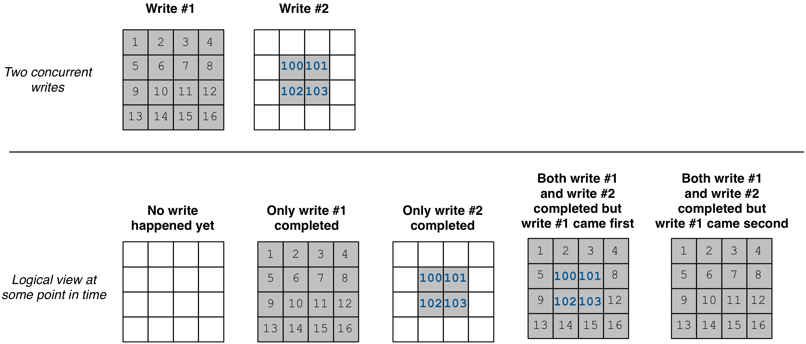
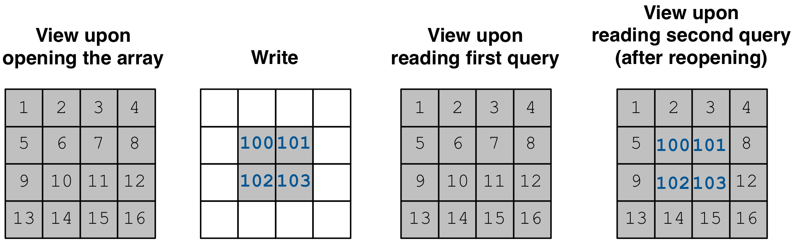

Concurrency and Consistency
===========================

In addition to using parallelism internally, TileDB is designed
having **parallel programming** in mind. Specifically,
scientific computing users may be accustomed to using *multi-processing*
(e.g., via `MPI <https://www.mpich.org/>`__ or
`Dask <https://dask.pydata.org/en/latest/>`__),
or writing *multi-threaded* programs to speed up performance.
In this tutorial we explain
how TileDB enables *concurrency* via **thread-/process-safe** queries.
In addition, we include a discussion on *consistency*, i.e.,
on how each thread/process views the contents of an array at any
given moment when other threads/processes are working concurrently.

We will initially describe concurrency and consistency for arrays.
The case of key-value stores is similar, but there are a few nuances
we stress at the end of the tutorial. Note that TileDB object
management and VFS operations are not currently thread-/process-safe,
but we will consider providing this feature in a future version.

Array concurrency
-----------------

Defining an array, i.e., storing the array schema on disk is neither
thread- nor process-safe. We do not expect a practical scenario
where multiple threads/processes attempt to define the same array
in parallel. Moreover, defining the array is extremely lightweight
(and parallelized internally), thus it will never be a performance
bottleneck. Therefore, in this section we focus on concurrent
queries.

.. content-tabs::

   .. tab-container:: cpp
      :title: C++

      In TileDB, a *write operation* is the process of creating a write
      query object, submitting the query (potentially multiple times in
      the case of global writes) and finalizing the query object
      (important only in global writes). The code snippet shown below
      describes an **atomic write operation**, i.e., a block of functions
      that must be treated atomically by each thread. For example, do not
      attempt to prepare the
      query object with multiple threads, or have multiple threads
      invoke ``query.submit()`` for the same ``Query`` object ``query``.
      Instead, you can have multiple threads create *separate* ``Query`` objects
      (e.g., ``query_1``, ``query_2``) for the same array even sharing the
      same context, and prepare and submit them in parallel having each thread
      use the atomic block shown below.

      .. code-block:: c++

         // ### An atomic write operation ###
         // Optionally: Array array(ctx, array_name, TILEDB_WRITE);
         Query query(ctx, array);
         // ... Prepare query object here
         query.submit();   // This creates the fragment directory
         // ... Potentially submit multiple times in global writes
         query.finalize(); // Important only for global writes
         // If you opened the array in this block: array.close();

      Observe that you can optionally open the array in the atomic block.
      However, if you do open the array in this block, make sure to close it
      in this block as well. In general, for every array object
      creation/opening there should be a corresponding array closing.

   .. tab-container:: python
      :title: Python

      In TileDB, a *write operation* is the process of writing data to an
      array slice. In the Python API all writes such as the one shown
      in the snippet below are **atomic** (the same holds for both
      dense and sparse arrays). Note that when creating a dense/sparse
      array object, TileDB **opens** the array in the specified ``mode``.

      .. code-block:: python

        ### An atomic write operation ###
        with tiledb.DenseArray(ctx, array_name, mode='w') as A:
            data = np.array(...)
            A[:] = data

Concurrent writes are achieved by having each thread or process create
a **separate fragment** for each write operation. The fragment is
created upon the first write query submission. No synchronization
is needed across processes and no internal state is shared across
threads among the write operations and, thus, *no locking is necessary*.
Regarding the concurrent creation of the fragments, thread- and
process-safety is achieved because each thread/process creates a fragment
with a *unique name* (recall, using the unique per process/thread UUID
and the current timestamp). Therefore, there are no conflicts even at the
filesystem level.

.. content-tabs::

   .. tab-container:: cpp
      :title: C++

      A *read opearation* is the process of creating a read
      query object and submitting the query (potentially multiple times in
      the case of incomplete queries) until the query is completed. The code
      snippet shown below describes an **atomic read operation**, i.e.,
      similar to writes, a set of functions that must be invoked by a single
      thread in sequence, but multiple threads can still create their own
      such blocks and invoke them in parallel.

      .. code-block:: c++

         // ### An atomic read operation ###
         // Optional not recommended: Array array(ctx, array_name, TILEDB_READ);
         Query query(ctx, array);
         // ... Prepare query object here
         query.submit();   // This creates the fragment directory
         // ... Potentially submit multiple times in global writes
         query.finalize(); // Important only for global writes
         // If you opened the array in this block: array.close();

      Similar to writes you can optionally open the array in the atomic block.
      This function is both process- and thread-safe. During opening
      the array, TileDB loads the array schema and fragment metadata to main
      memory *once*, and share them across all ``Array`` objects referring to
      the same array. Therefore, for the multi-threading case,
      it is highly recommended that you open the array once *outside* the atomic
      block and have all threads create the query on the same array object.
      This is to prevent the scenario where a thread opens the array, then
      closes it before another thread opens the array again, and so on. TileDB
      internally employs a reference-count system, discarding the array schema
      and fragment metadata each time the array is closed and the reference
      count reaches zero (the schema and metadata are typically cached, but
      they still need to be deserialized in the above scenario). Having
      all concurrent queries use the same ``Array`` object eliminates the
      above problem.

   .. tab-container:: python
      :title: Python

      A *read operation* is shown in the snippet below. All read operations
      in the Python API are **atomic**. Note that when creating a dense/sparse
      array object, TileDB **opens** the array in the specified ``mode``.

      .. code-block:: python

         ### An atomic read operation ###
         with tiledb.DenseArray(ctx, array_name, mode='r') as A:
             data = A[:]

Reads in the multi-processing setting are completely independent
and no locking is required. In the multi-threading scenario, locking
is employed (through mutexes) only when the queries access the tile cache,
which incurs a very small overhead.

Concurrent reads and writes can be arbitrarily mixed. Fragments are not
visible unless the write query has been completed. Fragment-based writes
make it so that reads simply see the logical view of the array without
the new (incomplete) fragment. This
**multiple-writers-multiple-readers** concurrency model of TileDB is
different (and more powerful) than competing approaches, such as HDF5’s
single-writer-multiple-readers (SWMR) model. This feature comes with a
more relaxed consistency model, which is described in the next section.

*Consolidation* can be performed in the background in parallel with other
reads and writes. Locking is required only for a very brief period.
Specifically, consolidation is performed independently of reads and
writes. The new fragment that is being created is not visible to reads
before consolidation is completed. The only time when locking is
required is after the consolidation finishes, when the old fragments are
deleted and the new fragment becomes visible (this happens by flushing
the fragment metadata on disk, which is a very lightweight operation). TileDB
enforces locking at this point. After all current reads release their shared
lock on that array, the consolidation function gets an exclusive lock, deletes
the old fragments, makes the new fragment visible, and releases the lock.

Note that **locking** (wherever it is needed) is achieved via mutexes
in multi-threading, and file locking in multi-processing (for those storage
backends that support it).

.. warning::

    All **POSIX-compliant**
    filesystems and **Windows** filesystems support file locking. Note that
    **Lustre** supports POSIX file locking semantics and exposes local-
    (mount with ``-o localflock``) and cluster- (mount with ``-o flock``)
    level locking. Currently, TileDB does not use file locking on **HDFS**
    and **S3** (these storage backends do not provide such functionality,
    but rather resource locking must be implemented as an external
    feature). For filesystems that do not support filelocking, the
    multi-processing programs are responsible for synchronizing the
    concurrent writes.

.. warning::

   When using multiple processes on the same machine, you should be very
   careful with the level of concurrency you set to the TileDB context.
   By default, the TileDB library uses all available cores/threads in your system.
   TileDB will spawn the number of threads you specify through the config
   parameters (see :ref:`config`) for TBB, VFS and async threads
   *for each process*, which may adversely affect the performance of your program.

Array consistency
-----------------

By now you know that TileDB enables concurrent writes and reads that can
be arbitrarily mixed, without affecting the normal execution of a parallel
program. This comes with a more relaxed consistency model, called
**eventual consistency**. Informally, this guarantees that, if no new
updates are made to an array, eventually all accesses to the array will
“see” the last collective global view of the array (i.e., one that
incorporates all the updates).

We illustrate the concept of eventual consistency in the figure
below (which is the same for both dense and sparse arrays). Suppose
we perform two writes in parallel (by different threads or processes).
Assume also that there is a read at some point in time, which is
also performed by a third thread/process (potentially in parallel
with the writes). There are five possible
scenarios regarding the logical view of the array at the time of
the read (i.e., five different possible read query results).
First, no write may have completed yet, therefore the read sees
an empty array. Second, only the first write got completed. Third,
only the second write got completed. Fourth, both writes got completed,
but the first write was the one to create a fragment with an
earlier timestamp than the second. Fifth, both writes got completed,
but the second write was the one to create a fragment with an
earlier timestamp than the first.

The concept of eventual consistency essentially tells you that,
*eventually* (i.e., after all writes have completed), you will
see the view of the array with all updates in. The order of the
fragment creation will determine which cells are overwritten by
others and, hence, greatly affects the final logical view of the
array.

Eventual consistency allows high availability and
parallelism. This model is followed by the AWS S3 object store and,
thus, TileDB is ideal for integrating with such distributed storage
backends. If strict consistency is required for some application (e.g.,
similar to that in transactional databases), then an extra layer must be
built on top of TileDB to enforce additional synchronization.

*But how does TileDB deal internally with consistency?* This is where
**opening an array** becomes important. When you open an array, TileDB
takes a snapshot of the already completed fragments. This the view
of the array for *all* queries that will be using that opened array object.
If writes happen (or get completed) *after* the array got opened, the
queries will *not* see the new fragments. If you wish to see the
new fragments, you will need to either open a new array object and
use that one for the new queries, or *reopen* the array (reopening
the array bypasses closing it first, permitting some performance
optimizations).

We illustrate an example using the code snippet below.

.. content-tabs::

   .. tab-container:: cpp
      :title: C++

      .. code-block:: c++

        // Open the array for reads
        Array array_read(ctx, array_name, TILEDB_READ);

        // Open the same array for writes
        Array array_write(ctx, array_name, TILEDB_WRITE);
        // ... Perform a write query

        // Create a read query for the open array
        Query query_1(ctx, array_read);
        // ... Process query
        // ... Print query results

        // Reopen the array
        array_read.reopen();

        // Create a new read query for the open array
        Query query_2(ctx, array_read);
        // ... Process query
        // ... Print query results

      The figure below facilitates our explanation. The first array in the figure
      depicts the view when opening ``array_read``. All subsequent queries created
      for this array will see that view. Suppose a write happens *after*
      ``array_read`` got opened (second array in the figure). ``query_1`` will
      not be able to see this update and, therefore, it will see the same view as
      that before the write happened (third array in the figure). Reopening array
      ``array_read`` updates the array view to encompass the written cells.
      Therefore, a new query ``query_2`` created for the reopened array will
      finally see the update (fourth array in the figure).

   .. tab-container:: python
      :title: Python

      .. code-block:: python

        # Open the array for reads
        A_r = tiledb.DenseArray(ctx, array_name, mode='r')

        # Open the array for writes and write something
        A_w = tiledb.DenseArray(ctx, array_name, mode='w')
        data_w = np.array(...)
        A_w[:] = data_w

        # This will not be able to see the latest write
        data_1 = A_r[:]

        # You need to reopen the array for reads in order to see the latest write
        A_r.reopen()
        data_2 = A_r[:]

      The figure below facilitates our explanation. The first array in the figure
      depicts the view when opening ``A_r`. All subsequent queries created
      for this array will see that view. Suppose a write happens *after*
      ``A_r`` got created/opened (second array in the figure). ``data_1`` will
      not include this update and, therefore, it will see the same view as
      that before the write happened (third array in the figure). Reopening array
      ``A_r`` updates the array view to encompass the written cells.
      Therefore, ``data_2`` will include the update (fourth array in the figure).

.. note::

  When you write to TileDB with multiple processes, if your application
  is the one to be synchronizing the writes across machines, make sure
  that the machine *clocks* are synchronized as well. This is because
  TileDB sorts the fragments based on the timestamp in their names,
  which is calculated based on the machine clock.

Reading arrays at given timestamps
----------------------------------

TileDB allows users to *open an array for reads at a specific timestamp* (this
functionality is not applicable to writes). Opening an array at a timestamp
effectively allows the user to view a particular snapshot of the array
considering only writes that happened before or at the given timestamp
(i.e., including only fragments created before or at the timestamp). This is
useful for example in situations where multiple machines are reading from
the same array (and potentially perform some collective task), and the
user wants to make sure that all machines work on a common array snapshot.

The API is similar to that used for opening the array:

.. content-tabs::

   .. tab-container:: cpp
      :title: C++

      .. code-block:: c++

        // Create an array at a timestamp
        Array array(ctx, array_name, TILEDB_READ, timestamp);
        Array array(ctx, array_name, TILEDB_READ encryption_type, key, key_length, timestamp);

        // Open an array at a timestamp
        array.open(TILEDB_READ, timestamp);
        array.open(TILEDB_READ, encryption_type, key, key_length, timestamp);

Note that ``timestamp`` here must represent time in milliseconds ellapsed since
1970-01-01 00:00:00 +0000 (UTC).

.. note::

  Similar to the case of writes, when you open the array for reads at
  a timestamp with multiple worker nodes, make sure
  that the machine *clocks* are synchronized.

On key-value stores
-------------------

Recall that a key-value store is implemented as a sparse array. Therefore,
everything we covered in this tutorial on concurrency and consistency
directly applies to key-value stores as well. What you need to remember
is that the key-value writes (and creates a new fragment) *when it
flushes*.

The key-value store has an additional feature as compared to arrays:
you can both read and write to the same key-value object. This is
still *experimental* and should be used
with caution. What complicates things here is flushing. If you
write items to a key-value store, you will also be able to read
them form that object until *before* a flush. After the buffered items
are flushed, you need to *reopen* it (as explained above for arrays)
in order for these items to become visible again.

In general, for simplicity, we suggest you use the key-value store
objects as you do with array objects, i.e., separate reads and writes
to different key-value store objects. Then you can safely perform reads
and writes concurrently similarly to arrays (always
having the consistency issues we discussed above in mind).

