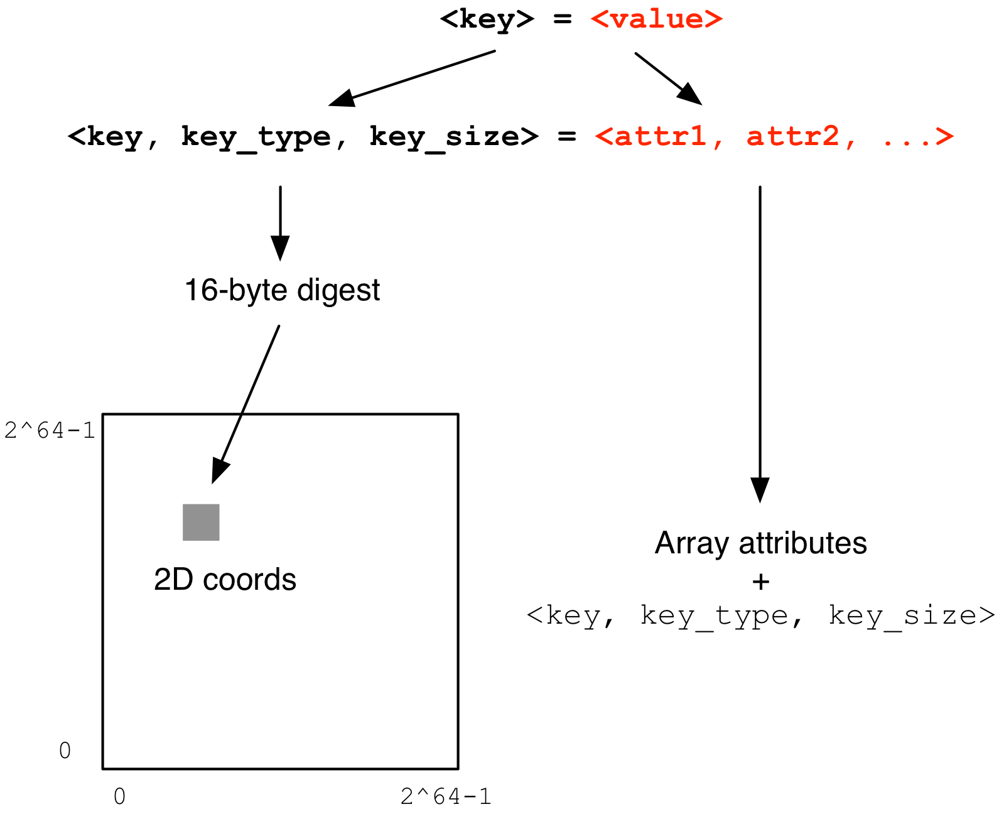

Key-value Store
===============

In this tutorial you will learn about a cool "by-product" of TileDB,
namely the TileDB key-value store (or map), as well as its relationship
to TileDB arrays.

.. warning::

   This TileDB feature is experimental. Everything covered here works
   great, but the APIs might undergo changes in future versions.

.. table:: Full programs
  :widths: auto

  ====================================  =============================================================
  **Program**                           **Links**
  ------------------------------------  -------------------------------------------------------------
  ``kv``                                |kvcpp| |kvpy|
  ====================================  =============================================================

.. |kvcpp| image:: ../figures/cpp.png
   :align: middle
   :width: 30
   :target: {tiledb_src_root_url}/examples/cpp_api/map.cc

.. |kvpy| image:: ../figures/python.png
   :align: middle
   :width: 25
   :target: {tiledb_py_src_root_url}/examples/kv.py

Why a key-value store?
----------------------

A key-value store essentially stores pairs of the form (<key>, <value>) and allows
for efficient retrieval of <value> given the corresponding <key>. The TileDB key-value
store can be perceived as a **persistent map** (in the C++ world), or a **persistent dictionary**
(in the Python world). This feature is particularly useful in applications where the user
wishes to attach arbitrary metadata to an array or group.

TileDB models a key-value store as a **sparse 2D array**. The TileDB key-value store inherits
all the TileDB array benefits (fast parallel reads and writes, compression, multiple storage
backend support, multiple language bindings, etc.).

TileDB models key-value pairs as cells in a sparse array as shown in the figure below.
First, a key-value pair is represented in a more general form, specifically (i) the key can
be of any type and have arbitrary bitsize (i.e., TileDB supports keys beyond strings) and,
thus, is represented as ``<key, key_type, key_size>``, and (ii) the value can consist of an
arbitrary number of partial values, of arbitrary types and bitsizes, and thus is represented
as ``<attr1,attr2, ...>``. TileDB hashes tuple ``<key, key_type, key_size>`` and produces a
16-byte digest. Currently, TileDB uses `MD5 <https://en.wikipedia.org/wiki/MD5>`_
as the hash function, but this may change in the
future. TileDB maps the 16-byte digest into two 8-byte coordinates in a huge domain
``[0, 2^64-1], [0, 2^64-1]``. The entire key-value pair is stored as a 2D cell at the
“digest” coordinates, with attributes the “value attributes”, plus extra attributes for
``<key, key_type, key_size>`` (so that the key can be retrieved upon a query as well).

Although a key in TileDB can be of any type, in this tutorial we focus only on
*string* keys for simplicity and because we expect this to be the most usual case.

Note that the array is *super sparse* (for any realistic application). Due to its ability
to store only non-empty cells, the TileDB performance is unaffected by the domain size.
A retrieval of a value given a key is carried out by a *unary subarray query*; the given
key is hashed with MD5 into coordinates ``(k1, k2)`` and the subarray query becomes
``[k1,k1], [k2,k2]``.

One may wonder why we chose MD5 as the hash function or, alternatively, why we chose 16
bytes as the digest size, when popular key-value stores utilize very cheap hash functions
instead (significantly faster than MD5). The basic reason is that we want to minimize
the probability for **collisions** when writing in parallel. Traditional key-value
stores need to synchronize
the parallel processes/threads that write key-values in the same “bucket” due to a
collision of the cheaper hash function. Handling such collisions would considerably impact
the parallel write performance of TileDB, and substantially make us deviate from the
overall architecture and design of TileDB (which would obviate the need to build a
key-value store with arrays). Moreover, TileDB is meant to be used for enormous data that
need to be stored persistently (most likely in compressed form). IO and (de)compression can
dominate the hashing cost, which justifies our prioritizing the parallel read/write
performance optimization instead.

Note that the use of MD5 is an implementation detail that is completely hidden from
the user. We are planning to use a more efficient hash function in the near future.
We will probably replace MD5 with `BLAKE2 <https://blake2.net/>`_ in a subsequent release.

Creating a KV store
-------------------

.. content-tabs::

   .. tab-container:: cpp
      :title: C++

      You can create a KV store similar to arrays, i.e., you create a schema, adding
      the attributes you like.

      .. code-block:: c++

       tiledb::Context ctx;
       tiledb::MapSchema schema(ctx);
       auto a1 = tiledb::Attribute::create<int>(ctx, "a1");
       auto a2 = tiledb::Attribute::create<float>(ctx, "a2");
       schema.add_attributes(a1, a2);
       tiledb::Map::create(map_name, schema);

   .. tab-container:: python
      :title: Python

      You can create a KV store similar to arrays, i.e., you create a schema defining
      the attribute name and type.

      .. code-block:: python

         ctx = tiledb.Ctx()
         schema = tiledb.KVSchema(ctx, attrs=[tiledb.Attr(ctx, name="a1", dtype=bytes)])
         tiledb.KV.create(ctx, array_name, schema)

      .. warning::

         The Python API for key-value stores does not currently support multiple attributes,
         or attributes with non-string-typed values.

Observe that, contrary to arrays, you cannot set a domain to a KV store. This
is because, as explained above, the KV store has fixed domain
``[0, 2^64-1], [0, 2^64-1]``. You should not worry about this because the 2D
sparse domain, as well as the coordinates of the KV items that you store,
are completely hidden from you.

Writing a KV store
------------------

You can write to a TileDB KV store as follows:

.. content-tabs::

   .. tab-container:: cpp
      :title: C++

      .. code-block:: c++

        tiledb::Context ctx;

        // Open the map
        tiledb::Map map(ctx, map_name, TILEDB_WRITE);

        std::vector<std::string> attrs = {"a1", "a2"};

        // Add map items with [] operator
        map["key_1"][attrs] = std::tuple<int, float>(1, 1.1f);
        map["key_2"][attrs] = std::tuple<int, float>(2, 2.1f);
        map.flush();

        // Add map items through functions
        auto key3_item = Map::create_item(ctx, "key_3");
        key3_item.set("a1", 3);
        key3_item["a2"] = 3.1f;
        map.add_item(key3_item);
        map.flush();

        // Close the map
        map.close();

      Similar to arrays, you must write all attributes for every item you are adding
      to the KV store.

   .. tab-container:: python
      :title: Python

      .. code-block:: python

         ctx = tiledb.Ctx()
         A = tiledb.KV(ctx, array_name)
         A["key_1"] = "1"
         A["key_2"] = "2"
         A["key_3"] = "3"
         A.flush()

Note that you must **always flush** the key-value store, otherwise the written
items will not be persisted on the file. Each flush creates a new fragment on
the disk. Therefore, it is important to not flush too often (while being careful
about the memory used internally for unflushed items), in order to avoid creating
numerous fragments. You explicitly flush the buffered items as follows:

.. content-tabs::

   .. tab-container:: cpp
      :title: C++

      .. code-block:: c++

        map.flush();

   .. tab-container:: python
      :title: Python

      .. code-block:: python

         A.flush()

Similar to arrays, you can perform as many writes (or flushes) to the KV
store as you wish. TileDB allows you to consolidate your KV
store similar to arrays as follows:

.. content-tabs::

   .. tab-container:: cpp
      :title: C++

      .. code-block:: c++

         tiledb::Map::consolidate(ctx, "my_map");

   .. tab-container:: python
      :title: Python

      .. code-block:: python

         A.consolidate()

Reading a KV store
------------------

You can read from a KV store as follows:

.. content-tabs::

   .. tab-container:: cpp
      :title: C++

      .. code-block:: c++

       // Open the map
       tiledb::Map map(ctx, map_name, TILEDB_READ);

       // Read the item values
       int key1_a1 = map["key_1"]["a1"];
       float key1_a2 = map["key_1"]["a2"];
       auto key2_item = map["key_2"];
       int key2_a1 = key2_item["a1"];
       auto key3_item = map["key_3"];
       float key3_a2 = key3_item["a2"];

   .. tab-container:: python
      :title: Python

      .. code-block:: python

         ctx = tiledb.Ctx()
         A = tiledb.KV(ctx, array_name)
         print("key_1: %s" % A["key_1"])
         print("key_2: %s" % A["key_2"])
         print("key_3: %s" % A["key_3"])

Finally, you can iterate over the stored KV items, and print
their keys and attribute values as follows (note that TileDB
retrieves the items in *random order*):

.. content-tabs::

   .. tab-container:: cpp
      :title: C++

      .. code-block:: c++

        Context ctx;
        tiledb::Map map(ctx, map_name, TILEDB_READ);

        std::cout << "\nIterating over map items\n";
        MapIter iter(map), end(map, true);
        for (; iter != end; ++iter) {
          auto key = iter->key<std::string>();
          int a1 = (*iter)["a1"];
          float a2 = (*iter)["a2"];
          std::cout << "key: " << key << ", a1: " << a1 << ", a2: " << a2 << "\n";
        }

   .. tab-container:: python
      :title: Python

      .. code-block:: python

         ctx = tiledb.Ctx()
         A = tiledb.KV(ctx, array_name)
         for p in A:
             print("key: '%s', value: '%s'" % (p[0], p[1]))

Compiling and running the code in the example listing at the beginning
of the tutorial, you get the following output:

.. content-tabs::

   .. tab-container:: cpp
      :title: C++

      .. code-block:: bash

         $ g++ -std=c++11 map.cc -o map_cpp -ltiledb
         $ ./map_cpp
         Simple read
         key_1, a1: 1
         key_1, a2: 1.1
         key_2: a1: 2
         key_3: a2: 3.1

         Iterating over map items
         key: key_3, a1: 3, a2: 3.1
         key: key_2, a1: 2, a2: 2.1
         key: key_1, a1: 1, a2: 1.1

   .. tab-container:: python
      :title: Python

      .. code-block:: bash

         $ python kv.py
         key_1: 1
         key_2: 2
         key_3: 3
         key: 'key_1', value: '1'
         key: 'key_3', value: '3'
         key: 'key_2', value: '2'

KV physical organization
------------------------

Let us inspect the contents of the map of the above example.
Observe that the physical organization
is similar to arrays. The only thing that distinguishes a KV store from
an array is file ``__kv_schema.tdb`` (whereas in arrays it is ``__array_schema.tdb``).
Notice also that a KV fragment contains the data files for attributes ``a1`` and
``a2`` as expected, but also includes ``__coords.tdb`` (confirming that this
is a sparse array), and some files for the keys ``__key.tdb``, ``__key_type.tdb`` and
``__key_var.tdb``.

.. code-block:: bash

  $ ls -l map/
  total 8
  drwx------  9 stavros  staff  306 Jul  2 22:30 __1d43f59f015a4497aaeaffdc830549db_1530585002464
  drwx------  9 stavros  staff  306 Jul  2 22:30 __d6924e6d0b174749a7cf0ba24f789137_1530585002473
  -rwx------  1 stavros  staff  150 Jul  2 22:30 __kv_schema.tdb
  -rwx------  1 stavros  staff    0 Jul  2 22:30 __lock.tdb
  $ ls -l map/__1d43f59f015a4497aaeaffdc830549db_1530585002464
  total 56
  -rwx------  1 stavros  staff   98 Jul  2 22:30 __coords.tdb
  -rwx------  1 stavros  staff  147 Jul  2 22:30 __fragment_metadata.tdb
  -rwx------  1 stavros  staff   49 Jul  2 22:30 __key.tdb
  -rwx------  1 stavros  staff   35 Jul  2 22:30 __key_type.tdb
  -rwx------  1 stavros  staff   45 Jul  2 22:30 __key_var.tdb
  -rwx------  1 stavros  staff    8 Jul  2 22:30 a1.tdb
  -rwx------  1 stavros  staff    8 Jul  2 22:30 a2.tdb

Finally, notice that our example produces two fragments. This is because we
flushed after adding two items, and then again after adding the third item.

