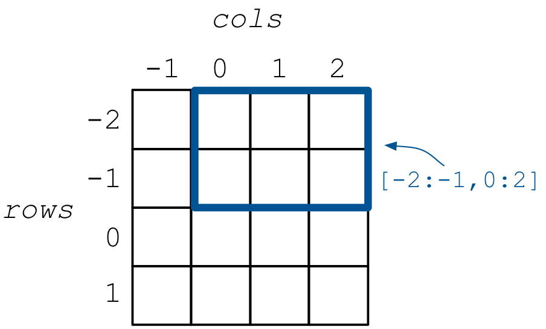
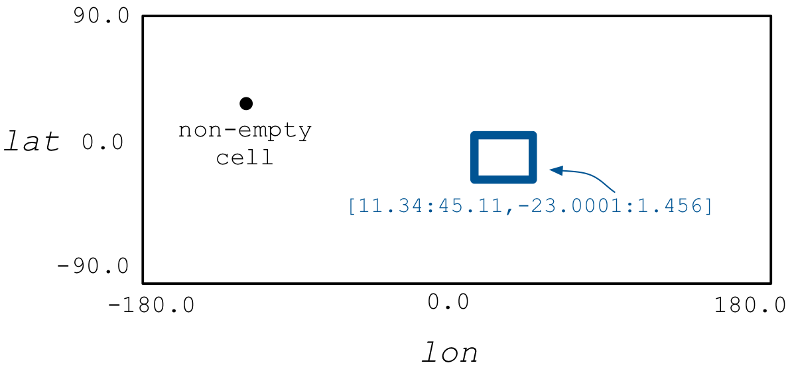

.. _neg-real:

Negative and Real Domains
=========================

Unlike most software managing arrays, in TileDB you can define
negative or even real coordinate spaces, which means that
TileDB allows you to store values in cells identified by negative
or real coordinates.

Negative domains
----------------

Negative domains can be used in *both dense and sparse* arrays.
They behave identically to what we have seen so far. Here is
a simple example defining 2D domain ``[-2, 1], [-1, 2]`` with
a ``2x2`` space tiling.

.. content-tabs::

   .. tab-container:: cpp
      :title: C++

      .. code-block:: c++

        Context ctx;
        Domain domain(ctx);
        domain.add_dimension(Dimension::create<int>(ctx, "rows", {{-2, 1}}, 2))
              .add_dimension(Dimension::create<int>(ctx, "cols", {{-1, 2}}, 2));

   .. tab-container:: python
      :title: Python

      .. code-block:: python

         ctx = tiledb.Ctx()
         dom = tiledb.Domain(ctx,
                   tiledb.Dim(ctx, name="rows", domain=(-2, 1), tile=2, dtype=np.int32),
                   tiledb.Dim(ctx, name="cols", domain=(-1, 2), tile=2, dtype=np.int32))

This creates the 2D array shown in the figure below.

As expected, tiling starts from the beginning of the domain, i.e., the tiles
in the example are ``[-2, -1], [-1, 0]``, ``[-2, -1], [1, 2]``,
``[0, 1], [-1, 0]``, and ``[0, 1], [1, 2]``. Moreover, slicing is used as you
have already learnt, allowing you to use ranges over negative coordinates as well,
e.g., ``[-2, -1], [0, 2]`` as shown in the figure.

Real domains
------------

Real domains (of type ``float32`` or ``float64``) can be used *only in sparse arrays*,
as dense arrays are defined only on integer domains. Recall that we defined an
array cell as being *uniquely identified by a coordinate tuple equal to the
dimensionality of the array*. This definition encompasses real coordinate spaces
as well.

One of the motivating applications for real domains is storing geospatial locations
as longitude/lattitude pairs, which are ``float32`` values. The global lon/lat
coordinate space is ``[-180.0, 180.0], [-90.0, 90.0]``. Then each geolocation
is a pair ``(lon, lat)``.

We can create such a domain very easily as follows:

.. content-tabs::

   .. tab-container:: cpp
      :title: C++

      .. code-block:: c++

        Context ctx;
        Domain domain(ctx);
        domain.add_dimension(Dimension::create<float>(ctx, "lon", {{-180.0, 180.0}}, 0.1))
              .add_dimension(Dimension::create<float>(ctx, "lat", {{-90.0, 90.0}}, 0.1));

   .. tab-container:: python
      :title: Python

      .. code-block:: python

         ctx = tiledb.Ctx()
         dom = tiledb.Domain(ctx,
                   tiledb.Dim(ctx, name="lon", domain=(-180.0, 180.0), tile=0.1, dtype=np.float32),
                   tiledb.Dim(ctx, name="lat", domain=(-90.0, 90.0), tile=0.1, dtype=np.float32))

The figure below shows how such an array looks like. Observe that each non-empty cell
is now better perceived as a **point** in the domain. Also notice that in the figure
``lon`` is the first dimension, which appears as the *X-axis*, and ``lat``
is the second, which appears as the *Y-axis* (this is easier to think about
rather than in terms of rows/cols as in the integer domain case).

Space tiling (set to ``0.1 x 0.1`` in our example) is used in the same way as for
integer domains in sparse arrays, i.e., solely for determining the global (physical)
order of the points. Finally, you can issue slices with real-valued
ranges, e.g., ``[11.34, 45.11], [-23.0001, 1.456]`` shown in the figure.
