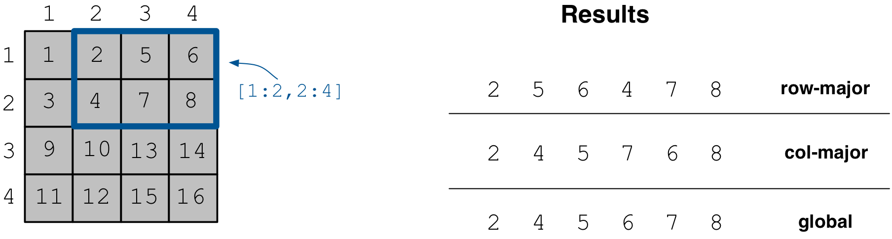
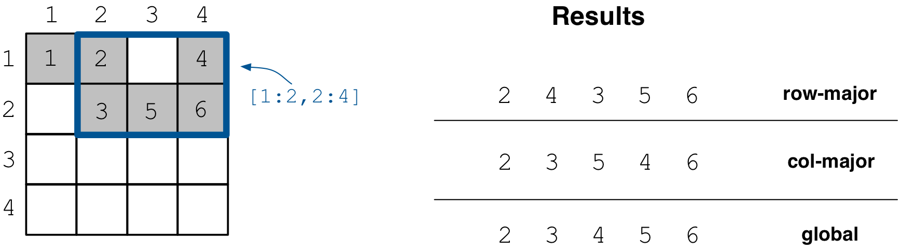
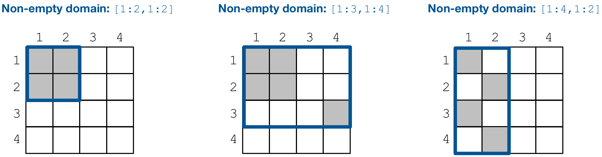
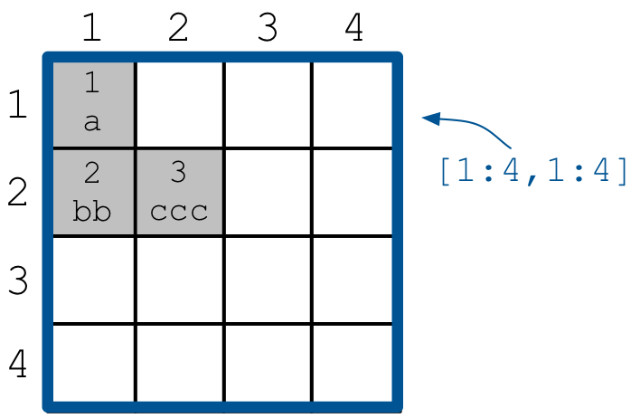

.. _reading:

Reading Arrays
==============

In the previous tutorials we have provided a fair amount of examples on
reading/slicing dense and sparse arrays. Specifically, we explained how
to slice and retrieve the results. We also showed that when reading sparse
arrays you retrieve only results for the non-empty cells, whereas when
reading dense arrays TileDB returns special fill values for any empty/non-populated
cells. Finally, we demonstrated how to read only a subset of the array attributes,
and also that you can even retrieve the coordinates of the result cells
in the case of dense arrays.

In this tutorial we will cover a few more important topics on reading,
such as reading in different layouts, determining the memory you need
to allocate to your buffers that will hold the results, how to retrieve
the non-empty domain of your array, and the concept of "incomplete" queries.

.. table:: Full programs
  :widths: auto

  ====================================  =============================================================
  **Program**                           **Links**
  ------------------------------------  -------------------------------------------------------------
  ``reading_dense_layouts``             |readingdenselayoutscpp| |readingdenselayoutspy|
  ``reading_sparse_layouts``            |readingsparselayoutscpp| |readingsparselayoutspy|
  ``reading_incomplete``                |readingincompletecpp|
  ====================================  =============================================================

.. |readingdenselayoutscpp| image:: ../figures/cpp.png
   :align: middle
   :width: 30
   :target: {tiledb_src_root_url}/examples/cpp_api/reading_dense_layouts.cc

.. |readingdenselayoutspy| image:: ../figures/python.png
   :align: middle
   :width: 25
   :target: {tiledb_py_src_root_url}/examples/reading_dense_layouts.py

.. |readingsparselayoutscpp| image:: ../figures/cpp.png
   :align: middle
   :width: 30
   :target: {tiledb_src_root_url}/examples/cpp_api/reading_sparse_layouts.cc

.. |readingsparselayoutspy| image:: ../figures/python.png
   :align: middle
   :width: 25
   :target: {tiledb_py_src_root_url}/examples/reading_sparse_layouts.py

.. |readingincompletecpp| image:: ../figures/cpp.png
   :align: middle
   :width: 30
   :target: {tiledb_src_root_url}/examples/cpp_api/reading_incomplete.cc

Basic concepts and definitions
------------------------------

.. toggle-header::
    :header: **Read query layout**

      You can read from a TileDB array with different layouts (namely row-major,
      column-major and global order). The row-/column-major layouts are
      with respect to your defined subarray and may differ from the physical
      layout of the cells on disk, attributing a lot of flexibility.

.. toggle-header::
    :header: **Maximum buffer sizes**

      One great challenge when reading sparse arrays or arrays with
      variable-length attributes (dense or sparse) is allocating the result
      buffers to be set to the query. The reason is that
      it is not possible to know the exact result size and, hence,
      it is very hard to calculate how much memory you need to allocate
      to your buffers. TileDB provides a function for computing a
      good upper bound estimate on the buffer size that can certainly
      hold the result for a given attribute.

.. toggle-header::
    :header: **Non-empty domain**

      TileDB provides a useful function for determining the non-empty
      domain of your array, i.e., the tightest hyper-rectangle that encompasses
      the non-empty cells stored in the (dense or sparse) array.

.. toggle-header::
    :header: **Incomplete queries**

      In certain cases, you may wish to read a huge slice *incrementally*.
      In such scenarios, allocating a huge buffer for the entire result
      may not be feasible, whereas you may only have a fixed budget for
      your buffers. TileDB enables you to submit queries on huge slices
      with a buffer size budget, and notify you about whether your query
      is completed or not. If it is incomplete, TileDB grants you a
      partial result, which you can consume and then resume the query,
      with TileDB incrementally bringing you the next partial results,
      and so on.

Reading in different layouts
----------------------------

TileDB allows you to retrieve the results of a subarray/slicing query in various
layouts *with repsect to your specified subarray*, namely row-major, column-major
and global order. You can set the layout for reads as follows.

.. content-tabs::

   .. tab-container:: cpp
      :title: C++

      .. code-block:: c++

        query.set_layout(TILEDB_ROW_MAJOR); // Can also be TILEDB_COL_MAJOR or TILEDB_GLOBAL_ORDER

   .. tab-container:: python
      :title: Python

      .. code-block:: python

        data = A.query(attrs=["a"], order=order, coords=True)[1:3, 2:5]

      Observe that the read layout in Python is set in argument ``order`` using the
      ``query`` syntax. Setting also ``coords=True`` allows you to get the coordinates
      (even in the dense case). Recall that row-major (``order='C'``) is the default layout of the
      returned numpy array. Setting ``order='F'`` (Fortran-order or column-major) will
      return a numpy array with the same shape as the requested slice, but which
      internally lays out the values in column-major order. Finally, setting
      the global order (``order='G'``) *always returns a 1D array*, since retaining
      the slice shape is meaningless when the cells are returned in global order
      (you can see which value corresponds to which cell by explicitly retrieving
      the coordinates).

We demonstrate an example of a dense array using code example ``reading_dense_layouts``.
The figure below depicts the array contents and the
subarray read results for different query layouts. Notice that despite the global
ordering of cells in the array, the read results are ordered with respect to the
subarray of the query. Note that this is a ``4x4`` dense array with ``2x2``
space tiling. The cell values follow the global physical cell order.

Running the program, you get the following output.

.. content-tabs::

   .. tab-container:: cpp
      :title: C++

      .. code-block:: bash

       $ g++ -std=c++11 reading_dense_layouts.cc -o reading_dense_layouts_cpp -ltiledb
       $ ./reading_dense_layouts_cpp row
       Non-empty domain: [1,4], [1,4]
       Cell (1, 2) has data 2
       Cell (1, 3) has data 5
       Cell (1, 4) has data 6
       Cell (2, 2) has data 4
       Cell (2, 3) has data 7
       Cell (2, 4) has data 8
       $ ./reading_dense_layouts_cpp col
       Non-empty domain: [1,4], [1,4]
       Cell (1, 2) has data 2
       Cell (2, 2) has data 4
       Cell (1, 3) has data 5
       Cell (2, 3) has data 7
       Cell (1, 4) has data 6
       Cell (2, 4) has data 8
       $ ./reading_dense_layouts_cpp global
       Non-empty domain: [1,4], [1,4]
       Cell (1, 2) has data 2
       Cell (2, 2) has data 4
       Cell (1, 3) has data 5
       Cell (1, 4) has data 6
       Cell (2, 3) has data 7
       Cell (2, 4) has data 8

   .. tab-container:: python
      :title: Python

      .. code-block:: bash

       $ python reading_dense_layouts.py row
       Non-empty domain: ((1, 4), (1, 4))
       Cell (1, 2) has data 2
       Cell (1, 3) has data 5
       Cell (1, 4) has data 6
       Cell (2, 2) has data 4
       Cell (2, 3) has data 7
       Cell (2, 4) has data 8
       $ python reading_dense_layouts.py col
       Non-empty domain: ((1, 4), (1, 4))
       NOTE: The following result array has col-major layout internally
       Cell (1, 2) has data 2
       Cell (1, 3) has data 5
       Cell (1, 4) has data 6
       Cell (2, 2) has data 4
       Cell (2, 3) has data 7
       Cell (2, 4) has data 8
       $ python reading_dense_layouts.py global
       Non-empty domain: ((1, 4), (1, 4))
       Cell (1, 2) has data 2
       Cell (2, 2) has data 4
       Cell (1, 3) has data 5
       Cell (1, 4) has data 6
       Cell (2, 3) has data 7
       Cell (2, 4) has data 8

The read query layout specifies how the cell values will be stored in the buffers
that will hold the results with respect to your subarray.

The case of sparse arrays is similar. We use code example ``reading_sparse_layouts``,
which creates a ``4x4`` array with ``2x2``
space tiling as well. The figure below depicts the contents of the array
and the different layouts of the retuned results. The cell values here also
imply the global physical cell order.

Running the program, you get the following output.

.. content-tabs::

   .. tab-container:: cpp
      :title: C++

      .. code-block:: bash

       $ g++ -std=c++11 reading_sparse_layouts.cc -o reading_sparse_layouts_cpp -ltiledb
       $ ./reading_sparse_layouts_cpp row
       Non-empty domain: [1,2], [1,4]
       Cell (1, 2) has data 2
       Cell (1, 4) has data 4
       Cell (2, 2) has data 3
       Cell (2, 3) has data 5
       Cell (2, 4) has data 6
       $ ./reading_sparse_layouts_cpp col
       Non-empty domain: [1,2], [1,4]
       Cell (1, 2) has data 2
       Cell (2, 2) has data 3
       Cell (2, 3) has data 5
       Cell (1, 4) has data 4
       Cell (2, 4) has data 6
       $ ./reading_sparse_layouts_cpp global
       Non-empty domain: [1,2], [1,4]
       Cell (1, 2) has data 2
       Cell (2, 2) has data 3
       Cell (1, 4) has data 4
       Cell (2, 3) has data 5
       Cell (2, 4) has data 6

   .. tab-container:: python
      :title: Python

      .. code-block:: bash

       $ python reading_sparse_layouts.py row
       Non-empty domain: ((1, 2), (1, 4))
       Cell (1, 2) has data 2
       Cell (1, 4) has data 4
       Cell (2, 2) has data 3
       Cell (2, 3) has data 5
       Cell (2, 4) has data 6
       $ python reading_sparse_layouts.py col
       Non-empty domain: ((1, 2), (1, 4))
       Cell (1, 2) has data 2
       Cell (2, 2) has data 3
       Cell (2, 3) has data 5
       Cell (1, 4) has data 4
       Cell (2, 4) has data 6
       $ python reading_sparse_layouts.py global
       Non-empty domain: ((1, 2), (1, 4))
       Cell (1, 2) has data 2
       Cell (2, 2) has data 3
       Cell (1, 4) has data 4
       Cell (2, 3) has data 5
       Cell (2, 4) has data 6

Allocating the result buffers
-----------------------------

.. note::

   The Python API efficiently handles all buffer allocation internally.
   Therefore, you can skip this section if you are using the Python API.

Recall how the read queries work in TileDB: you allocate the
buffers that will hold the results, you set the buffers to the
query object (for each attribute), you submit the query, and
TileDB populates your buffers with the query results. In other
words, memory management falls entirely on you. This is because
TileDB was designed for maximum performance (especially when
it is being integrated with high-level languages such
as Python); this approach minimizes the amount of copying
that happens internally.

For dense arrays with fixed attributes, it is fairly easy to
calculate how much space you need for your results. This is because
you know your subarray and you know that dense reads return
a result for every cell contained in the subarray (even for
empty cells).

However, it is extremely challenging to accurately calculate how
much space you need when you have variable-length attributes (in
both dense and sparse arrays), or when you read sparse arrays.
For variable-length attributes, even if you know how many
cells your subarray contains, you cannot know how much space
each cell requires to store an a priori unknown variable-length
value. For sparse arrays, you cannot know a priori how many
cells in your subarray are empty and non-empty (recall that
sparse array reads return values only for the non-empty cells).

To mitigate this problem, TileDB offers some very useful functions.
First, it allows you to calculate a good *upper bound estimate*
on the buffer sizes needed to store the entire result for
each attribute. If you allocate your buffers based on those
estimates, you are guaranteed to get your results without any
buffer overflow. We did that in the above sparse example as follows:

.. content-tabs::

   .. tab-container:: cpp
      :title: C++

      .. code-block:: c++

        auto max_el = array.max_buffer_elements(subarray);
        std::vector<int> data(max_el["a"].second);
        std::vector<int> coords(max_el[TILEDB_COORDS].second);

Note that these upper bounds are *estimates*. You should be very
careful since, especially when your array has many fragments, they may
be quite large. You should always check to see if the returned sizes
are "acceptable" for your application prior to allocating the
result buffers.

Moreover, since these maximum buffer sizes do not accurately tell
you what your result size is, *how can you know how many results
your query returned*? You can get this information from another
useful function as follows:

.. content-tabs::

   .. tab-container:: cpp
      :title: C++

      .. code-block:: c++

        auto result_num = (int)query.result_buffer_elements()["a"].second;

Note the above function tells you how many "useful" elements your
query retrieved for each attribute. Since attribute ``a`` above is a
fixed-length attribute storing a *single* integer value, it happens
that this is equivalent to the number of results. If ``a`` stored
two integers in each cell, you would have to divide the above number
with ``2``. If we wanted to get the number of results from the coordinates
attribute, we would have to write the following instead, since
each coordinate tuple for a cell in our 2D example consists of two values:

.. content-tabs::

   .. tab-container:: cpp
      :title: C++

      .. code-block:: c++

        auto result_num = (int)query.result_buffer_elements()[TILEDB_COORDS].second / 2;

For a detailed description of how to parse variable-length results using
the above function, see :ref:`variable-length-attributes`.

Getting the non-empty domain
----------------------------

We have shown in earlier tutorials that you can populate only
parts of a dense array, whereas sparse arrays (by definition)
have empty cells. TileDB offers an auxialiary function for calculating
the *non-empty domain*. Specifically, the non-empty domain in TileDB
is the tightest hyper-rectangle that contains all the non-empty
cells. We retrieved the non-empty domain in the above examples
as follows:

.. content-tabs::

   .. tab-container:: cpp
      :title: C++

      .. code-block:: c++

       auto non_empty_domain = array.non_empty_domain<int>();
       std::cout << "Non-empty domain: ";
       std::cout << "[" << non_empty_domain[0].second.first << ","
                 << non_empty_domain[0].second.second << "], ["
                 << non_empty_domain[1].second.first << ","
                 << non_empty_domain[1].second.second << "]\n";

   .. tab-container:: python
       :title: Python

       .. code-block:: python

        print("Non-empty domain: {}".format(A.nonempty_domain()))

For the dense array example the non-empty domain is ``[1,4], [1,4]``,
whereas for the sparse one it is ``[1,2], [1,4]``. Note that the
non-empty domain does *not* imply that every cell therein is non-empty.
In contrast, it guarantees that *every cell outside the non-empty
domain is empty*. The concept of the non-empty domain is
equivalent in both dense and sparse arrays. The figure below illustrates
the non-empty domain in some more array examples (non-empty cells
are depicted in grey).

.. _incomplete_queries:

Incomplete queries
------------------

.. warning::

  Currently incomplete query handling is not supported in the Python API.

There are scenarios where you may have a *specific memory budget* for
your result buffers. As explained above, TileDB allows you to get an
upper bound on the result sizes for your desired subarray query, which
is particularly useful for variable-length attributes and sparse arrays.
*But what if the maximum
buffer sizes are larger than your memory budget?* In this case, you
would have to split your subarray manually and try to find query partitions,
such that the maximum buffer sizes for each partition are not larger
than your memory budget. This can prove extremely cumbersome.
Moreover, since the upper bound is an estimate, there may be cases
where the maximum buffer sizes are larger than your memory budget,
even for very small subarrays.

To address the above issue, TileDB offers an exciting feature. You
can allocate any (non-zero) size to your buffers when setting them
to your query. If the result size is larger than your buffers can
accommodate, instead of crashing, TileDB will gracefully terminate
with an *incomplete* status that you can check. More interestingly,
TileDB will attempt to fill as many results as it can in your buffers,
and record some **internal state** that will allow it to *resume*
in the next submission. TileDB is smart enough to continue from
where it left off, without sacrificing performance by retrieving
again the already reported results.

We demonstrate this feature with code example ``reading_incomplete``,
which creates a very simple sparse array with
two attributes, an integer and a string. The figure below shows
the array contents on both attributes.

Below we show our read function. The first observation is that
we do not allocate enough space to our buffers to hold the entire
result (and we do not use the auxiliary function to get the maximum
buffer sizes as we did before).

.. content-tabs::

   .. tab-container:: cpp
      :title: C++

      .. code-block:: c++

       void read_array() {
         Context ctx;
         Array array(ctx, array_name, TILEDB_READ);
         const std::vector<int> subarray = {1, 4, 1, 4};

         // Prepare buffers such that the results **cannot** fit
         std::vector<int> coords(2);
         std::vector<int> a1_data(1);
         std::vector<uint64_t> a2_off(1);
         std::string a2_data;
         a2_data.resize(1);

         // Prepare the query
         Query query(ctx, array);
         query.set_subarray(subarray)
              .set_layout(TILEDB_ROW_MAJOR)
              .set_buffer("a1", a1_data)
              .set_buffer("a2", a2_off, a2_data)
              .set_coordinates(coords);

         // Create a loop
         Query::Status status;
         do {
           query.submit();
           status = query.query_status();

           // If any results were retrieved, parse and print them
           auto result_num = (int)query.result_buffer_elements()["a1"].second;
           if (status == Query::Status::INCOMPLETE && result_num == 0) {  // VERY IMPORTANT!!
             reallocate_buffers(&coords, &a1_data, &a2_off, &a2_data);
             query.set_buffer("a1", a1_data)
                  .set_buffer("a2", a2_off, a2_data)
                  .set_coordinates(coords);
           } else {
             print_results(coords, a1_data, a2_off, a2_data, query.result_buffer_elements());
           }
         } while (status == Query::Status::INCOMPLETE);

         // Handle error
         if (status == Query::Status::FAILED) {
           std::cout << "Error in reading\n";
           return;
         }

         // Close the array
         array.close();
       }

The second observation is that we keep on submitting the query in a **loop**.
Immediately after the query submission, we retrieve the *query status*,
we print any retrieved results, and then *we continue the loop for as long
as the query is incomplete*. The results that we print in each iteration
are always *newly retrieved results*. In other words, this loop simulates
an iterator. At some point, we retrieve all the results, the query
becomes *completed* and the loop terminates.

Let us inspect the output after compiling and running the program.

.. code-block:: bash

   $ g++ -std=c++11 reading_incomplete.cc -o reading_incomplete_cpp -ltiledb
   $ ./reading_incomplete_cpp
   Printing results...
   Cell (1, 1), a1: 1, a2: a
   Reallocating...
   Printing results...
   Cell (2, 1), a1: 2, a2: bb
   Reallocating...
   Printing results...
   Cell (2, 2), a1: 3, a2: ccc

Each time ``Printing results...`` is printed, a new query submission has
occurred and new results have been retrieved, which are printed immediately
after. Similar to what we have explained above and in tutorial
:ref:`variable-length-attributes`, we can parse the results using the
number of result elements returned by ``query.result_buffer_elements``.
Note that the results are *"synchronized"* across attributes: the
query returns the *same number* of result cell values for each attribute,
in order to facilitate tracking the progress.

Finally, observe that the program prints ``Reallocating...`` to the output,
suggesting that function ``reallocate_buffers`` was called in the loop.
There are cases where the query is incomplete and has not returned
*any* result. This is an indication that the current buffer sizes
cannot accommodate even a single result. You must handle these cases
with extreme care, otherwise you may get an infinite loop. In our
example, we choose to *reallocate* our buffers. Observe that initially
we had a string buffer of size ``1``, therefore the first result
was retrieved without reallocation. However, the second result
required a larger buffer and therefore reallocation was triggered
(increasing the string size to ``2``). But then the third string result
could not fit in the next iteration (because it was of size ``3``)
and therefore reallocation got triggered once again. Note that,
after reallocating your buffers, you need to *reset* them to the
query object.

The above example was rather contrived. In the general case and given
that your memory budget is reasonable, the above approach will complete
quickly and any extra cost stemming from pausing and resuming the
query gets amortized over the entire execution.

Reading and performance
-----------------------

There are numerous factors affecting the read performance, from the way the
arrays were tiled and written, to the number of fragments, to the read query
layout, to the level of internal concurrency, and more. See the
:ref:`performance/introduction` tutorial for
more information about the TileDB performance.