Tutorial: Tiles
===============

In this tutorial we will learn about the core concept of tiling in TileDB arrays. It's recommended that you read the other tutorials on attributes, dense and sparse arrays first.

Basic concepts
--------------

Tiles in TileDB are a fundamental topic, and it's essential to understand them in order to design array schemas that yield the highest performance and utility.

Arrays in TileDB can be thought of a collection of cells regularly arranged in an n-dimensional cube. In the most basic sense, a **tile** of an array corresponds to an n-dimensional rectangular region of the larger array. Logically, an array is decomposed into a set of disjoint, identically-shaped tiles that cover the entire array.

All arrays in TileDB, regardless of dimensionality, dense or sparse, attributes or domain, are composed of tiles. Tile size and shape is defined when creating the schema for an array. Once an array has been created, you cannot change the tile configuration.

Tiles are the **atomic unit of I/O**. During a read query, TileDB will fetch from disk all tiles that intersect with the query subarray. Even if a tile contains only a single intersecting cell, the entire tile will be read from disk, although only the single cell will be copied into the query result buffer.

Tiles are also the **unit of compression**. After fetching a compressed tile from disk, TileDB internally decompresses the tile as a unit.

**Optimizing** the array schema for performance is usually done through choosing tile size and shape to minimize wasted work in fetching array data that is ultimately discarded from the query result.

We will start with the simpler concept of tiling in dense arrays, and move from there to tiling in sparse arrays.

Dense array tiling
------------------

A dense array is decomposed into **space tiles**. The space tiles in a dense array are all of a uniform size and shape, which may be rectangular. For example, a dense 4 cell by 4 cell 2D array with 2x2 space tiles (the tiles have extent 2 in each dimension) would have 2 tiles in each dimension, meaning the whole array is decomposed into exactly 4 tiles:

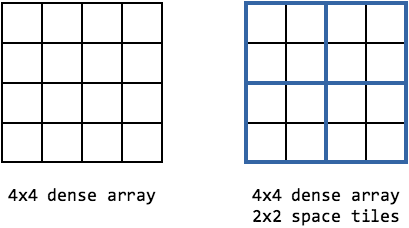

In code form, this array would be constructed using the following array schema::

    tiledb::Context ctx;
    tiledb::ArraySchema schema(ctx, TILEDB_DENSE);
    tiledb::Domain domain(ctx);
    domain.add_dimension(tiledb::Dimension::create<int>(ctx, "x", {{0, 3}}, 2))
          .add_dimension(tiledb::Dimension::create<int>(ctx, "y", {{0, 3}}, 2));
    schema.add_domain(domain);

This creates the 4x4 array with each dimension having the inclusive domain ``[0, 3]``, and sets the **tile extent** to 2 in each dimension.

The same array with 4x2 space tiles would decompose the array into 2 tiles:

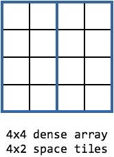

In code form::

    tiledb::Context ctx;
    tiledb::ArraySchema schema(ctx, TILEDB_DENSE);
    tiledb::Domain domain(ctx);
    domain.add_dimension(tiledb::Dimension::create<int>(ctx, "x", {{0, 3}}, 2))
          .add_dimension(tiledb::Dimension::create<int>(ctx, "y", {{0, 3}}, 4));
    schema.add_domain(domain);

Because tiles are the atomic unit of I/O, their size and shape determines how much I/O (and decompression) TileDB must do to satisfy a read query. With the 4x4 array above and 2x2 space tiles, a subarray query (slice) of ``[0:1, 0:2]`` (selecting rows 0 and 1 and columns 0, 1, and 2) would require fetching two tiles, which is 8 cells of data, even though the query result only needs 6 cells of data:

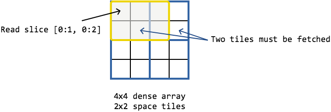

With the 4x4 array instead composed of 4x1 space tiles (i.e. each column is a tile), the same slice ``[0:1, 0:2]`` would instead require reading and decompressing three tiles, or 12 cells of data:

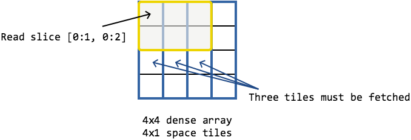

The first tiling is clearly superior for this query: 6/8 cells fetched from disk were used in the query result, whereas with the second tiling, only 6/12 cells fetched from disk were used in the query result. For this particular query, there is less wasted work using the first tiling.

Tile ordering
-------------

We can now look at another fundamental concept of TileDB arrays, **tile ordering** and **cell ordering**. Tile and cell ordering are a part of the array schema, and are used along with tile sizes to control the spatial locality of data in the array. The orderings together determine the groups of cells that are stored adjacent in the physical layout on disk.

Understanding the tile and cell ordering is necessary for understanding tiling in sparse arrays, and also for designing array schemas that achieve the best performance.

Both the tile and cell ordering are chosen when creating the array schema, and can be either **row-major** or **column-major**. The tile and cell ordering can be different from each other.

The **tile ordering** determines how the sequence of tiles in the array are organized when writing the array to disk. For example, the 2D dense array above with 2x2 space tiles had 4 tiles in total, numbered in the figure below from 0 to 3:

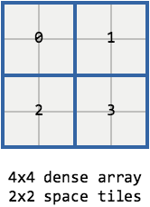

With a row major tile ordering, the tiles are stored on disk in the order 0, 1, 2, 3. With a column major ordering, they are stored on disk in the order 0, 2, 1, 3.

Similarly, the **cell ordering** determines the sequence of cells but within a single tile.

Combined, the tile and cell ordering form the **global order** of the array. The following code snippet creates the same 4x4 dense array with 2x2 space tiles, and uses a row-major tile ordering with a column-major cell ordering::

    tiledb::Context ctx;
    tiledb::ArraySchema schema(ctx, TILEDB_DENSE);
    tiledb::Domain domain(ctx);
    domain.add_dimension(tiledb::Dimension::create<int>(ctx, "x", {{0, 3}}, 2))
          .add_dimension(tiledb::Dimension::create<int>(ctx, "y", {{0, 3}}, 2));
    schema.add_domain(domain)
          .set_order({{TILEDB_ROW_MAJOR, TILEDB_COL_MAJOR}});

With a row-major tile ordering and column-major cell ordering, the figure below traces the global order, which is the order that the cells of the array will be stored on disk:

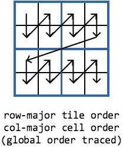

Commonly, you might choose the tile and cell order to be the same when interfacing with applications that assume a global row- or column-major ordering of dense data. For example, by default many C, C++ and NumPy programs assume a row-major ordering of data, and so you might choose both tile and cell ordering to be row-major. By contrast, R and Fortran (for example) use column-major ordering by default, so a choice of both tile and cell ordering to be column-major may be more appropriate.

Sparse array tiling
-------------------

We now have all the information to look at tiling in sparse arrays. A sparse array is decomposed into space tiles and **data tiles**. Space tiles in a sparse array are the same as in a dense array. However, because sparse arrays may not have data in every cell, each space tile might contain very different amounts of data (or no data, if all of the contained cells are empty). To address this TileDB uses **data tiles** to refer to a fixed number of non-empty cells in an array, rather than a fixed number of cells in the logical domain of the array (as with space tiles).

The number of non-empty cells in the data tiles for an array is called the data tile **capacity**. The capacity is also chosen when creating the array schema. The following code snippet creates an array schema for a 4x4 sparse array with 2x2 space tiles and a data tile capacity of 3::

    tiledb::Context ctx;
    tiledb::ArraySchema schema(ctx, TILEDB_SPARSE);
    tiledb::Domain domain(ctx);
    domain.add_dimension(tiledb::Dimension::create<int>(ctx, "x", {{0, 3}}, 2))
          .add_dimension(tiledb::Dimension::create<int>(ctx, "y", {{0, 3}}, 2));
    schema.set_order({{TILEDB_COL_MAJOR, TILEDB_ROW_MAJOR}})
          .set_domain(domain)
          .set_capacity(3);

Suppose that the above sparse array has only a few cells with data, colored grey in the following figure:

.. figure:: tiling-sparse-1.png
   :align: center

The space tiles decompose the array's logical domain the same as with the dense array. However, because a data tile stores a fixed number of non-empty cells, data tiles may not be disjoint in the logical domain. Instead, data tiles are represented by the **minimum bounding rectangle** or **MBR** that encloses all of its non-empty cells. The above array with a data tile capacity of 3 has the following data tiles:

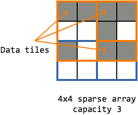

The data tiles are "filled" to the capacity with cells by traversing the array in the global order. This traversal process, and therefore the tile and cell ordering, is what determines which cells belong to which data tiles. The "last" tile in the array can have fewer cells than the capacity:

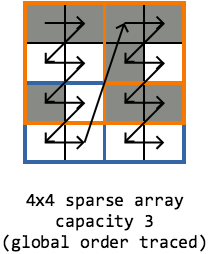

Consider a subarray read query (slice) of ``[1:2, 0:1]`` on this array. The following figure illustrates how the slice bounds intersect two space tiles, but only a single data tile.

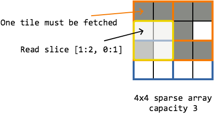

Earlier we said that tiles are the atomic unit of I/O and compression. More precisely, **data tiles are the atomic unit of I/O and compression**. (In a dense array, data tiles are equivalent to space tiles because every cell in a dense array is non-empty.) That means that the slice illustrated above results in a single I/O operation to fetch the intersecting data tile. A single cell from the data tile (which holds 3 cells) is stored into the query result.

A different slice, ``[0:0, 0:3]``, intersects two of the three data tiles in the array:

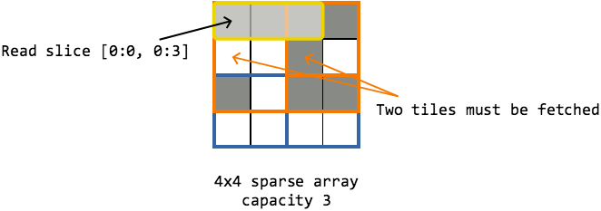

Both of those intersecting data tiles must be fetched from disk, and 3/5 of the cells from those two data tiles are stored in the query result.

Let's now consider the same sparse array, with the same tile and cell ordering, but with a capacity of 4. A different capacity would result in different data tiles, this time overlapping:

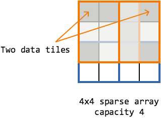

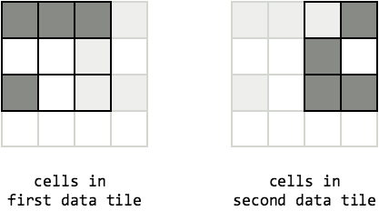

While the MBRs for the two data tiles overlap, each non-empty cell still belongs to exactly one data tile.

Note: if it is not clear why space tiles remain important in the sparse case, remember that data tiles are populated according to the global order of the array. The space tiles, in part, control the global ordering. Thus, space tiles in a sparse array can result in data tiles that are more square- and regular-shaped, which can be advantageous for square-like read slices.

Domain expansion
----------------

When constructing the array schema, if the space tile extent in a particular dimension does not evenly divide the dimension's domain, the domain is internally **expanded** by TileDB to make it divisible. In the above 4x4 example, if you specify 2x3 space tiles, the array's domain in the column dimension will be expanded from 4 to 6, so that exactly the array is exactly two tiles wide. The **expanded domain** of the array therefore becomes 6x4, and the **logical domain** of the array remains 4x4.

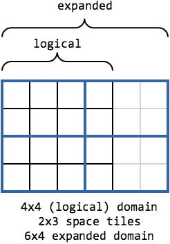

You can run into trouble with domain expansion in the case where the logical domain of the array uses the maximum representable value of the domain type (e.g. ``INT_MAX`` domain max for a dimension of type ``int``). In that case, it is not possible for TileDB to expand the domain beyond the type's maximum value without overflowing. TileDB will return an error during schema creation if it detects this is the case. If you encounter this situation, simply reduce your domain max in that dimension by the extent of one space tile. This will ensure that TileDB can expand the domain to be divisible by the space tile extent.

Choosing tile sizes
-------------------

While performance tuning of TileDB arrays is in general an advanced topic, a basic understanding of how to choose good tile sizes is not overly difficult.

As we saw earlier, the overall goal when choosing tile size and shape is to minimize the amount of wasted work required for TileDB to fulfill a read query. Work gets wasted when tiles are fetched from disk (and decompressed), only to use a small fraction of the data within them.

Let's consider dense arrays first. Suppose an application issuing read queries to a dense TileDB array commonly issues queries that fetch individual rows of the array. If the array was tiled such that each row was an individual tile (i.e. 1xn space tiles, where n is the number of columns), then TileDB would be able to fulfill the row queries by reading a single tile each time, and no work would be wasted. By contrast, if the array had been tiled with square tiles of some fixed extent (e.g. 10x10 space tiles), then each row query would require m/10 tiles to be read, and from each of those tiles 90% of the cells would be thrown away and not used in the query result. Lots of work is wasted in this case.

If you have such prior knowledge of the types read queries that will be issued to an array, you can use that knowledge to inform your choice of tile sizes to achieve very good performance.

Unfortunately, you may not always have such prior knowledge. In that case, it is usually wise to choose approximately square tiles of a "reasonable" size. Tiles that are too small will result in TileDB having to issue many small I/O requests to satisfy a read query, which in general will yield poorer performance than fewer, larger I/O requests. Similarly, tiles that are too large will result in I/O operations that are unnecessarily large, where much of the resulting data may be discarded.

Here the term "reasonable size" is deliberately vague; the only way to reliably ensure your tile size is appropriate for a given application is to profile and measure the read performance empirically.

The story is much the same in choosing tile size and capacity for sparse arrays. For example, if you have prior knowledge of the expected sparsity of the data, you can ensure the data tiles (recall data tiles are the unit of I/O) are not "too large" by choosing the capacity appropriately.

Without such prior knowledge for a sparse array, choosing square-like space tiles is generally a good idea, as it was for dense. Square-like space tiles in a sparse array will tend to reduce the number of intersections of data tile MBRs, which in turn will reduce the amount of I/O that must happen to satisfy a read query (recall all data tiles whose MBRs intersect a read query must be fetched).