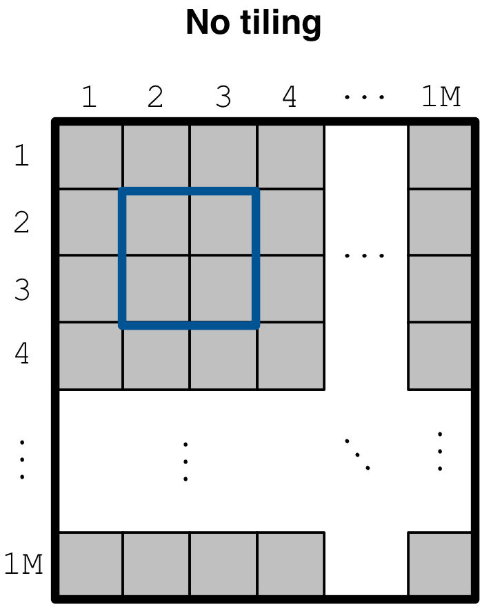
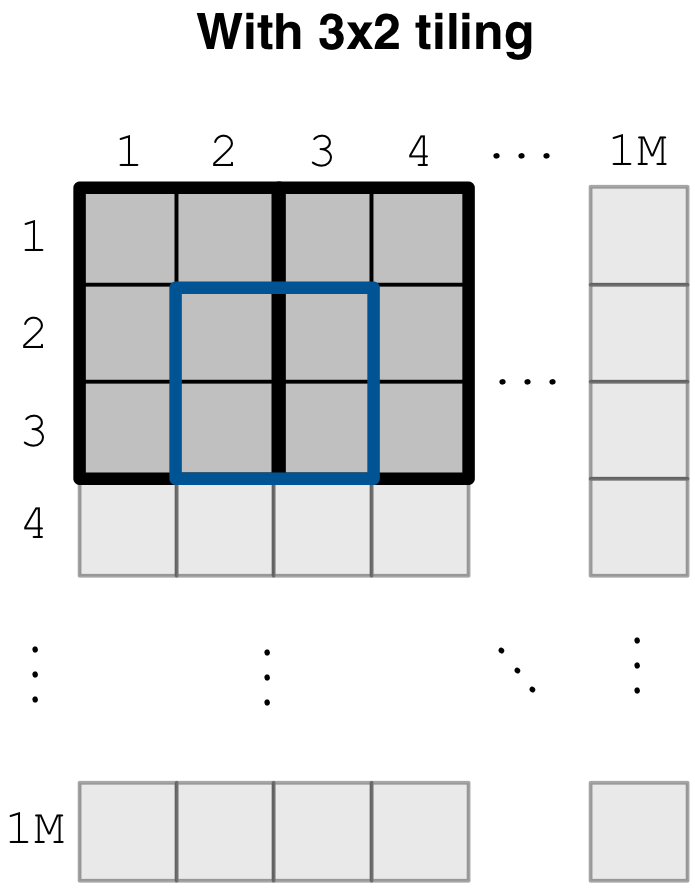
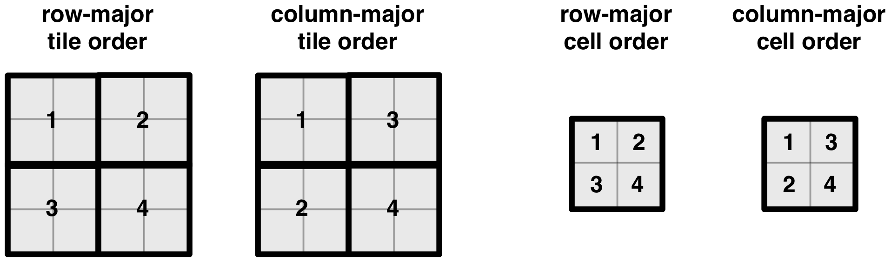
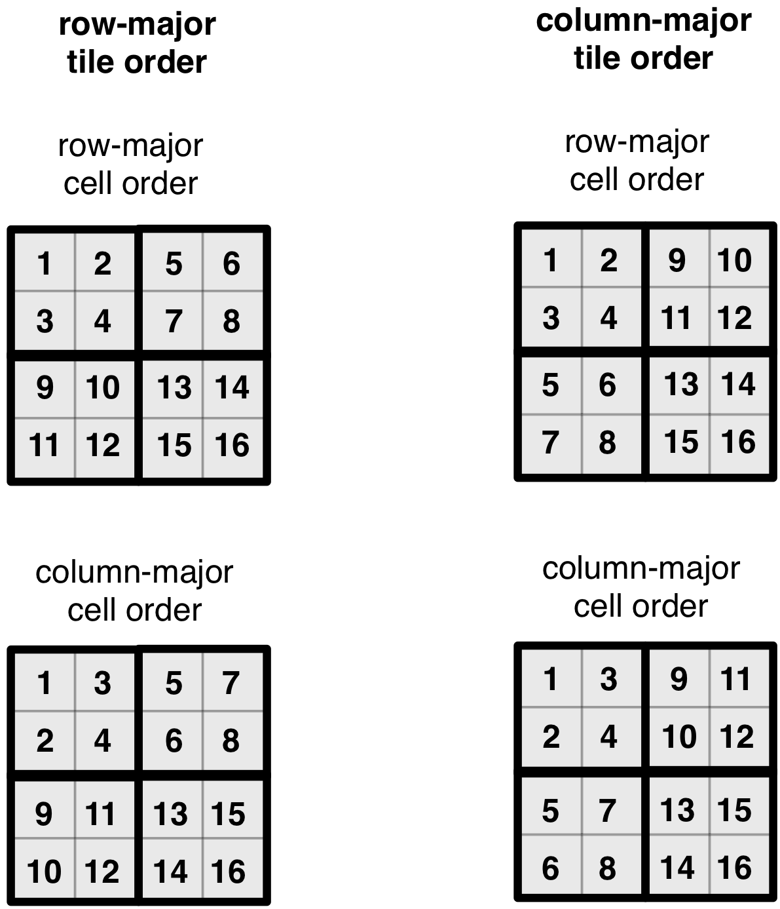
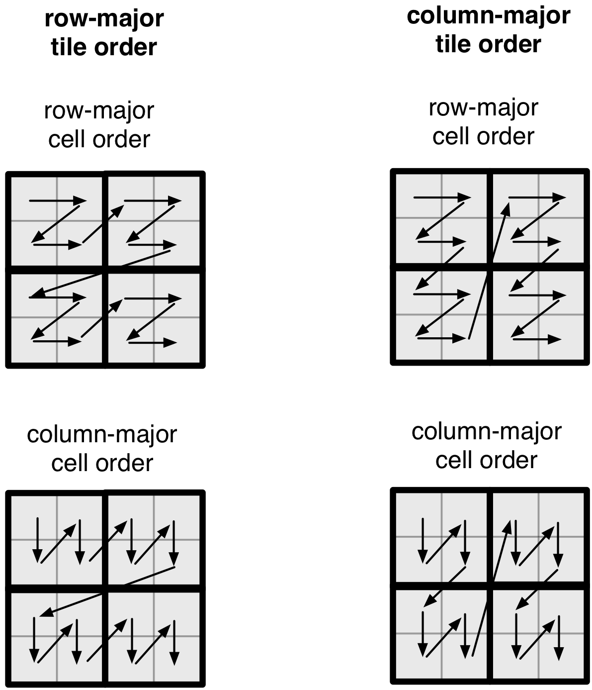
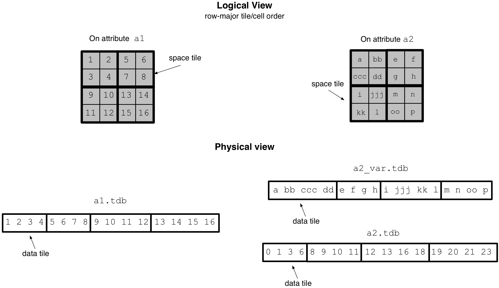
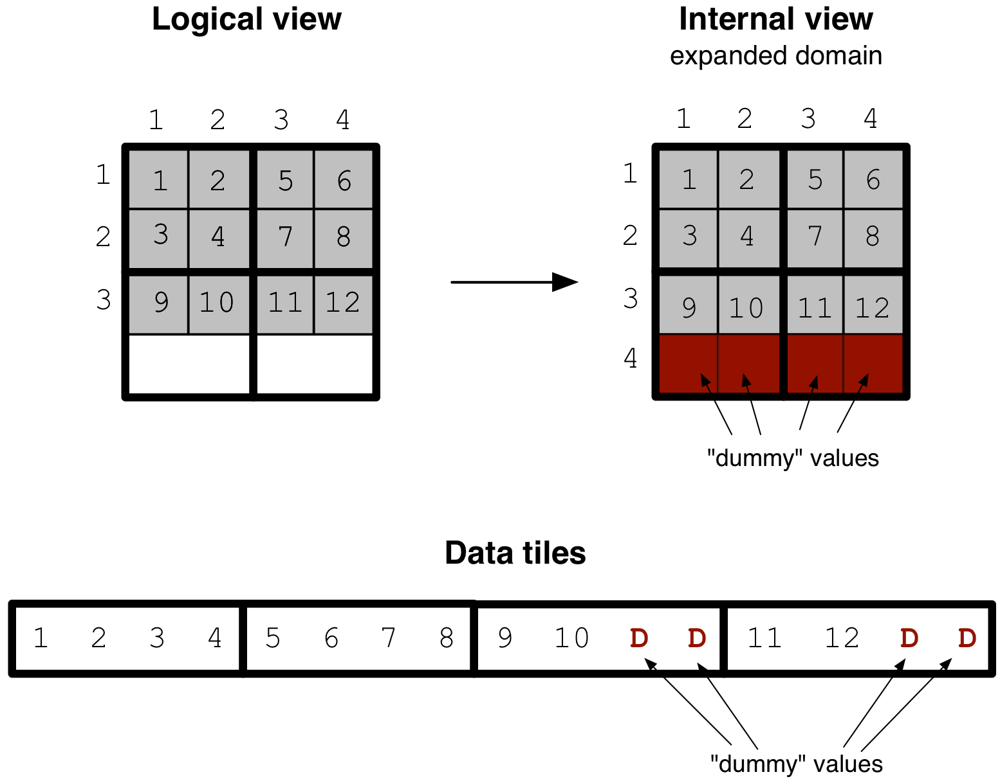

Tiling Dense Arrays
===================

In this tutorial you will learn about the core concept of tiling in TileDB,
focusing on dense arrays. It is recommended that you read the previous
tutorials on dense arrays and attributes first.

Basic concepts and definitions
------------------------------

.. toggle-header::
    :header: **Space tile**

      A space tile is a hyper-rectangular subarray (i.e., array slice) that
      groups a set of array cells. A dense TileDB array is decomposed into
      a set of space tiles, each of which having the **same shape**. The
      space tiles are defined by the user at the time of array creation,
      and TileDB stores the tiling information in the array schema.

.. toggle-header::
    :header: **Tile extent**

      This is the size of the space tile along some dimension. A space
      tile can have a different extent on each dimension.
      All space tiles will have the same tile extents on the same
      dimension, i.e., all space tiles will have the same shape.

.. toggle-header::
    :header: **Data tile**

      A data tile is a group of cell values on a specific attribute. In
      dense TileDB arrays, for each space tile, there is a corresponding
      data tile **per attribute** that stores the values of the cells on
      this attribute contained in the space tile. A data tile is the
      **atomic unit of I/O and filtering**.

.. toggle-header::
    :header: **Tile order**

      The tile order or layout (we use these terms interchangeably) is the
      order of the space tiles, which is defined by the user upon array
      creation and is stored in the array schema.

.. toggle-header::
    :header: **Cell order**

      The cell order or layout (we use these terms interchangeably) is the
      order of the cells in a space tile, which is defined by the user upon
      array creation and is stored in the array schema.

.. toggle-header::
    :header: **Global cell order**

      The global cell order or layout (we use these terms interchangeably) is
      the total order imposed on the array cells by the tile and cell order.
      It determines the way the cell values are physically stored in the
      TileDB files.

Motivation behind tiling
------------------------

TileDB is designed to manage massive quantities of data. A large array may not
fit in main memory. Therefore, any array access must be performed in **chunks** of
data. Moreover, **compresssion** is vital in terms of both
performance (since heavily compressed data may be transferred faster from the disk
or the network into main memory than uncompressed data) and cost (e.g., if the data
is stored on some pay-as-you-go service, such as AWS EBS or S3).

To clarify the rationale behind tiling, suppose we create a dense ``1Mx1M`` array
with an integer attribute ``a`` as follows. The following code defines the array
**without** tiling. In uncompressed form, the cell data consume about 1 TB, whereas
suppose for the sake of demonstration that the compressed array consumes 10 GB.

.. content-tabs::

   .. tab-container:: cpp
      :title: C++

      .. code-block:: c++

        domain.add_dimension(Dimension::create<int>(ctx, "rows", {{1, 1000000}}, 1000000))
              .add_dimension(Dimension::create<int>(ctx, "cols", {{1, 1000000}}, 1000000));
        ArraySchema schema(ctx, TILEDB_DENSE);
        schema.set_domain(domain).set_order({{TILEDB_ROW_MAJOR, TILEDB_ROW_MAJOR}});
        schema.add_attribute(Attribute::create<int>(ctx, "a"));

   .. tab-container:: python
      :title: Python

      .. code-block:: python

       dom = tiledb.Domain(ctx,
                           tiledb.Dim(ctx, name="rows", domain=(1, 1000000), tile=1000000, dtype=np.int32),
                           tiledb.Dim(ctx, name="cols", domain=(1, 1000000), tile=1000000, dtype=np.int32))
       schema = tiledb.ArraySchema(ctx, domain=dom, sparse=False,
                                   cell_order='row-major', tile_order='row-major',
                                   attrs=[tiledb.Attr(ctx, name="a", dtype=np.int32)])
       tiledb.DenseArray.create(array_name, schema)

Now suppose we wish to read a tiny ``2x2`` subarray from this large array as shown in
the figure below. Recall that the cell values of this array are written in a file
``a.tdb`` inside a subdirectory of the array directory. Suppose that we trivially
compress this file (e.g., using any compression tool, such as ``gzip``). In order
to retrieve the ``2x2`` subarray, we will have to decompress the **entire** file,
i.e., to get 16 bytes of data, we will have to fetch and decompress 10 GB of data.
Even if we do not compress the file, reading a subarray should entail
bringing chunks of data to main memory, instead of retrieving a cell at a
time from the file, since each cell retrieval could then mean an I/O system call
to the local filesystem, or an HTTP request to a cloud store (such as AWS S3 or
Microsoft Azure). For a larger subarray (e.g., ``1000x1000``) this would incur
prohibitive cost.

Tiling a dense array
--------------------

To mitigate the above problems, we change just two lines of code from the
snippet provided above as follows. Notice that we change the last argument
in the dimension constructor.

.. content-tabs::

   .. tab-container:: cpp
      :title: C++

      .. code-block:: c++

        domain.add_dimension(Dimension::create<int>(ctx, "rows", {{1, 1000000}}, 3))
              .add_dimension(Dimension::create<int>(ctx, "cols", {{1, 1000000}}, 2));

   .. tab-container:: python
      :title: Python

      .. code-block:: python

       dom = tiledb.Domain(ctx,
                           tiledb.Dim(ctx, name="rows", domain=(1, 1000000), tile=3, dtype=np.int32),
                           tiledb.Dim(ctx, name="cols", domain=(1, 1000000), tile=2, dtype=np.int32))

This means that we define the **tile extent** for dimension ``rows`` to be equal to
``3`` (this used to be ``1000000``), and the tile extent for dimension ``cols`` to
be equal to ``2`` (this used to be ``1000000`` as well). This effectively decomposes
the array into **space tiles**, each with shape ``3x2``. It also instructs TileDB
to chunk the cell values in ``a.tdb``, such that each group corresponds to one space
tile. Each such chunk, called a **data tile**, is the **atomic unit of I/O and
compression**. This means that (i) if the user specifies compression (to be covered
in later tutorials), TileDB will compress each data tile separately, and (ii) entire
(compressed or uncompressed) data tiles will always be retrieved from persistent
storage, even if we just need to read a single cell value from the tile. The figure
below illustrates the same array as above, where each space tile is depicted as a
thick black ``3x2`` rectangle. Now reading the ``2x2`` subarray (in thick blue)
entails fetching the data tiles corresponding to the two overlapping space tiles,
ignoring the rest of the array. This significantly reduces the amount of redundant
values retrieved when slicing, while allowing compression and efficient I/O.

Physical cell layout
--------------------

So far we have demonstrated the importance of tiling and how to define space tiles
upon array creation. *But how do the cell values get physically stored in the data
files?* Note that an array can be n-dimensional, but the files storing the cell
values understand only a **single dimension**. We later explain that the physical
cell layout can greatly **affect performance**. To answer the above question, we first
need to explain the **tile order** and **cell order**, and how the
user can specify them.

Consider the code line below. Recall that this has been used in all our earlier
examples when creating the array schema. This sets both the tile and cell
order to **row-major** (the first element in the pair corresponds to the tile
order and the second to the cell order). Another possible order is **column-major**.
Therefore, there are 4 different combinations for setting the tile/cell order,
which effectively results in 4 different physical cell layouts (always given
a particular space tiling - the combinations increase rapidly as the user
is flexible to adjust the tile extents along each dimension).

.. content-tabs::

   .. tab-container:: cpp
      :title: C++

      .. code-block:: c++

        schema.set_order({{TILEDB_ROW_MAJOR, TILEDB_ROW_MAJOR}});

   .. tab-container:: python
      :title: Python

      .. code-block:: python

        schema = tiledb.ArraySchema(..., cell_order='row-major', tile_order='row-major', ...)

The figure below illustrates the two tile orders and two
cell orders for a simple ``4x4`` array with a ``2x2`` space tiling.
Note that the cell order specifies the layout of the cells
**inside a space tile**.

We next demonstrate the effect of a tile/cell order combination
on the physical cell layout. The figure below illustrates all four
possible cell layouts for the ``4x4`` array with the ``2x2`` space
tiling. Note that the same cell order applies to **all** tiles. The
numbering of the cells indicates the position where the corresponding
cell value is stored in the attribute file (for **every** attribute).

Observe that the tile and cell order essentially superimpose a
**space-filling curve** on the array,
mapping n-dimensional cells to a 1-dimensional order. This is
more evident in the figure below.

.. note::
   The physical cell layout, as specified by the space tiling, tile order
   and cell order upon creating the array schema, is called the
   **global cell order**.

Space vs. data tiles
--------------------

In this subsection we revisit the concepts of space and data tiles in
order to clarify and distinguish between these two definitions. Consider
the example ``4x4`` array of the figure below, with a ``2x2`` tiling and
row-major tile and cell order. Suppose also that the array has two
attributes; a fixed-length ``a1`` storing
integers and a variable-length ``a2`` storing strings. The figure
depicts the **logical view** of the array, as well as its **physical view**
(i.e., the layout of the cell values in the attribute data files) assuming
no compression.

Observe that the space tile is defined in the logical view of the array,
whereas a data tile corresponds to a chunk of data in an attribute file,
i.e, it is defined in the array physical view.
In dense arrays, a data tile always stores the cell values contained in
a space tile (in a later tutorial we will see that this may not be
true for sparse arrays). Moreover, in the case of variable-length attributes,
for each space tile there are two data tiles; the first stores the actual
cell values in the space tile along the attribute, and the second
stores their corresponding starting offsets in the data file. Finally,
observe that the data tiles of a variable-length attribute may have
variable physical sizes.

Domain expansion
----------------

We have stated above that all space tiles in a TileDB array have the same
shape. However, *what happens in case the array domain cannot be decomposed
into integral (i.e., full) space tiles?* Consider the following example
of a ``3x4`` array with a ``2x2`` tiling. Since TileDB cannot handle "partial"
space tiles, it internally **expands** the domain minimally so that it contains
integral tiles. The cells in the expanded region of the array
are filled internally with empty (dummy) values (along **all** attributes).

This expansion is generally
hidden from the user (as it happens internally). However, there are two
scenarios where the user must be aware of the domain expansion. The first
is when writing in global cell order. This writing mode is explained
thoroughly in a later tutorial. The second is when the user specifies a
very large domain, highlighted in the following warning.

.. warning::

   When specifying an array domain that cannot be decomposed
   into integral tiles (i.e., some dimension domain is not divisible by
   the tile extent along that dimension), always account for the domain
   expansion. Specifically, make sure to define the dimension domain
   such that expanding by one tile extent does not lead to a domain
   bound overflow (for the selected domain data type).

Tiling and performance
----------------------

Choosing the space tile shape and tile/cell order is a challenging task.
The takeaway from this section is that these choices affect the
layout of the cell values in the data files, which in turn greatly
affect performance depending on the shapes and positions of the
subarrays upon reading. See :ref:`performance/introduction` for
more details on TileDB performance and how to tune it.

