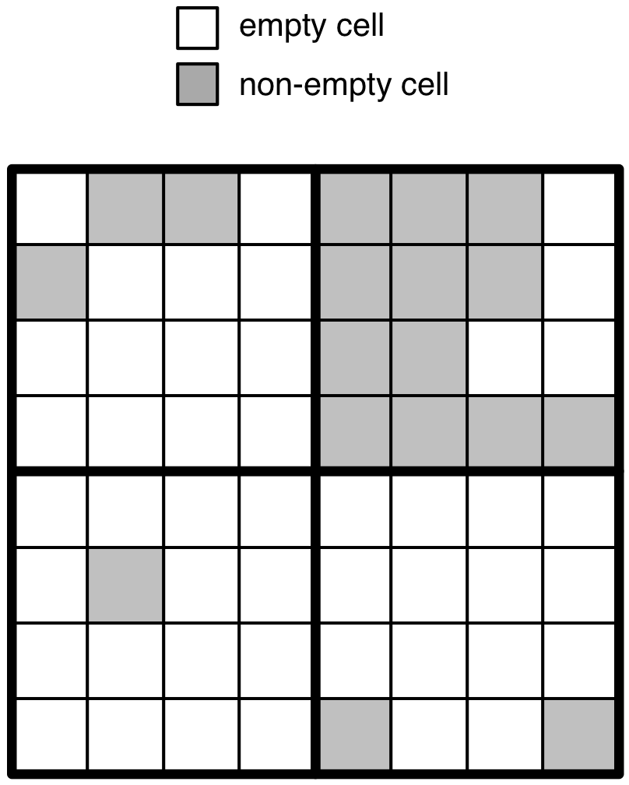
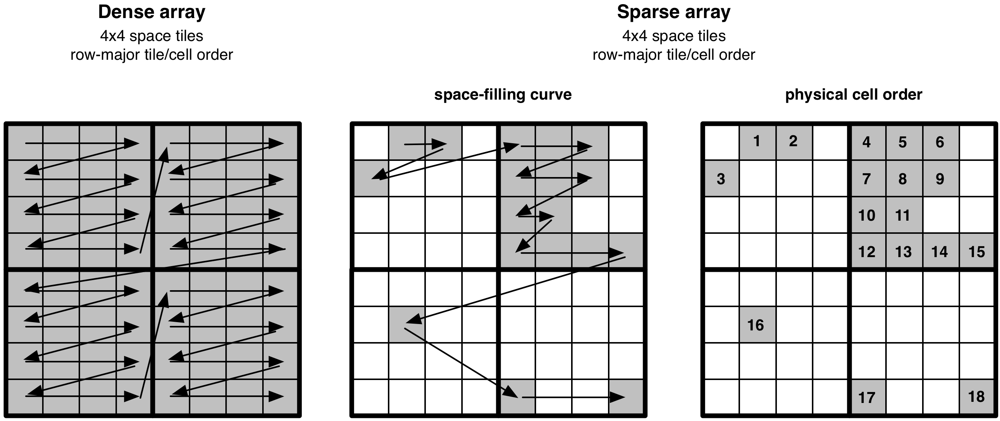
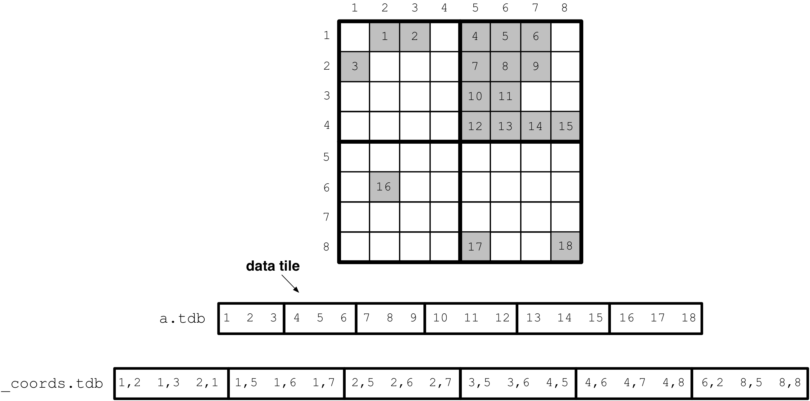
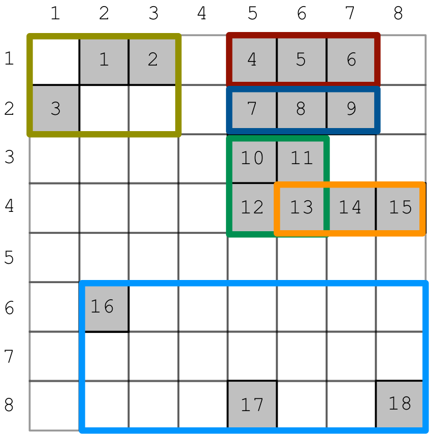
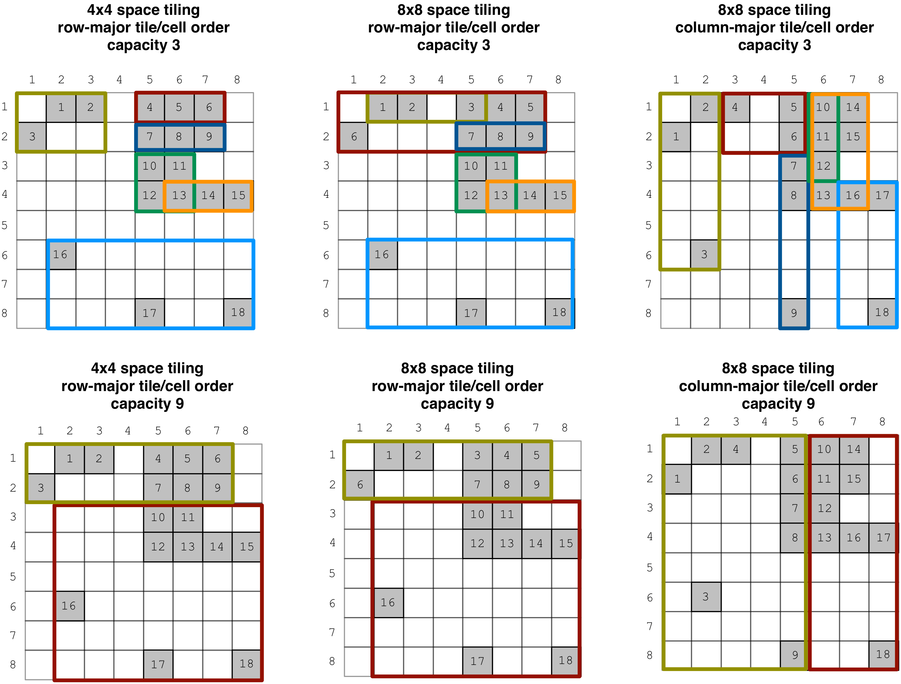

Tiling Sparse Arrays
====================

In this tutorial you will learn about the core concept of tiling in TileDB,
focusing on sparse arrays. It is recommended that you read the previous
tutorials on sparse arrays and attributes first, as well as on dense array
tiling so that you can better understand the differences from sparse tiling.

Basic concepts and definitions
------------------------------

.. toggle-header::
    :header: **Empty/Non-empty cells**

    In a sparse array, there are cells that are empty (i.e., they contain
    no value). TileDB stores only the values of non-empty cells in persistent
    storage, ignoring the empty cells.

.. toggle-header::
    :header: **Data tile**

    The definition of a data tile in sparse arrays is different from that in
    dense arrays. In this tutorial we will explain that a data tile contains
    values only from the non-empty cells. Moreover, a data tile does not
    always correspond to a space tile.

.. toggle-header::
    :header: **Tile capacity**

    This is the number of non-empty cells stored in a data tile. We will
    explain soon that all data tiles in a sparse array have the same capacity,
    which is specified by the user upon the array creation.

.. toggle-header::
    :header: **MBR**

    The minimum bounding rectangle (MBR) of a data tile is a rectangle in
    the logical view of the array that tightly includes all the non-empty
    cells whose values are stored in that data tile.

Problem with space tiling
-------------------------

Consider the ``8x8`` array with ``4x4`` space tiles in the figure below.
Assume for simplicity that the array stores a single (fixed-length) integer
attribute. The non-empty (resp. empty) cells are depicted in grey
(resp. white) color. If we followed the tiling technique of dense arrays,
we would have to create 4 data tiles, one for each space tile. *TileDB
does not materialize empty cells, i.e., it stores only the values
of the* **non-empty** *cells in the data files*. Therefore, the space tiles
would produce 4 data tiles with 3 (upper left), 12 (upper right),
1 (lower left) and 2 (lower right) non-empty cells.

Recall that the data tile in TileDB is the atomic unit of IO and filtering.
The **tile size imbalance** that may result from space tiling can
lead to ineffective compression (if numerous data tiles contain only a
handful of values), and inefficient reads (if the subarray you wish
to read only partially intersects with a huge tile, which needs to be
fetched in its entirety and potentially decompressed). *Ideally, we wish
every data tile to store to the same number of non-empty cells.* Recall
that this is achieved in the dense case by definition, since each space tile
has the same shape (equal number of cells) and every data tile
contains the values of the cells in a space tile. Finally, since the
distribution of the non-empty cells in the array may be arbitrary,
it is phenomenally difficult to fine-tune the space tiling in a way
that leads to load-balanced data tiles storing an acceptable number of
non-empty cells, or even completely unattainable.

Physical cell layout
--------------------

TileDB solves the above, seemingly very challenging, problem in a surprisingly
simple manner. Before we explain how TileDB creates the data tiles, we first
describe the physical layout of the non-empty cells in sparse arrays, i.e.,
the **global cell order**. We focus on this first, because we already know
how to do it:

.. note::

  The global order of the non-empty cells in a sparse array is equivalent to
  that in a dense array, ignoring the empty cells.

The figure below demonstrates the physical cell layout in sparse arrays, and its
connection to the layout in dense arrays. Note that, similar to the dense
case, the user is the one dictating the global cell order, by specifying the
space tiles (i.e., tile extents) and tile/cell order upon array creation.

Tiling a sparse array
---------------------

We have two facts so far:

1. We know how to define a global cell order (and we are quite flexible about it)

2. We must address the data tile imbalance we explained above.

All we need to do is specify the fixed number of non-empty cells we would
like each data tile to correspond to. We call this the **tile capacity**.
By specifying the tile capacity, we are instructing TileDB to *chunk* the
already sorted non-empty cells (on the global order) into data tiles
of equal cardinality. Continuing the example above, supposing that
the non-empty cells contain integers ``1-18`` that happen to follow the
global order (for simplicity), and setting the tile capacity to ``3``,
the following figure shows how TileDB creates the data tiles in the
attribute file ``a.tdb``. Notice also the extra ``__coords.tdb`` file
that TileDB creates for storing the coordinates of the non-empty cells.
Without this TileDB would not know which cells the values in ``a.tdb``
correspond to.

The case of variable-length attributes is similar; a data tile always
corresponds to a fixed number of non-empty cells and stores their
corresponding values along an attribute. One thing to note though:

.. note::

  The tile capacity specifies the fixed number of non-emtpy cells each
  data tile should correspond to. This implies that all
  the data tiles of a fixed-length attribute have the same size in bytes.
  However, the data tiles of a variable-length attribute may have variable
  size in bytes, although they have the same capacity.

You can easily specify the tile capacity in the array schema upon array
creation as shown below.

.. content-tabs::

   .. tab-container:: cpp
      :title: C++

      .. code-block:: c++

        schema.set_capacity(3);

   .. tab-container:: python
      :title: Python

      .. code-block:: python

        schema = tiledb.ArraySchema(..., capacity=3, ...)

.. note::

  The total number of non-empty cells does not need to be divisible by
  the tile capacity. It is ok for the very last data tile to be contain
  fewer values than the tile capacity specifies.

Minimum bounding rectangle (MBR)
--------------------------------

We now know how to create data tiles. *But how can TileDB process a subarray query?*
In the dense case, the space tiling and the fact that **every** cell contains a
value allows TileDB to do some easy internal calculations and efficiently determine
which cell values should be reported as results. However, in the sparse case,
given a subarray query and no extra information, TileDB would have to probe the
``__coords.tdb`` file and see which coordinates fall in the subarray, and
then access the corresponding values in ``a.tdb`` for the qualifying cells.
This can be very inefficient (it may even result in a complete scan of
``__coords.tdb``).

Fortunately, TileDB employs a simple indexing technique. Upon ingestion of the
data and when chunking the (sorted) coordinates into data tiles, TileDB creates
a **minimum bounding rectangle (MBR)**, i.e., a hyper-rectangle that
*tightly encompasses*
the coordinates in each data tile. For our running example, the MBRs of the
data tiles are depicted in different colors in the figure below.

Notice in the figure that 2 MBRs *overlap* (the green and the orange). In general,
the following holds about MBRs.

.. note::

  MBRs are allowed to overlap in TileDB. However, the sets of non-empty cells
  corresponding to the MBRs are **disjoint**; each non-empty cell is
  associated with exactly one MBR. Moreover, the MBRs are allowed to span
  over multiple space tiles.

The MBRs constitute compact information that is stored in a special
``__fragment_metadata.tdb`` file. The MBRs are loaded in main-memory the first
time the array is *opened* (we explain this in later tutorials), i.e., prepared
for reading. TileDB uses the MBRs to **prune** data tiles that certainly do
not contain any result, and focuses only on the data tiles whose MBRs intersect
with the subarray query. TileDB still needs to probe the overlapping data
tiles to discard any coordinates falling outside the subarray (the MBRs are
an *approximation* after all), but this technique significantly boosts the
overall read performance.

As a final remark, for readers familiar with spatial indexing, this MBR indexing
technique of TileDB adopts ideas from
`R-Trees <https://en.wikipedia.org/wiki/R-tree>`_.

Space vs. data tiles vs. MBRs
-----------------------------

We have explained space tiles, data tiles and MBRs, but this
may be too much terminology to digest. Let us summarize here these
definitions for sparse arrays and provide some more clarifications.

The **space tiles** simply *shape* the physical cell layout, i.e., they
take part in determining the global cell order. The **data tiles** are
chunks of non-empty cell values in the attribute files with a fixed capacity,
similar to the dense case, but (i) they store only values of non-empty cells,
and (ii) they do not correspond to space tiles.
The **MBRs** are rectangles that encompass the non-empty cells corresponding
to a data tile. There is a one-to-one correspondence
between an MBR and a data tile (across all attributes). The MBRs constitute
indexing information leading to fast reads.

Finally, in case you have not guessed it already, *the global order (i.e.,
the space tiles and tile/cell order) and capacity affect the shape of the MBRs*.
The figure below demonstrates what happens to the MBRs when varying
those parameters (the numbering in the cells follows the global order
in each case).

Domain expansion
----------------

What you know already from dense arrays about domain expansion (which happens
when the tile extent along some dimension does not divide the dimension domain)
holds also in the
case of sparse arrays. However, there is no need for padding tiles with dummy values
here. Remember, the data tiles in sparse arrays contain values only for non-empty
cells. The only thing you need to be aware of is that domain expansion *will* happen
internally, so you need to make sure that the domain you specify will not
exceed the data type bounds after expansion.

Tiling and performance
----------------------

By now you must know that MBRs facilitate reads, as only data tiles with MBRs
overlapping a query subarray will be fetched from the files. Moreover,
you know that the space tiling, tile/cell order and capacity all
affect the shape of the MBRs. Therefore, it is crucial to get these parameters
right so that you maximize the TileDB performance for your application.
See :ref:`performance/introduction` for
more details on TileDB performance and how to tune it.

