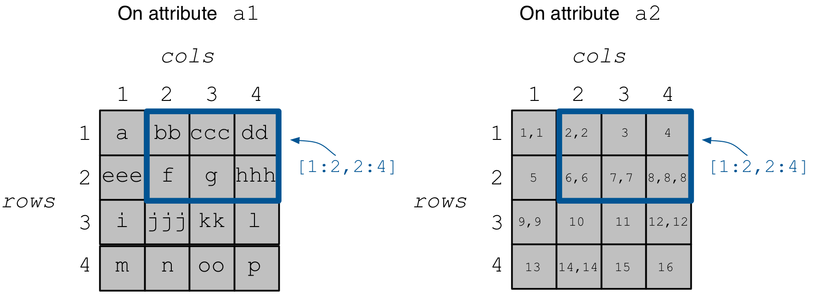

.. _variable-length-attributes:

Variable-length Attributes
==========================

In this tutorial we will learn how to use variable-length attributes.
It is recommended to read the tutorial on dense arrays first.

.. warning::

   Variable-length attributes are not yet supported in the Python API.

.. table:: Full programs
  :widths: auto

  ====================================  =============================================================
  **Program**                           **Links**
  ------------------------------------  -------------------------------------------------------------
  ``variable_length``                   |varlencpp|
  ====================================  =============================================================

.. |varlencpp| image:: ../figures/cpp.png
   :align: middle
   :width: 30
   :target: {tiledb_src_root_url}/examples/cpp_api/variable_length.cc

Basic concepts and definitions
------------------------------

.. toggle-header::
    :header: **Variable-length attributes**

       A variable-length attribute allows each cell to store a variable-length
       list of values of the same type. For example, each cell could store a
       variable-length list of characters (a string value).

Creating the array
------------------

This is similar to what we covered in the simple dense array example. The only
difference is that our two attributes are variable-length. Specifically,
``a1`` will store strings, whereas ``a2`` will store a variable-length
list of integers.

.. content-tabs::

   .. tab-container:: cpp
      :title: C++

      .. code-block:: c++

        schema.add_attribute(Attribute::create<std::string>(ctx, "a1"));
        schema.add_attribute(Attribute::create<std::vector<int>>(ctx, "a2"));

Writing to the array
--------------------

Since each cell may now store a variable number of values, when writing, you
must somehow tell TileDB which values belong to which cell. In TileDB,
you do this by providing **two** input buffers (instead of one as in
the fixed-length attributes); one buffer holds the actual cell data,
whereas another stores the **starting offsets** (in bytes) of each
variable-length cell.

Suppose we wish to populate the array with cell values on ``a1``
and ``a2`` as shown in the figure below.

Let's take a look at the code below and focus on ``a1`` first. Notice that
we create buffer ``a1_data`` which stores the cell values in row-major
order, e.g., cell ``(1,1)`` stores ``a``, ``(1,2)`` stores ``bb``, etc.
If a cell stores more than one value, we just place its values
in the buffer contiguously, such as ``bb`` for cell ``(1,2)``. The problem
is that, only by looking at ``a1_data``, TileDB has no way of
discerning the cell value "limits". Therefore, we construct an
extra buffer ``a1_off`` which stores the offsets where the **first**
value of each cell starts in ``a1_data``, e.g., ``a1_off[0] = 0`` means
that ``a`` starts at offset ``0`` in ``a1_data`` (in bytes),
``a1_off[1] = 1`` means ``bb`` starts at offset ``1``,
``a1_off[2] = 3`` means ``ccc`` starts at offset ``3``, etc.

.. content-tabs::

   .. tab-container:: cpp
      :title: C++

      .. code-block:: c++

        // Prepare the buffers
        std::string a1_data = "abbcccddeeefghhhijjjkklmnoop";
        std::vector<uint64_t> a1_off = {
            0, 1, 3, 6, 8, 11, 12, 13, 16, 17, 20, 22, 23, 24, 25, 27};
        std::vector<int> a2_data = {1, 1, 2, 2,  3,  4,  5,  6,  6,  7,  7,  8,  8,
                                    8, 9, 9, 10, 11, 12, 12, 13, 14, 14, 14, 15, 16};
        std::vector<uint64_t> a2_el_off = {
            0, 2, 4, 5, 6, 7, 9, 11, 14, 16, 17, 18, 20, 21, 24, 25};
        std::vector<uint64_t> a2_off;
        for (auto e : a2_el_off)
          a2_off.push_back(e * sizeof(int));

        // Prepare and submit the query
        Array array(ctx, array_name, TILEDB_WRITE);
        Query query(ctx, array);
        query.set_layout(TILEDB_ROW_MAJOR)
             .set_buffer("a1", a1_off, a1_data)
             .set_buffer("a2", a2_off, a2_data);
        query.submit();
        array.close();

Note that the offsets buffer stores offsets **in bytes**. That was easy for ``a1``
where each character consumes 1 byte. The case of ``a2`` is a little different,
thus, for simplicity, we take two steps. In the first step we construct a
buffer ``a2_el_off`` that records the starting offsets **in terms of elements**
in ``a2_data``. For instance, ``2,2`` of cell ``(1,2)`` starts at **element**
``2`` in ``a2_data``. Next, we create another buffer ``a2_off`` that stores the
actual buffer offsets by multiplying the element offsets by the size of an
integer. In the previous example ``2,2`` of cell ``(1,2)`` starts at **byte**
``2*sizeof(int)=8`` in ``a2_data``. Note that TileDB expects ``a2_off``,
not ``a2_el_off``.

Finally, similar to the fixed-length case we use ``set_buffer`` to add the
buffers to the query, but now we provide both (byte) offset and data buffers.

Reading from the array
----------------------

We focus on subarray ``[1,2], [2,4]``. Recall that, in order to read
from a TileDB array, we must allocate space for the buffers that will
hold the result. For the variable-length case, this is a challenging
task, since we do not know how many values each cell may be storing.
Fortunately, TileDB has an auxiliary function that gives you an
**upper bound** on how many elements your buffers need to store
the results (note that this is an **approximation**). You can
prepare the buffers as follows. Once again, we need two buffers
for each attribute, one for the data and one for the offsets.

.. content-tabs::

   .. tab-container:: cpp
      :title: C++

      .. code-block:: c++

        auto max_el_map = array.max_buffer_elements(subarray);
        std::vector<uint64_t> a1_off(max_el_map["a1"].first);
        std::string a1_data;
        a1_data.resize(max_el_map["a1"].second);
        std::vector<uint64_t> a2_off(max_el_map["a2"].first);
        std::vector<int> a2_data(max_el_map["a2"].second);

Next, we perform the query as usual, but now we set both
the data and offset buffers. After completion, ``a1_data`` and
``a2_data`` will hold the result cell values , whereas ``a1_off``
and ``a2_off`` will store the starting offsets (**in bytes**)
of the cell values in ``a1_data`` and ``a2_data``, respectively.
More specifically, ``a1_data`` will contain ``bbcccddfghhh``,
``a1_off`` will contain ``0, 2, 5, 7, 8, 9``, ``a2_data`` will
contain ``2, 2, 3, 4, 6, 6, 7, 7, 8, 8, 8`` and ``a2_off`` will
contain ``0, 8, 12, 16, 24, 32`` (see figure above).

.. content-tabs::

   .. tab-container:: cpp
      :title: C++

      .. code-block:: c++

        Query query(ctx, array);
        query.set_subarray(subarray)
             .set_layout(TILEDB_ROW_MAJOR)
             .set_buffer("a1", a1_off, a1_data)
             .set_buffer("a2", a2_off, a2_data);
        query.submit();
        array.close();

.. warning::

  For the case of variable-length attributes, you should always use the
  auxialiary ``max_buffer_elements`` function to calculate the
  appropriate buffer sizes that will hold the result, even if you
  know the result size a priori. This is because TileDB **may overestimate**
  the buffer sizes needed and, hence, process a **part of the query**
  upon ``query.submit()``, yielding an incomplete status (checked
  with ``query.query_status()``). For more information about incomplete
  queries, see :ref:`incomplete_queries`. Allocating buffers using the sizes output by
  ``max_buffer_elements`` guarantees that the query will be completed
  and the whole result will be returned.

Perhaps the most cumbersome task is parsing the cell values given the
data and offset buffers. Here is what we do for the strings of ``a1``.
We first calculate the string sizes using the offsets buffer. Then,
we create a vector of strings (one per result cell), so that we make it
easy to print later.

.. content-tabs::

   .. tab-container:: cpp
      :title: C++

      .. code-block:: c++

        // Get the string sizes
        auto result_el_map = query.result_buffer_elements();
        auto result_el_a1_off = result_el_map["a1"].first;
        std::vector<uint64_t> a1_str_sizes;
        for (size_t i = 0; i < result_el_a1_off - 1; ++i)
          a1_str_sizes.push_back(a1_off[i + 1] - a1_off[i]);
        auto result_a1_data_size = result_el_map["a1"].second * sizeof(char);
        a1_str_sizes.push_back(result_a1_data_size - a1_off[result_el_a1_off - 1]);

        // Get the strings
        std::vector<std::string> a1_str;
        for (size_t i = 0; i < result_el_a1_off; ++i)
          a1_str.push_back(std::string(&a1_data[a1_off[i]], a1_str_sizes[i]));

For the integers of ``a2``, we first calculate the element offsets from the
byte offsets in ``a2_off``, and then we calculate the number of elements
per result cell. Once again, this will simplify printing the result.

.. content-tabs::

   .. tab-container:: cpp
      :title: C++

      .. code-block:: c++

        // Get the element offsets
        std::vector<uint64_t> a2_el_off;
        auto result_el_a2_off = result_el_map["a2"].first;
        for (size_t i = 0; i < result_el_a2_off; ++i)
          a2_el_off.push_back(a2_off[i] / sizeof(int));

        // Get the number of elements per cell value
        std::vector<uint64_t> a2_cell_el;
        for (size_t i = 0; i < result_el_a2_off - 1; ++i)
          a2_cell_el.push_back(a2_el_off[i + 1] - a2_el_off[i]);
        auto result_el_a2_data = result_el_map["a2"].second;
        a2_cell_el.push_back(result_el_a2_data - a2_el_off.back());

Finally, we print the result as follows.

.. content-tabs::

   .. tab-container:: cpp
      :title: C++

      .. code-block:: c++

        for (size_t i = 0; i < result_el_a1_off; ++i) {
          std::cout << "a1: " << a1_str[i] << ", a2: ";
          for (size_t j = 0; j < a2_cell_el[i]; ++j)
            std::cout << a2_data[a2_el_off[i] + j] << " ";
          std::cout << "\n";
        }

If you compile and run the example of this tutorial as shown below, you should
see the following output:

.. code-block:: bash

   $ g++ -std=c++11 variable_length.cc -o variable_length -ltiledb
   $ ./variable_length
   a1: bb, a2: 2 2
   a1: ccc, a2: 3
   a1: dd, a2: 4
   a1: f, a2: 6 6
   a1: g, a2: 7 7
   a1: hhh, a2: 8 8 8

On-disk structure
-----------------

Let us look at the contents of the array of this example on disk.

.. code-block:: bash

   $ ls -l variable_length/
   total 8
   drwx------  7 stavros  staff  238 Jun 19 13:40 __45aba8bfac594505b3a92c83db4920be_1529430032040
   -rwx------  1 stavros  staff  186 Jun 19 13:40 __array_schema.tdb
   -rwx------  1 stavros  staff    0 Jun 19 13:40 __lock.tdb

   $ ls -l variable_length/__45aba8bfac594505b3a92c83db4920be_1529430032040/
   total 40
   -rwx------  1 stavros  staff  132 Jun 19 13:40 __fragment_metadata.tdb
   -rwx------  1 stavros  staff   80 Jun 19 13:40 a1.tdb
   -rwx------  1 stavros  staff   28 Jun 19 13:40 a1_var.tdb
   -rwx------  1 stavros  staff   80 Jun 19 13:40 a2.tdb
   -rwx------  1 stavros  staff  104 Jun 19 13:40 a2_var.tdb

Observe that, contrary to the case of fixed-length attributes, TileDB stores **two**
files for each variable-length attribute. Specifically, ``a1_var.tdb`` and ``a2_var.tdb``
store the actual cell values (which are of variable length), whereas ``a1.tdb`` and
``a2.tdb`` store the corresponding starting offsets (in bytes). In other words,
TileDB adopts a "columnar" format by splitting the values from the offsets. The
reason behind this choice is better compressibility (later tutorials explain this
in more detail).
