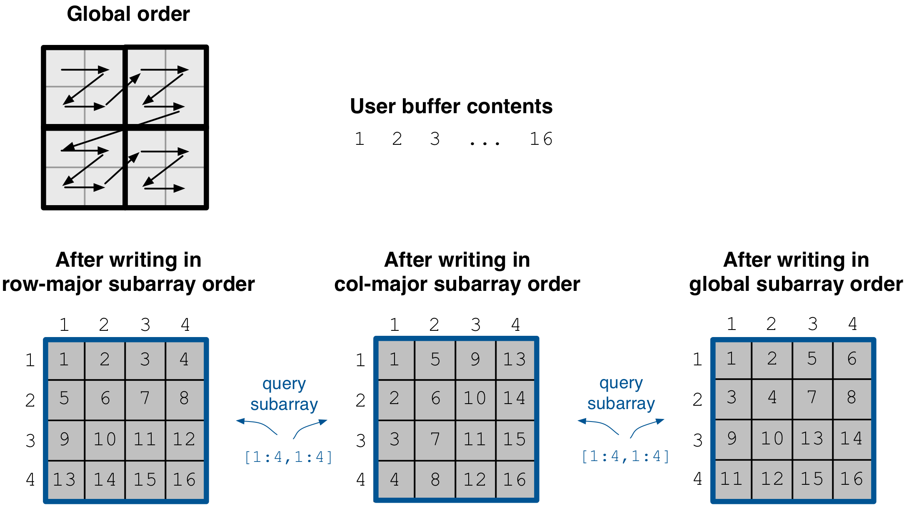
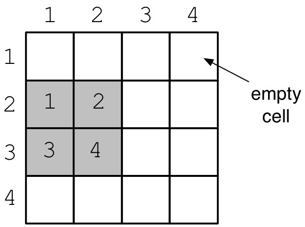
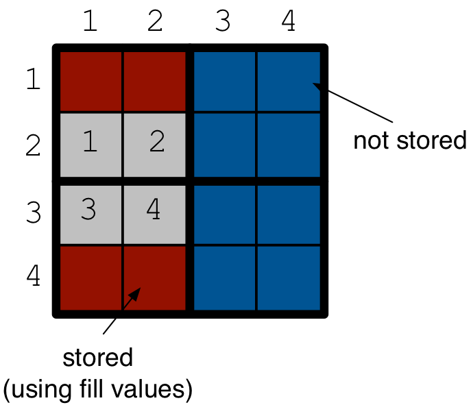
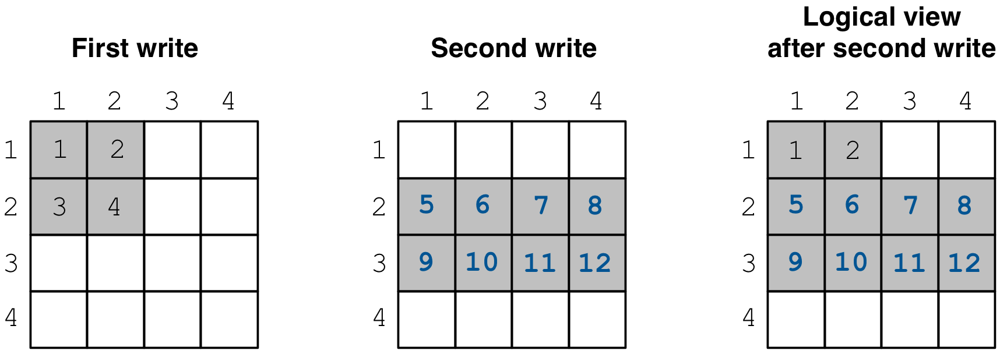
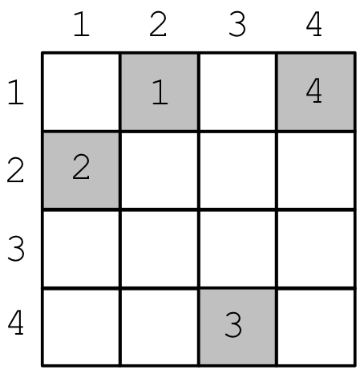
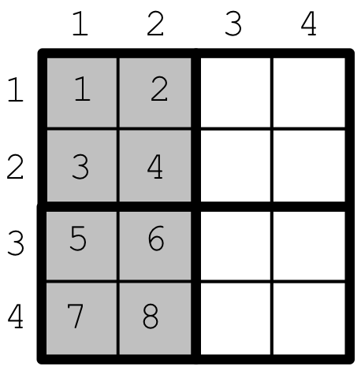
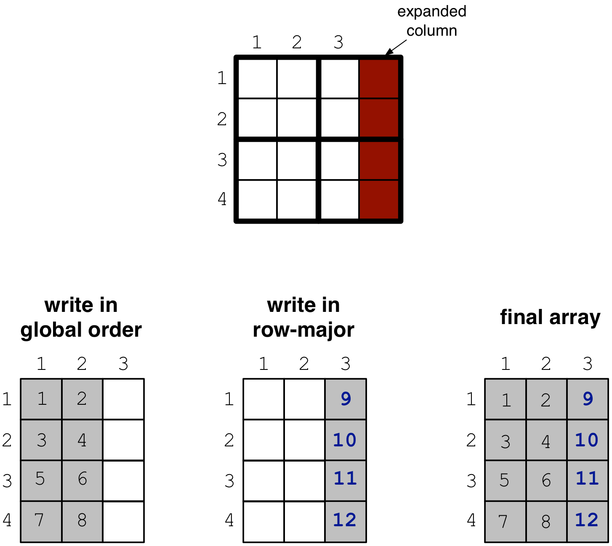

Writing Dense Arrays
====================

In this tutorial you will learn how to write to dense arrays. It is highly
recommended that you read the tutorials on dense arrays and tiling first,
as well as writing sparse arrays.

.. toggle-header::
    :header: **Example Code Listing #1**

    .. content-tabs::

       .. tab-container:: cpp
          :title: C++

          .. literalinclude:: ../{source_examples_path}/cpp_api/writing_dense_padding.cc
             :language: c++
             :linenos:

.. toggle-header::
    :header: **Example Code Listing #2**

    .. content-tabs::

       .. tab-container:: cpp
          :title: C++

          .. literalinclude:: ../{source_examples_path}/cpp_api/writing_dense_multiple.cc
             :language: c++
             :linenos:

.. toggle-header::
    :header: **Example Code Listing #3**

    .. content-tabs::

       .. tab-container:: cpp
          :title: C++

          .. literalinclude:: ../{source_examples_path}/cpp_api/writing_dense_sparse.cc
             :language: c++
             :linenos:

.. toggle-header::
    :header: **Example Code Listing #4**

    .. content-tabs::

       .. tab-container:: cpp
          :title: C++

          .. literalinclude:: ../{source_examples_path}/cpp_api/writing_dense_global.cc
             :language: c++
             :linenos:

.. toggle-header::
    :header: **Example Code Listing #5**

    .. content-tabs::

       .. tab-container:: cpp
          :title: C++

          .. literalinclude:: ../{source_examples_path}/cpp_api/writing_dense_global_expansion.cc
             :language: c++
             :linenos:

Basic concepts and definitions
------------------------------

.. toggle-header::
    :header: **Empty cells**

      TileDB allows you to partially populate a dense array, i.e., it permits
      empty cells. In this tutorial we explain that TileDB materializes
      only cells that belong to partially written tiles. Moreover, you
      can write sparse cells to a dense array. In this case empty cells
      are not materialized at all, similar to the case of sparse arrays.

.. toggle-header::
    :header: **Fill values**

      When reading a subarray from a dense array, TileDB returns values
      for *all* cells in the subarray, even for the empty ones. For each
      empty cell, TileDB returns a special "fill value" which depends on
      the attribute data type. This is different from the case of sparse
      arrays where a subarray read query returns values only for
      the *non-empty* cells.

Writing to a dense array
------------------------

Let us revisit the ``quickstart_dense.cc`` example of tutorial :ref:`dense-arrays`.
Here is how we wrote to the array:

.. content-tabs::

   .. tab-container:: cpp
      :title: C++

      .. code-block:: c++

       Context ctx;
       std::vector<int> data = {
           1, 2, 3, 4, 5, 6, 7, 8, 9, 10, 11, 12, 13, 14, 15, 16};
       Array array(ctx, array_name, TILEDB_WRITE);
       Query query(ctx, array);
       query.set_layout(TILEDB_ROW_MAJOR).set_buffer("a", data);
       query.submit();
       array.close();

This writes values ``1, 2, ...`` to the ``4x4`` dense TileDB array.
The above code omits setting one more parameter to the query object,
namely the subarray inside which the cell values will be written.
TileDB understands that you will be writing to the entire domain,
i.e., ``[1,4], [1,4]``. The result would be equivalent if we
added the following lines before submitting the query:

.. content-tabs::

   .. tab-container:: cpp
      :title: C++

      .. code-block:: c++

       std::vector<int> subarray = {1, 4, 1, 4};
       query.set_subarray(subarray);

This implies that you can write to any subarray in a dense array,
i.e., you do not have to populate the entire array at once
(see also the section on multiple writes below). For instance,
the code below would just populate only two rows of the above
array, i.e., subarray ``[1,2], [1,4]``:

.. content-tabs::

   .. tab-container:: cpp
      :title: C++

      .. code-block:: c++

       std::vector<int> data = {1, 2, 3, 4, 5, 6, 7, 8};
       std::vector<int> subarray = {1, 2, 1, 4};

       Context ctx;
       Array array(ctx, array_name, TILEDB_WRITE);
       Query query(ctx, array);
       query.set_layout(TILEDB_ROW_MAJOR)
            .set_buffer("a", data);
            .set_subarray(subarray);
       query.submit();
       array.close();

Observe that the above code sets the query layout to **row-major**.
This means that the values ``1, 2, 3, ...`` are laid out inside
buffer ``data`` (provided to the query) in row-major order
*with respect to the subarray query*. You can also set the layout
to **column-major** or **global order** instead as well (we
explain this in more detail below). TileDB
knows how to efficiently re-organize the cells internally (if needed)
and map them to the global order upon writing the values to disk.

To better demonstrate the effect of the query layout in writes,
let us create the same array as above, but now with ``2x2`` space
tiling, and experiment with row-major, column-major and global
query layout upon writing. Substitute the ``create_array``
and ``write_array`` functions of ``quickstart_dense.cc`` with
the ones provided below.

.. content-tabs::

   .. tab-container:: cpp
      :title: C++

      .. code-block:: c++

       void create_array() {
         Context ctx;
         if (Object::object(ctx, array_name).type() == Object::Type::Array)
           return;

         // 4x4 domain with 2x2 space tiling
         Domain domain(ctx);
         domain.add_dimension(Dimension::create<int>(ctx, "rows", {{1, 4}}, 2))
               .add_dimension(Dimension::create<int>(ctx, "cols", {{1, 4}}, 2));
         ArraySchema schema(ctx, TILEDB_DENSE);
         schema.set_domain(domain).set_order({{TILEDB_ROW_MAJOR, TILEDB_ROW_MAJOR}});
         schema.add_attribute(Attribute::create<int>(ctx, "a"));
         Array::create(array_name, schema);
       }

       void write_array() {
         std::vector<int> data = {
             1, 2, 3, 4, 5, 6, 7, 8, 9, 10, 11, 12, 13, 14, 15, 16};
         std::vector<int> subarray = {1, 4, 1, 4};

         Context ctx;
         Array array(ctx, array_name, TILEDB_WRITE);
         Query query(ctx, array);
         query.set_layout(TILEDB_ROW_MAJOR). // Try also with TILEDB_COL_MAJOR/TILEDB_GLOBAL_ORDER
              .set_buffer("a", data)
              .set_subarray(subarray);
         query.submit();
         array.close();
       }

The figure below depicts the array contents when varying the query layout.
Observe that the layout is always specified with respect to the query
subarray.

Empty space / Padding
---------------------

Since TileDB allows you to write to any subarray of your array,
*what happens if your array has empty areas?* We demonstrate
with example ``writing_dense_padding.cc`` (see code listing #1
at the beginning of the section). We first create a ``4x4`` array
with ``2x2`` space tiling. We then write only subarray
``[2,3], [12]``, leaving the rest of the array unpopulated:

.. content-tabs::

   .. tab-container:: cpp
      :title: C++

      .. code-block:: c++

       std::vector<int> data = {1, 2, 3, 4};
       std::vector<int> subarray = {2, 3, 1, 2};
       Context ctx;
       Array array(ctx, array_name, TILEDB_WRITE);
       Query query(ctx, array);
       query.set_layout(TILEDB_ROW_MAJOR)
            .set_buffer("a", data)
            .set_subarray(subarray);
       query.submit();
       array.close();

The array looks like in the figure below.

The example then reads the *entire* array (i.e., ``[1,2], [3,4]``)
in row-major order and
prints the cell values on the screen. Here is the output after
compiling and running the program:

.. code-block:: bash

   $ g++ -std=c++11 writing_dense_padding.cc -o writing_dense_padding_cpp -ltiledb
   $ ./writing_dense_padding_cpp
   -2147483648
   -2147483648
   -2147483648
   -2147483648
   1
   2
   -2147483648
   -2147483648
   3
   4
   -2147483648
   -2147483648
   -2147483648
   -2147483648
   -2147483648
   -2147483648

Observe that for every empty cell in ``[1,2], [3,4]``, TileDB returned value
``-2147483648``. This is the default **fill value**, which is is equal to
the minumum value stored in an integer variable.
The table below shows the default fill values for all supported
attribute data types.

==========================   ======================================================
**Data type**                **Fill value**
--------------------------   ------------------------------------------------------
``TILEDB_CHAR``              Minimum ``char`` value
``TILEDB_INT8``              Minimum ``int8`` value
``TILEDB_UINT8``             Maximum ``uint8`` value
``TILEDB_INT16``             Minimum ``int16`` value
``TILEDB_UINT16``            Maximum ``uint16`` value
``TILEDB_INT32``             Minimum ``int32`` value
``TILEDB_UINT32``            Maximum ``uint32`` value
``TILEDB_INT64``             Minimum ``int64`` value
``TILEDB_UINT64``            Maximum ``uint64`` value
``TILEDB_FLOAT32``           ``NaN``
``TILEDB_FLOAT64``           ``NaN``
``TILEDB_ASCII``             ``0``
``TILEDB_UTF8``              ``0``
``TILEDB_UTF16``             ``0``
``TILEDB_USC2``              ``0``
``TILEDB_USC4``              ``0``
``TILEDB_ANY``               ``0``
==========================   ======================================================

.. note::

  In a future release, you will be able to define your own fill values for
  each of your arrays.

But you may wonder, *how does TileDB handles empty spaces at the physical level?*

.. note::

  TileDB does not materialize empty cells for dense arrays, except for the ones
  belonging to partially written tiles.

Let us explain the above with our running example. The array has ``2x2`` space
tiling, which means that we have two partially written tiles (the upper left
and lower left in red), and two completely empty tiles (upper right and lower
right in blue).
TileDB distinguishes between partially written tiles and completely empty tiles.
We mentioned in an earlier tutorial that TileDB always writes integral tiles
on the file, i.e., it cannot write just 2 out of 4 cells in our example.
Hence, TileDB will explicitly store the fill value for each empty cell in
a partially written tile. In contrast, it does not materialize any cells for
the completely
empty tiles (i.e., it entirely ignores empty tiles). This is depicted
in the figure below.

Let us inspect the contents of the array folder, after running the above
example:

.. code-block:: bash

  $ ls -l writing_dense_padding/
  total 8
  drwx------  4 stavros  staff  136 Jun 25 10:28 __76679576e9454d1eb08e8a2f5bf8fd29_1529936885146
  -rwx------  1 stavros  staff  109 Jun 25 10:28 __array_schema.tdb
  -rwx------  1 stavros  staff    0 Jun 25 10:28 __lock.tdb
  $ ls -l writing_dense_padding/__76679576e9454d1eb08e8a2f5bf8fd29_1529936885146/
  total 16
  -rwx------  1 stavros  staff  106 Jun 25 10:28 __fragment_metadata.tdb
  -rwx------  1 stavros  staff   32 Jun 25 10:28 a.tdb

As expected, there is a single fragment subdirectory. Observe the size of
attribute file ``a.tdb``, which is 32 bytes. Given that the attribute type
is ``int32`` (and since there is no compression), this implies that 8 cell
values were written to the file, i.e., *two tiles*. This confirms that
*padding* applies only to partially written files, whereas completely
empty tiles are not materialized at all.

Multiple writes / Updates
-------------------------

You can write to a dense array multiple times, similar to the case we
described for sparse arrays in an earlier tutorial. Each write in
row-major or column-major layout creates a new subfolder/fragment
in the array directory (we explain unordered and global layout in
the subsections below). Consider the following two writes to the
dense array we have been using in the examples above (see the full
code listing #2 at the beginning of this tutorial):

.. content-tabs::

   .. tab-container:: cpp
      :title: C++

      .. code-block:: c++

        void write_array_1() {
          std::vector<int> data = {1, 2, 3, 4};
          std::vector<int> subarray = {1, 2, 1, 2};
          Context ctx;
          Array array(ctx, array_name, TILEDB_WRITE);
          Query query(ctx, array);
          query.set_layout(TILEDB_ROW_MAJOR)
               .set_buffer("a", data)
               .set_subarray(subarray);
          query.submit();
          array.close();
        }

        void write_array_2() {
          std::vector<int> data = {5, 6, 7, 8, 9, 10, 11, 12};
          std::vector<int> subarray = {2, 3, 1, 4};
          Context ctx;
          Array array(ctx, array_name, TILEDB_WRITE);
          Query query(ctx, array);
          query.set_layout(TILEDB_ROW_MAJOR)
               .set_buffer("a", data)
               .set_subarray(subarray);
          query.submit();
          array.close();
        }

The first function writes to subarray ``[1,2], [1,2]``, whereas the second
to ``[2,3], [1,4]``. The figure below depicts the two writes,
as well as the collective logical view of the array after the second write.

After compiling and running the program, we get the following
output. Observe that the full read (in row-major) order results in
retrieving the cell values as depicted in the collective
logical view of the array (again, retrieving the default
fill values for the empty cells).

.. code-block:: bash

       $ g++ -std=c++11 writing_dense_multiple.cc -o writing_dense_multiple_cpp -ltiledb
       $ ./writing_dense_multiple_cpp
       1
       2
       -2147483648
       -2147483648
       5
       6
       7
       8
       9
       10
       11
       12
       -2147483648
       -2147483648
       -2147483648
       -2147483648

Listing the array directory, you can see that there are two
subfolders/fragments created:

.. code-block:: bash

  $ ls -l writing_dense_multiple/
  total 8
  drwx------  4 stavros  staff  136 Jun 25 14:51 __71c5c364bc4b4f49888668c912c4a01c_1529952665416
  -rwx------  1 stavros  staff  109 Jun 25 14:51 __array_schema.tdb
  drwx------  4 stavros  staff  136 Jun 25 14:51 __d13ece6b48ca470b8c42810cdf9d9206_1529952665410
  -rwx------  1 stavros  staff    0 Jun 25 14:51 __lock.tdb

Writing sparse cells
--------------------

One exciting feature about dense arrays is that *you can write sparse cells
to them*, i.e., you can write multiple cells that do not necessary fall in
the same hyper-rectangular subarray in a single write query. The sparse writes
in dense arrays are
*identical* to those of sparse arrays, i.e., you need to add an extra buffer
that holds the explicit coordinates of the cells you are writing into. Also here
is where the unordered layout is relevant again. Everything discussed about
writes in :ref:`writing-sparse` (e.g., even writing in global order) holds here
as well.

Let us demonstrate with an example (see full code listing #3 at the beginning
of this tutorial). Here is how we write some sparse cells to the dense
array of the previous examples:

.. content-tabs::

   .. tab-container:: cpp
      :title: C++

      .. code-block:: c++

       std::vector<int> data = {1, 2, 3, 4};
       std::vector<int> coords = {1, 2, 2, 1, 4, 3, 1, 4};
       Context ctx;
       Array array(ctx, array_name, TILEDB_WRITE);
       Query query(ctx, array);
       query.set_layout(TILEDB_UNORDERED)
            .set_buffer("a", data)
            .set_coordinates(coords);
       query.submit();
       array.close();

The array resulting from the above write looks as follows:

Compiling and running the program gives the output shown below. Observe that,
contrary to sparse arrays, when slicing dense arrays, TileDB returns
fill values for empty areas as explain earlier in this tutorial. Recall that,
in the case of sparse arrays, you get back only the values of the non-empty
cells; no cell is ever materialized for sparse arrays (neither in writes
nor reads). Also notice that you can explicitly request the cell coordinates
even in dense arrays.

.. code-block:: bash

  $ g++ -std=c++11 writing_dense_sparse.cc -o writing_dense_sparse_cpp -ltiledb
  $ ./writing_dense_sparse_cpp
  Cell (1, 1) has data -2147483648
  Cell (1, 2) has data 1
  Cell (1, 3) has data -2147483648
  Cell (1, 4) has data 4
  Cell (2, 1) has data 2
  Cell (2, 2) has data -2147483648
  Cell (2, 3) has data -2147483648
  Cell (2, 4) has data -2147483648
  Cell (3, 1) has data -2147483648
  Cell (3, 2) has data -2147483648
  Cell (3, 3) has data -2147483648
  Cell (3, 4) has data -2147483648
  Cell (4, 1) has data -2147483648
  Cell (4, 2) has data -2147483648
  Cell (4, 3) has data 3
  Cell (4, 4) has data -2147483648

Let us inspect the contents of the dense array after the write:

.. code-block:: bash

  $ ls -l writing_dense_sparse/
  total 8
  drwx------  5 stavros  staff  170 Jun 25 17:59 __88e0ebca9aa44442918ad93fa82209f2_1529963970336
  -rwx------  1 stavros  staff  109 Jun 25 17:59 __array_schema.tdb
  -rwx------  1 stavros  staff    0 Jun 25 17:59 __lock.tdb
  $ ls -l writing_dense_sparse/__88e0ebca9aa44442918ad93fa82209f2_1529963970336/
  total 24
  -rwx------  1 stavros  staff   32 Jun 25 17:59 __coords.tdb
  -rwx------  1 stavros  staff  110 Jun 25 17:59 __fragment_metadata.tdb
  -rwx------  1 stavros  staff   16 Jun 25 17:59 a.tdb

Observe that the
coordinates were written explicitly in file ``__coords.tdb`` inside
the fragment, similarly to the sparse case. Note that here the
sparse format is adopted, i.e., *no empty cell is materialized*.
This is in contrast to the padding technique explained earlier in this
tutorial for dense fragments. In other words, when writing sparse cells to
dense arrays, TileDB creates a *sparse fragment*, which is treated as a
sparse array snapshot! We provide more information on fragments in a later
tutorial.

Writing in global layout
------------------------

TileDB allows you to write in global order similar to the case of sparse arrays.
This generally leads to better performance, but comes at the expense of extra
usage complexity.
The limitation with this layout is that you need to always write
*integral* tiles, i.e., the subarray you set to the query (and write into)
must not partially intersect tiles, but instead encompass them entirely.

The following code writes to subarray ``[1,4], [1,2]`` (see full code
listing #4 at the beginning of this tutorial). Observe that, similar
to the case of sparse arrays, we can submit the same query multiple
times, effectively *appending* to the same fragment (list the contents
of the resulting array to verify this). The difference here is that
we update the contents of the buffer we already set, without needing
to reset the buffer to the query in the second write. Either way works
here (resetting a new buffer, or updating the contents of the set buffer
without resetting). **Important:** do not forget to *finalize* the query
when you are done writing/appending in global order
and before closing the array.

.. content-tabs::

   .. tab-container:: cpp
      :title: C++

      .. code-block:: c++

       std::vector<int> subarray = {1, 4, 1, 2};
       Context ctx;
       Array array(ctx, array_name, TILEDB_WRITE);
       Query query(ctx, array);

       // First submission
       std::vector<int> data = {1, 2, 3, 4};
       query.set_layout(TILEDB_GLOBAL_ORDER)
            .set_buffer("a", data)
            .set_subarray(subarray);
       query.submit();

       // Second submission, after updating the buffer contents
       for (int i = 0; i < 4; ++i)
         data[i] = 5 + i;
       query.submit();

       // IMPORTANT!
       query.finalize();

       array.close();

The resulting array is depicted below. Note that the subarray we wrote into
contains *exactly* two tiles. Any attempt to write to partial tiles in
global order would have failed (and the behavior can be unexpected).

Writing in global order mode must done with extra care in case
some tile extent does not divide the respective dimension domain. As
we have explained in an earlier tutorial, this results in internal
*domain expansion*. Moreover, TileDB does not allow you to write
outside your defined domain. Therefore, *if your domain contains
partial tiles, you will not be able to write to them in global
order*.

We illustrate with an example. Consider you have a ``4x3`` array
with ``2x2`` space tiling, as shown in the figure below. The
domain contains two entrire tiles (upper left and lower left)
and two partial tiles (upper right and lower right). In this
case, you can write in global order in subarray ``[1,4], [1,2]``,
but choose another layout (e.g., row-major) for ``[1,4], [3,3]``.
This is done in code listing #5 (see at beginning of this
tutorial) in two writes, which are also shown in the figure below.

Writing and performance
-----------------------

The writing performance can be affected by various factors, such as the
tiling, compression and query layout. Due to the importance of this
topic, we include an extensive discussion in a later tutorial
dedicated on performance.
