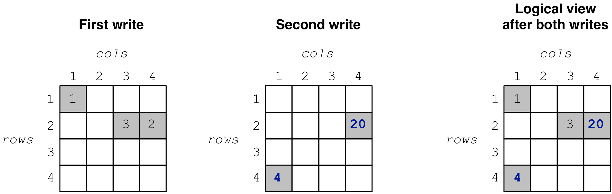

.. _writing-sparse:

Writing Sparse Arrays
=====================

In this tutorial you will learn how to write to sparse arrays. It is highly
recommended that you read the tutorials on sparse arrays and tiling first.

.. toggle-header::
    :header: **Example Code Listing #1**

    .. content-tabs::

       .. tab-container:: cpp
          :title: C++

          .. literalinclude:: {source_examples_path}/cpp_api/quickstart_sparse.cc
             :language: c++
             :linenos:

.. toggle-header::
    :header: **Example Code Listing #2**

    .. content-tabs::

       .. tab-container:: cpp
          :title: C++

          .. literalinclude:: {source_examples_path}/cpp_api/multiple_writes_sparse.cc
             :language: c++
             :linenos:

.. toggle-header::
    :header: **Example Code Listing #3**

    .. content-tabs::

       .. tab-container:: cpp
          :title: C++

          .. literalinclude:: {source_examples_path}/cpp_api/global_order_sparse.cc
             :language: c++
             :linenos:

Basic concepts and definitions
------------------------------

.. toggle-header::
    :header: **Query**

    Writing to TileDB arrays is performed by creating and submitting query
    objects (the term is adopted from the domain of Databases). The query carries
    the user buffers that contain the cell values to be written, along with
    the layout of the values in the buffers.

.. toggle-header::
    :header: **Query layout**

    The query layout determines the way the user provides the cell values to
    be written. TileDB supports two layouts for writing in sparse arrays.

.. toggle-header::
    :header: **Updates**

    Updates in TileDB are simple write operations. TileDB does not perform
    writes in-place, i.e., it does not overwrite previously created files.
    Instead, it creates new files, i.e., all files in TileDB are *immutable*.

Writing to a sparse array
-------------------------

Let us revisit the ``quickstart_sparse.cc`` example of tutorial :ref:`sparse-arrays`.
Here is how we wrote to the array:

.. content-tabs::

   .. tab-container:: cpp
      :title: C++

      .. code-block:: c++

        std::vector<int> coords = {1, 1, 2, 4, 2, 3};
        std::vector<int> data = {1, 2, 3};
        Context ctx;
        Array array(ctx, array_name, TILEDB_WRITE);
        Query query(ctx, array, TILEDB_WRITE);
        query.set_buffer("a", data)
             .set_coordinates(coords)
             .set_layout(TILEDB_UNORDERED);
       query.submit();
       array.close();

After preparing the cell values to be written,
we construct an array object, effectively
"opening" the array, i.e., preparing the array for writes (e.g., this
load the array schema from persistent storage to main memory). Then we create
a query, specifying that this query will perform writes. Notice that the
query type must be the same in both the array and query object.
(i.e., ``TILEDB_WRITE`` in both cases). Next, we set
the buffers for attribute ``a`` and coordinates to the query. These will
be dispatched to TileDB along with the query. Note that the coordinates
are necessary, as these specify exactly in which cells you wish
to write the values.

Subsequently, we set the **layout**;
this specifies the order in which you stored the cell values in buffers
``coords`` and ``data``. **Unordered** here means that the cells are not
given in a particular order. TileDB needs this information in order to
*sort* internally and then store the values along the *global
cell order* (recall that TileDB always respects the global cell order
when writing the array data in physical storage). In this example
it happens for the given order (row-major) to be the same as the
global order. We will see in later examples that this is not true
in general. For instance, if we had specified a ``2x2`` space tiling
for the above array, the global order would be ``(1,1), (2, 3), (2,4)``.
Below we explain that
TileDB enables you to write also directly in global order, avoiding
the sorting and boosting performance. Finally, we submit the query
and close the array.

Multiple writes / Updates
-------------------------

TileDB of course allows you to submit multiple write queries to an array,
and a query may update (i.e., modify) previously written values. Consider
the example in the figure below, where we perform two writes to the
same array.

When we read the array, as expected, we get the cells
shown in the collective logical view produced by both writes,
i.e., after cell ``(4,1)`` is added and cell ``(2,4)`` is modified
in the second write. Compiling and running the example code listed
at the beginning of this tutorial (listing #2), you get the following:

.. code-block:: bash

   $ g++ -std=c++11 multiple_writes_sparse.cc -o multiple_writes_sparse_cpp -ltiledb
   $ ./multiple_writes_sparse_cpp
   Cell (1, 1) has data 1
   Cell (2, 3) has data 3
   Cell (2, 4) has data 20
   Cell (4, 1) has data 4

Let us see how the array directory looks like after the execution of the program:

.. code-block:: bash

    $ ls -l multiple_writes_sparse/
    total 8
    drwx------  5 stavros  staff  170 Jun 22 15:27 __35a9e44618d34f68a20ec0b5a51d17eb_1529695666920
    drwx------  5 stavros  staff  170 Jun 22 15:27 __5f38614a64d94b97b607125965db3bdd_1529695666925
    -rwx------  1 stavros  staff  115 Jun 22 15:27 __array_schema.tdb
    -rwx------  1 stavros  staff    0 Jun 22 15:27 __lock.tdb
    $ ls -l multiple_writes_sparse/__35a9e44618d34f68a20ec0b5a51d17eb_1529695666920
    total 24
    -rwx------  1 stavros  staff   90 Jun 22 15:27 __coords.tdb
    -rwx------  1 stavros  staff  110 Jun 22 15:27 __fragment_metadata.tdb
    -rwx------  1 stavros  staff   12 Jun 22 15:27 a.tdb
    $ ls -l multiple_writes_sparse/__5f38614a64d94b97b607125965db3bdd_1529695666925
    total 24
    -rwx------  1 stavros  staff   82 Jun 22 15:27 __coords.tdb
    -rwx------  1 stavros  staff  104 Jun 22 15:27 __fragment_metadata.tdb
    -rwx------  1 stavros  staff    8 Jun 22 15:27 a.tdb

Notice that now there are *two* subdirectories under the array directory. Each
subdirectory corresponds to a write operation and is called **fragment**. We
discuss fragments in more detail in a later tutorial. However, what is important
here is that the cell values added by different operations create different
files and no file is overwritten. You may perceive each write as a *separate array*
(hence, array "fragment"). TileDB is smart enough to understand how (and when!)
you created these fragments and provide you with the correct values upon reading.

.. note::

  Every file in TileDB is immutable!

A final remark concerns **deletions**. Currently, TileDB does not support
deletions. If you wish to delete a cell, you will have to essentially
set a "dummy" value (that you know how to recognize on your end) to that
cell, which will act as a *tombstone* marking the cell as deleted. We are
currently working on a better way of handling deletions, which we will
make available in a future release.

Writing in global layout
------------------------

So far we have been using the "unorderded" layout when providing the
cells to TileDB for writing, which will be the most frequent layout
you will use. However, *if* your cells are already laid out in the
global order of your array, TileDB allows you to write them in the
**global layout**. This provides two benefits: (i) you avoid the
internal TileDB sorting step, which may result in some performance
speedup (TileDB parallelizes sorting internally, but you can still
gain if you completely avoid it), and (ii) as we shall see below,
writing in global order enables you to submit an arbitrary number
of queries, without creating a new fragment each time, but rather always
*appending to the same fragment*. This is useful if you have a very
large dataset and you wish to just *stream* it into a TileDB array,
avoiding the creation of numerous subfolders and files.

You set the global layout simply as follows:

.. content-tabs::

   .. tab-container:: cpp
      :title: C++

      .. code-block:: c++

        query.set_layout(TILEDB_GLOBAL_ORDER);

We will show how to slightly modify ``quickstart_sparse.cc``, such that
you write in global layout instead of unordered, submitting
two write queries instead of one (see listing #3 at the beginning
of this tutorial). Here are the two write queries for the same
three cells:

.. content-tabs::

   .. tab-container:: cpp
      :title: C++

      .. code-block:: c++

        // Submit first query
        std::vector<int> coords_1 = {1, 1, 2, 4};
        std::vector<int> data_1 = {1, 2};
        query.set_buffer("a", data_1).set_coordinates(coords_1);
        query.submit();

        // Submit second query
        std::vector<int> coords_2 = {2, 3};
        std::vector<int> data_2 = {3};
        query.set_buffer("a", data_2).set_coordinates(coords_2);
        query.submit();

Observe that, if the next cell values to be written are stored in
different buffers, you need to set those buffers to the query before
submitting it.

When writing in global order, TileDB maintains some
internal *state*. This is to allow you to submit successive
queries and let TileDB pick up the writing process from where it left off.
It is extremely important to **flush** this state when you
are done writing in global order as follows:

.. content-tabs::

   .. tab-container:: cpp
      :title: C++

      .. code-block:: c++

        query.finalize();

Let us compile and run the program, and then inspect the contents of the
array directory:

.. code-block:: bash

   $ g++ -std=c++11 global_order_sparse.cc -o global_order_sparse_cpp -ltiledb
   $ ./global_order_sparse_cpp
   Cell (1, 1) has data 1
   Cell (2, 3) has data 3
   Cell (2, 4) has data 2
   $ ls -l global_order_sparse/
   total 8
   drwx------  5 stavros  staff  170 Jun 22 16:29 __01b96bab96a64c3b86e06417c16b0618_1529699391758
   -rwx------  1 stavros  staff  115 Jun 22 16:29 __array_schema.tdb
   -rwx------  1 stavros  staff    0 Jun 22 16:29 __lock.tdb

As expected, the array contains the same cells and values as ``quickstart_sparse.cc``.
Moreover, despite the fact that we submitted two write queries, only one
subfolder/fragment got created. This confirms that successive write query
submissions in global order append the cell values to the same
fragment files.

Choosing a layout
-----------------

In the above example, the global order was trivial to determine, because we had
a single ``4x4`` space tile and the cell order was row-major. This resulted in
a global order that required all cells to be sorted in row-major order.
However, for larger arrays with
finer-grained space tiling, it will generally be non-trivial to manually derive
the global order and provide the cells to TileDB sorted on that order. Therefore,
we expect you to use the unordered layout in the vast majority of your applications.
Just note that TileDB has got your back here, since it performs sorting internally
very efficiently via parallelization, whereas it also provides an efficient fragment
consolidation mechanism in case you create too many fragments (covered in a later tutorial).

Writing and performance
-----------------------

As mentioned above, the layout in which you write the cells may affect performance,
as writing in the unordered layout involves some
internal sorting, which is avoided in the case of global order writes. Moreover,
each write in the unordered layout produces
a separate fragment. We will soon explain that numerous fragments may impact
the read performance. We provide a more detailed discussion on fragments and performance
considerations about writes in later tutorials.

