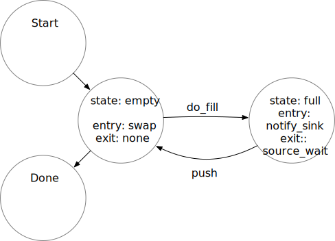
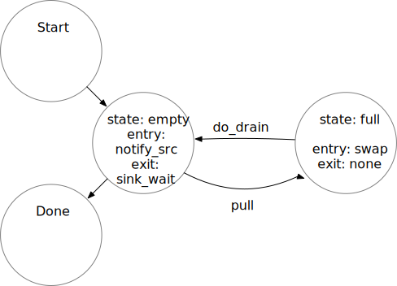

The file fsm.h implements a state machine for two communicating ports, `Source` and
`Sink`.  Each port has two states, empty or full.  There are two transition events
associated with the source: source_fill, which transitions from empty to full and
tells the state machine there is an item in the `Source`, and and source_push, which
initiates transfer to the `Sink` and transitions from full to empty.

Similarly, there are two events associated with the sink: sink_drain, which
transitions from full to empty and tells the `Sink` node that its item has been
removed, and and sink_pull, which attempts to transfer an item from the `Source` and
transitions from empty to full. For simplicity, though we may need them in the future,
there are currently no defined events for startup, stop, forced shutdown, or abort.

To complete the functionality of the state machine for the purposes of safely
transferring data from a `Source` to a `Sink`, there are exit and entry actions
associated with selected states and events.

Diagrams for the source and sink state machines can be found in
source_state_machine.svg and sink_state_machine.svg, respectively.  The diagrams also
show the entry and exit actions for each state machine.  




Our basic goal for the `Source` and `Sink` ports is to transfer a data item from a
`Source` to a connected (bound) `Sink`.  At a high level, the way a client would use
the `Source` to do this is the following:
- create a data item
- insert the data item into a `Source` port
- invoke the source_fill event
- invoke the source_push event


Similarly, the desired usage of a `Sink` port is also to transfer a data item from a
`Source` to a bound `Sink`.  At a high level, the way a client would use the `Source`
is the following
- invoke the sink_pull event
- extract the data item from the `Sink` port
- consume the item
- invoke the sink_drain event


Since the `Source` and `Sink` are bound together, we need to consider a product state
machine, one which has all combinations of `Source` and `Sink` states.  Since the
`Source` and `Sink` states each have *empty* and *full* states, we denote the product
states as *empty_empty*, *empty_full*, *full_empty*, and *full_full*, which represent
*sourcestate_sinkstate*.

Based on these product states and the four above events, the state transition table
for the product state machine (which we will just refer to as the "state machine"
below is the following:

|  State          |||| Event      |||
|--------|--------|-------------|-------------|-------------|-------------|----------|
| Source |  Sink  | source_fill | source_push | sink_drain  | sink_pull   | shutdown |
| empty  | empty  | full_empty  |             |             | empty_full  |          |
| empty  | full   | full_full   |             | empty/empty |             |          |
| full   | empty  |             | empty_empty |             | full_full   |          |
| full   | full   |             | empty_full  | full_empty  |             |          |  


Using this table, we can include the states as predicates with "proof outline" 
statements for the `Source` operation:
```C
   while (not done) {
     /* { state = empty_empty ∨ state = empty_full } ∧ { source_item = empty } */
     do produce and insert item
     /* { state = empty_empty ∨ state = empty_full } ∧ { source_item = full } */
     do source_fill
     /* { state = full_empty ∨ state = full_full } ∧ { source_item = full } */
     do source_push
     /* { state = empty_empty ∨ state = empty_full } ∧ { source_item = empty } */
   }
```

Similarly for `Sink`:
```C
   while (not done) {
     /* { state = empty_empty ∨ state = full_empty } ∧ { sink_item = empty } */
     do sink_pull
     /* { state = empty_full ∨ state = full_full } ∧ { sink_item = full } */
     do extract and consume item  
     /* { state = empty_full ∨ state = full_full } ∧ { sink_item = full } */
     do sink_drain
     /* { state = empty_empty ∨ state = full_empty } ∧ { sink_item = empty } */
   }
```

Now, the `Source` and `Sink` need to coordinate `source_push` and `sink_pull` so there
is not a race condition (nor a deadlock) when making transitions in the state machine.
Moreover, we have to make sensible transitions.  That is, we only be able to
succesfully do a source_push when the `Sink` state is empty (and the `Sink` item
itself is empty).  This is why we insert a new item and *then* invoke source_fill.
Until the state has transitioned to indicate the state of the `Source` is full, the
`Sink` will not attempt to transfer the item.  Similarly, we empty the sink_item and
*then* signal that the `Sink` is in the empty state.

To do this, we associate exit and entry actions with each state transition, some of
which will synchronize between `Source` and `Sink`.  These actions are used with the
state transition thusly:

  - begin_transition: given old_state and event
  - execute exit(old_state, event)
  - new_state = transition(old_state, event)
  - execute entry(new_state, event)

Note that the exit action is called *before* the state transition.
Note also that the entry action is called with the new state
(the post transition state).

The tables for entry and exit actions to be perfomed on state transitions is:

   |      States     ||||                     Events                                  |||
   |--------|--------|-------------|-------------|-------------|-------------|----------|
   | Source |  Sink  | source_fill | source_push | sink_drain  | sink_pull   | shutdown |
   | empty  | empty  |             |             |             | sink_swap   |          |  wait on pull?
   | empty  | full   |             | return      |             | return      |          |
   | full   | empty  |             | src_swap    |             | sink_swap   |          |  wait on pull?
   | full   | full   |             | src_swap    |             | return      |          |


The table for entry actions to be performend on state transitions is:


   |      States     ||||                     Events                                  |||
   |--------|--------|-------------|-------------|-------------|-------------|----------|
   | Source |  Sink  | source_fill | source_push | sink_drain  | sink_pull   | shutdown |
   | empty  | empty  |             | return      | notify_src  |             |          |
   | empty  | full   |             | return      |             | return      |          |
   | full   | empty  | notify_sink | src_swap    | notify_src  | snk_swap    |          |
   | full   | full   | notify_sink |             |             | return      |          |


The `src_swap` function is used to potentially transfer the data items associated with `Source` and `Sink` from the `Source` to the `Sink` (as well as changing the state if data transfer is carried out).  The data transfer is carried out by swapping the `Source` and `Sink` items and changing the full_empty to empty_full.  Since data transfer can only happen when the `Source` is full and the `Sink` is empty, the `Source` will wait until it receives a signal from the `Sink` indicating that the `Sink` is empty.  The operation of the `snk_swap` function is identical -- the `Sink` checks if the `Sink` is empty, swaps if the state is full_empty, and waits if it is not.

In more detail, we can describe the `Source` behavior (including proof outline predicates);
```C
  init: { state = empty_empty ∧ source_item = empty }
  while (not done)
     /* { state = empty_empty ∨ state = empty_full } ∧ { source_item = empty } */
     client of the source inserts an item  /* Note that the Sink can execute during this */
     /* { state = empty_empty ∨ state = empty_full } ∧ { source_item = full } */
     client invokes source_fill event to transition from empty to full.
     /* { state = full_empty ∨ state = full_full } ∧ { source_item = full } */
     Source notifies Sink that it is full
     /* { state = full_empty ∨ state = full_full } ∧ { source_item = full } */
     Source returns

     /* The Sink may pull, drain, do both, or do nothing */
     /* { state = full_empty ∨ state = full_full ∨ state = empty_full ∨ state = empty_empty } ∧ { source_item = empty ∨ source_item = full } */
     client invokes source_push event
     /* { state = full_empty ∨ state = full_full ∨ state = empty_full ∨ state = empty_empty } ∧ { source_item = empty ∨ source_item = full } */
     state machine executes source_push exit action, which may be one of the following, depending on the state */
       if state = empty_full → return
       if state = empty_empty → continue
       if state = full_empty ∨ state = full_full → execute src_swap
         /* pre_src_swap: { state = full_empty ∨ state = full_full } ∧ { source_item = full } */
         if state = full_empty, do swap
           /* pre_swap: { state = full_empty } ∧ { source_item = full } */       
           state machine swaps source_item and sink_item and transitions to empty_full state
           /* post_swap: { state = empty_full } ∧ { source_item = empty } */       
           notify sink
         else 
           /* else_swap: { state = full_full } ∧ { source_item = full } */
           notify sink
           wait for sink to drain item or to pull and drain_item
             /* Important! The state machine is now no longer in the state it was when it started the wait. */
             if sink drained: state → full_empty
             if sink pulled: state → full_empty
	     if sink pulled and drained: state → empty_empty
	     if sink drained and pulled: state → empty_full
       make state transition according to state transition table and state on exit of exit action
       /* { state = empty_empty ∨ state = empty_full } ∧ { source_item = empty } */
       invoke entry action 
         if state = empty_empty → return
         if state = empty_full → return
         /* post_entry: { state = empty_empty ∨ state = empty_full } ∧ { source_item = full } */
      /* post_push: { state = empty_empty ∨ state = empty_full } ∧ { source_item = empty } */
    /* end_loop: { state = empty_empty ∨ state = empty_full } ∧ { source_item = empty } */
  /* post_loop: { state = empty_empty ∨ state = empty_full } ∧ { source_item = empty } */
```

The `Sink` is the dual of the `Source`.
We can describe the `Sink` behavior (including proof outline predicates);
```C
  init: { state = empty_empty ∧ sink_item = empty }
  while (not done)
     /* { state = empty_empty ∨ state = empty_full } ∧ { sink_item = empty ∨ sink_item = full } */
     /* Before client invokes the sink_pull event, the source could have filled, filled and pushed, or done nothing */
       if source filled: empty_empty → full_empty
       if source filled and pushed empty_empty → empty_full
       if source did nothing state does not change
     /* { state = empty_empty ∨ state = empty_full ∨ state = full_empty } ∧ { sink_item = empty ∨ sink_item = full } */
     client invokes sink_pull event
     invoke exit action for state
       empty_full → return
       full_empty, empty → snk_swap
       /* { state = full_empty ∨ state = empty_empty } ∧ { sink_item = empty } */
       if state = full_empty
          { state = full_empty } ∧ { sink_item = empty } */
          swap elements
          { state = empty_full } ∧ { sink_item = full } */
        notify source
     else
       /* { state = empty_empty } ∧ { sink_item = empty } */
       notify source
       wait
        /* Important! The state machine is now no longer in the state it was when it started the wait. */
        /* the source would have been notified after filling, pushing, or filling and pushing */
 	      if source filled: state → full_empty or full_full
	      if source pushed: → full_full 
	      fill then push: → full_full
     make state transition
     /* { state = empty_full ∨ state = full_full } ∧ { sink_item = full } */
     invoke entry function for that state
       if source notified from source_fill: state would be empty_full or full_full → none
       if source notifed from src_swap: state would be empty_full → return
       if source notifed from src_swap else: state would be empty_empty → none
     /* post_pull: { state = empty_full ∨ state = full_full } ∧ { sink_item = full } */

     client of the source extracts an item  /* Note that the Source can execute during this */
     /* { state = empty_full ∨ state = full_full } ∧ { sink_item = empty } */
     client invokes sink_drain event to transition from full to empty 
     /* { state = empty_empty ∨ state = full_empty } ∧ { sink_item = empty } */
     Sink notifies Souce that it is empty
     /* { state = full_empty ∨ state = empty_empty } ∧ { sink_item = empty } */
     Sink returns
     /* end_loop: { state = empty_empty  ∨ state = full_empty } ∧ { sink_item = empty } */
  /* post_loop: { state = empty_empty ∨ state = full_empty } ∧ { sink_item = empty } */
```

Operations carried out directly by the state machine are protected by a lock.  When the `Source` or `Sink` wait, they do so on a condition variable using that same lock.

Since the synchronization implies that if the `Source` and `Sink` execute the same
number of loops, the `Sink` will execute last, we can conclude that the final state
after `Source` and `Sink` finish executing will be `empty_empty` and both
`source_item` and `sink_item` will be empty.

The sink_swap and src_swap functions are identical. Each checks to see if the state is
equal to full_empty, if so, swap the state to empty_full (and perform an action swap 
of the items assoiated with the source and sink), and notifies the other.  If the state
is not equal to full_empty, the swap function notifies the other and goes into a wait.

Thus, we may not need separate swaps for source and sink, nor separate condition variables, nor separate notification functions.  Leaving things separate for now.


