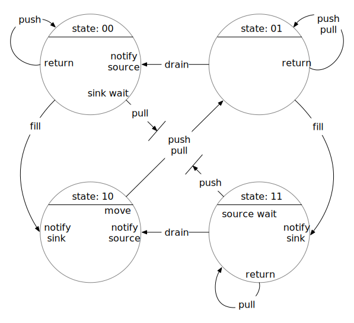

[1]: # To render this document:
[2]: # pandoc -V -t html5  -V disable-smart-shrinking  -V margin-left=0 -V margin-right=0 -V margin-top=25  -V margin-bottom=25 -o fsm2.pdf fsm2.md
[3]: # There may be more intelligent combinations of html directives, wkhtmltopdf options, etc, but enough time has already been spent on 
[4]: # even getting it to this point.

# Analysis of Port State Machine

The file fsm.h implements a state machine for two communicating ports, `Source` and
`Sink`.  Each port has two states, empty or full.  There are two transition events
associated with the source: fill, which transitions from empty to full and
tells the state machine there is an item in the `Source`, and and push, which
initiates transfer to the `Sink` and transitions from full to empty.

Similarly, there are two events associated with the sink: drain, which transitions
from full to empty and tells the `Sink` node that its item has been removed, and and
pull, which attempts to transfer an item from the `Source` and transitions from empty
to full. For simplicity, though we may need them in the future, we not consider events
for startup, stop, forced shutdown, or abort.

The following diagram shows the state transitions for the port state machine.  The
state is represented with two bits, one for the source and one for the sink, e.g.,
"00" meaning that the source state is 0 and the sink state is 1.

\

To provide the functionality of the state machine for the purposes of safely
transferring data from a `Source` to a `Sink`, there are exit and entry actions
associated with selected states and events.

One particular aspect of this is the pull event from state 00 and the push event from
state 11.  In these cases, the exit action is "wait", since the only valid state to
complete a push or a pull is from state 01. Accordingly, we perform notifications as
entry actions to state 10.  

When a source or sink thread is released from its wait, it is still in the push or
pull event.  To enable it to complete that desired operation, we restart the event
processing for the push or pull event in the current state.

(As a slight optimization, we also perform notifications on entry to states 00 and 11.
The waiter doesn't get to move in that case, but does get to leave the wait and
produce or consume an item and then try to push or pull again.)

Our basic goal for the `Source` and `Sink` ports is to transfer a data item from a
`Source` to a connected (bound) `Sink`.  At a high level, the way a client would use
the `Source` to do this is the following:
- create a data item
- insert the data item into a `Source` port
- invoke the fill event
- invoke the push event

Similarly, the desired usage of a `Sink` port is also to transfer a data item from a
`Source` to a bound `Sink`.  At a high level, the way a client would use the `Source`
is the following
- invoke the pull event
- extract the data item from the `Sink` port
- consume the item
- invoke the drain event

Based on these product states and the four above events, the state transition table
for the product state machine (which we will just refer to as the "state machine"
below is the following:

|     State            ||| Event      |||
|--------|-------------|-------------|-------------|-------------|----------|
|        | fill        | push        | drain       | pull        | stop     |
| 00     | 10          | 00          |             | 01          |          |
| 01     | 11          | 01          | 00          | 01          |          |
| 10     |             | 01          |             | 01          |          |
| 11     |             | 01          | 10          | 11          |          |  

Using this table, we can include the states as predicates to create an initial "proof
outline" statements for the `Source` operation:

```C
   while (not done) {
     /* { state = 00 ∨ state = 01 } ∧ { source_item = empty } */
     do produce and insert item
     /* { state = 00 ∨ state = 01 } ∧ { source_item = full } */
     do fill
     /* { state = 10 ∨ state = 11 } ∧ { source_item = full } */
     do push
     /* { state = 00 ∨ state = 01 } ∧ { source_item = empty } */
   }
```

Similarly for `Sink`:
```C
   while (not done) {
     /* { state = 00 ∨ state = 10 } ∧ { sink_item = empty } */
     do pull
     /* { state = 01 ∨ state = 11 } ∧ { sink_item = full } */
     do extract and consume item  
     /* { state = 01 ∨ state = 11 } ∧ { sink_item = full } */
     do drain
     /* { state = 00 ∨ state = 10 } ∧ { sink_item = empty } */
   }
```

Now, the `Source` and `Sink` need to coordinate `push` and `pull` so there
is not a race condition (nor a deadlock) when making transitions in the state machine.
Moreover, we have to make sensible transitions.  That is, we only be able to
succesfully do a push when the `Sink` state is empty (and the `Sink` item
itself is empty).  This is why we insert a new item and *then* invoke fill.
Until the state has transitioned to indicate the state of the `Source` is full, the
`Sink` will not attempt to transfer the item.  Similarly, we empty the sink_item and
*then* signal that the `Sink` is in the empty state.

To do this, we associate exit and entry actions with each state transition, some of
which will synchronize between `Source` and `Sink`.  These actions are used with the
state transition thusly:

  - begin_transition: given old_state and event
  - execute exit(old_state, event)
  - new_state = transition(old_state, event)
  - execute entry(new_state, event)

Note that the exit action is called *before* the state transition.
Note also that the entry action is called with the new state
(the post transition state).

The tables for exit actions to be perfomed on state transitions is:

   |  State |||                    Events                                  |||
   |--------|-------------|-------------|-------------|-------------|----------|
   |        | fill        | push        | drain       | pull        | stop     |
   | 00     |             | return      |             | sink_wait   |          |
   | 01     |             | return      |             | return      |          |
   | 10     |             | source_swap |             | sink_swap   |          |
   | 11     |             | source_wait |             | return      |          |


The table for entry actions to be performend on state transitions is:


   |        State   |||                     Events                                  |||
   |--------|-------------|-------------|---------------|-------------|----------|
   |        | fill        | push        | drain         | pull        | shutdown |
   | 00     |             |             | notify_source |             |          |
   | 01     |             |             |               |             |          |
   | 10     | notify_sink |             | notify_source |             |          |
   | 11     | notify_sink |             |               |             |          |


The `source_swap` function is used to potentially transfer the data items associated with
`Source` and `Sink` from the `Source` to the `Sink` (as well as changing the state if
data transfer is carried out).  The `source_swap` function is invoked whenever the state is 
10 (which is when there is an item in `Source` and space available to transfer to
the `Sink`.
The data transfer is carried out by swapping the
`Source` and `Sink` items and changing the state of 10 to 01.

When the state is 00, the `Sink` will wait for the `Source` to become full.  The
`Source` will notify the `Sink` when it becomes full.  Similarly, if the state is 11,
the `Source` will wait until it is signalled by the `Sink` that the `Sink` is empty.

## Proof Outlines

### Source Proof Outline

In more detail, we can describe the `Source` behavior (including proof outline predicates).  The steps
of `Source` operation are pseudocode in normal text, while the associated state of the state machine
are given in comments, with predicates in curly braces.
```C
  init: /* { state = 00 ∧ source_item = empty } */
  while (not done)

     /* { state = 00 ∨ state = 01 } ∧ { source_item = empty } */
     client of the source inserts an item  /* Note that although the Sink can execute and potentially change the
                                              state here, the allowable transitions do not end up changing it */


     /* { state = 00 ∨ state = 01 } ∧ { source_item = full } */
     client invokes fill event to transition from empty to full.

     state machine locks mutex
     /* { mutex = locked } */
     state machine invokes exit action
     if { state = 00 ∨ state = 01 } → none
     /* { state = 00 ∨ state = 01 } ∧ { source_item = full } */
     state machine performs transition
     /* { state = 00 } → { state = 10 } ∧ { source_item = full } */
     /* { state = 01 } → { state = 11 } ∧ { source_item = full } */
     /* { state = 10 ∨ state = 11 } ∧ { source_item = full } */
     Source notifies Sink that it is full
     /* { state = 10 ∨ state = 11 } ∧ { source_item = full } */
     Source returns
     state machine unlocks mutex
     /* { mutex = unlocked } */

     /* Before the Source begins the push, the Sink may pull, drain, do both, or do nothing */

     /* { state = 10 ∨ state = 11 ∨ state = 01 ∨ state = 00 } ∧ { source_item = empty ∨ source_item = full } */
     client invokes push event
     state machine locks the mutex
     /* { mutex = locked */

     /* { state = 10 ∨ state = 11 ∨ state = 01 ∨ state = 00 } ∧ { source_item = empty ∨ source_item = full } */
     state machine executes push exit action, which may be one of the following, depending on the state
     restart:
       if { state = 00 ∨ state = 01 } → none
       if state = 10 → execute source_swap
       if state = 11 → execute source_wait
         pre_source_swap: /* { state = 10 } ∧ { source_item = full } */
            state machine swaps source_item and sink_item -- swap does not change state
         post_source_swap: /* { state = 10 } ∧ { source_item = empty } */

       if { state = 11 } → execute source_wait  
          pre_source_wait: /* { state = 11 } */
          /* unlock mutex and wait for Sink to become empty */
          /* Important! When the state machine comes back from wait, it is now no longer in the state it was when it started the wait. */
          /* We therefore restart event processing for the push event, given the state present when coming back from wait: goto restart.*/
       /* { mutex = locked } */

       /* { state = 00 ∨ state = 01 ∨ state = 10 } ∧ { source_item = empty } */      
       make state transition according to state transition table and next_state set by most recent event
         { state = 00 } → { state = 00 }
         { state = 01 ∨ state = 10 } → { state = 01 }

       /* { state = 00 ∨ state = 01 } ∧ { source_item = empty } */
       state machine invokes entry action (none) 

       post_entry: /* { state = 00 ∨ state = 01 } ∧ { source_item = empty } */
       state machine unlocks mutex
       /* { mutex = unlocked } */

      post_push: /* { state = 00 ∨ state = 01 } ∧ { source_item = empty } */
    end_loop: /* { state = 00 ∨ state = 01 } ∧ { source_item = empty } */
  post_loop: /* { state = 00 ∨ state = 01 } ∧ { source_item = empty } */
```

### Sink Proof Outline

The `Sink` is the dual of the Source.  Note that we start with pull.
We can describe the `Sink` behavior (including proof outline predicates):
```C
  init: /* { state = 00 ∧ sink_item = empty } */
  while (not done)
     /* { state = 00 ∨ state = 01 } ∧ { sink_item = empty ∨ sink_item = full } */
     /* Before client invokes the pull event, the source could have filled, filled and pushed, or done nothing */
       if source filled: 00 → 10
       if source filled and pushed 00 → 01
       if source filled and pushed and filled 00 → 11
       if source did nothing state does not change
     /* { state = 00 ∨ state = 01 ∨ state = 10 ∨ state = 10 } ∧ { sink_item = empty ∨ sink_item = full } */
     client invokes pull event
     state machine locks mutex
     /* mutex = locked */

     /* { state = 00 ∨ state = 01 ∨ state = 10 ∨ state = 11 } ∧ { sink_item = empty ∨ sink_item = full } */
     state machine executes pull exit action, which may be one of the following, depending on the state
     restart:
       { state = 01 ∨ state = 11 } → none
       { state = 10 } → sink_swap 
       { state = 00 } → sink_wait
         pre_sink_swap: /* { state = 10 } ∧ { sink_item = empty } */
         post_sink_swap: /* { state = 10 } ∧ { sink_item = full } */

         if { state = 00 } → execute sink_wait
         pre_sink_wait: /* { state = 00 } */ 
           /* unlock mutex and wait for Source to become full */
           /* Important! When the state machine comes back from wait, it is now no longer in the state it was when it started the wait. */
           /* We therefore restart event processing for the pull event, given the state present when coming back from wait: goto restart.*/
       /* { mutex = locked */

       /* { state = 01 ∨ state = 10 ∨ state = 11 } ∧ { sink_item = full } */      
       make state transition according to state transition table and state and next_state set by most recent event
         { state = 01 ∨ state = 10 } → { state = 01 }
         { state = 11 } → { state = 11 }

       /* { state = 01 ∨ state = 11 } ∧ { sink_item = full } */
       state machine invokes pull entry action (none)
       /* post_entry: { state = 01 ∨ state = 11 } ∧ { sink_item = full } */ 
     state machine unlocks mutex
     /* { mutex = unlocked */

     /* post_pull: { state = 01 ∨ state = 11 } ∧ { sink_item = full } */

     client of the sink extracts the item  /* Note that although the Source can execute and potentially change the
                                                state here, the allowable transitions do not end up changing it */
     /* { state = 01 ∨ state = 11 } ∧ { sink_item = empty } */
     client invokes drain event to transition from full to empty 
     state machine locks mutex
     /* { state = 01 ∨ state = 11 } ∧ { sink_item = empty } */
     state machine performs exit action
     if { state = 01 ∨ state = 11 } → none
     { state = 01 ∨ state = 11 }
     state machine performs transition
     { state = 01 } → { state = 00 }
     { state = 11 } → { state = 10 }
     /* { state = 00 ∨ state = 10 } ∧ { sink_item = empty } */
     state machine performs entry action
       { state = 00 } → notify_source
       { state = 10 } → notify_source
     Sink returns
     state machine unlocks mutex
     /* end_loop: { state = 00 ∨ state = 10 } ∧ { sink_item = empty } */
     At this point, the source could inject, fill, push
        { state = 00 ∨ state = 01 ∨ state = 10 ∨ state = 11 } ∧ { sink_item = empty ∨ sink_item = full} */
  /* post_loop: { state = 00 ∨ state = 10 } ∧ { sink_item = empty } */
```

### Summary of Source and Sink Proof Outline

From the above analysis, we can summarize the `Source` proof outline below.  In a
manner similar to how states are represented, we indicate whether items are empty or
full using 0 or 1.

#### Source

```C
   while (not done) {
     /* { state = 00 ∨ state = 01 } ∧ ( items = 00 ∨ items = 01 ) }   */
     inject
     /* { state = 00 ∨ state = 01 } ∧ ( items = 10 ∨ items = 11 ) }   */
     fill
     /* { state = 00 ∨ state = 01 ∨ state = 10 ∨ state = 11 } ∧       */
     /* { items = 00 ∨ items = 01 ∨ items = 10 ∨ state = 11 }         */
     push
     /* { state = 00 ∨ state = 01 } ∧ ( items = 00 ∨ items = 01 ) }   */
   }
```

#### Sink

From the above analysis, we can summarize the `Sink` proof outline as follows:

```C
   while (not done) {
     /* { state = 00 ∨ state = 01 ∨ state = 10 ∨ state = 11 } ∧       */
     /* { items = 00 ∨ items = 01 ∨ items = 10 ∨ state = 11 }         */
     pull
     /* { state = 01 ∨ state = 11 } ∧ { items = 01 ∨ items = 11 }     */
     extract
     /* { state = 01 ∨ state = 11 } ∧ { items = 00 ∨ items = 10 }     */
     drain
     /* { state = 00 ∨ state = 01 ∨ state = 10 ∨ state = 11 } ∧       */
     /* { items = 00 ∨ items = 01 ∨ items = 10 ∨ state = 11 }         */
   }
```


### Comments

Operations carried out directly by the state machine are protected by a lock.  When
the `Source` or `Sink` wait, they do so on a condition variable using that same lock.

Note that when the `Source` and `Sink` both exit their loops that the `Source` will
have 
  { state = 00 ∨ state = 01 } 
while the `Sink` will have 
  { state = 00 ∨ state = 10 }.
The final state of the state machine is therefore 
  { state = 00 ∨ state = 01 } ∧ { state = 00 ∨ state = 10 } ∧ { item = empty }, 
i.e., 
  { state = 00 } ∧ { item = empty }.
(This assumes that both `Source` and `Sink` perform the same number of operations,
otherwise one of them will be left in a wait.)

**NB:** The sink_swap and source_swap functions are identical. Each checks to see if
the state is equal to 10, if so, swap the state to 01 (and perform an
action swap of the items assoiated with the source and sink), and notifies the other.
If the state is not equal to 10, the swap function notifies the other and goes
into a wait.

Thus, we may not need separate swaps for `Source` and `Sink`, nor separate condition
variables, nor separate notification functions.  I have verified that this works
experimentally, but I am leaving things separate for now.


## Alternate Proof Outline

We can perform somewhat more precise proof outlines by considering `Source` and `Sink` actions in better detail.  We use the techniques from, e.g., *Concurrent Programming* by Greg Andrews.

For this proof outline, there are two boolean arrays, each with two elements, shared by the `Source` and `Sink`: `state` and `items`.

### Source Actions

For the purposes of a proof outline, the `Source` has three operations:

```
1. inject: items[0] ← 1
2. fill: state[0] ← 1
3. push: 〈 await ¬{ state = 11 } :
            if { state = 10 ∧ items = 10 } → { state = 01 ∧ items = 01 } ⟩
```

### Sink Actions

Similarly, for the purposes of a proof outline, the `Sink` has three operations:

```
1. extract: item[1] ← 0
2. drain: state[1] ← 0
3. pull: 〈 await ¬{ state = 00 } :
            if { state = 10 ∧ items = 10 } → { state = 01 ∧ items = 01 } ⟩
```


### Source Proof

If we just consider the `Source` actions without considering concurrent `Sink` operations, we have the following proof outline:
```C
   while (not done) {
     /* { state = 00 ∧ items = 00 } */
     inject: items[0] ← 1
     /* { state = 00 ∧ items = 10 } */
     fill: state[0] ← 1
     /* { state = 10 ∧ items = 10 } */
     push: 〈 await ¬{ state = 11 } :
              if { state = 10 ∧ items = 10 } → { state = 01 ∧ items = 01 } ⟩
     /* { state = 01 ∧ { items = 01 } */
   }
```

We can make a second iteration of this proof outline, adding the condition `{ state =
01 ∧ items = 01 }` to the beginning, since that is the final state of the previous
iteration:

```C
   while (not done) {
     /* { state = 00 ∧ items = 00 } ∨ { state = 01 ∧ items = 01 } */
     inject: items[0] ← 1
     /* { state = 00 ∧ items = 10 } ∨ { state = 01 ∧ items = 11 } */
     fill: state[0] ← 1
     /* { state = 10 ∧ items = 10 } ∨ { state = 11 ∧ items = 11 } */
     push: 〈 await ¬{ state = 11 } :
              if { state = 10 ∧ items = 10 } → { state = 01 ∧ items = 01 } ⟩
     /* { state = 01 ∧ { items = 01 } */
   }
```

Note that if we enter push with `{ state = 11 }`, we will not exit until that state changes, which will require action from the `Sink`.


### Sink Proof

If we just consider the `Sink` actions without considering concurrent `Source` operations, we have the following proof outline:

```C
   while (not done) {
     /* { state = 10 ∧ items = 10 } */
     pull: 〈 await ¬{ state = 00 } :
              if { state = 10 ∧ items = 10 } → { state = 01 ∧ items = 01 } ⟩
     /* { state = 01 ∧ items = 01 } */
     extract: extract: item[1] ← 0
     /* { state = 01 ∧ items = 00 } */
     drain: state[1] ← 0  
     /* { state = 00 ∧ items = 00 } */
   }
```

A second iteration of the `Sink` actions would result in

```C
   while (not done) {
     /* { state = 00 ∧ items = 00 } ∨ { state = 10 ∧ items = 10 } */
     pull: 〈 await ¬{ state = 00 } :
              if { state = 10 ∧ items = 10 } → { state = 01 ∧ items = 01 } ⟩
     /* { state = 01 ∧ { items = 01 } */
     extract: extract: item[1] ← 0
     /* { state = 01 ∧ { items = 00 } */
     drain: state[1] ← 0  
     /* { state = 00 ∧ { items = 00 } */
   }
```

Here, we are stopped in the `await` statement, pending action by the `Source`.and still result in a valid proof outline.


### Derivation of Source Proof with Concurrent Sink Actions

We now work through the `Source` proof, allowing arbitrary `Sink` actions to occur
between any two `Source` action.  The allowable `Sink` actions at any point must have
the same predicate at the point where the `Sink` action occurs.  For example, the
predicate prior to `Source` `inject` includes `{ state = 01 ∧ items = 01 }`, which is
also a predicate prior to extract.  Thus, `extract` could also occur prior to
`inject`.  We can therefore include the predicate resulting from the `extract` action
as part of the predicate prior to `inject`.  Applying allowable `Sink` actions in this
fashion to all of the `Source` predicates, we obtain:


```C
   while (not done) {
     /* { state = 00 ∧ items = 00 } ∨ { state = 01 ∧ ( items = 00 ∨ items = 01 ) } */

        /* extract: { state = 01 ∧ items = 01 } → { state = 01 ∧ items = 00 } */
        /* drain: { state = 01 ∧ items = 00 } → { state = 00 ∧ items = 00 } */
        /* pull: no change

     /* { state = 00 ∧ items = 00 } ∨ { state = 01 ∧ ( items = 00 ∨ items = 01 ) } */
     inject: items[0] ← 1
     /* { state = 00 ∧ items = 10 } ∨ { state = 01 ∧ ( items = 10 ∨ items = 11 ) } */

        /* extract: { state = 01 ∧ items = 11 } → { state = 01 ∧ items = 10 } */
        /* drain: { state = 01 ∧ items = 10 } → { state = 00 ∧ items = 10 } */
        /* pull: no change

     /* { state = 00 ∧ items = 10 } ∨ { state = 01 ∧ ( items = 10 ∨ items = 11 ) } */
     fill: state[0] ← 1
     /* { state = 10 ∧ items = 10 } ∨ { state = 11 ∧ ( items = 10 ∨ items = 11 ) } */

        /* extract: { state = 11 ∧ items = 11 } → { state = 11 ∧ items = 10 } */
        /* drain: { state = 11 ∧ items = 10 } → { state = 10 ∧ items = 10 } */
        /* pull: { state = 10 ∧ items = 10 } → { state = 01 ∧ items = 01 } */
        /* pull+extract: { state = 01 ∧ items = 01 } → { state = 01 ∧ items = 00 } */
        /* pull+extract+drain: { state = 01 ∧ items = 00 } → { state = 00 ∧ items = 00 } */

     /* { state = 00 ∧ items = 00 } ∨ { state = 01 ∧ ( items = 00 ∨ items = 01 ) } ∨ */
     /* { state = 10 ∧ items = 10 } ∨ { state = 11 ∧ ( items = 10 ∨ items = 11 ) } */
     push: 〈 await ¬{ state = 11 } :
              if { state = 10 ∧ items = 10 } → { state = 01 ∧ items = 01 } ⟩
     /* { state = 00 ∧ items = 00 } ∨ { state = 01 ∧ ( items = 00 ∨ items = 01 ) } */
   }
```


### Derivation of Sink Proof with Concurrent Source Actions


Applying the same process to the `Sink` proof outline as we did for the `Source` proof outline:

```C
   while (not done) {
     /* { state = 00 ∧ items = 00 } ∨ { state = 10 ∧ items = 10 } */

       /* inject: { state = 00 ∧ items = 00 } → { state = 00 ∧ items = 10 }
       /* inject+fill: { state = 00 ∧ items = 10 } → { state = 10 ∧ items = 10 }
       /* inject+fill+push: { state = 10 ∧ items = 10 } → { state = 01 ∧ items = 01 }
       /* inject+fill+push+inject: { state = 01 ∧ items = 01 } → { state = 01 ∧ items = 11 }
       /* inject+fill+push+inject+fill: { state = 01 ∧ items = 11 } → { state = 11 ∧ items = 11 }

     /* { state = 00 ∧ ( items = 00 ∨ items = 10 ) } ∨ { state = 10 ∧ items = 10 } ∨  */
     /* { state = 01 ∧ ( items = 01 ∨ items = 11 ) } ∨ { state = 11 ∧ items = 11 ) }  */
     pull: 〈 await ¬{ state = 00 } :
              if { state = 10 ∧ items = 10 } → { state = 01 ∧ items = 01 } ⟩
     /* { state = 01 ∧ ( items = 01 ∨ items = 11 ) } ∨ { state = 11 ∧ items = 11 ) } */

       /* inject: { state = 01 ∧ items = 01 } → { state = 01 ∧ items = 11 } */
       /* fill: { state = 01 ∧ items = 01 } → { state = 11 ∧ items = 11 } */
       /* push: no change 

     /* { state = 01 ∧ ( items = 01 ∨ items = 11 ) } ∨ { state = 11 ∧ items = 11 ) } */
     extract: extract: item[1] ← 0
     /* { state = 01 ∧ ( items = 00 ∨ items = 10 ) } ∨ { state = 11 ∧ items = 01 ) } */

       /* inject: { state = 01 ∧ items = 00 } → { state = 01 ∧ items = 10 } */
       /* fill: { state = 01 ∧ items = 11 } → { state = 11 ∧ items = 10 } */
       /* push: no change 

     /* { state = 01 ∧ ( items = 00 ∨ items = 10 ) } ∨ { state = 11 ∧ items = 01 ) } */
     drain: state[1] ← 0  
     /* { state = 00 ∧ ( items = 00 ∨ items = 10 ) } ∨ { state = 10 ∧ items = 01 ) } */

       /* inject: { state = 00 ∧ items = 00 } → { state = 00 ∧ items = 10 }
       /* inject+fill: { state = 00 ∧ items = 10 } → { state = 10 ∧ items = 10 }
       /* inject+fill+push: { state = 10 ∧ items = 10 } → { state = 01 ∧ items = 01 }
       /* inject+fill+push+inject: { state = 01 ∧ items = 01 } → { state = 01 ∧ items = 11 }
       /* inject+fill+push+inject+fill: { state = 01 ∧ items = 11 } → { state = 11 ∧ items = 11 }

     /* { state = 00 ∧ ( items = 00 ∨ items = 10 ) } ∨ { state = 10 ∧ items = 10 } ∨  */
     /* { state = 01 ∧ ( items = 01 ∨ items = 11 ) } ∨ { state = 11 ∧ items = 11 ) }  */
   }
```

### Summary of Final Source and Sink Proof Outline

Summarizing the proof outlines above (including only the relevant predicates), we
obtain the proof outlines below.  Note that these are compatible with the previously
derived proof outlines, but the predicates exclude certain combinations of `states`
and `items`.  Where helpful, we include these predicates as comments in the dag source code files.

#### Source

```C
   while (not done) {
     /* { state = 00 ∧ items = 00 } ∨ { state = 01 ∧ ( items = 00 ∨ items = 01 ) }   */
     inject: items[0] ← 1
     /* { state = 00 ∧ items = 10 } ∨ { state = 01 ∧ ( items = 10 ∨ items = 11 ) }   */
     fill: state[0] ← 1
     /* { state = 00 ∧ items = 00 } ∨ { state = 01 ∧ ( items = 00 ∨ items = 01 ) } ∨ */
     /* { state = 10 ∧ items = 10 } ∨ { state = 11 ∧ ( items = 10 ∨ items = 11 ) }   */
     push: 〈 await ¬{ state = 11 } :
              if { state = 10 ∧ items = 10 } → { state = 01 ∧ items = 01 } ⟩
     /* { state = 00 ∧ items = 00 } ∨ { state = 01 ∧ ( items = 00 ∨ items = 01 ) }   */     
   }
```

#### Sink

```C
   while (not done) {
     /* { state = 00 ∧ ( items = 00 ∨ items = 10 ) } ∨ { state = 10 ∧ items = 10 } ∨ */
     /* { state = 01 ∧ ( items = 01 ∨ items = 11 ) } ∨ { state = 11 ∧ items = 11 ) } */
     pull: 〈 await ¬{ state = 00 } :
              if { state = 10 ∧ items = 10 } → { state = 01 ∧ items = 01 } ⟩
     /* { state = 01 ∧ ( items = 01 ∨ items = 11 ) } ∨ { state = 11 ∧ items = 11 ) } */
     extract: extract: item[1] ← 0
     /* { state = 01 ∧ ( items = 00 ∨ items = 10 ) } ∨ { state = 11 ∧ items = 01 ) } */
     drain: state[1] ← 0  
     /* { state = 00 ∧ ( items = 00 ∨ items = 10 ) } ∨ { state = 10 ∧ items = 10 } ∨ */
     /* { state = 01 ∧ ( items = 01 ∨ items = 11 ) } ∨ { state = 11 ∧ items = 11 ) } */
   }
```

### Comments

The proof outlines shows some important characteristics of the port state machine.

1. If we begin with the valid state `{ state = 00 ∧ items = 00 }` (which is the only sensible state with which to begin),
the state machine will never enter any `BAD` state.  We define a `BAD` state to be any of the following:
  - predicate with `{ items = 10 ∨ items = 11 }` prior to `inject` 
  - predicate with `{ state = 10 ∨ state = 11 }` prior to `fill` 
  - predicate with `{ items = 00 ∨ items = 10 }` prior to `extract` 
  - predicate with `{ state = 00 ∨ state = 10 }` prior to `drain` 

2. If we begin with the valid state `{ state = 00 ∧ items = 00 }`, and use the following steps for the `Source`

    ```C
      inject
      fill
      push
    ``` 
    The `Source` will **always** be ready to accept an item for injection.  Hence we do not have to check whether the `Source` is ready prior to invoking `inject`.  No concurrent `Sink` action will change the state into one that is `BAD` prior to `inject`.

4. Similarly, if we use the following steps for the `Sink`

    ```C
      pull
      extract
      drain
      ```

    There will **always** be an item ready to extract after `pull` completes.

5. There are no race conditions between `inject` and `fill`, nor between `extract` and `drain`.  Concurrent actions from the `Sink` cannot cause a `BAD` state between `inject` and `fill`, nor can concurrent actions from the `Source` introduce a `BAD` state between `extract` and `drain`.

6.  In fact, there are no race conditions between **any** of the steps in the `Source` or the `Sink`.  As a result, we do not need to introduce any locking mechanism to make any pairs of actions atomic.  (As a reminder, all actions executed by the state machine are atomic.)


## Proof Outlines for Buffered Edges Between Source and Sink

For much of what TileDB will be doing with our task graph library, we will be using multi-stage edges between nodes.
`Edge`s, as they are currently implemented, still provide a control connection from the `Sink` to the `Source` connected by the `Edge`.
In developing a proof outline for `Source` and `Sink` connected by an `Edge` with one (or more) buffered stages, we must account for the buffered data in both the `state` and the `items`.

Revisiting the `Source` and `Sink` operations that we previously presented, we have the following actions for a three-stage port state machine:

### Source Actions

```
1. inject: items[0] ← 1
2. fill: state[0] ← 1
3. push: 〈 await ¬{ state = 111 } :
            if { state = 010 ∧ items = 010 } → { state = 001 ∧ items = 001 } ⟩
            if { state = 100 ∧ items = 100 } → { state = 001 ∧ items = 001 } ⟩
            if { state = 101 ∧ items = 101 } → { state = 011 ∧ items = 011 } ⟩
            if { state = 110 ∧ items = 110 } → { state = 011 ∧ items = 011 } ⟩
```

### Sink Actions

Similarly, for the purposes of a proof outline, the `Sink` has three operations:

```
1. extract: item[2] ← 0
2. drain: state[2] ← 0
3. pull: 〈 await ¬{ state = 000 } :
            if { state = 010 ∧ items = 010 } → { state = 001 ∧ items = 001 } ⟩
            if { state = 100 ∧ items = 100 } → { state = 001 ∧ items = 001 } ⟩
            if { state = 101 ∧ items = 101 } → { state = 011 ∧ items = 011 } ⟩
            if { state = 110 ∧ items = 110 } → { state = 011 ∧ items = 011 } ⟩
```


### Source Proof Outline

In the following, we indicate a "don't care" value in `state` or in `items` with an `x`.

```C
   while (not done) {
     /* { state = 000 ∧ items = 000 } ∨ { state = 0x1 ∧ ( items = 0x0 ∨ items = 0x1 ) } */
       /* extract: */
       /* { state = 000 ∧ items = 000 } ∨ { state = 0x1 ∧ ( items = 0x0 ∨ items = 0x1 ) } */
       /* drain: */
       /* { state = 0x0 ∧ ( items = 0x0 ∨ items = 0x1 ) } ∨ { state = 0x1 ∧ ( items = 0x0 ∨ items = 0x1 ) } */
       /* pull: */
       /* { state = 0x0 ∧ ( items = 0x0 ∨ items = 0x1 ) } ∨ { state = 0x1 ∧ ( items = 0x0 ∨ items = 0x1 ) } */
   
     /* { state = 0x0 ∧ ( items = 0x0 ∨ items = 0x1 ) } ∨ { state = 0x1 ∧ ( items = 0x0 ∨ items = 0x1 ) } */
     inject: items[0] ← 1
     /* { state = 0x0 ∧ ( items = 1x0 ∨ items = 1x1 ) } ∨ { state = 0x1 ∧ ( items = 1x0 ∨ items = 1x1 ) } */

       /* extract: */
       /* { state = 0x0 ∧ ( items = 1x0 ∨ items = 1x1 ) } ∨ { state = 0x1 ∧ ( items = 1x0 ∨ items = 1x1 ) } */
       /* drain: */
       /* { state = 0x0 ∧ items = 1x0 ∨ items = 1x1 } ∨ { state = 0x1 ∧ ( items = 1x0 ∨ items = 1x1 } */
       /* pull: */
       /* { state = 0x0 ∧ items = 1x0 ∨ items = 1x1 } ∨ { state = 0x1 ∧ ( items = 1x0 ∨ items = 1x1 } */

     /* { state = 0x0 ∧ items = 1x0 ∨ items = 1x1 } ∨ { state = 0x1 ∧ ( items = 1x0 ∨ items = 1x1 } */  
     fill: state[0] ← 1
     /* { state = 1x0 ∧ ( items = 1x0 ∨ items = 1x1 ) } ∨ { state = 1x1 ∧ ( items = 1x0 ∨ items = 1x1 } */
       /* extract: */
       /* { state = 1x0 ∧ ( items = 1x0 ∨ items = 1x1 ) } ∨ { state = 1x1 ∧ ( items = 1x0 ∨ items = 1x1 } */
       /* drain: */
       /* { state = 1x0 ∧ ( items = 1x0 ∨ items = 1x1 ) } ∨ { state = 1x1 ∧ ( items = 1x0 ∨ items = 1x1 } */
       /* pull: */
       /* { state = 1x0 ∧ ( items = 1x0 ∨ items = 1x1 ) } ∨ { state = 1x1 ∧ ( items = 1x0 ∨ items = 1x1 } ∨
          { state = 0x1 ∧ items = 0x1 } ∨ { state = x11 ∧ items = x11 } */

     /* { state = 1x0 ∧ ( items = 1x0 ∨ items = 1x1 ) } ∨ { state = 1x1 ∧ ( items = 1x0 ∨ items = 1x1 } ∨
        { state = 0x1 ∧ items = 0x1 } ∨ { state = x11 ∧ items = x11 } ∨
        { state = 0x1 ∧ items = 0x0 } ∨ { state = x11 ∧ items = x10 } ∨
	{ state = 0x0 ∧ items = 0x0 } */
     push: 〈 await ¬{ state = 111 } :
            if { state = 1x0 ∧ items = 1x0 } → { state = 0x1 ∧ items = 0x1 } ⟩
            if { state = 010 ∧ items = 010 } → { state = 001 ∧ items = 001 } ⟩
            if { state = 101 ∧ items = 101 } → { state = 011 ∧ items = 011 } ⟩
     /* { state = 000 ∧ items = 000 } ∨ { state = 0x1 ∧ items = 0x1 } */
   }
```

### Source Summary

```C
   while (not done) {
     /* { state = 000 ∧ items = 000 } ∨ { state = 0x1 ∧ ( items = 0x0 ∨ items = 0x1 ) } */
     inject: items[0] ← 1
     /* { state = 0x0 ∧ ( items = 1x0 ∨ items = 1x1 ) } ∨ { state = 0x1 ∧ ( items = 1x0 ∨ items = 1x1 ) } */
     fill: state[0] ← 1
     /* { state = 1x0 ∧ ( items = 1x0 ∨ items = 1x1 ) } ∨ { state = 1x1 ∧ ( items = 1x0 ∨ items = 1x1 ) } ∨ */
     /* { state = 0x1 ∧ ( items = 0x0 ∨ items = 0x1 ) } ∨ { state = x11 ∧ ( items = x10 ∨ items = x11 ) } ∨ */
     /* { state = 0x0 ∧ items = 0x0 } */
     push: 〈 await ¬{ state = 111 } :
            if { state = 1x0 ∧ items = 1x0 } → { state = 0x1 ∧ items = 0x1 } ⟩
            if { state = 010 ∧ items = 010 } → { state = 001 ∧ items = 001 } ⟩
            if { state = 101 ∧ items = 101 } → { state = 011 ∧ items = 011 } ⟩
     /* { state = 000 ∧ items = 000 } ∨ { state = 0x1 ∧ ( items = 0x0 ∨ items = 0x1 ) } */
   }
```


### Sink Proof Outline


```C
   while (not done) {

     /* { state = 0x0 ∨ ( state = 0x0 ∧ items = 1x0 ) } ∨ { state = 1x0 ∧ ( items = 0x0 ∨ items = 1x0 ) } */

       /* inject */
       /* { state = 0x0 ∨ ( state = 0x0 ∧ items = 1x0 ) } ∨ { state = 1x0 ∧ ( items = 0x0 ∨ items = 1x0 ) } */       

       /* fill */
       /* { state = 0x0 ∨ ( state = 0x0 ∧ items = 1x0 ) } ∨ { state = 1x0 ∧ ( items = 0x0 ∨ items = 1x0 ) } */       

       /* push */
       /* { state = 0x0 ∨ ( state = 0x0 ∧ items = 1x0 ) } ∨ { state = 1x0 ∧ ( items = 0x0 ∨ items = 1x0 ) } */
       /* { state = 0x1 ∨ state = 0x1 } */

     pull: 〈 await ¬{ state = 00 } :
            if { state = 010 ∧ items = 010 } → { state = 001 ∧ items = 001 } ⟩
            if { state = 100 ∧ items = 100 } → { state = 001 ∧ items = 001 } ⟩
            if { state = 101 ∧ items = 101 } → { state = 011 ∧ items = 011 } ⟩
            if { state = 110 ∧ items = 110 } → { state = 011 ∧ items = 011 } ⟩

     /* { state = 0x1 ∧ items = 0x1 } */

       /* inject: */
       /* { state = 0x1 ∧ items = 0x1 } ∨ { state = 0x1 ∧ items = 1x1 } */

       /* fill: */
       /* { state = 0x1 ∧ ( items = 0x1 ∨ items = 1x1 ) } ∨ { state = 1x1 ∧ items = 1x1 } 

       /* push: */
       /* { state = 0x1 ∧ ( items = 0x1 ∨ items = 1x1 ) } ∨ { state = 1x1 ∧ items = 1x1 } 

     extract: extract: item[2] ← 0

     /* { state = 0x1 ∨ ( state = 0x0 ∧ items = 1x0 ) } ∨ { state = 1x1 ∧ items = 1x0 } */

       inject:
       /* { state = 0x1 ∨ ( state = 0x0 ∧ items = 1x0 ) } ∨ { state = 1x1 ∧ items = 1x0 } */

       fill:

       /* { state = 0x1 ∨ ( state = 0x0 ∧ items = 1x0 ) } ∨ { state = 1x1 ∧ ( items = 0x0 ∨ items = 1x0) } */

       push:

     /* { state = 0x1 ∨ ( state = 0x0 ∧ items = 1x0 ) } ∨ { state = 1x1 ∧ ( items = 0x0 ∨ items = 1x0) } */

     drain: state[1] ← 0
     /* { state = 0x0 ∨ ( state = 0x0 ∧ items = 1x0 ) } ∨ { state = 1x0 ∧ ( items = 0x0 ∨ items = 1x0) } */
   }
```


### Sink Summary

```C
   while (not done) {
     /* { state = 0x0 ∨ ( items = 0x0 ∧ items = 1x0 ) } ∨ { state = 1x0 ∧ ( items = 0x0 ∨ items = 1x0) } ∨ */
     /* { state = 0x1 ∧ ( items = 0x1 ∨ items = 1x1 ) } ∨ { state = 1x1 ∧ items = 1x1 }                    */
     pull: 〈 await ¬{ state = 00 } :
            if { state = 010 ∧ items = 010 } → { state = 001 ∧ items = 001 } ⟩
            if { state = 100 ∧ items = 100 } → { state = 001 ∧ items = 001 } ⟩
            if { state = 101 ∧ items = 101 } → { state = 011 ∧ items = 011 } ⟩
            if { state = 110 ∧ items = 110 } → { state = 011 ∧ items = 011 } ⟩
     /* { state = 0x1 ∧ ( items = 0x1 ∨ items = 1x1 ) } ∨ { state = 1x1 ∧ items = 1x1 }                    */
     extract: extract: item[2] ← 0
     /* { state = 0x1 ∨ ( items = 0x0 ∧ items = 1x0 ) } ∨ { state = 1x1 ∧ ( items = 0x0 ∨ items = 1x0) }   */
     drain: state[1] ← 0
     /* { state = 0x0 ∨ ( items = 0x0 ∧ items = 1x0 ) } ∨ { state = 1x0 ∧ ( items = 0x0 ∨ items = 1x0) } ∨ */
     /* { state = 0x1 ∧ ( items = 0x1 ∨ items = 1x1 ) } ∨ { state = 1x1 ∧ items = 1x1 }                    */ 
   }
```


### Comments

As with the unbuffered case, the the buffered proof outlines shows the same important
characteristics of the port state machine.

1. If we begin with the valid state `{ state = 000 ∧ items = 000 }` (which is the only sensible state with which to begin),
the state machine will never enter any `BAD` state.  We define a `BAD` state to be any of the following:
  - predicate with `{ items = 1x0 ∨ items = 1x1 }` prior to `inject` 
  - predicate with `{ state = 1x0 ∨ state = 1x1 }` prior to `fill` 
  - predicate with `{ items = 0x0 ∨ items = 1x0 }` prior to `extract` 
  - predicate with `{ state = 0x0 ∨ state = 1x0 }` prior to `drain` 

2. If we begin with the valid state `{ state = 000 ∧ items = 000 }`, and use the following steps for the `Source`

    ```C
      inject
      fill
      push
    ``` 
    The `Source` will **always** be ready to accept an item for injection.  Hence we do not have to check whether the `Source` is ready prior to invoking `inject`.  No concurrent `Sink` action will change the state into one that is `BAD` prior to `inject`.

4. Similarly, if we begin with the valid state `{ state = 000 ∧ items = 000 }` and
use the following steps for the `Sink`

    ```C
      pull
      extract
      drain
      ```

    There will **always** be an item ready to extract after `pull` completes.

5. There are no race conditions between `inject` and `fill`, nor between `extract` and `drain`.  Concurrent actions from the `Sink` cannot cause a `BAD` state between `inject` and `fill`, nor can concurrent actions from the `Source` introduce a `BAD` state between `extract` and `drain`.

6.  In fact, there are no race conditions between **any** of the steps in the `Source` or the `Sink`.  As a result, we do not need to introduce any locking mechanism to make any pairs of actions atomic.  (As a reminder, all actions executed by the state machine are atomic.)

