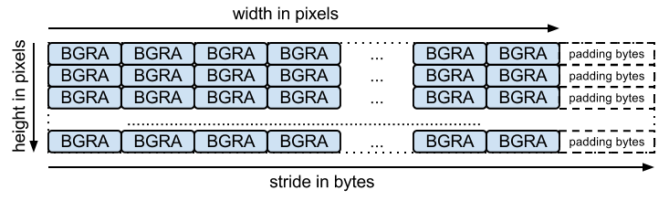

The WebP filter compresses image data using [libwebp](https://developers.google.com/speed/webp/docs/api#headers_and_libraries). The current input formats supported are `RGB`, `RGBA`, `BGR`, and `BGRA`. The colorspace format can be configured for this filter by setting the `TILEDB_WEBP_INPUT_FORMAT` filter option. Tile-based compression is determined by dimension extents. Extents equal to dimension bounds will compress the image in one pass.

For attributes, the WebP filter supports only the uint8_t data type.
Dimension data types can be any two matching integral types, such as `{uint32_t, uint32_t}` or `{int64_t, int64_t}` for example.

```
# Data from 2x3 pixel image
input = [[255,62,83, 149,43,67, 138,43,67]
         [255,62,83, 149,43,67, 138,43,67]]
# Ingest and read with lossless compression
output = [[255,62,83, 149,43,67, 138,43,67]
          [255,62,83, 149,43,67, 138,43,67]]
# Ingest and read with lossy compression
output = [[251,60,84, 148,51,61, 142,42,64]
          [252,63,85, 150,46,67, 139,44,68]]
```

The figure below from WebP API documentation may help to understand the format of data passed to and read from the WebP filter.

 \
[Photo](https://developers.google.com/static/speed/webp/images/image_layout.png) by [Google](https://developers.google.com/speed/webp/docs/api) licensed under [CC BY 4.0](https://creativecommons.org/licenses/by/4.0/)

Using the figure above from [WebP API documentation](https://developers.google.com/speed/webp/docs/api), `height` should correspond with dimension 0 upper bound, while `stride` corresponds with dimension 1 upper bound.
The pixel `width` of the image is internally calculated based on colorspace format and tile extents.

Tile extents are used to configure tile-based compression. We should note that the [maximum WebP image size](https://developers.google.com/speed/webp/faq#what_is_the_maximum_size_a_webp_image_can_be) is 16383x16383.
Because of this, our extents can not exceed `16383` for dimension 0, and `16383 * pixel_depth` for dimension 1.
`pixel_depth` is defined by our colorspace format selection. `RGB` and `BGR` images have a depth of 3, while `RGBA` and `BGRA` have a depth of 4 for the additional alpha value provided for each pixel.


# Filter Enum Value

The filter enum value for the WEBP filter is `17` (TILEDB_FILTER_WEBP enum).

# Input and Output Layout

Input is a single array of colorspace values in RGB, BGR, RGBA, or BGRA format. For RGB format we would expect the first
pixel to store R, G, B values at `input[0]`, `input[1]`, and `input[2]` respectively, followed by the remaining pixels 
in the image. Ingesting a 10x10 image would expect 300 total input values for 10 rows of 30 colorspace values per-row.

Output is organized the same as input. If we compress an image with lossless enabled, all outputs match inputs exactly. 
If we instead use lossy compression with a quality of 0, output colorspace values will vary due to data lost during
lossy WebP compression but the organization of the data remains the same.
